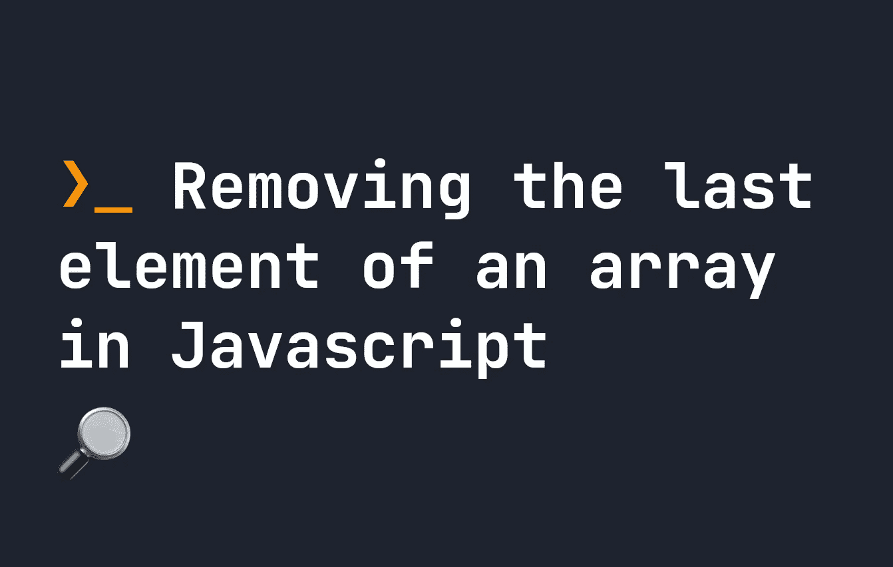

# 如何在 JavaScript 中移除数组的最后一个元素

> 原文：<https://javascript.plainenglish.io/how-to-remove-the-last-element-of-an-array-in-javascript-ef1c24bcd181?source=collection_archive---------8----------------------->

## 这是我们在 JavaScript 中最常见的操作之一，有很多方法可以做到。我们来对比一下。



我们对数组执行的最频繁的操作之一是删除最后一个元素。有几种不同的方法可以做到这一点——但最常用的方法之一是使用`pop()`方法。假设您有以下数组:

```
let myArr = [ "🍎", "🍏", "🍐", "🍍" ];
```

要删除最后一个元素，我们所要做的就是应用`pop()`:

```
let myArr = [ "🍎", "🍏", "🍐", "🍍" ];
myArr.pop();
console.log(myArr); // [ "🍎", "🍏", "🍐" ]
```

**注意这里的**这移除了最后一个元素并修改了原始数组。我们已经通过使用`pop()`永久地改变了原始数组。

另一种常见的方法是使用`splice`方法。再次，`splice`会修改原来的数组，工作方式也差不多。没有真正的理由使用一个而不是另一个:

```
let myArr = [ "🍎", "🍏", "🍐", "🍍" ];
myArr.splice(-1);
console.log(myArr); // [ "🍎", "🍏", "🍐" ]
```

最后，另一种不改变原始数组的方法是使用`slice`(不要与`splice`混淆)。`slice()`与`pop()`和`splice()`的不同之处在于它对原始数组做了一个[浅拷贝](https://fjolt.com/article/javascript-shallow-copies)。用`slice`删除最后一个元素看起来像这样:

```
let myArr = [ "🍎", "🍏", "🍐", "🍍" ];
let newArr = myArr.slice(0, -1);
console.log(newArr); // [ "🍎", "🍏", "🍐" ]
console.log(myArr); // [ "🍎", "🍏", "🍐", "🍍" ]
```

这里，我们将切片数组存储在一个新变量中，因为原始数组保持不变。然而，浅层拷贝有一些怪癖，比如有时会导致原始数组改变——所以它不是独立的拷贝。[你可以在这里了解更多关于浅层副本以及如何创建深层副本的信息](https://fjolt.com/article/javascript-shallow-copies)。

你也可以在这里了解更多关于[切片法的知识。](https://fjolt.com/article/javascript-slice)

*更多内容请看*[***plain English . io***](https://plainenglish.io/)*。报名参加我们的* [***免费周报***](http://newsletter.plainenglish.io/) *。关注我们关于*[***Twitter***](https://twitter.com/inPlainEngHQ)[***LinkedIn***](https://www.linkedin.com/company/inplainenglish/)*[***YouTube***](https://www.youtube.com/channel/UCtipWUghju290NWcn8jhyAw)*[***不和***](https://discord.gg/GtDtUAvyhW) *。对增长黑客感兴趣？检查* [***电路***](https://circuit.ooo/) *。***