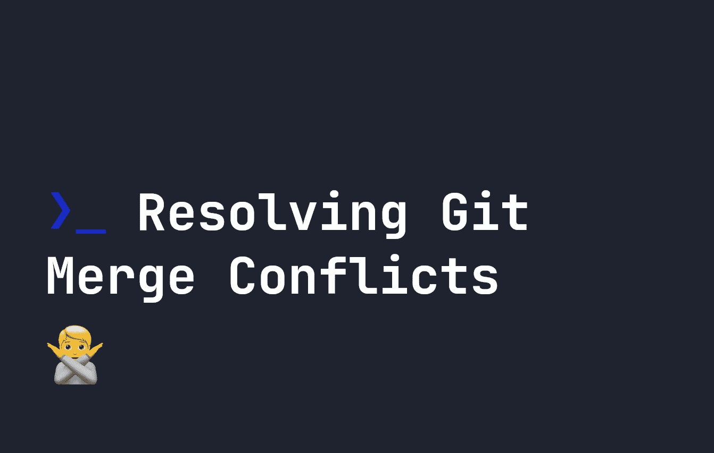
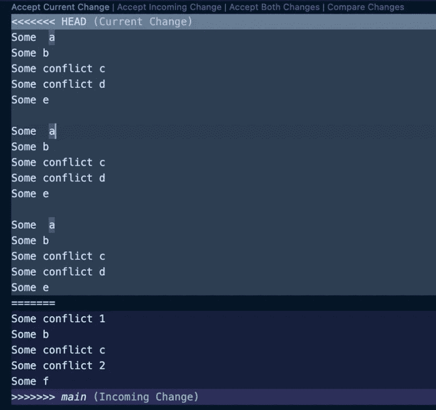

# 如何解决 Git 合并冲突

> 原文：<https://javascript.plainenglish.io/how-to-resolve-git-merge-conflicts-be4617a02691?source=collection_archive---------15----------------------->

## Git 合并冲突是使用 Git 不可避免的一部分。让我们看看如何在终端中或通过 GUI 解决这些问题。



合并冲突通常是复杂开发项目工作中的一部分。在本指南中，我们将看看如何处理它们，以及它们何时会发生。

# 什么时候会发生合并冲突？

如果您对您所在的分支和您试图合并到的分支上的同一个文件进行了更改，那么在 Git 中就会发生合并冲突。在这种情况下，Git 不知道应该使用哪一个——所以它会抛出一个合并冲突错误。

考虑对`main`分支和`my-branch`中的`file.md`进行更改的场景。当我们检查`main`并试图将`my-branch`合并到`main`时，我们会遇到以下错误:

```
git merge my-branchAuto-merging file.md
CONFLICT (content): Merge conflict in file.md
Automatic merge failed; fix conflicts and then commit the result.
```

Git 不知道在这里做什么，所以我们的工作就是尝试并解决它。

# 稳定当前分支

有时，当我们试图合并一个文件时，合并会完全失败:

```
error: Your local changes to the following files would be overwritten by merge:
        file.md
Please commit your changes or stash them before you merge.
```

这是因为我们在当前分支上有未提交的变更。在合并之前，我们需要关闭当前分支上的所有更改。为此，您可以运行`git stash` ( [我在这里更详细地介绍了 git stash](https://fjolt.com/article/git-mastering-stash))，或者您可以简单地在这个分支上提交您的更改以稳定它:

```
git add -A
git commit -m "My commit message"
```

既然我们的分支已经稳定，我们可以尝试运行`git merge my-branch`(其中`my-branch`是您的分支)来将我们的分支合并回`main`。如果我们现在遇到合并冲突，我们需要解决它们。

# 如何通过 GUI 解决 git 中的合并冲突

如果您正在使用像 Visual Studio 代码这样的现代代码编辑器，那么合并冲突将出现在 GUI 中，您可以在 GUI 中接受传入的更改或接受分支上的当前更改。这为解决冲突提供了一个非常简单的方法。在 Visual Studio 代码中，这通过下面显示的 GUI 表示在冲突文件中。你有很多选择:

*   “接受当前更改”—这将使用您当前分支的内容。
*   “接受传入的更改”——这将使用您正在合并的分支中的内容。
*   “接受两个改变”——这将保持两个，一个在另一个下面。
*   “比较更改”—这将打开一个额外的屏幕，以便并排比较更改。



检查完所有冲突后，您可以添加文件并正常提交:

```
git add -A
git commit -m "My commit message"
```

# 如何通过终端解决 git 中的合并冲突

在某些情况下，您可能没有 GUI 来解决合并冲突。您可以使用许多命令。

**首先**，`git status`会告诉你受影响的文件:

```
git status
On branch my-branch
You have unmerged paths.
  (fix conflicts and run "git commit")
  (use "git merge --abort" to abort the merge)Unmerged paths:
  (use "git add <file>..." to mark resolution)
        both modified:   file.mdno changes added to commit (use "git add" and/or "git commit -a")
```

我们可以看到，只有`file.md`受到影响。接下来，我们可以使用`git diff`来查看这个分支和我们要合并的分支之间的区别:

```
++<<<<<<< HEAD
 +Some  a
 +Some b
 +Some conflict c 
 +Some conflict d
 +Some e
++=======
+ Some conflict 1
+ Some b
+ Some conflict c
+ Some conflict 2
 -Some f
++Some f
++>>>>>>> main
```

这里，`++<<<<<<<`之后、`++=======`之前的一切代表当前的分支变更，而`++=======`之后、`++>>>>>>> main`之前的一切代表您正在合并的分支。

我们还可以通过运行`git log --merge`来查看冲突的提交

# 在合并冲突期间中止合并

有时你会意识到你在合并冲突中陷得有点太深——在这种情况下，你可以通过运行`git merge --abort`来撤销它。

```
git merge --abort
```

这将使我们回到非合并状态，这样我们就可以在尝试再次合并之前，手动解决两个分支中的合并冲突。

# 通过接受传入的或当前的更改来解决

解决某些文件合并冲突的另一个简单方法是使用`git checkout`上的`--theirs`和`--ours`选项。我们的合并冲突发生在`file.md`。如果我想接受来自我试图合并的分支的`file.md`的所有变更，我可以写:

```
git checkout --theirs file.md
```

这将从“他们的”代码版本中签出`file.md`。如果我想在我当前的分支中使用这个版本，我会使用`--ours`。`--ours`和`--theirs`都期望一个文件作为参数——所以这必须在一个文件接一个文件的基础上完成。

很简单，对吧？这对于合并整个文件来说很好，但是如果我们在一个文件中有多个合并冲突呢？

# 通过编辑文件本身来解决

记住，当你创建一个 git 合并冲突时，当我们运行`git diff`时，我们最终得到的内容是这样的？

```
++<<<<<<< HEAD
 +Some  a
 +Some b
 +Some conflict c 
 +Some conflict d
 +Some e
++=======
+ Some conflict 1
+ Some b
+ Some conflict c
+ Some conflict 2
 -Some f
++Some f
++>>>>>>> main
```

该内容也存在于发生冲突的文件中(当然没有 T0 和 T1)。当您想在没有任何 GUI 帮助的情况下解决合并冲突时，最简单的方法是转到有问题的文件，简单地删除您不想接受的部分。这只是意味着如果你想接受电流，删除`<<<<<<< HEAD`和`=======`之间的文本，或者如果你想接受输入，删除`=======`和`>>>>>>>`之间的文本。

# 添加并提交您的更改

一旦您解决了您的合并冲突，不要忘记在当前分支上添加并提交您的更改，以便它们保持保存状态:

```
git add -A
git commit -m "Merge message"
```

# 结论

我们的代码编辑器中有强大的工具来解决合并冲突。话虽如此，有时环境的限制意味着我们必须解决自己的 git 合并错误——或者我们可能更喜欢从终端完成这项工作。一些特定的边缘情况也可能意味着我们必须从终端完成这项工作。

在任何情况下，合并冲突都是 git 开发的一部分，只需从存在冲突的文件中删除我们不想要的内容就可以解决。我们还可以使用`git checkout --theirs`或`git checkout --ours`更快地解决问题。

*更多内容请看*[***plain English . io***](https://plainenglish.io/)*。报名参加我们的* [***免费周报***](http://newsletter.plainenglish.io/) *。关注我们关于*[***Twitter***](https://twitter.com/inPlainEngHQ)[***LinkedIn***](https://www.linkedin.com/company/inplainenglish/)*[***YouTube***](https://www.youtube.com/channel/UCtipWUghju290NWcn8jhyAw)*[***不和***](https://discord.gg/GtDtUAvyhW) *。对增长黑客感兴趣？检查* [***电路***](https://circuit.ooo/) *。***