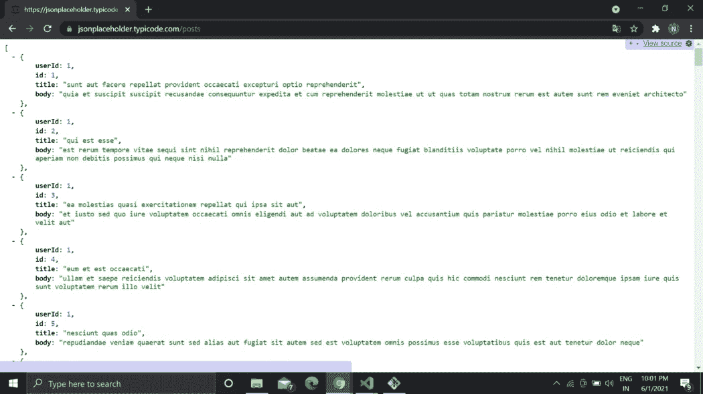
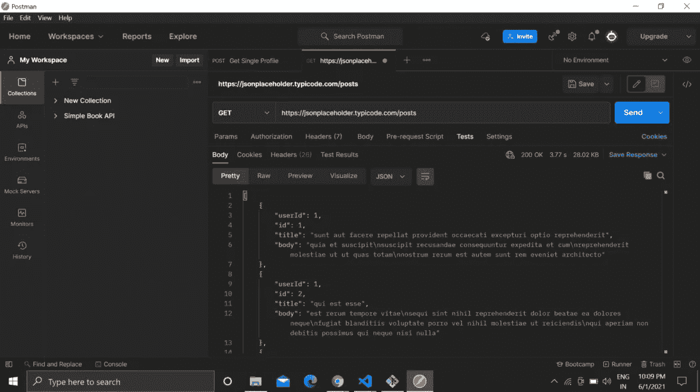
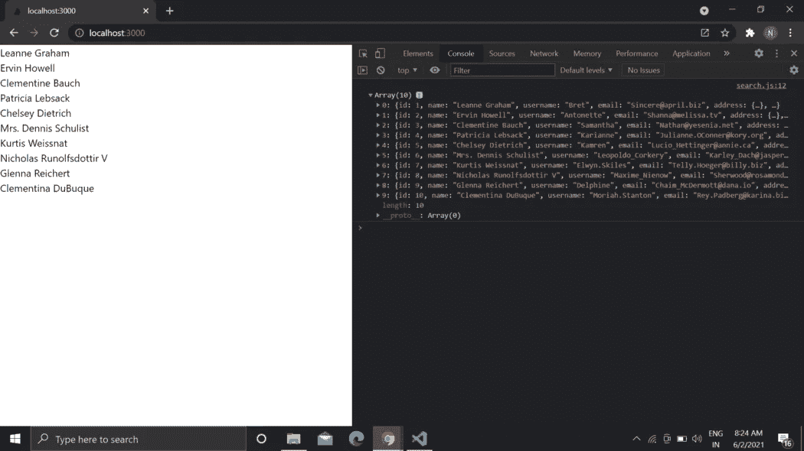

# 如何使用 Axios 在 React 中检索 API 数据

> 原文：<https://javascript.plainenglish.io/how-to-retrieve-your-api-data-in-react-using-axios-e5ab5a0ffd0b?source=collection_archive---------5----------------------->

## 5 分钟内学会。


Photo by [Lala Azizli](https://unsplash.com/@lazizli?utm_source=medium&utm_medium=referral) on [Unsplash](https://unsplash.com?utm_source=medium&utm_medium=referral)

我需要使用 Axios 来检索 API 数据并显示它。

但是我发现写完整个代码真的很不方便，偶尔还会篡改一下。结果后来显示不准确。

此外，如果您想了解如何从 API 显示数据，本教程将是有用的。

那我们开始吧。

# API 是否可操作？

让我分享一个例子。

当时我在一家初创公司工作。讲师给了我一些 API 代码，我可以将它们包含在代码库中。15 分钟后，我发现 API 运行不正常。

所以，首先也是最重要的，确定它是否可操作。

你可以用三种方法来做这件事。

让我们看一个免费的假 API 的例子，即 [JSONPlaceholder](https://jsonplaceholder.typicode.com/) 。

你可以从这里得到各种各样的假 API，比如[帖子数量](https://jsonplaceholder.typicode.com/posts)、[用户数量](https://jsonplaceholder.typicode.com/users)等等。

1.  第一种方法是直接点击链接或转到该网址。例如，当我点击[文章数量](https://jsonplaceholder.typicode.com/posts)时，它会显示类似下图的内容。



我有一个扩展，它为我提供了关于 API 中数据的更准确的信息。 [JSONView](https://chrome.google.com/webstore/detail/jsonview/chklaanhfefbnpoihckbnefhakgolnmc?hl=en) 是扩展的名称。也可以在 Chrome 内部安装使用。

如果一个 API 是公开可用的，我们可以判断它是否是功能性的。您还可以更清楚地看到 API 内部的数据量。

2.第二种方法是利用 Postman(也可以使用迅雷客户端)。Postman 让我们更容易使用 API。只需输入 API URL 并单击 transmit 按钮来检索数据。



如你所见，我们也在这里得到数据。Postman 可以连接到公共和私有 API。私有 API 需要不记名令牌或其他类型的权限。

如果你想学习如何使用 Postman 使用 API，[看看这个视频](https://youtu.be/VywxIQ2ZXw4)。

3.第三种方法是从任何代码编辑器中使用`console.log(response.data);`。这将在后面进一步讨论。

# 初始化 React 应用程序

首先，您必须使用初始化 React 应用程序，

```
npx create-react-app my-app
```

之后，使用以下命令安装 Axios:

```
npm i axios
```

# 创建功能组件

根据需要在 React 项目中创建组件文件夹或文件。

Get.js 是我的文件名。

在您的代码中创建一个如下所示的函数组件。

```
import React from 'react'function Get() {
return (
<div></div>
)
}
export default Get;
```

导入我们现在将使用的依赖项。

```
import React from 'react'
import { useState, useEffect } from "react";
import axios from "axios"
```

并创建一个如下所示的 useState 挂钩，

```
const [data, setData] = useState(‘’);
```

在这里，我们将设置从 API 获得的数据。最初，不会有任何数据。

# 使用 Axios 获取 API 数据

目前为止，我们还没有和 API 合作过。让我们开始吧。

首先，用您喜欢的任何名称创建一个方法。

```
const getAllData = () => {axios.get(
"https://jsonplaceholder.typicode.com/users").then((response) => {console.log(response.data);
setData(response.data);}).catch((error) => {
console.log(error);
});
};
```

我们在这里使用 Axios，并且在`axios.get`中，我们指定我们想要的 API 数据的 URL。然后我们会设置数据，如果有错误，它会打印出来。

我们来看看；我们还使用`console.log(response.data);`来确认我们正在从 API 获取数据。

但是，因为我们还没有调用它，所以前面提到的技术会失败。

所以我们将利用`useEffect hook`来完成这个任务。

```
useEffect(() => {
 getAllData();
}, []);
```

# 使用 Axios 显示数据

现在我们也看不到数据。因为到目前为止我们还没有展示过。

让我们展示它。

```
<>
{data ? ( 
data.map(
(data) => {return (
<div className="data" key={data.id}>
<h3>{data.name}</h3>
</div>);
 })) : (<h3>No data yet</h3>)}
</>
```

这里使用了三元运算符。我还添加了一个条件，如果有数据，只显示一个带有数据名的 div，否则不打印任何数据。

仅此而已。我们使用 Axios 从 API 获取数据并显示出来。

这里有一个完整的代码为您提供帮助。

```
import React from 'react'
import { useState, useEffect } from "react";
import axios from "axios"function Get() {
    const [data, setData]  = useState('');
    const getAllData = () => {
        axios
          .get("[https://jsonplaceholder.typicode.com/users](https://jsonplaceholder.typicode.com/users)")
          .then((response) => {
            console.log(response.data);
            setData(response.data);
          })
          .catch((error) => {
            console.log(error);
          });
    }
    useEffect(() => {
      getAllData();
    },[]);return (
        <>
            {data ? 
                data.map(data => {
                    return(
                       <div className="data" key={data.id}>
                         <h3>{data.name}</h3>
                       </div>
                    )
                }) : <h3>No data yet</h3> }
        </>
    )
}
export default Get;
```

当你在 App.js 中导入这个功能组件，它就可以工作了。



这里，我们正在获取数据，甚至在控制台选项卡中显示数据。

现在你也可以说得更清楚了。您可以构造一个方法并调用它，而不是在 return 语句中添加逻辑，如下所示。

```
import React from "react";
import { useState, useEffect } from "react";
import axios from "axios";function Get() {
  const [data, setData] = useState("");

  const getAllData = () => {
    axios
      .get("[https://jsonplaceholder.typicode.com/users](https://jsonplaceholder.typicode.com/users)")
      .then((response) => {
        console.log(response.data);
        setData(response.data);
      })
      .catch((error) => {
        console.log(error);
      });
  };

  useEffect(() => {
    getAllData();
  }, []); **const displayData = () => {
    return data ? (
      data.map((data) => {
        return (
          <div className="data" key={data.id}>
            <h3>{data.name}</h3>
          </div>
        );
      })
    ) : (
      <h3>No data yet</h3>
    );
  }**return (
    <>
      **{displayData()}**
    </>
  );
}export default Get;
```

就这样结束了。您已经在应用程序中显示了 API 数据。还学习了如何在 react app 中检索 API 数据。

谢了。

*如果你喜欢我的工作，想要支持，可以* [*请我喝杯咖啡！*](https://www.buymeacoffee.com/nitinfab)

*更多内容看* [***说白了。报名参加我们的***](http://plainenglish.io/) **[***免费周报***](http://newsletter.plainenglish.io/) *。在我们的* [***社区不和谐***](https://discord.gg/GtDtUAvyhW) *获得独家获取写作机会和建议。***