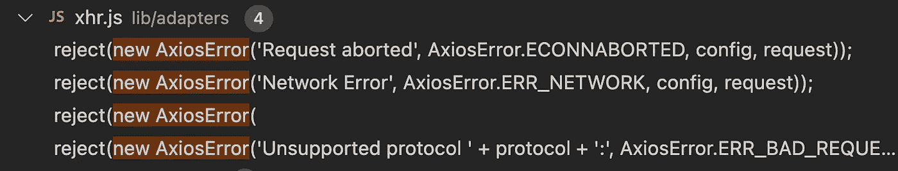

# 如何使用 Axios 重试请求

> 原文：<https://javascript.plainenglish.io/how-to-retry-requests-using-axios-64c2da8340a7?source=collection_archive---------0----------------------->

## 关于使用 Axios 拦截器重试请求的教程。

Retry Axios request

# 前言

当用户访问我们的 web 应用程序时，HTTP 请求可能会由于网络不稳定而失败，例如超时或网络异常。在这种情况下，通常会有一个异常页面通知用户，他们可以稍后重新进入 web 应用程序。如果我们重试这些失败的 HTTP 请求，用户可能不需要退出并重新进入我们的 web 应用程序，体验会更好。

我们将首先了解如果 [Axios](https://axios-http.com/) 请求失败可能发生的所有异常，然后使用 Axios 的拦截器重试 HTTP 请求。

# Axios 请求的例外

如果你观察过 Axios 的异常，可以发现所有异常的名字都是`AxiosError`。从`Error`继承的 Axios 自定义处理异常`[AxiosError](https://github.com/axios/axios/blob/v1.x/lib/core/AxiosError.js)`类。所以我们可以通过搜索 AxiosError 的源代码来找到所有的异常。

你可以搜索超过 20 个使用它的地方，但是我们只需要注意请求过程中的异常。

主要的例外是:

1.  请求中止
2.  网络错误
3.  网络超时
4.  不支持的协议

`Request aborted`的异常可能是由用户取消请求引起的，我们可能不会重试该请求。而`Unsupported protocol`的异常不需要重试，因为它会再次失败。因此，我们可以在`Network error`或`Network timeout`请求失败时重试请求。

# 失败时重试请求

Using interceptor to retry request

在使用 Axios 时，我们可以使用拦截器，它可以在请求和响应被`then`或`catch`处理之前拦截它们。拦截器接受两个参数，完成的回调和拒绝的回调。当请求失败时，它将执行被拒绝的回调。

我在 [copen.io](https://codepen.io/bitbug/pen/wvmreeY) 上创建了一个演示，为了测试这个特性，我们可以用 Devtools 阻止请求 URL。

然后我们可以模拟一下`Network Error`:

# 结论

通过使用 Axios 的拦截器拦截响应，如果出现`Network timeout`或`Network error`，尝试再次发送请求。我们可以通过设置`retry`和`retryDelay`来控制重试请求的次数和每次请求的间隔。

希望它能帮助你，我期待你**跟随**我学习更多实用技巧，成为一名更好的开发者。

您可以了解有关 Axios 的更多信息:

 [## 为什么我更喜欢在 Web 应用程序中使用 Axios

### 同构和基于承诺的代码使开发更加高效

javascript.plainenglish.io](/why-i-prefer-axios-in-web-app-9a78d655fd1d)  [## 为什么 Axios 可以在浏览器和 Node.js 中同时使用

### axios 如何兼容两种不同的请求方法

javascript.plainenglish.io](/why-axios-can-be-used-both-in-browser-and-node-js-5b88206f70f)  [## 如何实现像 Axios 这样的请求拦截器

### 在处理请求或响应之前拦截它们

javascript.plainenglish.io](/how-to-implement-a-request-interceptor-like-axios-896a1431304a) 

*更多内容看* [***说白了。报名参加我们的***](https://plainenglish.io/) **[***免费周报***](http://newsletter.plainenglish.io/) *。关注我们关于* [***推特***](https://twitter.com/inPlainEngHQ)**和*[***LinkedIn***](https://www.linkedin.com/company/inplainenglish/)*。查看我们的* [***社区不和谐***](https://discord.gg/GtDtUAvyhW) *加入我们的* [***人才集体***](https://inplainenglish.pallet.com/talent/welcome) *。****