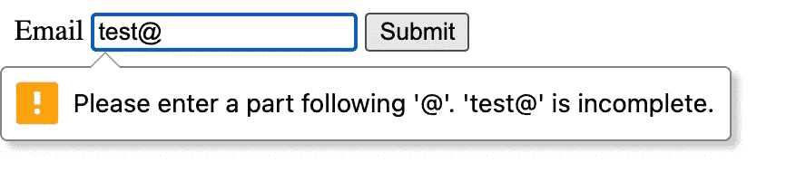

# 如何破坏客户端表单验证

> 原文：<https://javascript.plainenglish.io/how-to-ruin-client-side-form-validation-f9d7a619006?source=collection_archive---------0----------------------->

## 以及如何避免？


credit card Photo by [rupixen.com](https://unsplash.com/@rupixen?utm_source=unsplash&utm_medium=referral&utm_content=creditCopyText) on [Unsplash](https://unsplash.com/s/photos/online-shopping?utm_source=unsplash&utm_medium=referral&utm_content=creditCopyText)

在向服务器提交表单之前，默认的浏览器行为是检查所有必需的字段是否都存在并且格式正确。这称为客户端表单验证。然而，无意中禁用这种有用的浏览器行为是非常容易的。

# 对用户体验的影响

首先，我们这里说的是一个用户体验问题，而不是安全问题。表单提交后，必须在服务器端进行验证。这确保了只有正确的数据才能进入数据库。因此，虽然客户端表单验证不应该涉及应用程序的安全性，但它对于良好的用户体验是很重要的。您希望为用户提供关于输入数据是否“可以提交”的即时反馈。如果没有客户端验证，用户必须等待服务器返回响应，并在等待后调整数据。

# 浏览器会检查什么

虽然您可以在 JavaScript 中构建额外的检查，但以下是浏览器将自动执行的内置检查:

## 输入类型检查

每当您给输入字段一个类型时，浏览器将检查用户输入是否与表单提交上的类型匹配。更具体地说，当您提交一个表单并且您的输入不匹配时，浏览器会通知您，并且表单不会提交，直到您修复它。

```
<input type="email">
```



## 检查必填字段是否存在

每当输入字段有一个必需的属性时，就会检查它是否存在。

```
<input type="text" required>
```


对于客户端的[输入验证](https://developer.mozilla.org/en-US/docs/Learn/Forms/Form_validation)，您可以使用更多的内置特性。

既然我们已经概括了浏览器强大的验证功能，让我们看看这是如何被意外破坏的，以及如何减轻这种破坏。

# 用表单属性破坏表单验证

从 HTML5 开始，你可以在表单外使用按钮来提交表单。要做到这一点，您必须为按钮提供带有表单 id 值的表单属性。

```
<form id="login-form">
    <input type="text" name="street" required>
</form>

<button form='login-form'>Submit form</button>
```

这将提交表单，即使按钮在表单之外。虽然这是可能的，但它跳过了浏览器的本地输入检查功能。

# 用 JS 提交函数破坏表单验证

如果表单是通过 JS submit 函数提交的，那么所有的输入检查都会被跳过。

```
form.submit();
```

# 如何缓解

1.  非 JS 方法:使用标准表单标记

将按钮保留在表单中，并通过用户直接单击提交表单，表单将被自动验证。

```
<form id="login-form">
    <input type="text" name="street" required>
    <button>Submit form</button>
</form>
```

2.JS 方法:使用 HTMLFormElement.reportValidity()

您可以通过调用表单上的方法`reportValidity`来使用内置的浏览器验证。在验证输入之后，使用 JavaScript `submit`方法。

```
btn.addEventListener("click", () => {
    const isValid = form.reportValidity();
    if(isValid){          
        form.submit();
    } 
})
```

截至发布之日，此方法在除 IE 之外的所有浏览器中都可用。

还有一种类似的方法:`requestSubmit`。但是 Safari 还不支持(当然还有 IE)。使用`requestSubmit`方法，您可以立即请求提交表单，验证将在提交之前进行。这就像单击提交按钮(在表单内部)时发生的默认行为一样。

```
btn.addEventListener("click", () => form.requestSubmit());
```

您可以在这里检查实现状态[，但是现在，在 JS 表单提交方面，您应该坚持使用`reportValidity`和`submit`方法。](https://developer.mozilla.org/en-US/docs/Web/API/HTMLFormElement/requestSubmit)

# 摘要

您可以通过在提交表单之前在客户端验证输入来改善用户体验。要小心，因为浏览器的默认验证行为很容易被破坏。

避免在表单之外使用按钮，但是如果你这样做，只有在调用表单上的`reportValidity`之后才使用 JavaScript 提交表单。

感谢您的阅读！我希望你能从这篇文章中学到一些东西。请在评论中告诉我你的想法。

## 来源和其他资源

了解有关客户端表单验证的更多信息

[https://developer . Mozilla . org/en-US/docs/Learn/Forms/Form _ validation](https://developer.mozilla.org/en-US/docs/Learn/Forms/Form_validation)

关于 reportValidity 的更多详细信息

[https://developer . Mozilla . org/en-US/docs/Web/API/HTMLFormElement/report validity](https://developer.mozilla.org/en-US/docs/Web/API/HTMLFormElement/reportValidity)

更多关于`requestSubmit`的细节。

[](https://developer.mozilla.org/en-US/docs/Web/API/HTMLFormElement/requestSubmit) [## htmlformelement . request submit()-Web API | MDN

### 在下面的例子中，通过尝试使用 requestSubmit()发送请求来提交表单，如果它可用的话…

developer.mozilla.org](https://developer.mozilla.org/en-US/docs/Web/API/HTMLFormElement/requestSubmit) 

所有 HTML 输入类型[https://www.w3schools.com/html/html_form_input_types.asp](https://www.w3schools.com/html/html_form_input_types.asp)

*更多内容请看*[***plain English . io***](https://plainenglish.io/)*。报名参加我们的* [***免费周报***](http://newsletter.plainenglish.io/) *。关注我们关于*[***Twitter***](https://twitter.com/inPlainEngHQ)[***LinkedIn***](https://www.linkedin.com/company/inplainenglish/)*[***YouTube***](https://www.youtube.com/channel/UCtipWUghju290NWcn8jhyAw)*[***不和***](https://discord.gg/GtDtUAvyhW) *。***