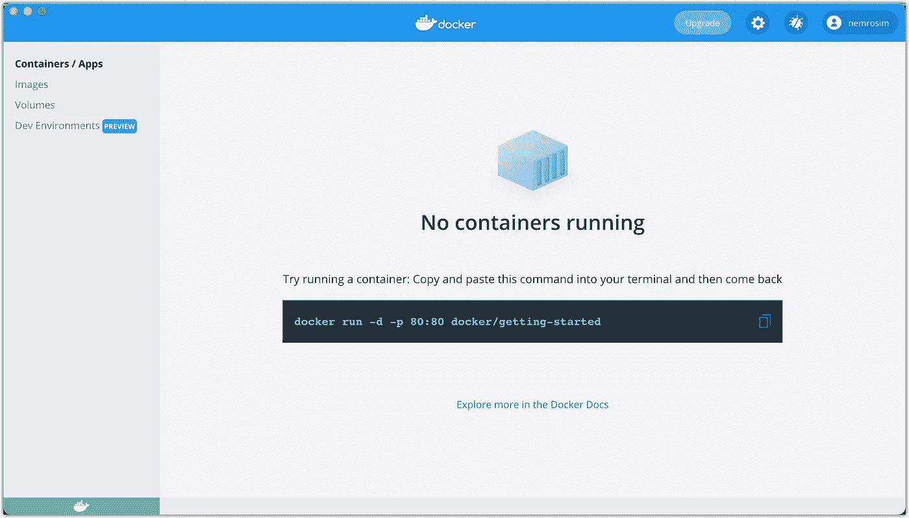

# 用 Docker 在本地运行 GitHub 动作

> 原文：<https://javascript.plainenglish.io/how-to-run-github-actions-locally-b4a3e69c4b49?source=collection_archive---------7----------------------->

## 在你的机器上本地测试 GitHub 动作而不把你的改变推给 GitHub 的简要指南。


# 步骤 1:安装 act

Mac 用户:`brew install act`

[](https://github.com/nektos/act) [## GitHub - nektos/act:在本地运行您的 GitHub 操作🚀

### “全球思考，本地行动”在本地运行您的 GitHub 行动！你为什么想这么做？两个原因:快…

github.com](https://github.com/nektos/act) 

# 步骤 2:安装/运行 Docker

[](https://www.docker.com/) [## 增强开发者的应用开发能力| Docker

### 最新消息阅读 Docker 商业白皮书！Docker Business 帮助组织大规模构建现代应用程序…

www.docker.com](https://www.docker.com/) 

# 第三步:跑步

运行 act 命令

```
act
```

# 问题

Act 用的是小 docker 形象。如果您遇到类似以下的错误:

```
sudo: command not found
```

尽量使用接近 GitHub 所用图像的完整图像。该命令如下所示:

```
act -P <platform>=<docker-image>
```

示例:

```
act -P ubuntu-latest=nektos/act-environments-ubuntu:18.04-full
// OR
act -P ubuntu-latest=ghcr.io/catthehacker/ubuntu:full-latest
```

**⚠️注**:这个包是`11.28 GB!!!`

 [## 码头枢纽

### 编辑描述

hub.docker.com](https://hub.docker.com/layers/nektos/act-environments-ubuntu/18.04-full/images/sha256-69f4f815404ccc68f22bbce1ad49f4367a3c26577d7ba01155c8a2280591e17f?context=explore) 

Docker Ubuntu 图片:

[](https://github.com/catthehacker/docker_images/pkgs/container/ubuntu) [## 一起打造更好的软件

### GitHub 是人们构建软件的地方。超过 7300 万人使用 GitHub 来发现、分享和贡献超过…

github.com](https://github.com/catthehacker/docker_images/pkgs/container/ubuntu) 

*更多内容看* [***说白了就是***](https://plainenglish.io/) *。报名参加我们的* [***免费周报***](http://newsletter.plainenglish.io/) *。关注我们关于*[***Twitter***](https://twitter.com/inPlainEngHQ)*和*[***LinkedIn***](https://www.linkedin.com/company/inplainenglish/)*。加入我们的* [***社区***](https://discord.gg/GtDtUAvyhW) *。*