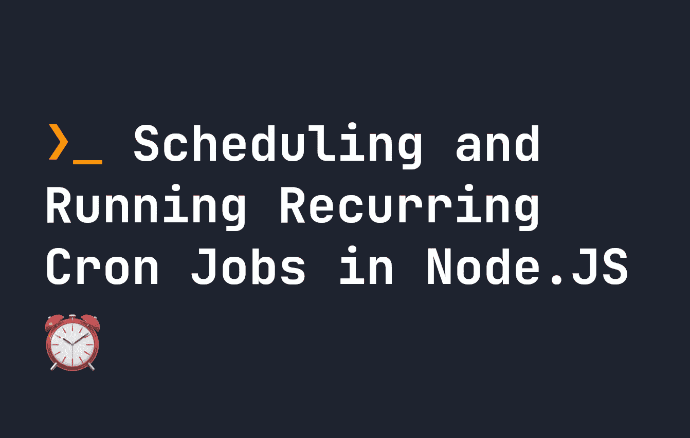

# 如何在 Node.js 中调度和运行重复的 Cron 作业

> 原文：<https://javascript.plainenglish.io/how-to-schedule-and-run-recurring-cron-jobs-in-node-js-91d679868179?source=collection_archive---------10----------------------->

## Cron 作业用于创建以特定时间间隔运行的脚本。让我们看看它们在 Node.js 中是如何工作的



这是编程中的一个常见要求，必须设置某些东西以特定的时间间隔运行。例如，您可能希望每 30 分钟处理一次数据库，或者您可能希望每周发送一次电子邮件。我们通常的做法是使用 cron jobs。在 Node.js 中，我们还可以设置 cron 作业以特定的时间间隔运行。让我们看看它是如何工作的。

# Cron 作业如何在 Node.js 中工作

在 Node.js 中创建 cron 作业的最佳方式是使用名为`node-schedule`的包。确保安装了 Node.js，然后在项目文件夹中运行以下命令来安装它:

```
npm i node-schedule
```

`node-schedule`基本上允许我们使用`cron`格式的时间来设置重复性工作。`cron`格式是 JavaScript 中的一组 6 个字符，每个字符代表一个不同的时间元素。我们也可以使用星号作为通配符。格式的顺序如下所示:

```
*    *    *    *    *    *
┬    ┬    ┬    ┬    ┬    ┬
│    │    │    │    │    │
│    │    │    │    │    └ day of week (0 - 7) (0 or 7 is Sun)
│    │    │    │    └───── month (1 - 12)
│    │    │    └────────── day of month (1 - 31)
│    │    └─────────────── hour (0 - 23)
│    └──────────────────── minute (0 - 59)
└───────────────────────── second (0 - 59, OPTIONAL)
```

理解`cron`格式最简单的方法是，如果我们给出最基本的格式，即`* * * * *`，它被翻译成含义为`every month`的`every day of the week`或`every day of month`的`every hour`或`every minute`的`every second`。所以本质上，`* * * * *`在`node-schedule`中每秒都在运行。

如果我们开始定义数字而不是星星，那么我们就可以开始限制事情发生的频率。例如，`00 30 10 * * 1`将定义一个作业，当小时为 **10** 分钟为 **30** 秒钟为 **00** 时，该作业在每月**的**一周的第一天**运行**在每月的每**天运行。**

因此，基本上该作业将在每周一上午 10:30 运行。

# Cron 作业中使用的其他符号

我们还可以在 cron jobs 中使用其他一些符号，当您第一次看到它们时，可能会感到困惑。

*   破折号(`-` ) -可以用来表示一个范围，例如`2-5`表示`2,3,4,5`。**举例** : `00 30 10 * * 1-4`。
*   问号(`?`)——可以用在一周的**天**或一月的**天**中，如果一个都不重要的话。例如，如果我们希望某个东西在一个月中的某一天触发，但是我们不在乎那天是星期几——那么我们将星期几设置为 T1。**举例** : `00 30 10 * * ?`。
*   正斜杠(`/` ) -用于定义系列。例如，给`*/5`一个小时的值代表`0,5,10,15,20`。如果您给定一个数字作为第一个参数，它将定义起始数字。即小时字段中的`2/5`代表`2,7,12,17,22`。**举例** : `00 30 */5 * * 1`。
*   逗号(`,` ) -表示一系列数字，即`2,3,5,7`。**举例** : `00 30 5 * 4,5,6 1`。

# 在 Node.js 中设置 cron 作业

既然我们对如何格式化 cron 作业有了一些了解，那么让我们看看如何创建一个。假设我们想使用前面的例子，创建一个 cron 作业，在每周一上午 10:30 运行。我们将使用的格式是`00 30 10 * * 1`。在您的项目中创建一个名为`scheduler.js`的文件，并将以下代码放入其中:

```
import schedule from 'node-schedule'
schedule.scheduleJob('00 30 10 * * 1', async function() {
    // This will run every Monday at 10:30;
    console.log('hey!');
});
```

以上`function() ...`中的任何内容将在每周一上午 10:30 运行。这种情况下，`console.log('hey!')`。要启动该脚本，您可以直接从命令行运行它，如下所示:

```
node scheduler.js
```

现在我们的作业将在星期一的任何时候运行，时间是上午 10:30。

# 在 Node.js 中持续运行 cron 作业

这段代码很好，但是它意味着您必须保持您的`node scheduler.js`会话活动。如果您想在后台运行这样的 cron 作业而不必担心它，最好使用`pm2`来保持它持续运行。`pm2`启动 Node.js 程序，并让它保持运行，这样你就不用担心了。您可以在终端中安装`pm2`,如下所示:

```
npm install pm2 -g
```

然后，要运行您的`scheduler.js`文件并保持它持久运行，请在终端中运行以下命令:

```
pm2 start scheduler.js
```

现在我们的`scheduler.js`文件正在后台运行，将在每周一上午 10:30 启动——所以你不必担心。

# 结论

Cron 作业需求一直都在出现，因此在 Node.js 中拥有这一功能非常有用。Cron 作业可以用来做很多事情，比如整理文件结构、发送电子邮件或定期处理大量数据。我希望你喜欢这个指南。[点击此处](https://fjolt.com/)了解更多网络技巧。

*更多内容看* [***说白了。报名参加我们的***](https://plainenglish.io/) **[***免费周报***](http://newsletter.plainenglish.io/) *。关注我们关于*[***Twitter***](https://twitter.com/inPlainEngHQ)*和*[***LinkedIn***](https://www.linkedin.com/company/inplainenglish/)*。查看我们的* [***社区不和谐***](https://discord.gg/GtDtUAvyhW) *，加入我们的* [***人才集体***](https://inplainenglish.pallet.com/talent/welcome) *。***