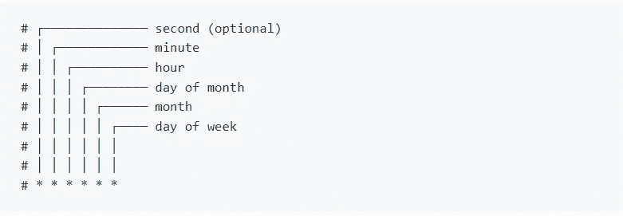
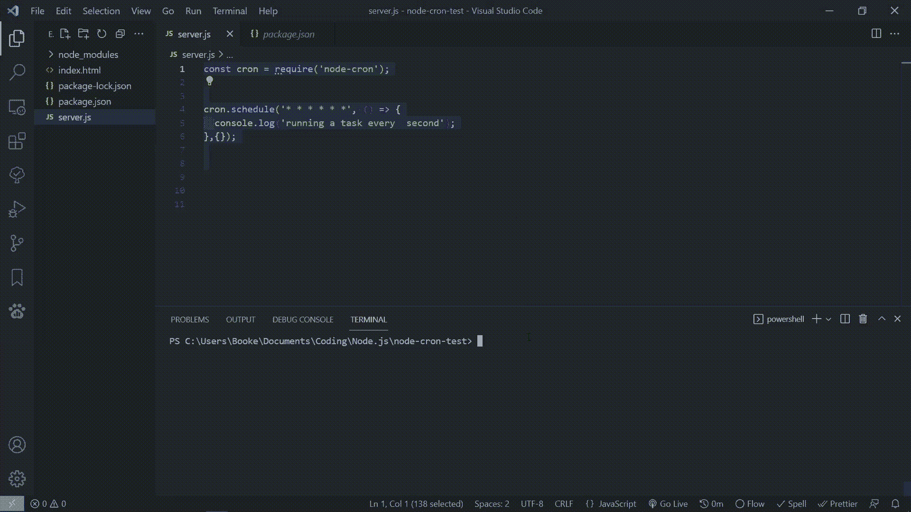
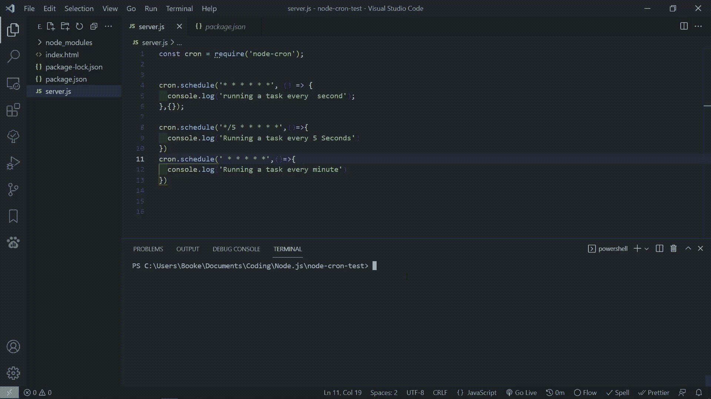

# 如何使用 Node-Cron 在 Node.js 中调度任务

> 原文：<https://javascript.plainenglish.io/how-to-schedule-tasks-in-node-js-using-node-cron-e584dc14388b?source=collection_archive---------9----------------------->

## 再次简化 Node.js 中的任务调度


Photo by [CHUTTERSNAP](https://unsplash.com/@chuttersnap?utm_source=medium&utm_medium=referral) on [Unsplash](https://unsplash.com?utm_source=medium&utm_medium=referral)

创建 Node.js 应用程序时，有时需要重复运行某些任务。

例如，你可能需要在每个月的第一天运行一个 web scrapper，或者你可能需要在每周二、三、四的早上 6 点发送电子邮件。

像这样的用例是节点包 [node-cron](https://github.com/node-cron/node-cron) 开始发光的地方。

在这篇博文中，我将向您展示如何每秒、每 5 秒和每分钟打印 console.log 语句，这样您就可以开始理解如何使用 node-cron。

# 什么是 node-cron？

node-cron 是一个 Node.js 模块，允许您使用 crontab 语法调度任务。

如果您不知道 crontab 语法是什么，这是一种通过使用由 5–6 个字段组成的字符串来表示一组时间的方法。

crontab 的语法如下所示:



Crontab Syntax

使用 crontab 语法时，星号(*)表示“每隔*间隔*运行此任务”

例如，cron 表达式:*** * * * * * ***表示“每秒、每分钟、每小时、每小时、每天、每月、每周的每一天运行以下任务”

> 本质上，这个 cron 表达式将每秒运行一个任务。

为了更精确，我们可以用数字代替星号。

例如，如果我们想每小时运行一个任务，我们可以使用 cron 表达式:

> * * 1 * **

如果我们想每五个小时运行一个任务，我们可以使用 cron 表达式:

> * * */5 * * *

现在我们对 crontab 语法有了基本的了解，是时候在实际项目中使用我们的新知识了。

*注意:如果您需要更好地理解 crontab 语法，我建议您通读一下*[*node-cron*](https://github.com/node-cron/node-cron)*文档，并使用* [*crontab。guru*](https://crontab.guru/#*_*_*_*_*) *练习写 cron 表情。*

# 导入节点-cron

要使用 node-cron，您只需运行以下 npm 命令:

```
$ npm install --save node-cron
```

之后，创建一个名为 **server.js** 的新 javascript 文件，并添加以下代码

```
const cron = require('node-cron');
```

这就是开始使用 node-cron 所需要做的全部工作。

# 使用 Cron.schedule

现在我们已经设置了 node-cron，是时候开始调度任务了。

我们将使用 cron。安排来完成这项工作。

克朗。schedule 接受两个参数一个 cron 表达式和一个回调函数以及要执行的任务。

下面的代码显示了如何运行每秒打印的任务

> “每秒运行一个任务”

到控制台。

代码如下:

Scheduling a task every second

太好了！

现在你所要做的就是运行**节点 server.js** ，你应该看到“每秒运行一个任务”被每秒打印到控制台。



The output of Running Server.js

很好，现在是时候做同样的事情了，但是这次是每 5 秒和 1 分钟一次。

代码如下:

这是您将看到的输出:



Console Output of running a task every second,5 seconds, and minute

# 结论

感谢您阅读完我的文章**‘如何使用 Node-Cron 在 Node.js 中调度任务’**。如果你有任何问题，请随意提问，我会尽快回答。

我希望你有美好的一天。如果你是中级新手，你可以点击这里的链接[加入。](https://bookeraziz.medium.com/membership)

[](/how-to-add-dynamic-styles-in-react-and-react-native-628280320ca4) [## 如何在 React 和 React Native 中添加动态样式

### 让你的应用充满活力的初学者指南

javascript.plainenglish.io](/how-to-add-dynamic-styles-in-react-and-react-native-628280320ca4) [](https://blog.devgenius.io/6-vs-code-quality-of-life-extensions-acbfd1425561) [## 6 VS 代码生命质量扩展

### 这些扩展可能不会让你更有效率，但是它们会让你的生活变得更加轻松

blog.devgenius.io](https://blog.devgenius.io/6-vs-code-quality-of-life-extensions-acbfd1425561) 

*更多内容请看*[*plain English . io*](http://plainenglish.io/)*。报名参加我们的* [*免费周报*](http://newsletter.plainenglish.io/) *。在我们的* [*社区*](https://discord.gg/GtDtUAvyhW) *获得独家的写作机会和建议。*