# 使用 JavaScript 和 Python 在没有无头浏览器的情况下合法地抓取 Glassdoor 作业数据

> 原文：<https://javascript.plainenglish.io/how-to-scrape-glassdoor-job-data-legally-without-headless-browsers-331ea7c24ebd?source=collection_archive---------14----------------------->

## 一个关于合法地从 Glassdoor 抓取工作列表数据的教程，不需要使用任何类型的无头浏览器或登录网站。


Glassdoor 存储了超过 1 亿条评论、薪水和见解；有 220 万雇主积极向市场发布工作，每月有大约 5900 万次独立访问。拥有如此多的数据和需求，Glassdoor 是工作和公司数据的金矿。

在今天的教程中，我们将在不使用任何类型的无头浏览器或登录网站的情况下，从 Glassdoor 收集工作列表数据，从而保持我们的活动合法且符合道德责任。

谈论法律…

# 刮玻璃门合法吗？

直截了当的答案是肯定的，只要你不违反一些基本规则，刮 Glassdoor 就是合法的。

一般来说，Glassdoor 不喜欢被刮，正如其[使用条款](https://www.glassdoor.com/about/terms.htm#:~:text=or%20to%20scrape)中所述。然而，有一些细微差别，因为你必须接受这些条款，他们会影响你。

例如，创建一个帐户，然后在日志墙后面抓取数据会被认为是非法的，因为你在创建帐户的那一刻就已经同意了*的使用条款*。

也就是说，所有不需要账号就可以访问的页面都被认为是公开的；因此，你刮这些纸是合法的。

尽管如此，我们还是建议使用一些[最佳实践来确保你尊重网站](https://www.scraperapi.com/blog/web-scraping-best-practices/)并且不伤害它的用户。

**资源:**要获得更全面的解释，请查看我们的[网页抓取合法性指南](https://www.scraperapi.com/featured/is-web-scraping-legal/)。

# 用 JavaScript 抓取 Glassdoor 作业

对于这个项目，我们将收集 Glassdoor 在米兰的兼职工作机会，以提取职位名称、公司招聘和职位发布的链接。

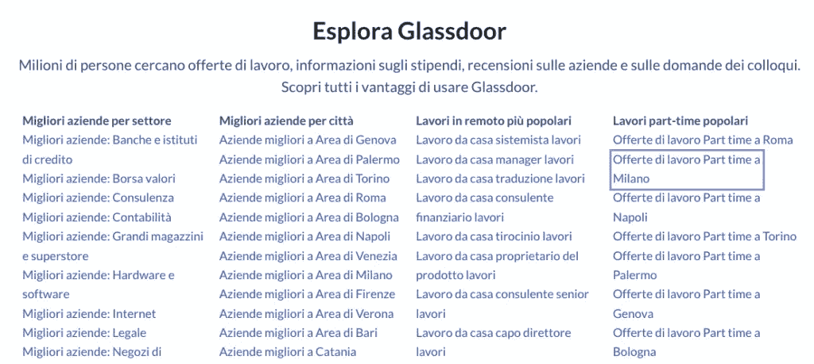

这些分类页面是公开的(它们不在任何类型的登录或付费墙后面)，所以我们正在做这个 100%白帽子。

# 要求

虽然我们将解释该过程的每一步，但我们假设您已经掌握了基本知识。然而，如果你曾经感到失落或困惑，这里有几个更简单的网络抓取项目，你可以用它们来逐步提高你的技能:

*   [带节点的网页抓取。初学者 JS](https://www.scraperapi.com/blog/web-scraping-javascript-tutorial/)
*   [用 Cheerio 抓取 LinkedIn 工作数据](https://www.scraperapi.com/blog/how-to-build-a-linkedin-scraper/)
*   [在 Node.js 中使用 Async 和 Await 进行网络抓取](https://www.scraperapi.com/blog/how-to-scrape-football-data/)

现在，让我们从设置项目开始。

# 1.获取项目设置

为了让一切都启动并运行起来，你需要为你的项目创建一个新的文件夹(我们将我们的文件夹命名为 *glassdoor-scraper* )，并在 VS Code 或你最喜欢的 IDE 上打开它。

进入文件夹后，打开终端并启动节点。JS 是这样的:

`1npm init` `-``y`

它将在您的项目中创建两个必要的 JSON 文件。

**注意:**如果还没有，[下载并安装 Node。JS 和 NPM](https://nodejs.org/en/download/) 在运行任何命令之前。

然后，我们将安装我们最喜欢的三个依赖项:

`1npm install axios cheerio objects``-``to``-``csv`

从这里，创建一个新的文件名 glassdoorScraper.js，并在顶部导入依赖项:

```
1const axios = require(``"axios"``);2const cheerio = require(``"cheerio"``);3const ObjectsToCsv = require(``"objects-to-csv"``);
```

下一步，让我们探索 Glassdoor，了解如何访问我们正在寻找的每个数据点。

# 2.了解 Glassdoor 的页面

当点击链接“提供米兰拉沃罗兼职”

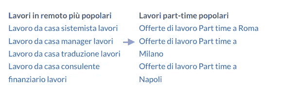

网站会在左边以卡片的形式把你带到一个工作列表，更多的细节在右边。每张卡片代表一份工作，包含了我们要找的所有信息:公司名称、职位名称和工作岗位的链接。

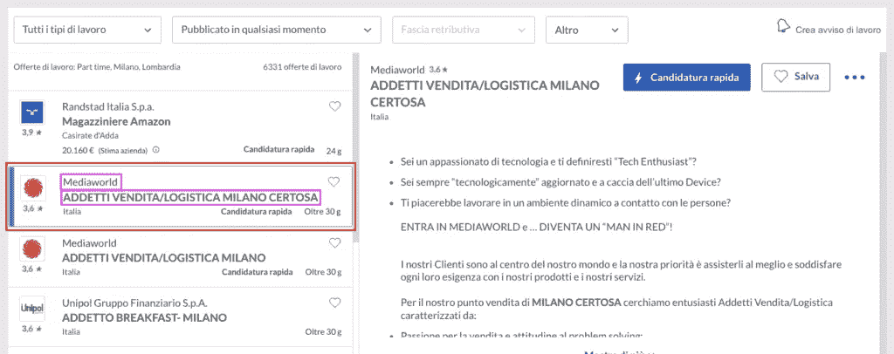

但是我们对视觉渲染不感兴趣，对吗？为了找到我们的 CSS 目标，让我们检查页面，看看这些卡片是如何构成的。

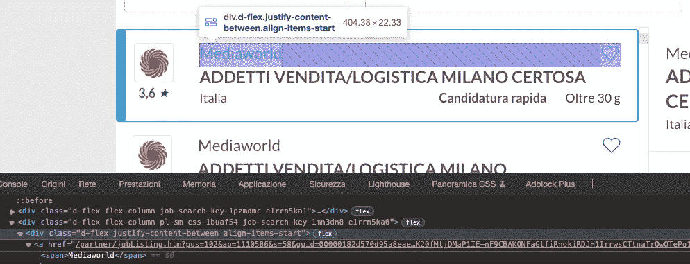

卡片上的第一个元素是公司的名称，它在容器中向下三层:`div > a > span`。注意这一点很重要，因为包含文本的`<span>`没有任何我们可以作为目标的属性。

如果我们只在解析器中使用`<span>`,我们将提取页面上的所有`<span>`元素——这并不太好。

相反，我们可以上升一个级别，将父标签`<a>`作为目标，因为它有大量的属性。

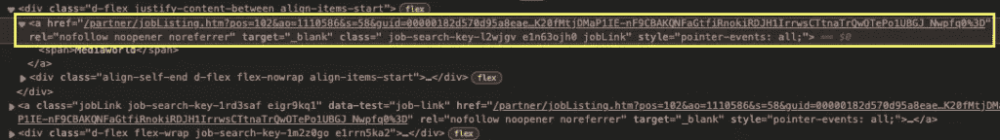

公司名称的选择器看起来类似于`a.job-search-key-l2wjgv.e1n63ojh0.jobLink > span`。

换句话说，我们以每个具有类属性“`job-search-key-l2wjgv.e1n63ojh0.jobLink`”的`<a>`标签为目标，然后向下移动到`<span>`子标签。

**注意:**这个标签分配了三个不同的类值；在大多数情况下，当检查页面的 HTML 时，这些值用空格分隔，如上图所示。但是，当在代码中构造选择器时，这可能会成为一个问题，因此，请用点替换这些空格。

如果您对其余的元素执行相同的过程，它将看起来像这样:

*   对于职位名称，我们实际上是在寻找数据测试属性:“a[data-test='job-link'] > span”

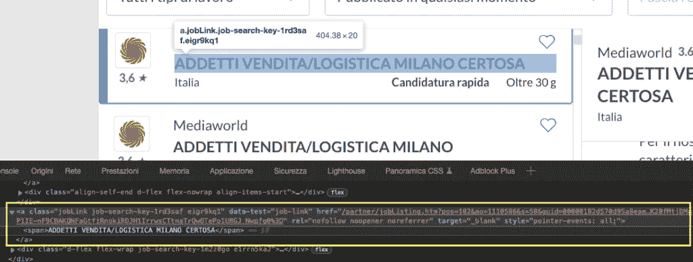

*   对于 URL，我们将使用与职位相同的选择器，但是没有`<span>`元素。

但是我们怎么知道这些会不会起作用呢？嗯，我们可以建立刮刀，并尝试在第一页上的选择器，但如果它不工作，将只是不断发送请求后，请求？

不要！在我们将我们的 IP 置于危险之前，最好使用浏览器的控制台来测试这些选择器。

# 3.测试浏览器控制台内的选择器

从您所在的位置，单击控制台选项卡。你会看到很多信息印在那里。

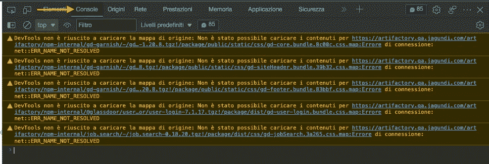

要摆脱它，在你的关键字中按 CTRL + L 清除控制台。

从头开始，让我们将第一个选择器传递给 querySelectorAll()函数，看看返回了什么:

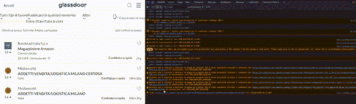

很好，成功了！如您所见，它总共返回了 30 个节点，当我们将鼠标悬停在这些节点上时，它们会在每张卡片上突出显示公司的名称。另外，现在我们知道每页有 30 个作业。

尝试测试其余的选择器，亲自看看这个过程。当你准备好了，让我们回到 VS 代码。

# 4.通过 Axios 发送 HTTP 请求

你知道你想要提取什么，现在你知道在哪里可以找到它。是时候把我们的铲运机送到野外去了。

在我们的 our glasssdoorScraper.js 文件中，让我们创建一个新的异步函数，并通过传递我们的目标 URL 来初始化 Axios。

```
1(``async function () {2const page = await axios("");3})();
```

哦！但是我们还没有选择网址，不是吗？回到当前页面，URL 看起来像这样:

```
1[https://www.glassdoor.it/Lavoro/milano-part-time-lavori-SRCH_IL.0](https://www.glassdoor.it/Lavoro/milano-part-time-lavori-SRCH_IL.0),6_IC2802090_KO7,16.htm
```

但是在没有评估是否有更好的变体之前，你不应该使用第一个 URL。

举例来说，如果我们浏览分页系列中的其余 URL，这里有一个页面与页面之间的共同趋势:

第 2 页:

```
[https://www.glassdoor.it/Lavoro/milano-part-time-lavori-SRCH_IL.0,6_IC2802090_KO7,16_IP2.htm?includeNoSalaryJobs=true&pgc=AB4AAYEAHgAAAAAAAAAAAAAAAeJsfSYASAEBAQ0BkGkLZy7wZR4%2F2Zo9gFfJc%2BaGfJR2hsdPG88aYkQEq%2BZCuA1D8cX0auxYd5YLWXw4PlrFLs6CbF64VTKidMy%2FVVlQewAA](https://www.glassdoor.it/Lavoro/milano-part-time-lavori-SRCH_IL.0,6_IC2802090_KO7,16_IP2.htm?includeNoSalaryJobs=true&pgc=AB4AAYEAHgAAAAAAAAAAAAAAAeJsfSYASAEBAQ0BkGkLZy7wZR4%2F2Zo9gFfJc%2BaGfJR2hsdPG88aYkQEq%2BZCuA1D8cX0auxYd5YLWXw4PlrFLs6CbF64VTKidMy%2FVVlQewAA)
```

第 3 页:

```
[https://www.glassdoor.it/Lavoro/milano-part-time-lavori-SRCH_IL.0,6_IC2802090_KO7,16_IP3.htm?includeNoSalaryJobs=true&pgc=AB4AAoEAPAAAAAAAAAAAAAAAAeJsfSYAfQEBARIBKE7V5yzSCE8JHGVBEGqz7wAzuNK9l7EpYDY04B%2FezXcfXZMYR5YqLcFzc7zLnpGx2RjtMQTOQD7v9%2FdGuWhCorhxKDvn80HEk9RcGxMTa110BNJz2wVS1VEBfbcw0u1rpBWrMhZMF1T%2BAHtTQq8aCnkr9ztDMcmkAAA%3D](https://www.glassdoor.it/Lavoro/milano-part-time-lavori-SRCH_IL.0,6_IC2802090_KO7,16_IP3.htm?includeNoSalaryJobs=true&pgc=AB4AAoEAPAAAAAAAAAAAAAAAAeJsfSYAfQEBARIBKE7V5yzSCE8JHGVBEGqz7wAzuNK9l7EpYDY04B%2FezXcfXZMYR5YqLcFzc7zLnpGx2RjtMQTOQD7v9%2FdGuWhCorhxKDvn80HEk9RcGxMTa110BNJz2wVS1VEBfbcw0u1rpBWrMhZMF1T%2BAHtTQq8aCnkr9ztDMcmkAAA%3D)
```

在这些 URL 中有很多噪音，但是仔细看看用黄色突出显示的 URL 的底部。

如果我们只使用这一部分，我们得到的结果就好像我们在分页一样。所以让我们从现在开始使用这个结构。

```
1(``async function () {2const page = await axios(3"[https://www.glassdoor.it/Lavoro/milano-part-time-lavori-SRCH_IL.0](https://www.glassdoor.it/Lavoro/milano-part-time-lavori-SRCH_IL.0),6_IC2802090_KO7,16_IP1.htm?includeNoSalaryJobs=true"4);56console.log(page.status);7})();
```

此外，我们还提供控制台日志记录。

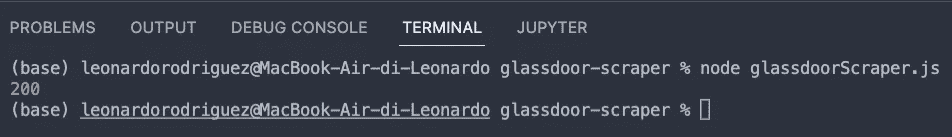

厉害了，一个 200 成功的代码！然而，在我们继续之前，我们还需要做一件事，一旦我们将项目扩展到更多的请求，让我们的 scraper 更有弹性。

# 5.集成 ScraperAPI 以避免阻塞

在抓取高流量或数据密集型网站时，需要考虑的一点是，大多数网站不喜欢被抓取，因此他们有几个锦囊妙计来阻止您的脚本访问他们的服务器。

为了解决这个问题，你需要编写不同的行为来方便服务器，你的抓取器实际上是一个真正的人与页面进行交互，如处理验证码，旋转你的 IP 地址，创建和维护一个 IP 地址池进行旋转，[发送正确的标题](https://www.scraperapi.com/blog/headers-and-cookies-for-web-scraping/)，并更改你的 IP 位置以访问地理敏感数据。

或者我们可以使用一个简单的 API 来为我们处理这一切。

ScraperAPI 使用机器学习、多年的统计分析和巨大的浏览器农场来防止您的抓取机器人被标记和阻止。

首先，让我们[创建一个免费的 ScraperAPI 帐户](https://www.scraperapi.com/signup)来生成一个 API 密钥——您可以在您的仪表板中找到它。

我们将使用以下结构来修改我们的初始请求:

```
1http:``/``/``api.scraperapi.com?api_key``=``{yourApiKey}&url``=``https:``/``/``www.glassdoor.it``/``Lavoro``/``milano``-``part``-``time``-``lavori``-``SRCH_IL.``0``,``6_IC2802090_KO7``,``16_IP1``.htm?includeNoSalaryJobs``=``true
```

现在，我们的请求将从 ScraperAPI 的服务器发送，在每个请求中轮换我们的 IP 地址，并处理我们的刮刀遇到的所有复杂性和反刮擦系统。

# 6.用 Cheerio 解析响应

有趣的部分开始了！提取所需数据的第一步是[解析响应](https://www.scraperapi.com/blog/what-is-data-parsing/)，这样我们就可以浏览节点，并使用之前构建的选择器挑选元素。

```
1const html = page.data;2const $ = cheerio.load(html);
```

您现在所做的是将响应数据(HTML 数据)存储到一个变量中，然后传递给 Cheerio 进行解析。

Cheerio 会将 HTML 文件中的每个元素转换成节点对象，我们可以使用 XPath 或者 CSS 选择器遍历这些对象。

尽管如此，还有一个选择器我们还没有讨论:主容器。

在页面上，每个工作列表都由一个卡片表示，每个卡片都包含我们想要的数据。为了让我们的 scraper 更容易找到信息——并减少无用数据泄露到我们项目中的可能性——我们首先需要挑选所有的卡片，然后遍历它们以提取数据点。

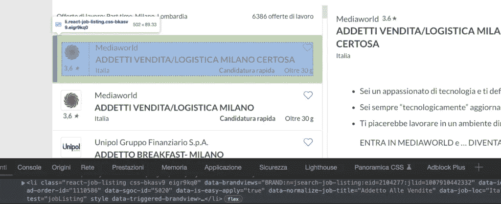

每张卡片都是一个`<li>`元素，我们可以使用`[data-test="jobListing"]`属性来挑选它们。

**注意:**由于截图中的剪切，您在图像上看不到它，但是您将能够在页面上找到该属性。

所以我们可以这样编写整个解析器:

```
1let allJobs = $(``'[data-test="jobListing"]'``);2allJobs.each((index, element) =``> {3const jobTitle = $(element).find(``"a[data-test='job-link'] > span"``).text();4const company = $(element)5.find(``"a.job-search-key-l2wjgv.e1n63ojh0.jobLink > span"``)6.text();7const jobLink = $(element).find(``"a[data-test='job-link']"``).attr(``"href"``);8});
```

注意到字符串末尾的`.text()`方法了吗？您可能已经知道，方法从元素中提取文本数据。没有它，它将返回标记和文本，这不是很有帮助。

另一方面，当我们想要提取元素中某个属性的值时，我们可以使用`.attr()`方法并传递我们想要从中获取值的属性。

如果我们现在运行我们的脚本，实际上什么也不会发生，因为脚本不会对它选取的数据做任何事情。

我们可以继续将数据记录到终端，但是看起来会很混乱。所以，在我们记录它之前，让我们用一个数组来格式化它。

# 7.将数据推送到空数组中

在主异步函数之外，创建一个空数组，如下所示:

```
1let jobListings = [];
```

要在里面添加抓取的数据，我们只需要使用数组上的`.push()`:

```
1jobListings.push({2"Job Title"``: jobTitle,3"Hiring Company"``: company,4"Job Link"``: "[https://www.glassdoor.it](https://www.glassdoor.it/)" + jobLink,5});
```

你听到了吗？我们在从`jobLink`返回的值之前推送一个字符串。但是为什么呢？

这就是为什么网络抓取是关于细节的。让我们回到页面，看看`href`值:

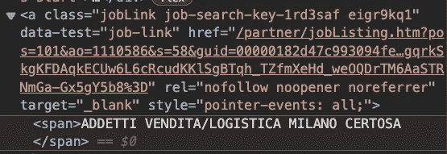

那里有很多信息，但是 URL 少了一块:“[*https://www . glass door . it*](https://www.glassdoor.it)”。这是一个聪明的方法来保护网址免受像我们这样的骗子的攻击。

我们将这两个字符串连接成一个字符串，将缺少的信息作为一个字符串与 jobLink 的值一起传递。因此，使它再次有用。

解决了这个问题后，让我们通过控制台记录生成的数组来测试我们的代码:

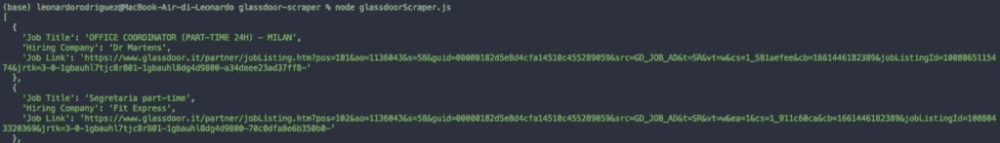

迄今为止工作出色；你已经完成了最难的部分！现在，让我们把数据从终端取出来，好吗？

# 8.构建 CSV 文件

由于 ObjectsToCsv 包，将抓取的信息导出到 CSV 文件实际上非常简单。您需要做的就是在`.each()`方法之外添加以下代码片段:

```
1const csv = new ObjectsToCsv(jobListings);2await csv.toDisk(``"./glassdoorJobs.csv"``, { append: true });3console.log(``"Save to CSV"``);
```

重要的是，我们将 append 设置为 true，这样如果我们不在每次使用文件时覆盖它。

我们之前已经测试过了，所以先不要运行你的代码。之前我们还想再做一件事。

# 9.处理分页页面

我们已经知道了 URL 结构在分页系列中是如何逐页变化的。有了这些信息，我们可以创建一个`for loop`来增加 IP{x}号，直到我们到达分页中的最后一页:

```
1for (let pageNumber = 1``; pageNumber < 31``; pageNumber +``= 1``){}
```

此外，我们需要在`axios()`请求中动态添加这个数字:

```
1const page = await axios(2http://api.scraperapi.com?api_key={yourApiKey}&url=https://www.glassdoor.it/Lavoro/milano-part-time-lavori-SRCH_IL.0,6_IC2802090_KO7,16_IP${pageNumber}.htm?includeNoSalaryJobs=true3);
```

最后，我们将整个代码移到`for loop`中——为了简单起见，将 CSV 部分排除在循环之外。

# 10.试运行和全玻璃门节点。JS 刮刀

如果你一直跟随(如果你直接来到这一节:*嗨*)你的代码库应该是这样的:

```
1const axios = require(``"axios"``);2const cheerio = require(``"cheerio"``);3const ObjectsToCsv = require(``"objects-to-csv"``);45let jobListings = [];67(``async function () {8for (let pageNumber = 1``; pageNumber < 31``; pageNumber +``= 1``) {9const page = await axios(10 `http:```//api.scraperapi.com?api_key=51e43be283e4db2a5afb62660fc6ee44&url=https://www.glassdoor.it/Lavoro/milano-part-time-lavori-SRCH_IL.0,6_IC2802090_KO7,16_IP${pageNumber}.htm?includeNoSalaryJobs=```true` ``11);12const html = await page.data;13const $ = cheerio.load(html);1415let allJobs = $(``'[data-test="jobListing"]'``);16allJobs.each((index, element) =``> {17const jobTitle = $(element).find(``"a[data-test='job-link'] > span"``).text();18const company = $(element).find(``"a.e1n63ojh0 > span"``).text();19const jobLink = $(element).find(``"a[data-test='job-link']"``).attr(``"href"``);20jobListings.push({21"Job Title"``: jobTitle,22"Hiring Company"``: company,23"Job Link"``: "[https://www.glassdoor.it/](https://www.glassdoor.it/)" + jobLink,24});25});2627console.log(pageNumber + " Done!"``);28}2930const csv = new ObjectsToCsv(jobListings);31await csv.toDisk(``"./glassdoorJobs.csv"``);32console.log(``"Save to CSV"``);33console.log(jobListings);34})();
```

运行代码后，将在您的文件夹中创建一个新的 CSV 文件。

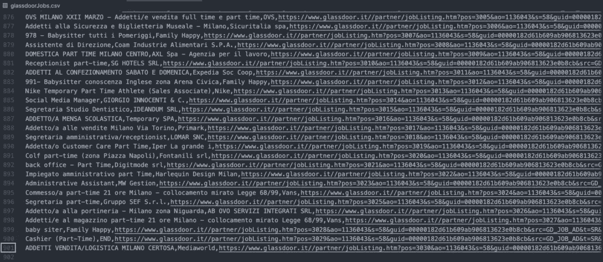

**注意:**要实现这一点，请记住您需要将您的 ScraperAPI 键添加到脚本中，替换`{yourApiKey}`占位符。

我们做了一些改动:

*   首先，我们添加了一个`console.log(pageNumber + " Done!")`行，在脚本运行时给出视觉反馈。
*   其次，我们从`.toDisk()`方法中删除了`{ append: true }`参数；由于它已经不在`for loop`中，我们不会再向它添加(追加)任何数据。

恭喜你，你用 JavaScript 构建了你的第一个玻璃门刮刀！

你可以使用相同的原则来抓取 Glassdoor 上的每一页，使用相同的逻辑，你可以将这个脚本翻译成其他语言。

让我们创建一个 Python 脚本来做与演示相同的事情。

# 在 Python 中抓取玻璃门作业

用 Python 编写 Glassdoor scraper 时，您可能倾向于使用 Selenium 这样的工具。然而，就像 JavaScript 一样，我们不需要使用任何类型的无头浏览器。

相反，我们将使用请求和漂亮的 Soup 构建一个循环来访问和解析分页页面的 HTML，像上面那样提取数据。

# 1.设置 Python 环境

在您的项目文件夹中，创建一个新的 glassdoor-python-scraper 目录，添加一个 glassdoor_scraper.py 文件，并从终端发送安装请求和漂亮的 Soup:

```
1pip install requests beautifulsoup4
```

最后，将两个依赖项都导入到文件的顶部:

`1import` `requests`

`2from` `bs4` `import` `BeautifulSoup`

就这样，我们为下一步做好了准备。

# 2.在 For 循环中使用请求

另外，向服务器发送初始请求并打印状态代码。

```
1response = requests.get(2"[https://www.glassdoor.it/Lavoro/milano-part-time-lavori-SRCH_IL.0](https://www.glassdoor.it/Lavoro/milano-part-time-lavori-SRCH_IL.0),6_IC2802090_KO7,16_IP1.htm?includeNoSalaryJobs=true"``)34print``(response.status_code)
```

**注意:**记住，在能够运行 Python 脚本之前，您需要将 CD 放到新文件夹中。

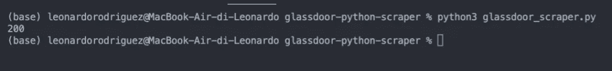

目前为止很有效！现在，让我们把它放到一个`for loop`中，并尝试访问分页中的前三页。为此，我们将创建一个从 1 到 4 的范围(该范围中不包括 4)，并将一个{x}变量添加到字符串中:

```
1for x in range``(``1``, 4``):2response = requests.get(3"[https://www.glassdoor.it/Lavoro/milano-part-time-lavori-SRCH_IL.0](https://www.glassdoor.it/Lavoro/milano-part-time-lavori-SRCH_IL.0),6_IC2802090_KO7,16_IP{x}.htm?includeNoSalaryJobs=true"``)45print``(response.status_code)
```

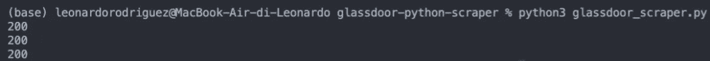

有了这个简单的 for 循环，我们的 scraper 将能够毫无问题地遍历分页。

# 3.用美汤刮玻璃门数据

出于测试目的，我们不希望我们的 scraper 在三个不同的页面上失败，所以让我们将范围缩小到 1–2；只会刮到第一页。

和以前一样，我们将使用`[data-test="jobListing"]`属性选择器挑选所有的工作卡:

```
1all_jobs = soup.select(``"[data-test='jobListing']"``)
```

所有的卡片都存储在`all_jobs`变量中，我们可以遍历它们来提取目标数据点:

```
1for job in all_jobs:2job_title = job.find(``"a"``, attrs``=``{``"data-test"``: "job-link"``}).text3company = job.select_one(4"a.job-search-key-l2wjgv.e1n63ojh0.jobLink > span"``).text5job_link = job.find(``"a"``, attrs``=``{``"data-test"``: "job-link"``})[``"href"``]
```

**注意:**由于某种原因，当`using` `.find()`提取公司名称时不起作用，所以我们决定用`select_one()`的方法代替。

# 4.构造 JSON 文件

我们在使用 Python 教程抓取表格数据的[中详细讨论了如何处理 JSON 文件。不过，为了简单说明，我们将数据添加到一个空数组中，并使用 json.dump()方法将数组存储到一个 json 文件中:](https://www.scraperapi.com/blog/python-loop-through-html-table/)

```
1glassdoor_jobs.append({2"Job Title"``: job_title,3"Company"``: company,4"Job Link"``: "[https://www.glassdoor.it](https://www.glassdoor.it/)" + job_link5})
```

**注意:**您需要在文件顶部导入 json，并在循环外创建一个新的`glassdoor_jobs = []`空数组，这样才能工作。

当数组准备好格式良好的数据后，我们将把数据转储到一个 JSON 文件中，并使用下面的代码片段:

```
1with open``(``'glassdoor_jobs'``, 'w'``) as json_file:2json.dump(glassdoor_jobs, json_file, indent``=``2``)
```

最后要做的一件事:测试它！

# 5.试运行和全玻璃门 Python 刮刀

无需更多介绍，下面是收集 Glassdoor 作业数据的完整 Python 脚本:

```
1import requests2from bs4 import BeautifulSoup3import json45glassdoor_jobs = []67for x in range``(``1``, 31``):8response = requests.get(9"[http://api.scraperapi.com?api_key=](http://api.scraperapi.com/?api_key=){your_api_key}&url=[https://www.glassdoor.it/Lavoro/milano-part-time-lavori-SRCH_IL.0](https://www.glassdoor.it/Lavoro/milano-part-time-lavori-SRCH_IL.0),6_IC2802090_KO7,16_IP{x}.htm?includeNoSalaryJobs=true"``)10soup = BeautifulSoup(response.content, "html.parser"``)1112all_jobs = soup.select(``"[data-test='jobListing']"``)13for job in all_jobs:14job_title = job.find(``"a"``, attrs``=``{``"data-test"``: "job-link"``}).text15company = job.select_one(16"a.job-search-key-l2wjgv.e1n63ojh0.jobLink > span"``).text17job_link = job.find(``"a"``, attrs``=``{``"data-test"``: "job-link"``})[``"href"``]18glassdoor_jobs.append({19"Job Title"``: job_title,20"Company"``: company,21"Job Link"``: "[https://www.glassdoor.it](https://www.glassdoor.it/)" + job_link22})23print``(``"Page " + str``(x) + " is done"``)2425with open``(``'glassdoor_jobs'``, 'w'``) as json_file:26json.dump(glassdoor_jobs, json_file, indent``=``2``)
```

我们做了一些改变:

*   我们将范围从 1–2 更改为 1–31。脚本将在第 30 页停止(因为不包括第 31 页)，这是分页系列的最后一页。
*   我们添加了一个`print("Page: " + str(x) + " is done")`语句，用于代码运行时的视觉反馈。它将 x 变量从整数转换成字符串，这样我们就可以连接整个短语。
*   为了保护我们的知识产权和处理任何针对我们的反抓取技术，我们将通过 ScraperAPI 的服务器发送我们的请求。您可以在初始 URL 中看到新字符串，并通过我们的文档[了解更多关于 ScraperAPI 功能的信息](https://www.scraperapi.com/documentation/)。

以下是最终结果:

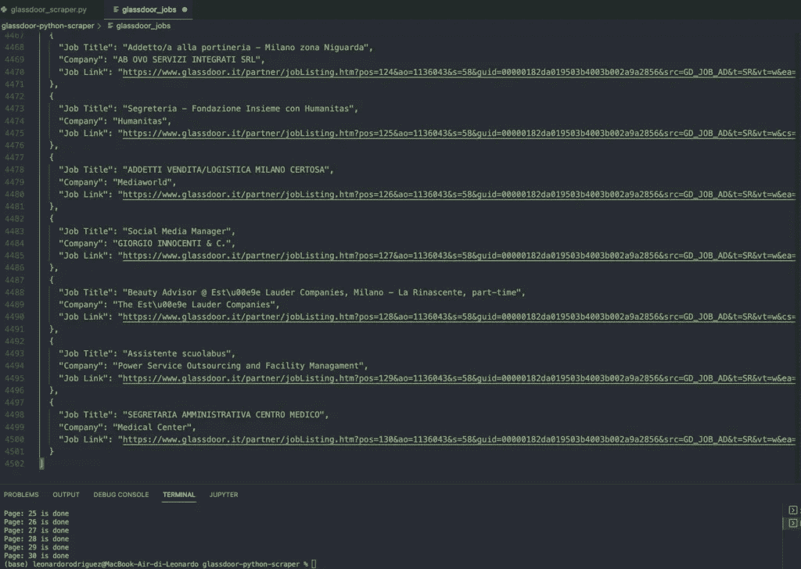

刮出 30 页，并将所有数据格式化成可重用的 JSON 文件。

# 包扎

通过扩展这个项目，您可以获得更多的页面和更多的数据点。您还可以通过过滤信息来收集特定的职位，如仅具有特定头衔、位置或价值的职位(即显示工资的职位)，并建立一个策划的职位公告板或工作机会简讯。

有了这么多的信息，天空是无限的，所以保持你的头脑开放的可能性。

下次见，刮刮快乐！

*更多内容请看*[***plain English . io***](https://plainenglish.io/)*。报名参加我们的* [***免费周报***](http://newsletter.plainenglish.io/) *。关注我们关于*[***Twitter***](https://twitter.com/inPlainEngHQ)[***LinkedIn***](https://www.linkedin.com/company/inplainenglish/)*[***YouTube***](https://www.youtube.com/channel/UCtipWUghju290NWcn8jhyAw)*[***不和***](https://discord.gg/GtDtUAvyhW) *。对增长黑客感兴趣？检查* [***电路***](https://circuit.ooo/) *。***