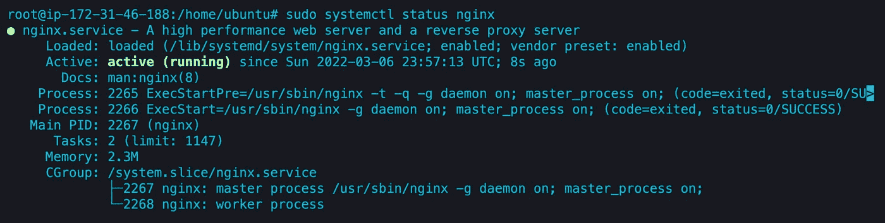
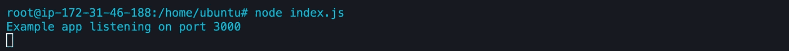
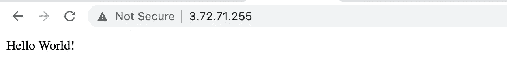
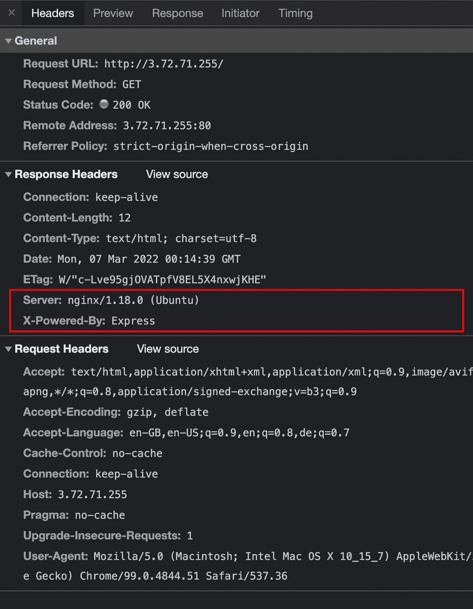
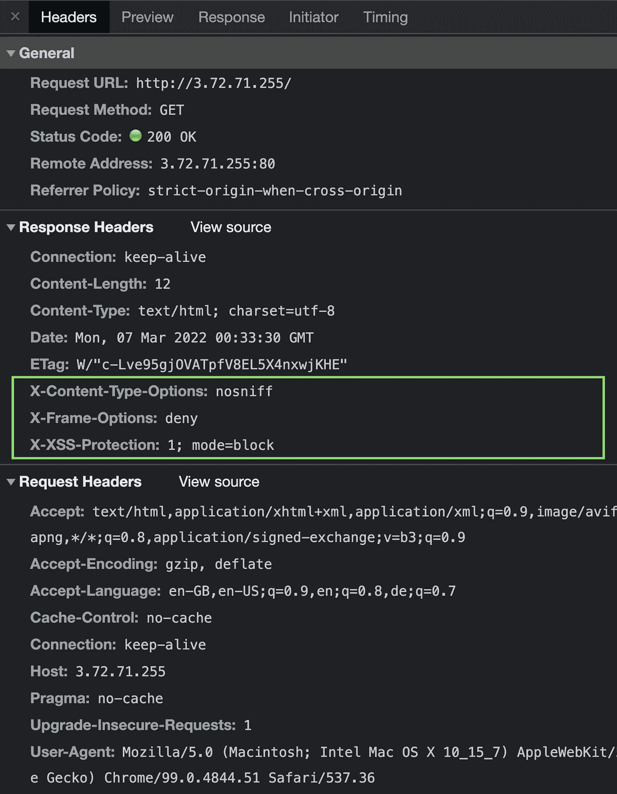

# 如何保护你的 NGINX 服务器

> 原文：<https://javascript.plainenglish.io/how-to-secure-your-nginx-server-3359dfce8b8b?source=collection_archive---------0----------------------->

## 关于如何保护 NGINX 服务器的简要指南

**安全**变得越来越重要。现代软件在帮助我们开发安全软件方面变得越来越好，但最重要的是，我们必须做一些额外的努力来为我们的产品获得更多的安全性。今天，我想给你一个简单的指导，告诉你如何保护你的 [NGINX](https://www.nginx.com/) 服务器。

本指南基于安装在 Linux 机器上的 Express (Node.js)示例，从头开始。这意味着我们将在配置 NGINX 配置之前安装 NGINX，Node.js。

不要担心，一切都会尽可能的简单。


Photo by [Luca Bravo](https://unsplash.com/@lucabravo?utm_source=medium&utm_medium=referral) on [Unsplash](https://unsplash.com?utm_source=medium&utm_medium=referral)

首先，我们需要一个服务器。对于本指南，我在 [AWS](https://aws.amazon.com/free) 上获得了一个新鲜的 [EC2](https://aws.amazon.com/ec2/) 实例(Ubuntu Server 20.04 LTS) **。你可以使用你喜欢的任何东西，但是我猜你已经有一个服务器在运行了，否则，你就不会在这里了，对吗？**

# 安装 NGINX

假设你已经连接到你的服务器，我们将安装 NGINX 并设置它。

```
$ sudo apt update
$ sudo apt install nginx nginx-extras -y
$ sudo systemctl enable nginx
$ sudo systemctl restart nginx
```

让我们检查一下是否一切都好。

```
$ sudo systemctl status nginx
```

终端中的输出应该是这样的:



# 安装 Node.js

正如我所说的，我将基于 Node.js 来演示这一点，你基本上可以通过使用`/var/www/html`来跳过这一部分。

```
$ sudo curl -sL https://deb.nodesource.com/setup_14.x | sudo bash -
$ sudo apt install nodejs -y
```

让我们通过执行以下命令来检查是否一切正常

```
$ node  -v
v14.19.0
```

# 设置 Express 服务器

别担心，我会尽量简单。

```
$ npm init -y
$ npm install express
```

现在让我们创建我们的`index.js`。

```
$ nano index.js
```

在这里，我们添加了一个非常简单的 Express 示例代码:

index.js

# 配置 NGINX

因此，首先我向您展示了一种在 NGINX 上使用 Node.js 服务器应用程序的非常标准的方法，没有任何安全性，因为我看到它们在互联网上广泛传播。跟我呆在一起。

```
$ nano /etc/nginx/sites-available/default
```

在这里，我们将把内容替换为:

/etc/nginx/sites-available/default

这段代码告诉 NGINX 将端口 80 指向运行在端口 3000 上的 ExpressJS 服务器。

现在，让我们重新启动 NGINX 服务来看看我们的变化。

```
$ sudo systemctl restart nginx
```

此外，我将运行我们的快速应用程序:

```
$ node index.js
```



服务器正在运行，NGINX 已经设置好，所以我要在浏览器上访问我的服务器。



一切按预期运行。现在让我们看看响应头。



所以我们在这里看到的是我们暴露的大量敏感数据。例如，如果黑客知道服务器构建在什么样的框架或 NGINX 版本上，情况会变得很危险。所以让我们去掉这些易受攻击的数据。

# 保护我们的 NGINX 配置

```
$ nano /etc/nginx/sites-available/default
```

在这里，我们将用以下内容替换所有配置:

因此，我们在第 13 行到第 20 行添加了一系列配置，以提高我们的服务器安全性。

## 说明

```
Line 14: server_tokens off;
```

这将删除 NGINX 版本号。默认情况下，它的选项是启用的。

```
Line 15: proxy_hide_header X-powered-by;
```

这将删除响应报头`x-powered-by`。基于我们的例子，我们删除了我们的服务器在 ExpressJS 上运行的信息。

```
Line 16: proxy_hide_header X-Runtime;
```

X-Runtime HTTP 响应头用于提供应用程序处理每个请求所需的时间。这种行为可被用于收集攻击，在这种攻击中，值可用于确认一条信息(如用户名)是否有效。

```
Line 17: add_header X-XSS-Protection "1; mode=block";
```

该标题启用了内置于最新 web 浏览器中的跨站点脚本(XSS)过滤器。

```
Line 18: add_header X-Frame-Options "deny";
```

该标题不允许浏览器在框架或 iframe 中呈现页面。

```
Line 19: add_header X-Content-Type-Options "nosniff";
```

这个标题在大多数浏览器上禁用了内容类型嗅探。

```
Line 20: more_clear_headers Server;
```

这一行是类固醇的第 14 行。它完全删除了响应头`server`，所以我们甚至没有暴露我们的服务器运行在 NGINX 上的事实。这一行使得第 14 行变得多余，但是我想向您展示这两个选项。

让我们再次重启我们的 NGINX 服务器，不要忘记重启我们的 Express 服务器。

```
$ sudo systemctl restart nginx
$ node index.js
```

让我们再次查看我们的响应头。



很好，我们不再暴露易受攻击的信息，同时我们添加了一些帮助我们保护服务器的标题。

感谢您阅读我关于如何保护 NGINX 服务器的文章。有更多的方法可以最小化这样的风险，但是我希望这给你一个好的开始。

干杯！

我希望你喜欢读这篇文章。如果你愿意支持我成为一名作家，可以考虑注册[成为](https://medium.com/@hellokevinvogel/membership)的媒体成员。每月只需 5 美元，你就可以无限制地使用 Medium。

想支持我？[给我买杯咖啡。](https://www.buymeacoffee.com/hellokevinvogel)

# 接下来阅读

[](https://blog.bitsrc.io/solid-principles-in-typescript-153e6923ffdb) [## 打字稿中的坚实原则

### TypeScript 对用 JavaScript 编写干净的代码产生了巨大的影响。但是总有办法…

blog.bitsrc.io](https://blog.bitsrc.io/solid-principles-in-typescript-153e6923ffdb) [](https://blog.devgenius.io/object-orientated-programming-oop-in-typescript-c1066941f5ee) [## TypeScript 中的面向对象编程(OOP)

### TypeScript 对 JavaScript 中面向对象编程的实现有很大的影响。今天，我想谈谈…

blog.devgenius.io](https://blog.devgenius.io/object-orientated-programming-oop-in-typescript-c1066941f5ee) [](https://blog.bitsrc.io/10-quick-typescript-one-liners-128a2721345) [## 10 个快速打印的一行程序

### 将提高生产力的 JavaScript / TypeScript 一行程序

blog.bitsrc.io](https://blog.bitsrc.io/10-quick-typescript-one-liners-128a2721345) 

*更多内容请看*[***plain English . io***](https://plainenglish.io/)*。报名参加我们的* [***免费周报***](http://newsletter.plainenglish.io/) *。关注我们关于*[***Twitter***](https://twitter.com/inPlainEngHQ)*和*[***LinkedIn***](https://www.linkedin.com/company/inplainenglish/)*。加入我们的* [***社区不和谐***](https://discord.gg/GtDtUAvyhW) *。*