# 如何用鲜味自己托管自己的网站分析

> 原文：<https://javascript.plainenglish.io/how-to-self-host-your-own-website-analytics-with-umami-46025fd59826?source=collection_archive---------18----------------------->

## 通过 Heroku 上的 umami 自助托管您的网站分析，完全控制您的数据。

当我们谈到网站分析时，首先想到的是谷歌分析。然而，我们都知道 Google Analytics 会捕获所有用户的信息，所以没有隐私或对数据的控制。

谷歌分析捕捉了如此多不同的指标，甚至我们都不需要，最重要的事实是，要理解这些指标，你需要一个博士学位😁玩笑归玩笑，但老实说，理解谷歌分析指标并不容易。

最近，我在为我的 [portfolio](https://sachinchaurasiya.dev) 网站寻找一个分析解决方案，一些人建议使用 Google Analytics，但我希望通过简单友好的仪表板完全控制我的网站分析和易于理解的指标。因此，我开始搜索谷歌分析的替代品，我发现了一些有趣的替代品，如[似是而非。io](https://plausible.io/) 和 [umami.is](https://umami.is/) 。

经过几天的研究，我得出结论，umami 将是最适合我的用例，因为它是开源的，专注于隐私，它为你提供了一个强大的网络分析解决方案，尊重你的用户的隐私。最好的部分是，当你自己托管鲜味时，你将完全控制你的数据。

所以在这篇文章中，我将讨论如何在 Heroku 上用 umami 自主管理你自己的网站分析。

让我们开始吧。

# 分叉鲜味库

访问[https://github.com/umami-software/umami](https://github.com/umami-software/umami)并分叉仓库。

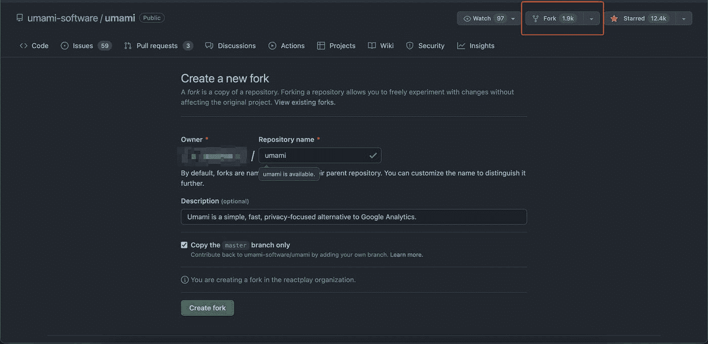

# 创建或登录 Heroku 帐户

前往 [Heroku 网站](https://id.heroku.com/login)并登录您的 Heroku 帐户，如果您没有帐户，请点击注册创建一个。

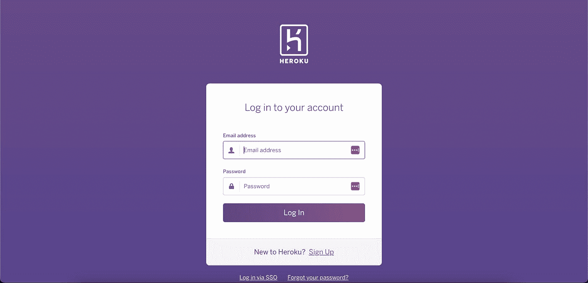

# 创建和配置 Heroku 应用程序

登录后，转到仪表板，从那里点击**新建>创建新应用**。

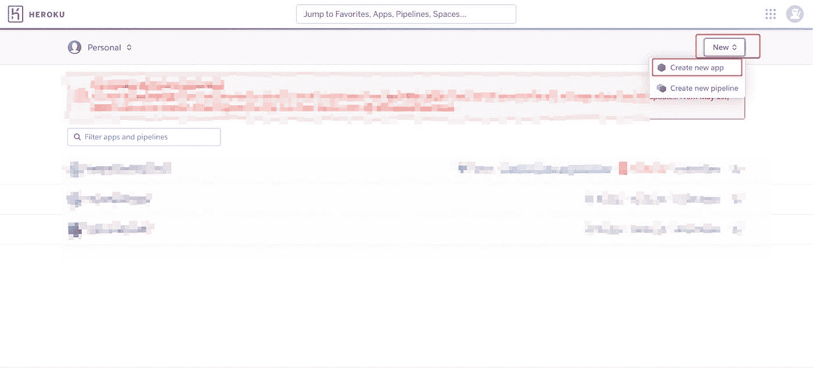

现在给你的应用起个名字，我已经给了**网站-分析-鲜味**。然后点击**创建应用**按钮创建您的应用。

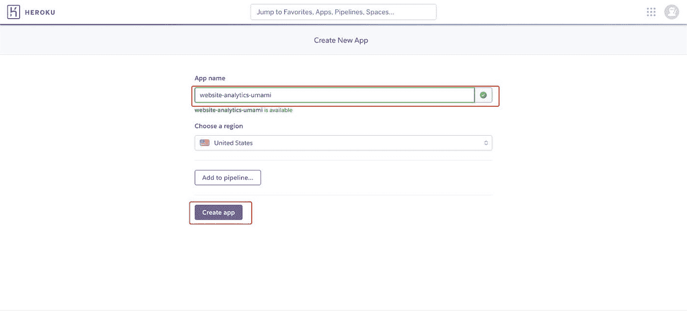

# 将 Heroku 应用程序连接到分叉的鲜味库

在您的控制面板中，单击您刚刚创建的应用程序名称。我会点击**网站-分析-鲜味**。

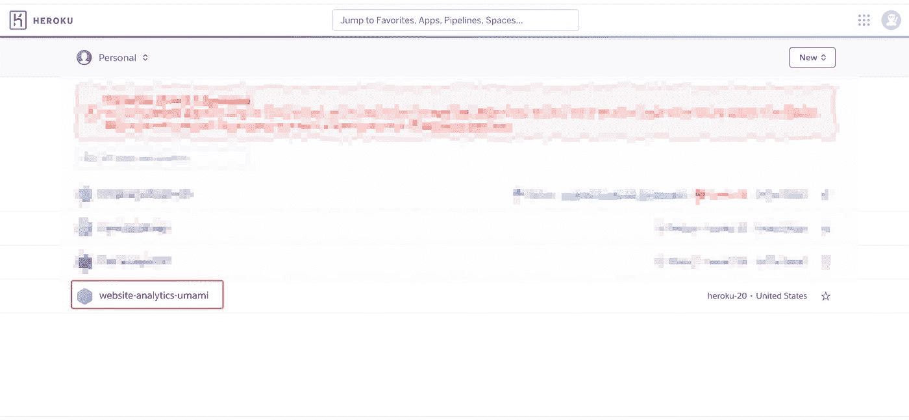

现在导航到部署选项卡并点击**连接到 GitHub** 按钮。

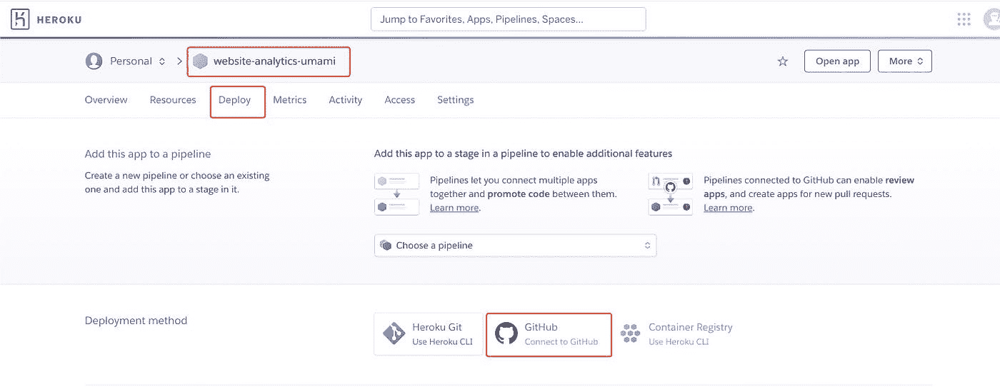

一旦你点击**连接到 GitHub** 按钮，你就必须授权 Heroku 访问你的 GitHub 库。

搜索您想要连接的库，即**鲜味**，然后点击连接按钮将您的 Heroku 应用程序与鲜味库连接。

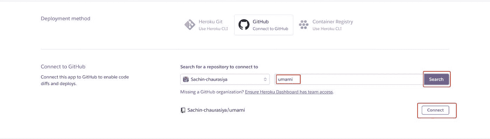

# 启用自动部署

连接您的存储库后，向下滚动到**自动部署**部分并点击**启用自动部署**。如果您对此存储库进行任何新的更改，Heroku 将自动部署。

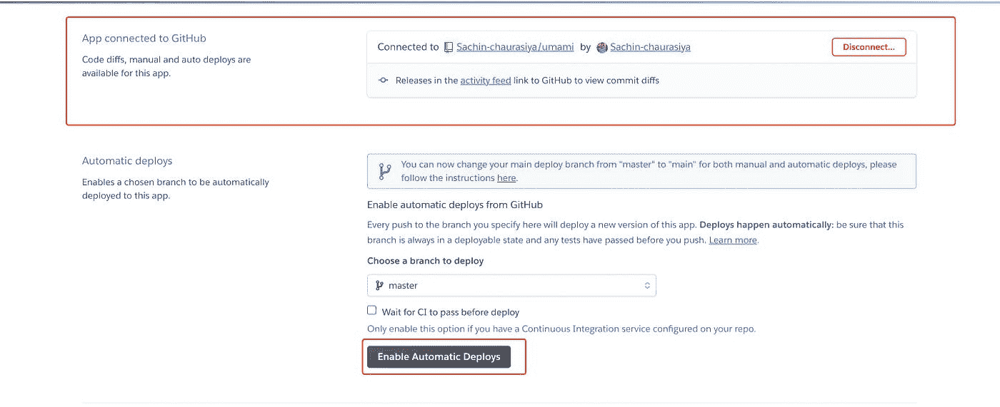

# 设置数据库

正如我提到的，鲜味是自托管的，所以你必须建立一个数据库来存储你的分析数据。

导航到**资源**选项卡，向下滚动到**附加组件**部分，然后搜索 **Postgres** 。

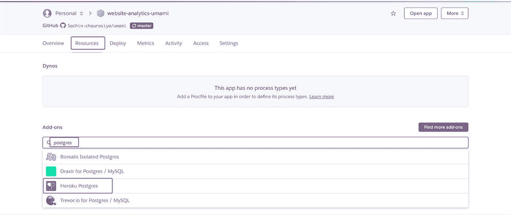

选择 **Heroku Postgres** 选项。选择后，你会看到一个模式如下。选择一个免费计划，然后点击**提交订单**将该插件添加到您的应用程序中。

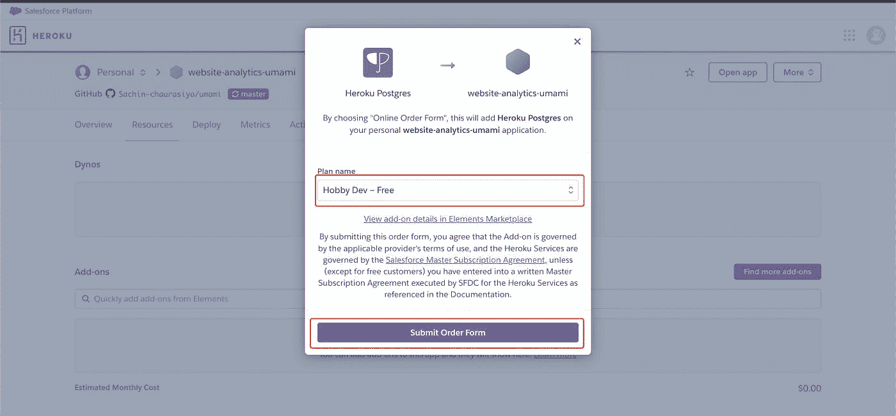

Umami 需要 env 变量 **DATABASE_URL** 来处理数据库。导航到**设置**选项卡，向下滚动到**配置变量**部分，您将看到 Heroku 已经自动创建了一个 env 变量 **DATABASE_URL** ，因此您不必手动设置它。

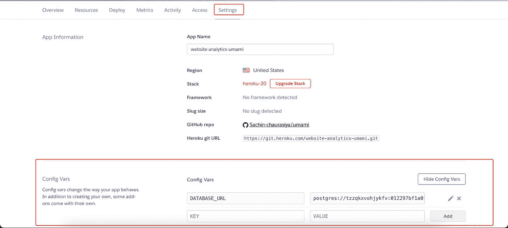

Umami 还需要一个环境变量 **HASH_SALT** ，您可以从 **Config Vars** 部分添加它。

现在一切都设置好了，让我们进入下一部分，即部署您的应用程序。

# 部署鲜味

您已经为您的应用启用了自动部署，但第一次，您将必须手动部署。

导航到**部署**选项卡，向下滚动到**手动部署**部分，然后点击**部署分支**按钮，等待一段时间以完成部署。

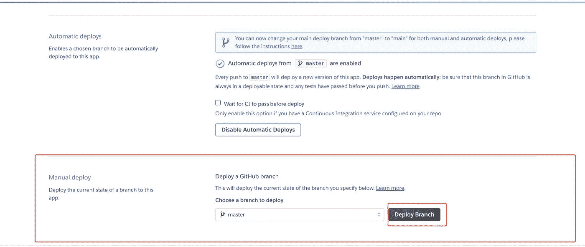

一旦你的应用程序被部署，你会看到一个绿色的**部署到 Heroku** 和一个消息`Your app was successfully deployed.`

单击查看按钮打开部署的应用程序。

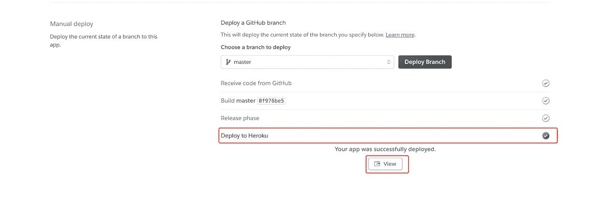

# 配置鲜味

如果您打开应用程序，您将看到这样的登录屏幕，默认情况下，umami 创建一个管理员用户，用户名为 **admin** ，密码为 **umami** 。

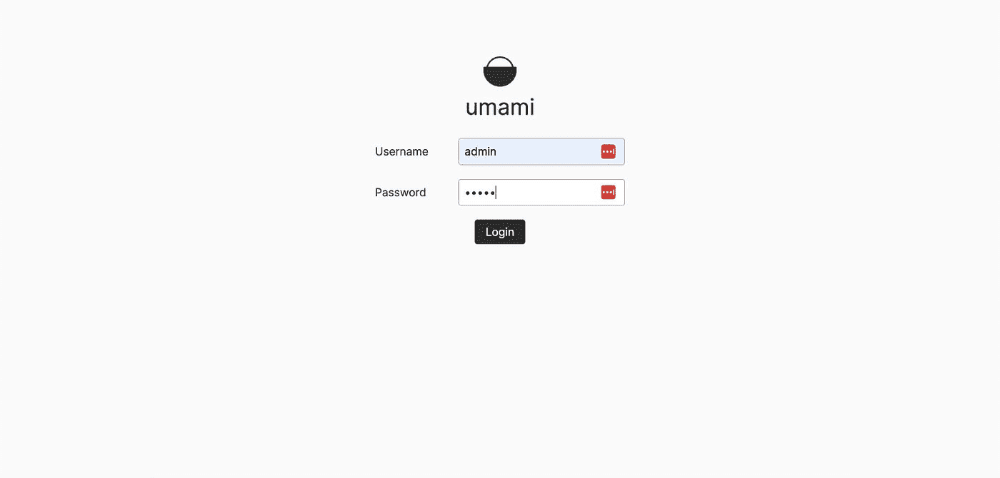

从控制面板导航至设置并点击**添加网站**按钮。

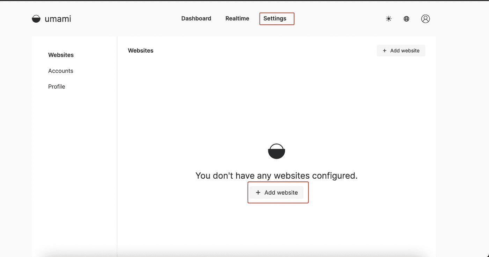

为您的网站命名，并添加您想要跟踪的域。如果您想与他人共享您的分析，也可以启用共享 URL。

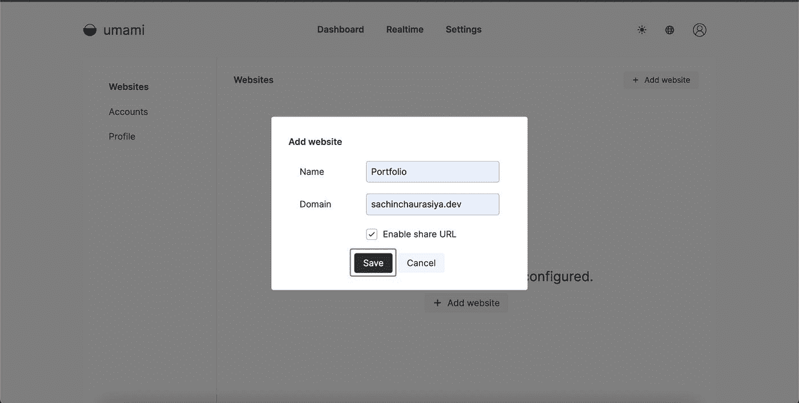

要跟踪你网站的统计数据，你必须获得跟踪代码，并把它放在你网站的`<head>`部分。

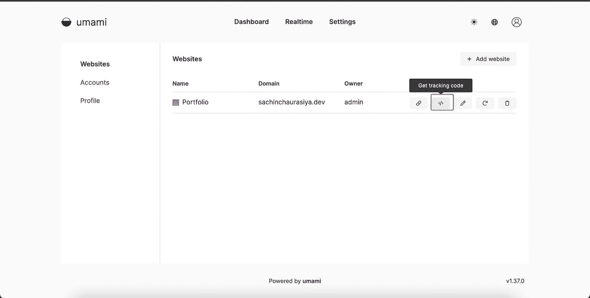

恭喜你，🥳，如果你一直坚持到现在，你已经成功地拥有了自己的网站分析。

# 查看分析

现在，从网站部分点击您添加的网站以查看分析。我会点击我的**作品集**网站。

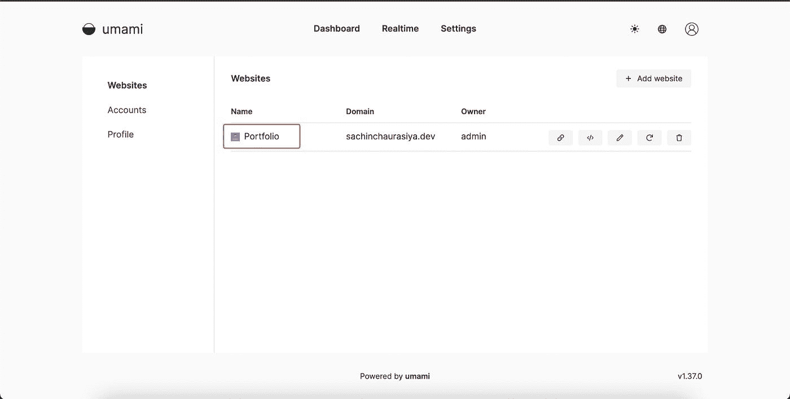

您将被重定向到控制面板，在那里您将看到您网站的所有可用分析指标。

**举例:**

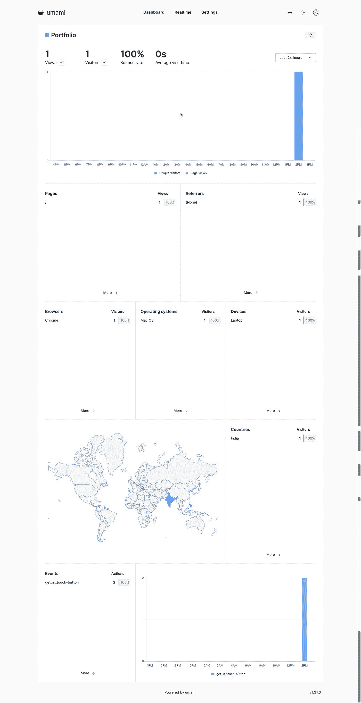

# 摘要

在这篇文章中，我们讨论了如何在 Heroku 上使用 umami 自托管您的网站分析，最终结果是，您将拥有自己网站的自托管分析，并对您的数据拥有隐私和完全的控制权。

这个话题到此为止。感谢您的阅读。

# 有用的链接

*   [鲜味](https://umami.is/)
*   [鲜味特征](https://umami.is/features)
*   [在 Heroku 上运行](https://umami.is/docs/running-on-heroku)
*   [现场演示](https://app.umami.is/share/8rmHaheU/umami.is)
*   [有鲜味的径赛项目](https://umami.is/docs/track-events)

# 与我联系

[LinkedIn](https://www.linkedin.com/in/sachin-chaurasiya)|[Twitter](https://twitter.com/sachindotcom)

*原载于*[*https://blog . sachinchaurasiya . dev*](https://blog.sachinchaurasiya.dev/how-to-self-host-your-own-website-analytics-with-umami)*。*

*更多内容请看*[***plain English . io***](https://plainenglish.io/)*。报名参加我们的* [***免费周报***](http://newsletter.plainenglish.io/) *。关注我们关于*[***Twitter***](https://twitter.com/inPlainEngHQ)[***LinkedIn***](https://www.linkedin.com/company/inplainenglish/)*[***YouTube***](https://www.youtube.com/channel/UCtipWUghju290NWcn8jhyAw)*[***不和***](https://discord.gg/GtDtUAvyhW) *。***