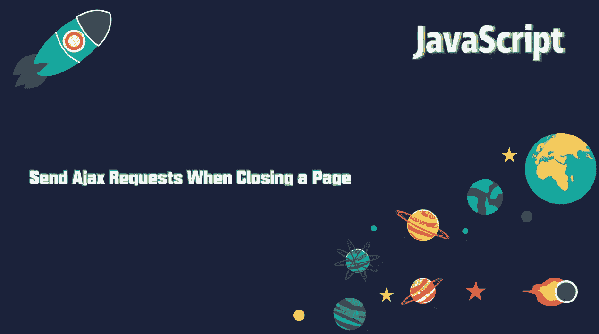
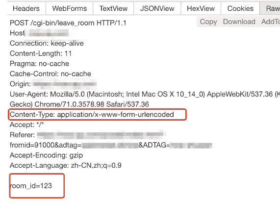
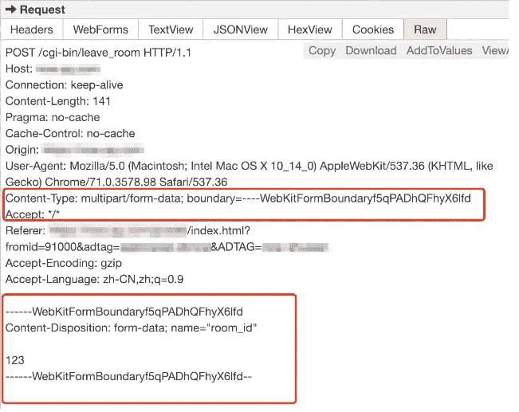
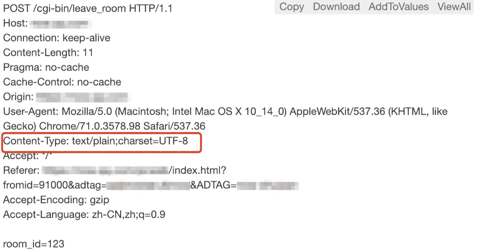

# 关闭页面时如何发送 Ajax 请求

> 原文：<https://javascript.plainenglish.io/how-to-send-ajax-requests-when-closing-a-page-8298ceeedf9?source=collection_archive---------2----------------------->

## 关闭页面时发送 Ajax 请求



有时我们需要做一些报告来记录用户离开页面时的行为。或者发送一个服务器 ajax 请求通知服务器用户已经离开，比如一个直播间的结账操作。

本文分为两个部分来解释如何完成退出行为报告。

## 1.事件监听

浏览器有两个事件可以用来监听页面关闭，`beforeunload` 和`unload`。
`beforeunload` 是在文档和资源被调用时将被关闭，此时文档仍然可见，并且在发生这种关闭时仍然可以被取消。例如，下面的写法将允许用户在刷新或关闭页面时弹出一个窗口来提醒用户是否关闭。

```
window.addEventListener("beforeunload", function (event) {
  // Cancel the event as stated by the standard.
  event.preventDefault();
  // Chrome requires returnValue to be set.
  event.returnValue = '';
});
```

`unload` 是在页面已经被卸载时，文档处于的状态:

1.  所有资源仍然存在(图像、iframe 等。);
2.  对于用户来说，所有的资源都是不可见的；
3.  界面交互无效(window.open、alert、confirm 等。);
4.  该错误不会停止卸载文档的过程。

基于以上两种方法你可以实现监听关闭页面的事件，为了安全起见，你可以监听这两个事件。然后做监听器函数的处理，让关闭事件只调用一次。

## 2.请求发送

有了上面的倾听者，事情只完成了一半。如果我们直接在监听器中发送 ajax 请求，我们会发现请求被浏览器中止，无法发送出去。当页面卸载时，浏览器不保证异步请求会成功发出。

有几种方法可以解决这个问题。

**选项 1:发送同步 ajax 请求**

```
var oAjax = new XMLHttpRequest();

oAjax.open('POST', url + '/user/register', false);//false is synchronization request

oAjax.setRequestHeader("Content-type", "application/x-www-form-urlencoded");

oAjax.onreadystatechange = function() {
    if (oAjax.readyState == 4 && oAjax.status == 200) {
        var data = JSON.parse(oAjax.responseText);
    } else {
        console.log(oAjax);
    }
};

oAjax.send('a=1&b=2');
```

这种方法是有效的，但是用户需要在关闭页面之前等待请求完成。这对用户来说不是一个好的体验。

**选项 2:发送异步请求，忽略服务器端的 ajax 中止**

虽然异步请求会被浏览器中止，但是如果服务器可以忽略中止并仍然正常执行，这是可能的。比如 PHP 有 ignore_user_abort 函数来忽略 abort，需要后端修改，一般不可行。

**选项 3:使用 navigator.sendBeacon 发送异步请求**

参考 MDN:

[](https://developer.mozilla.org/en-US/docs/Web/API/Navigator/sendBeacon) [## navigator . send beacon()-Web API | MDN

### 当用户完成页面时，网站通常希望向服务器发送分析或诊断信息。最…

developer.mozilla.org](https://developer.mozilla.org/en-US/docs/Web/API/Navigator/sendBeacon) 

从介绍中可以看出，这个方法是用来在用户离开时发送请求的。非常适合这个场景。其使用方法如下。

```
navigator.sendBeacon(url [, data]);
```

sendBeacon 支持发送的数据可以是`ArrayBufferView`、`Blob`、`DOMString`或`FormData` 类型的数据。
这里有几种使用 sendBeacon 发送请求的方式，你可以修改报头和内容的格式，因为一般与服务器的通信方式是固定的，如果你修改了报头或内容，服务器将无法正确识别。

(1)使用 blob 发送使用 Blob 发送的好处是可以定义自己的内容格式和头，比如下面的方式将 content-type 设置为 application/x-www-form-urlencoded。

```
blob = new Blob([`room_id=123`], {type : 'application/x-www-form-urlencoded'});
navigator.sendBeacon("/cgi-bin/leave_room", blob);
```



(2)使用 FormData 对象，但这样 content-type 将被设置为“multipart/form-data”。

```
var fd = new FormData();
fd.append('room_id', 123);
navigator.sendBeacon("/cgi-bin/leave_room", fd);
```



(3)数据也可以使用 URLSearchParams 对象，并将 content-type 设置为“text/plain；charset=UTF-8 "。

```
var params = new URLSearchParams({ room_id: 123 })
navigator.sendBeacon("/cgi-bin/leave_room", params);
```



通过尝试，可以发现使用 blob 发送更加方便，内容的设置也更加灵活。如果抢到包后发送的消息没有被后台识别，可以尝试修改内容的字符串或头，找到合适的方式发送请求。

*更多内容看* [***说白了就是 io***](https://plainenglish.io/) *。报名参加我们的* [***免费周报***](http://newsletter.plainenglish.io/) *。关注我们关于*[***Twitter***](https://twitter.com/inPlainEngHQ)，[***LinkedIn***](https://www.linkedin.com/company/inplainenglish/)*，*[***YouTube***](https://www.youtube.com/channel/UCtipWUghju290NWcn8jhyAw)*，以及* [***不和***](https://discord.gg/GtDtUAvyhW) ***。***

***对缩放您的软件启动感兴趣*** *？检查出* [***电路***](https://circuit.ooo?utm=publication-post-cta) *。*