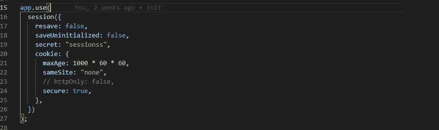
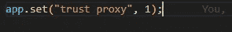
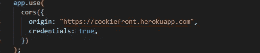

# 如何将 Cookies 从 Express 发送到生产中的前端应用程序

> 原文：<https://javascript.plainenglish.io/how-to-send-cookies-from-express-to-a-front-end-application-in-production-9273a4f3ce72?source=collection_archive---------3----------------------->

## 如何在 HTTPS 协议中通过快速会话包将 cookies 从快速应用程序发送到前端。


在本文中，我将解释如何通过快速会话包将 cookies 从快速应用程序发送到 HTTPS 协议的前端。

如果您曾经尝试过在 Express 和 React 这样的前端应用程序中使用 cookie，您一定会发现在设置 cookie 时，您必须在应用程序的不同部分考虑相当多的选项。错误地设置其中一个选项会导致 cookie 问题。更糟糕的是，错误信息不太清楚。

我们将探索的第一组选项是 cookie 选项中的*安全*和*相同站点*选项。 *samesite* 属性允许在第三方域(在本例中是您的前端应用程序)上设置 cookies。这里有几个选项，但在这种情况下，最好将 samesite 设置为“none”，这允许在第三方网站上设置 cookies。

出于安全原因，大多数浏览器要求您随时将 *secure* 选项设置为 true，您可以将 *samesite* 设置为“none”来执行 HTTPS 协议。因此您必须在 HTTPS 环境中托管您的应用程序。这意味着在使用 HTTP 协议的本地环境(localhost)中，您可能无法在解耦的应用程序中设置 cookies。因此，你必须找到另一个替代品，也许是代理。



以上是您的快速会话中间件应该如何设置。**注意 cookie 对象中的 sameSite 和 secure 选项是如何设置的。**

另一个需要注意的选项是信任代理选项。大多数 PAAS，例如 Heroku，使用负载平衡器。基本上，负载平衡器是一种将网络请求分发到其他服务器的服务器。Express 大多数情况下会查看 req.socket.remoteAddress 以查看请求是否来自 HTTP 或 HTTPS 连接，并且大多数情况下设置负载平衡器的方式是通过 HTTP 转发请求，因为它们与它们转发请求的服务器之间的通信通常在同一个 VPC 内。所以 Express 看到请求来自一个不安全的 HTTP 地址。但是幸运的是，我们可以告诉 express 查看 x-forwarded 头，看看原始请求来自哪里。这可以通过将信任代理设置为 1 来实现。因此，express 将前端 IP 视为 x-forwarded 标头中最左侧的条目。



Setting the trust proxy option to 1

以上是如何设置信任代理选项。

**注意:所有这些都应该在定义您的任何路线之前完成。**

现在，我们需要在前端应用程序中包含一个选项。大多数情况下，当向一个 URL 发送请求时，cookie 集会自动发送，但是在这种情况下，我们向另一个 URL 上的 web 服务器发送请求，因此需要您明确地告诉您用来发送请求的包发送 cookie。在 Axios、fetch 和其他 HTTP 客户端包中，这可以通过将 withCredentials 选项设置为 true 来实现。

因为您将前端和后端应用程序托管在两个不同的安全(HTTPS)域上。你通常遇到的第一个问题是 [*cors*](https://developer.mozilla.org/en-US/docs/Web/HTTP/CORS) 问题。许多开发人员通常设置 cors 来将源响应头设置为通配符(*)。

```
Access-Control-Allow-Origin: *
```

如果您在 Express app.use(cors())中像这样设置 cors，这意味着您正在将 access-control-response-origin 头设置为通配符。

将 cors 设置为通配符会在将 cookies 设置为第三方域(您的前端应用程序)时产生问题。这是因为大多数浏览器**不允许用通配符(*) origin 头响应的服务器设置 cookie**，这是出于安全原因。因此，您必须显式设置原点，如果您使用的是 cors 包，只需将中间件中的原点选项设置为:

`app.use(cors({origin: “https://your-url.com"}))`

要了解更多关于 cors 的信息，你可以[点击这里](https://developer.mozilla.org/en-US/docs/Web/HTTP/CORS)，我认为 MDN 在解释它方面做得很好。

同样出于安全原因，在 express 应用程序上还有一件事要做，您还必须通过将凭据选项设置为 true 来告诉 cors 接受凭据。因此，对于 cors 选项，它应该是这样的:



This is how your cors option should look like

我有一个 youtube 视频，其中我解释了如何从 express 应用程序到 react 前端设置 cookies。在视频中，我还解释了如何在本地和生产中做到这一点。视频链接如下:

*更多内容请看*[***plain English . io***](https://plainenglish.io/)*。报名参加我们的* [***免费周报***](http://newsletter.plainenglish.io/) *。关注我们关于*[***Twitter***](https://twitter.com/inPlainEngHQ)*和*[***LinkedIn***](https://www.linkedin.com/company/inplainenglish/)*。加入我们的* [***社区不和谐***](https://discord.gg/GtDtUAvyhW) *。*