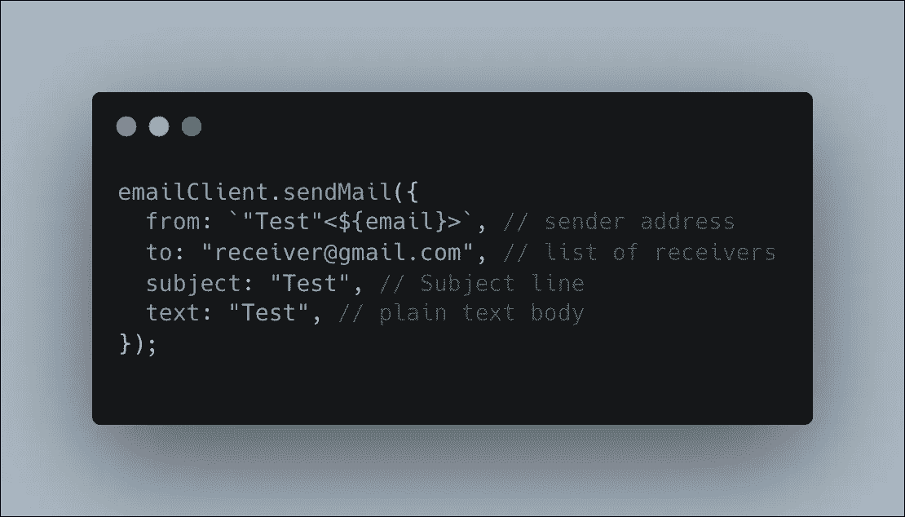

# 如何使用 JavaScript 发送带有可定制 PDF 附件的电子邮件

> 原文：<https://javascript.plainenglish.io/how-to-send-emails-with-customizable-pdfs-attachments-using-javascript-a3bba77028e5?source=collection_archive---------0----------------------->

## 如何利用 Nodemailer 和 jsPDF 来完全自动化您的电子邮件需求。


Nodemailer sending you a beautiful email packed with meaningful attachments

你好！🏝

最近，我负责创建一个售票系统，我需要给每个买票的人发一份**个性化的票 pdf** 。就像经常发生的那样，在我成功完成之后，如果你知道正确的步骤和潜在的障碍，事情会变得非常简单。

在今天的文章中，我们将讨论如何用 JavaScript 发送电子邮件，如何创建自定义 pdf，以及如何将两者合并以创建一个令人惊叹的 EX(电子邮件体验，我刚刚想到了这个术语)。

此外，你会在文章的最后发现一个**奖励**，它将涵盖如何创建定制的电子邮件模板。

如果您想在拥有代码的情况下继续学习，请从我的 GitHub 获取项目:

[](https://github.com/kolberszymon/Nodemailer-jsPDF-Handlebars-Tutorial) [## GitHub-kolberszymon/node mailer-jsPDF-handle bars-教程

### 此时您不能执行该操作。您已使用另一个标签页或窗口登录。您已在另一个选项卡中注销，或者…

github.com](https://github.com/kolberszymon/Nodemailer-jsPDF-Handlebars-Tutorial) 

## **节点邮件程序**

重要的事情先来。为了能够从代码中发送电子邮件，通常，您只需要主机、端口和登录凭证。在某些情况下(是的，Gmail，我正看着你🕶)，会有一些额外的步骤包括在内。让我们使用 Gmail 来设置它，因为其他事情可能会更容易。

**0。不太安全的应用程序访问(如果你正在使用 Gmail)** 如果你希望能够使用代码从你的 Gmail 帐户发送电子邮件，你必须授权从你的 Google 帐户访问不太安全的应用程序。


Access to the less secure application screen

1.  **安装节点邮件程序**


Installing nodemailer

**2。创建节点邮件程序的“传输”**

你可以把它当作一个电子邮件帐户。在大多数情况下，您希望只有一个这样的实例。创建传输实例时，您需要:

*   **主机**:多数情况下是 SMTP 服务器。你可以使用那里几乎所有的邮件，只需在谷歌中输入你的邮件提供商邮箱 SMTP 服务器，例如“Gmail SMTP 服务器名”，


Gmail SMTP server address

*   **端口**:对于安全连接(我们应该以此为目标)它将是 465，如果一个“安全”参数设置为假，它将是 587，
*   **安全:**端口 465 为真，端口 587 为假，
*   **auth** :登录的凭证，当然你不应该把你的变量存储在代码里，而是在。环境文件。


Initializing nodemailer transport

**3。发送电子邮件**

创建后，传输者将有资格发送电子邮件。就这么简单。您可以使用 **sendMail** 方法发送电子邮件，就像这样:



sending an email using nodemailer

调用此方法会在您的电子邮件上产生以下视图:


Email generated with the usage of the sendMail method

如您所见，您可以在 from 参数中用双引号传递发件人昵称。

## jsPDF

jsPDF 实际上非常酷😎。它允许您直接从 JavaScript 代码创建 pdf，并且快速有效。作为**奖励，**我将向您展示如何在其中加入您生成的二维码。让我们创建一个如下所示的 PDF。


Our today PDF structure goal

1.  **安装二维码和 jspdf npm 模块**


Installing needed libraries

**2。创建一个 PDF 文档**


creating PDF representation in code

如您所见，有了 jsPDF 的新实例，我们能够指定不同的选项。如果你想查看所有可能的选择，你可以在 jsPDF 的官方文档中找到它们。在我们的例子中，它将是以厘米为单位的 a4 格式。

**3。生成二维码**


Generating QRCode

由于 QRCode.toDataURL 是一个基于承诺的函数，我们将通过在异步函数中封装该过程来避免回调。由于这一点，代码将更具可读性。

**4。创建一个 PDF 结构**


Creating PDF structure in code

如你所见，这非常直观。当然，你要么通过反复试验来完成，要么创建一个 Photoshop 文件并抓取准确的位置。选择权在你。总之，上面的代码会产生以下结果:


The same as the earlier one

## 通过电子邮件发送生成的 PDF 附件

最后，当我们能够发送电子邮件并创建 PDF 时，我们可以考虑合并这一功能。我们要用一个已经写好的代码，加入一点秘方来实现它。

**包含附件的方式**

如果您想在电子邮件中包含附件，您需要拥有数据。我的意思是，您需要将 PDF 文件保存在服务器中，或者(我的首选方式)创建一个 base64 pdf 字符串，这也允许您将它作为附件包含在内。Base64 pdf 字符串如下所示:

```
data:application/pdf;filename=generated.pdf;base64,JVBERi0xLjMKJ...
```

**如何创建 base64pdf？**

很简单，我们不保存文件，而是将数据输出到 base64 字符串，如下所示:


Outputting a base64 pdf string instead of saving the file

**包含 PDF 作为附件**

在将 dataURIString 重定向到 pdfOutput 变量后，我们可以将其作为附件发送。这可以通过在 sendMail 方法中指定 attachments 参数来实现。


Sending an attachment using a nodemailer

如果你想了解如何包含不同类型的附件(来自文件、流、文本/普通文件)，你可以查看[节点邮件文档](https://nodemailer.com/message/attachments/)。

运行上述代码会在我的收件箱中产生以下电子邮件:


Result of the above code

Tadaaa🎉

## 奖金-如何创建参数化的电子邮件模板


That’s what we’ll create :)

如果我们想创建这样的电子邮件，我们必须提升 HTML 电子邮件模板。为此，我们将使用 handlebars 模块，具体来说，我们将在 fs 库的帮助下直接从文件中读取它。


Project Structure

好吧，那我们怎么做呢？

1.  **解析模板路径**

我们使用路径解析来做这件事，因为它将创建一个相对路径，也就是说，从哪里运行代码并不重要。这是最好的做法。


Resolving a path to the folder

**2。读取文件内容，并用它创建一个模板**

如果你很好奇，电子邮件 HTML 模板看起来几乎像一个 HTML 文件。你可以在这里查看。把它写进这篇文章里太似是而非了。


Reading a template from the file

**3。抓取一个已创建的 HTML 并将其设置为 HTML 参数**


Calling sendMail with additional parameter

## 摘要

如果你想直接从代码中发送电子邮件，你需要一个电子邮件传输器。在 JavaScript 中，最流行的是 Nodemailer，它可以让你快速高效地发送电子邮件。此外，我们提升了 jsPDF 库，因为我们想发送个性化的票，并且作为一个奖励，在 handlebars 的一点帮助下，我们能够生成赏心悦目的电子邮件模板。

**GitHub 项目:**

[](https://github.com/kolberszymon/Nodemailer-jsPDF-Handlebars-Tutorial) [## GitHub-kolberszymon/node mailer-jsPDF-handle bars-教程

### 此时您不能执行该操作。您已使用另一个标签页或窗口登录。您已在另一个选项卡中注销，或者…

github.com](https://github.com/kolberszymon/Nodemailer-jsPDF-Handlebars-Tutorial) 

*更多内容看* [***说白了。报名参加我们的***](https://plainenglish.io/) **[***免费周报***](http://newsletter.plainenglish.io/) *。关注我们关于*[***Twitter***](https://twitter.com/inPlainEngHQ)*和*[***LinkedIn***](https://www.linkedin.com/company/inplainenglish/)*。加入我们的* [***社区不和谐***](https://discord.gg/GtDtUAvyhW) *。***