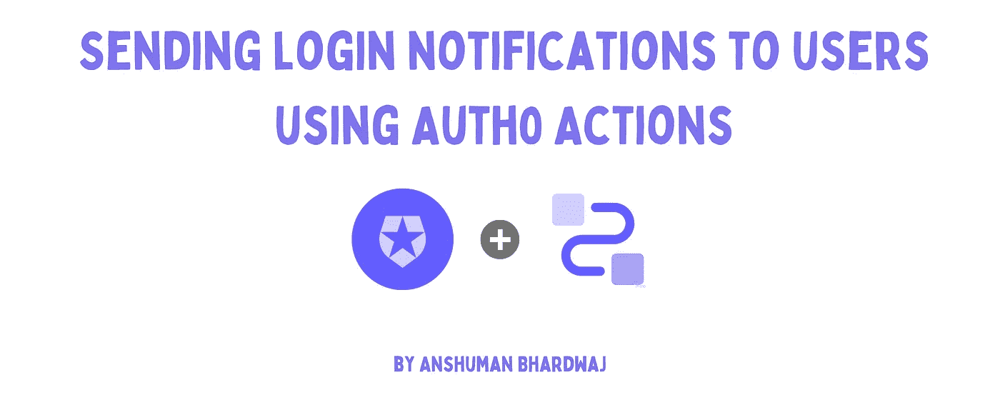
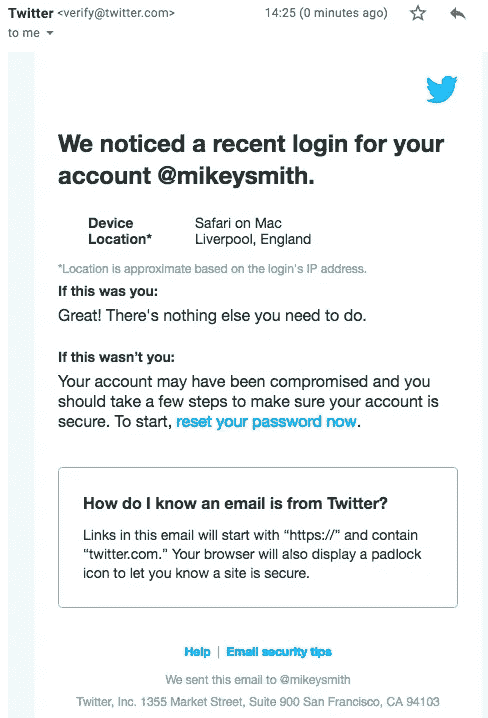
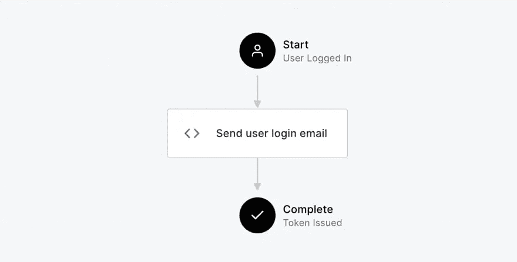
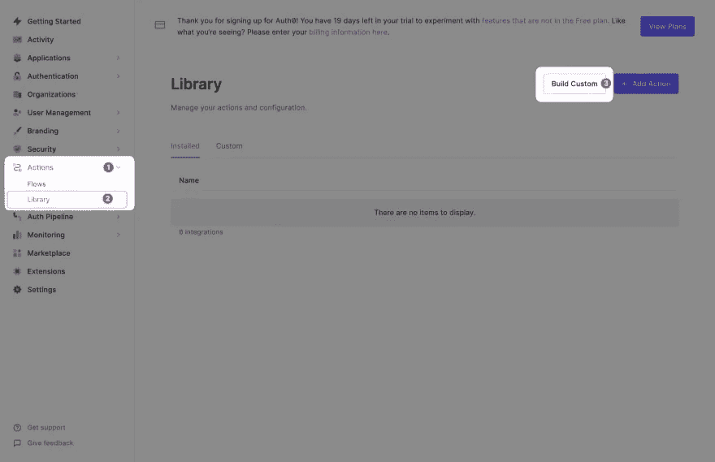
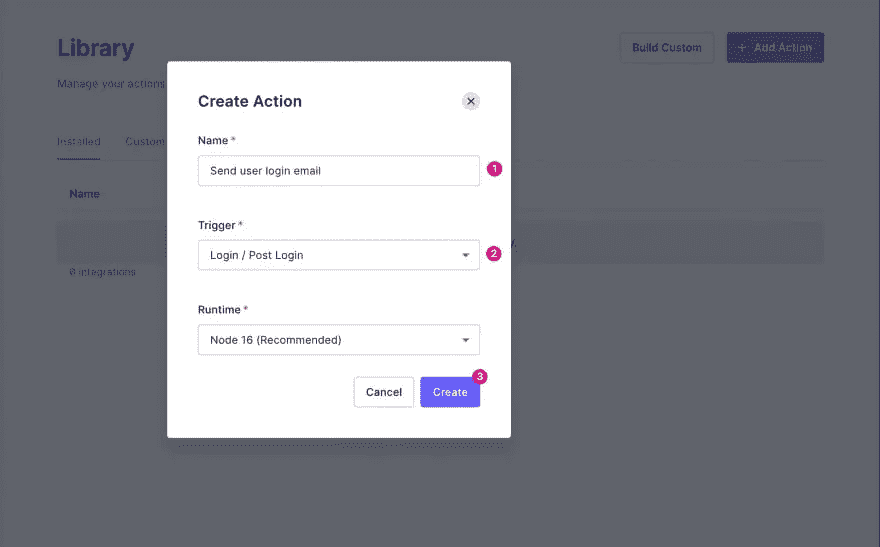
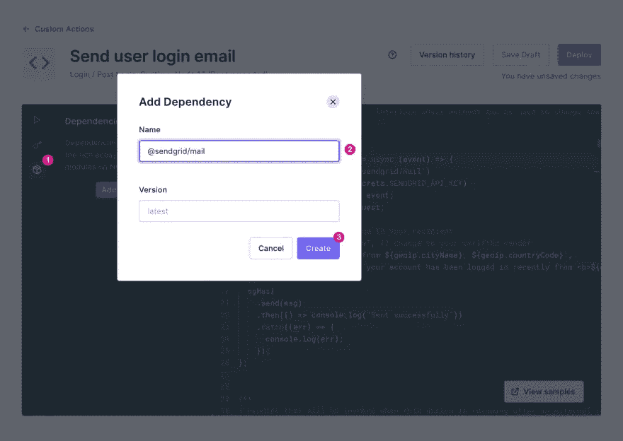
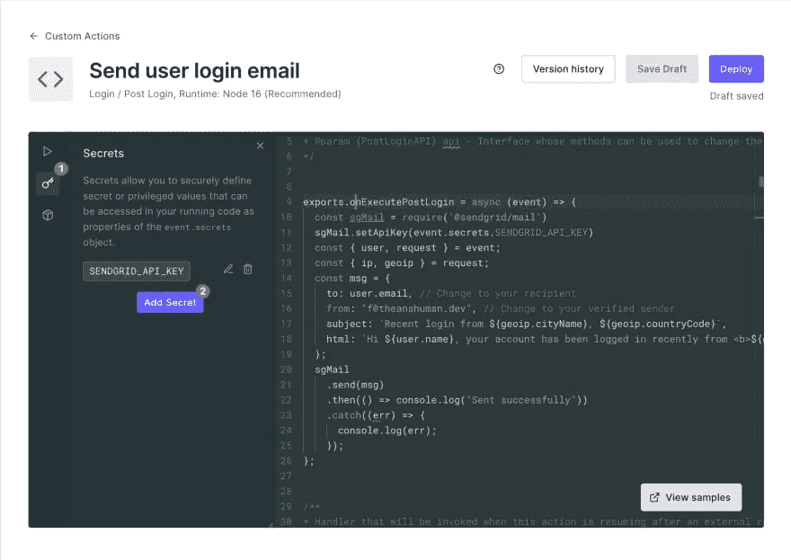
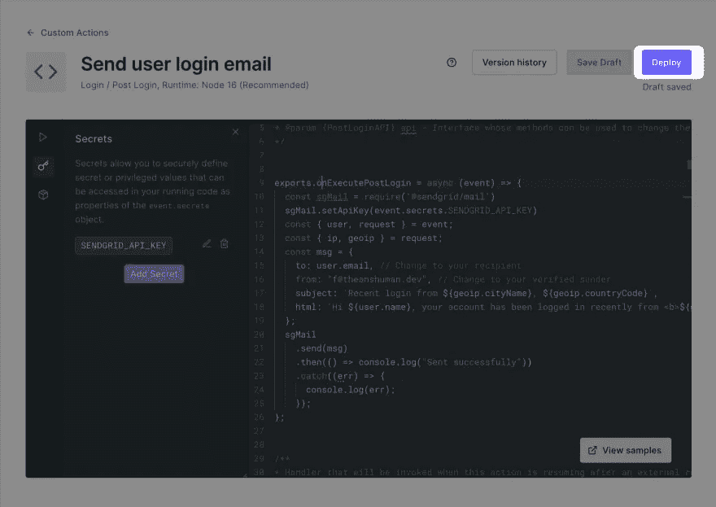
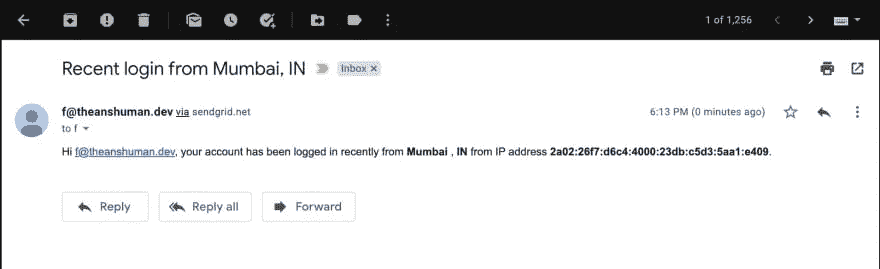
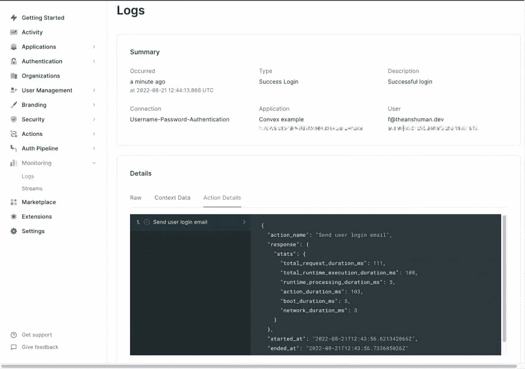

# 如何使用 Auth0 操作向用户发送登录通知

> 原文：<https://javascript.plainenglish.io/how-to-send-login-notifications-to-users-using-auth0-actions-8798597dfb5?source=collection_archive---------1----------------------->



Sending login notifications to users using Auth0 Actions

你永远不能确定你在互联网上的安全性。好消息是，大多数公司正变得积极主动，通过通知用户可疑的登录活动来防止对用户的黑客攻击。一些银行甚至通知用户每次登录尝试，我喜欢这样。

此时，大多数用户已经收到至少一封来自 Gmail 或 Twitter 等服务的电子邮件，告知他们帐户上的登录活动，如下图所示。



在本文中，您将学习如何使用 [Auth0 Actions](https://auth0.com/blog/introducing-auth0-actions/) 为您的应用程序设置类似的东西。Auth0 操作是 JavaScript 函数，您可以在身份验证流程的不同阶段插入这些函数，例如用户注册、登录和重置密码，以扩展默认功能。Auth0 操作允许您使用第三方库并存储要在代码中使用的机密。

你可能已经猜到我要说什么了，但是让我给你描述一下。Auth0 操作将在登录启动后执行，并在完成登录流程前发送一封电子邮件，如下所示。



在这个例子中，操作将通过电子邮件通知用户，但是你也可以通过短信或其他方式通知用户——我的朋友，没有限制。

# 先决条件

要了解这个示例，您需要一个 Auth0 帐户。如果你还没有，你可以注册一个免费的。你还需要一个电子邮件发送服务，比如 [Sendgrid](https://sendgrid.com/) 来发送电子邮件。

# 设置 Auth0 操作

要设置操作，

1.  打开您的 Auth0 仪表板
2.  选择左侧导航栏中的**动作>流程**选项，并点击**构建定制**



3.如下所示填写创建操作****表格，并点击* *创建**按钮



4.将`@sendgrid/mail` npm 包添加到编辑器的依赖部分。



5.将`SENDGRID_API_KEY`添加到机密部分。



6.在代码编辑器中更新`onExecutePostLogin`函数，如下所示。`event`对象提供所需的信息，如存储的机密、电子邮件、名称、所用设备的 IP 地址和地理位置。你可以在[文档](https://auth0.com/docs/customize/actions/flows-and-triggers/login-flow/event-object)中读到更多关于`event`物体的信息。

```
exports.onExecutePostLogin = async (event) => {
  const sgMail = require('@sendgrid/mail')
  sgMail.setApiKey(event.secrets.SENDGRID_API_KEY)
  const { user, request } = event;
  const { ip, geoip } = request;
  const msg = {
    to: user.email, // Change to your recipient
    from: "f@theanshuman.dev", // Change to your verified sender
    subject: `Recent login from ${geoip.cityName}, ${geoip.countryCode}`,
    html: `Hi ${user.name}, your account has been logged in recently from <b>${geoip.cityName}</b>, <b>${geoip.countryCode}</b> from IP address <b>${ip}</b>.`,
  };
  sgMail
    .send(msg)
    .then(() => console.log("Sent successfully"))
    .catch((err) => {
      console.log(err);
    });
};
```

7.点击**部署**按钮激活动作。



8.是时候测试一下动作了。登录您的应用程序



9.您可以打开 Auth0 仪表板内的**监控>日志**部分来查看操作执行细节。



# 结论

在本文中，您了解了 Auth0 操作，以及如何轻松地创建一个操作来向用户发送登录通知。Auth0 是一个领先的身份验证和授权平台，为开发人员提供社交登录、用户管理和无密码登录等功能。你可以[在 Auth0 上免费注册](https://a0.to/signup-for-auth0)来尝试这个例子或者用你自己的一个来做实验。

希望这篇文章对你有帮助！如果你有任何反馈或问题，你可以在下面的评论中提出来。更多此类文章，请关注我的 [Twitter](https://twitter.com/sun_anshuman) 。

*下次见！*


*原载于 2022 年 8 月 21 日*[*https://dev . to*](https://dev.to/anshuman_bhardwaj/sending-login-notifications-to-users-using-auth0-actions-153e)*。*

*更多内容看* [***说白了。报名参加我们的***](https://plainenglish.io/) **[***免费每周简讯***](http://newsletter.plainenglish.io/) *。关注我们关于* [***推特***](https://twitter.com/inPlainEngHQ) ，[***LinkedIn***](https://www.linkedin.com/company/inplainenglish/)*，*[***YouTube***](https://www.youtube.com/channel/UCtipWUghju290NWcn8jhyAw)*，* [***不和***](https://discord.gg/GtDtUAvyhW) *。***