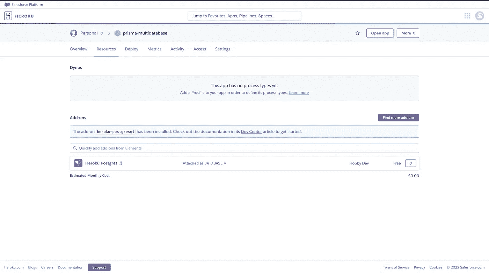

# 如何在 Heroku 上建立免费的 PostgreSQL 数据库

> 原文：<https://javascript.plainenglish.io/how-to-set-up-a-free-postgresql-database-on-heroku-ba73a432d64f?source=collection_archive---------10----------------------->

Heroku 提供托管 PostgreSQL 数据库的免费计划。如果你刚开始一个新项目，或者“*很快需要一个托管数据库*”来进行实验或原型制作，这可能会很方便。

本指南解释了如何在 Heroku 上快速建立一个免费的 PostgreSQL 数据库。你可以在 [Heroku Postgres 文档](https://devcenter.heroku.com/categories/heroku-postgres)中了解更多。

为了在 Heroku 上创建一个新的数据库，你首先需要在你的个人仪表盘上创建一个**应用**。然后您可以将一个 **Heroku Postgres** 实例作为**资源**附加到它上面。

1.  登录 Heroku [仪表板](https://dashboard.heroku.com/)并创建应用程序。

2.转到**资源→附加组件→** [**查找更多附加组件**](https://elements.heroku.com/addons) 。将***Heroku Postgres***插件添加到 Heroku app。

3.点击**安装 Heroku Postgres**

4.然后选择需要安装 **Heroku Postgres** 插件的 app。并点击**提交订单:**

现在，您已成功将 **Heroku Postgres** 附加组件添加到您的应用程序中。

5.要获取数据库凭证，请单击 **Heroku Postgres** 附加组件。然后转到**设置→查看凭证:**

您可以使用这些凭据从任何 PostgreSQL 客户端连接到您的 PostgreSQL 数据库，例如 psql (CLI)、TablePlus 或 Postico(GUI)。

如需进一步阅读，您可以查看 Heroku Postgres 文档:

 [## Heroku Postgres

### Heroku Postgres 是 Heroku 基于 PostgreSQL 的可靠而强大的数据库即服务。如果你是第一次接触 Heroku…

devcenter.heroku.com](https://devcenter.heroku.com/categories/heroku-postgres) 

如果您想在 Node.js 或 TypeScript 应用程序中使用这个数据库，请确保使用 **Prisma** 作为传统 ORM 的替代。

*更多内容请看*[***plain English . io***](https://plainenglish.io/)*。报名参加我们的* [***免费周报***](http://newsletter.plainenglish.io/) *。关注我们关于*[***Twitter***](https://twitter.com/inPlainEngHQ)[***LinkedIn***](https://www.linkedin.com/company/inplainenglish/)*[***YouTube***](https://www.youtube.com/channel/UCtipWUghju290NWcn8jhyAw)*[***不和***](https://discord.gg/GtDtUAvyhW) *。***