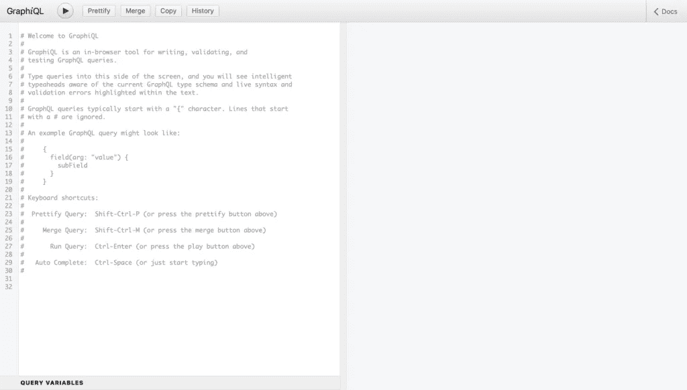
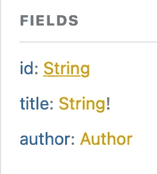
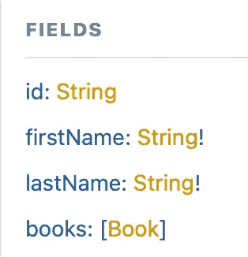
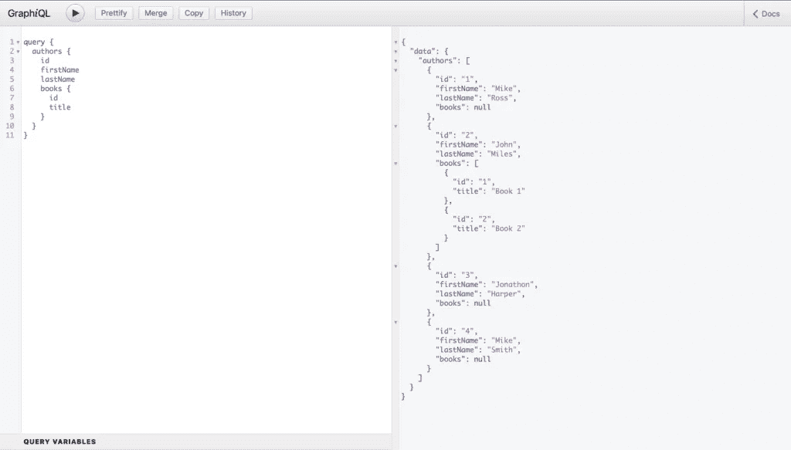
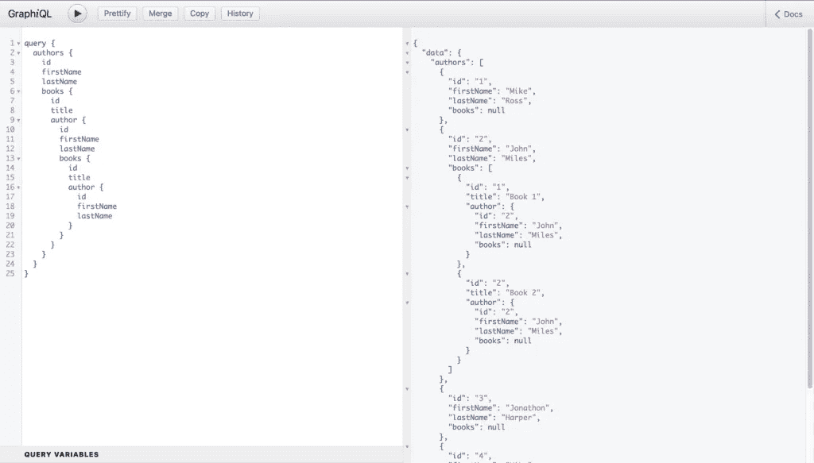
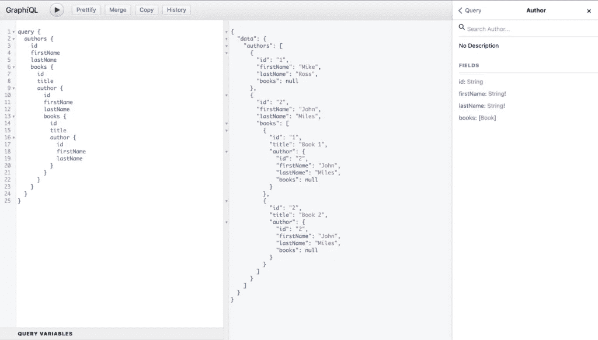

# 如何用 Node.js & Express 设置 GraphQL 服务器

> 原文：<https://javascript.plainenglish.io/how-to-set-up-a-graphql-server-with-node-js-express-8638a068b609?source=collection_archive---------8----------------------->


Source: [https://codersociety.com/blog/articles/graphql-reasons](https://codersociety.com/blog/articles/graphql-reasons)

在本文中，我们将浏览一下使用**node . js**&**Express**设置 **GraphQL** 服务器的整个过程。我们将使用 **Express 的**中间件库 **express-graphql** 来帮助我们完成这个过程。

*本文原载* [***此处***](https://upmostly.com/web-development/how-to-set-up-a-graphql-server-with-node-js) *。*

# 介绍

如果您还不熟悉 **GraphQL** 以及我们使用它的目的，请务必查看 [**这篇文章**](https://medium.com/javascript-in-plain-english/why-you-should-be-using-graphql-if-you-arent-already-7f5deb4333a8) ，其中我们深入讨论了什么是 **GraphQL** 以及为什么我们应该在我们的应用程序中使用它。

如果你已经熟悉了它，你可能想看看文章[中的](http://upmostly.com/tutorials/how-to-setup-graphql-in-react)，在那里我们用 **React** 实现 **Apollo 客户端**来连接到我们现在要创建的服务器。

> ***包含本文中介绍的代码的库可以在这里*** ***找到*** [***。***](https://github.com/upmostly/nodejs-graphql-server)
> 
> ***还会有一个包含使用该服务器的前端的存储库；这里可以找到***[](https://github.com/upmostly/react-apollo-integration)****。****

*所以，事不宜迟，我们开始吧！*

# *GraphQL 服务器配置设置*

*首先，我们可能想先创建一个新目录，通过`npm init`命令设置 npm，然后创建我们的 ***server.js*** 文件，它将托管我们的 **GraphQL** 服务器。*

*一旦我们做好了准备，我们就要安装下面的库:*

*   *`***express***`*
*   *`***express-graphql***`*
*   *`***graphql***`*
*   *`***cors***`*

*`server.js`文件应该是这样的:*

```
*const app = require("express")();
const cors = require('cors');
const { graphqlHTTP } = require("express-graphql");
const { buildSchema } = require("graphql");

const schema = buildSchema('');
const root = {};

app.use(cors());

app.use(
  "/graphql",
  graphqlHTTP({
    schema,
    rootValue: root,
    graphiql: true,
  })
);

app.listen(8080, () => {
  console.log('GraphQL server running on port 8080');
});*
```

*让我们看一下配置过程的每一步，以便更好地了解实际发生了什么:*

*   *首先，导入`express`库并调用它导出的主函数，这样我们就可以在`app`变量中设置我们的应用服务器*
*   *导入`cors`库的 main 函数来帮助我们解决在不同的域上运行服务器的问题(本地主机有不同的端口)*
*   *从`express-graphql`库中导入`graphqlHTTP`方法来帮助我们设置 GraphQL 模式*
*   *从`graphql`库中导入`buildSchema`方法来定义数据模式(我们允许客户端访问哪些数据)*
*   *现在定义一个空的数据模式*
*   *现在定义一个空的根，但是它将用于定义我们的 ***解析器*** 或者我们选择如何处理发送给客户端的数据。*
*   *没有附加配置的设置 **CORS***
*   *定义我们将用于 **"/graphql"** 端点的配置，它将使用我们之前定义的模式、根解析器对象以及我们将用于测试和以可视方式与我们的数据交互的运动场。*

*要启动服务器，您需要做的就是执行`node server.js` 命令。*

*然后，您可以在浏览器中查看“**localhost:8080**”URL，在那里您会看到[**GraphiQL**](https://www.npmjs.com/package/graphiql)playground running，这是一种与您的数据/模式进行交互的**可视化方式。***

*它应该是这样的:*

**

# *定义模式*

*现在我们已经设置好了 **GraphQL** ，让我们看看如何用一些数据填充我们的 **GraphQL 模式**。*

*为了简单起见，我们将使用一些更基本的模型，并定义这些模型之间的基本关系。*

*我们将有一个`Author`模型和一个`Book`模型，模式如下:*

****

*正如您从所附图片中看到的，我们将有两个基本模型，分别有三个、四个字段，其中我们还定义了一个**一对多关系(一个作者可能有许多本书)**。*

*这意味着一个作者可以写很多本书，而一本书只能有一个作者。*

*这就是我们如何在代码中定义这些模型模式:*

```
*const schema = buildSchema(
  `
    type Query {
      authors: [Author]
      books: [Book] 
    }

    type Author {
      id: String
      firstName: String!
      lastName: String!
      books: [Book]
    }
    type Book {
      id: String
      title: String!
      author: Author
    }
  `
);*
```

*我们还必须定义我们的父类`Query`类型，它承载所有检索数据的查询。在定义了父查询之后，我们必须定义`Author`和`Book`模型的模式。*

*你可以注意到“**！**“在某些字段类型后的符号，表示某个字段不可为空。类型周围的方括号("[]")表示它是一个数组。*

# *嘲笑我们的数据*

*我们现在已经定义了模式，但是还缺少两样东西:数据和解析查询数据的解析器。*

*让我们首先根据我们之前定义的模式模拟我们的数据:*

```
*const mockedAuthors = [
  {
    id: '1',
    firstName: "Mike",
    lastName: "Ross",
  },
  {
    id: '2',
    firstName: "John",
    lastName: "Miles",
    books: [
      {
        id: '1',
        title: "Book 1",
        author: {
          id: '2',
          firstName: "John",
          lastName: "Miles",
        },
      },
      {
        id: '2',
        title: "Book 2",
        author: {
          id: '2',
          firstName: "John",
          lastName: "Miles",
        },
      },
    ],
  },
];

const mockedBooks = {
  '1': {
    title: "Book 1",
    author: mockedAuthors["2"],
  },
  '2': {
    title: "Book 2",
    author: mockedAuthors["2"],
  },
};*
```

*您可能已经注意到，“Mike Ross”还没有写任何书，这不是问题，因为 Author 模式不需要在其数组中包含任何书。*

***此外，没有必要定义书籍数组，因为模式不需要它。***

*然而，我们可以通过将 **books** 字段的类型更改为`Author` to `[Book]!`来改变这种情况，这样至少需要一个数组，空的或不空的。*

# *定义解析器*

*现在我们已经定义了模式和数据，我们可以通过定义解析器来完成，我们将使用解析器来处理如何将数据交付给客户端。*

*现在，我们只需要两个解析器:*

*   ***一个用于解析作者数据***
*   ***一个用于解析书籍数据***

*我们将把**根**中的解析器定义如下:*

```
*const root = {
  authors: () => mockedAuthors,
  books: () => mockedBooks,
};*
```

*正如您在上面的代码片段中看到的，定义解析器的过程相对简单。*

*将有一个作为查询名的**属性，这意味着通过查询“authors ”(全部小写),您将获得“mockedAuthors”数据。***

***注意，我们也将函数作为值传递给属性；这是至关重要的。***

*现在让我们测试一切，这样我们就可以确保它按预期工作:*

**

*正如您所看到的，正如预期的那样，一切正常。*

**我们使用 GraphQL 的特定术语，通过提到我们正在进行查询，使用“****query****”关键字，后跟我们希望查询的属性/类型/条目。**

*在这种情况下，我们希望查询作者类型的所有属性，但只查询图书类型的 id 和标题；我们已经跳过了作者字段。*

*因为我们已经模拟了数据，将作者包含在书籍中，所以我们可能会执行如下循环查询:*

**

*所以，你有它。您可以看到设置 GraphQL 服务器并为其定义模式和解析器是多么容易。*

*通过定义类型，您不仅可以进行验证，还可以从您选择的平台访问文档。*

*GraphiQL 提供了一个右上角的小 Docs 菜单，它会弹出并向您显示模式中定义的所有类型的文档:*

**

*既然我们已经建立了使用**查询**检索数据的工作流，我们还将看看如何使用**变异**修改现有数据。*

# *定义突变*

*当我们使用查询来检索数据时，我们使用突变来创建、修改或删除现有数据。*

*假设我们试图创建一个新的作者条目，我们将通过定义一个新的父类型`Mutation`来实现，这个父类型将把我们可能在整个系统中使用的突变作为字段。*

*之后，我们必须定义解析器，瞧！这就是我们所需要做的。*

*下面的代码片段应该说明最终的`**server.js**` 文件能够创建一个新的`Author`条目:*

```
*const app = require("express")();
const cors = require('cors');
const { graphqlHTTP } = require("express-graphql");
const { buildSchema } = require("graphql");

const schema = buildSchema(
  `
    type Query {
      authors: [Author]
      books: [Book] 
    }
    type Mutation {
      createAuthor(
        firstName: String!,
        lastName: String!
      ): Author
    }
    type Author {
      id: String
      firstName: String!
      lastName: String!
      books: [Book]
    }
    type Book {
      id: String
      title: String!
      author: Author
    }
  `
);

const mockedAuthors = [
  {
    id: '1',
    firstName: "Mike",
    lastName: "Ross",
  },
  {
    id: '2',
    firstName: "John",
    lastName: "Miles",
    books: [
      {
        id: '1',
        title: "Book 1",
        author: {
          id: '2',
          firstName: "John",
          lastName: "Miles",
        },
      },
      {
        id: '2',
        title: "Book 2",
        author: {
          id: '2',
          firstName: "John",
          lastName: "Miles",
        },
      },
    ],
  },
];

const mockedBooks = {
  '1': {
    title: "Book 1",
    author: mockedAuthors["2"],
  },
  '2': {
    title: "Book 2",
    author: mockedAuthors["2"],
  },
};

const root = {
  authors: () => mockedAuthors,
  books: () => mockedBooks,
  createAuthor: ({ firstName, lastName }) => {
    const id = String(mockedAuthors.length + 1);
    const createdAuthor = {
      id,
      firstName,
      lastName
    };
    mockedAuthors.push(createdAuthor);
    return createdAuthor;
  }
};

app.use(cors());

app.use(
  "/graphql",
  graphqlHTTP({
    schema,
    rootValue: root,
    graphiql: true,
  })
);

app.listen(8080);*
```

*所以你有它。您应该有一个工作的 **GraphQL 服务器**与之交互，以便**检索**、**修改**或**删除**数据。*

*您可能会选择开始研究将解析器和模式类型分离到单独的目录和文件中，并将它们聚集在 **server.js** 文件中，等等；当考虑扩展 GraphQL 应用程序时，选择是无穷无尽的。*

*毕竟，这也是当初建造它的原因之一。*

*我希望你喜欢阅读这篇文章，并且它能帮助你理解使用**node . js**&**Express**设置你的 **GraphQL** 服务器的基本原理。如果你觉得我错过了什么，请在下面的评论中告诉我。*

*下次见。干杯！*

# *有用的资源*

*   *[模式&类型](https://graphql.org/learn/schema/)*
*   *[**express-graph QL**库](https://graphql.org/graphql-js/express-graphql/)*
*   *[**graph QL**库](https://graphql.org/graphql-js/graphql/)*

**更多内容请看*[***plain English . io***](https://plainenglish.io/)*。报名参加我们的* [***免费周报***](http://newsletter.plainenglish.io/) *。关注我们关于*[***Twitter***](https://twitter.com/inPlainEngHQ)[***LinkedIn***](https://www.linkedin.com/company/inplainenglish/)*[***YouTube***](https://www.youtube.com/channel/UCtipWUghju290NWcn8jhyAw)*[***不和***](https://discord.gg/GtDtUAvyhW) *。对增长黑客感兴趣？检查* [***电路***](https://circuit.ooo/) *。****