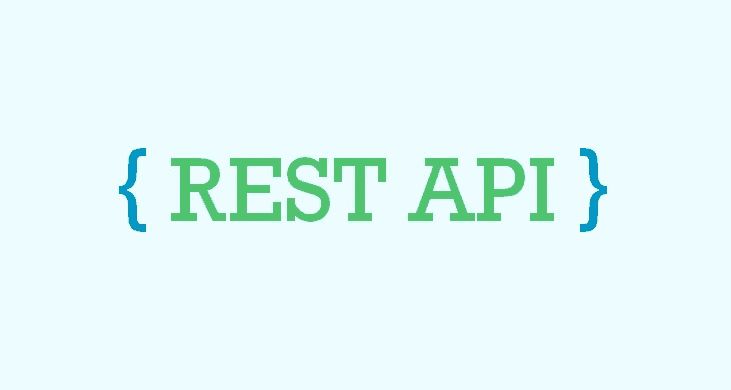
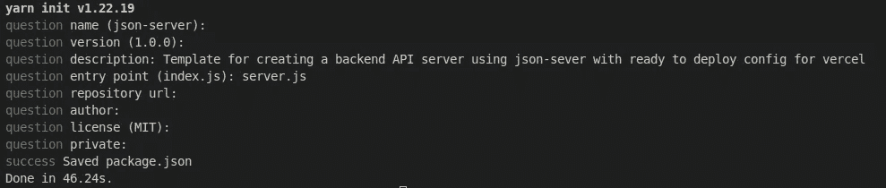
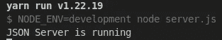
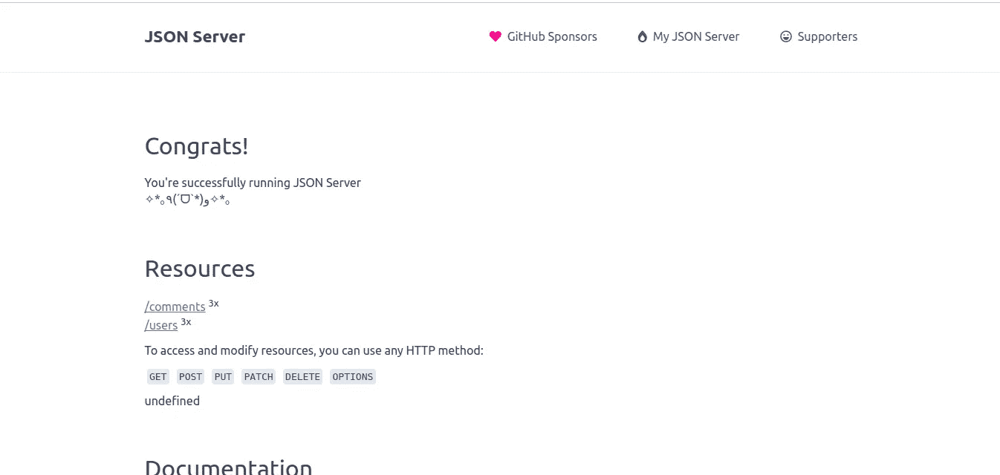
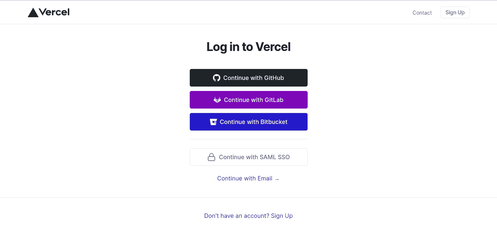
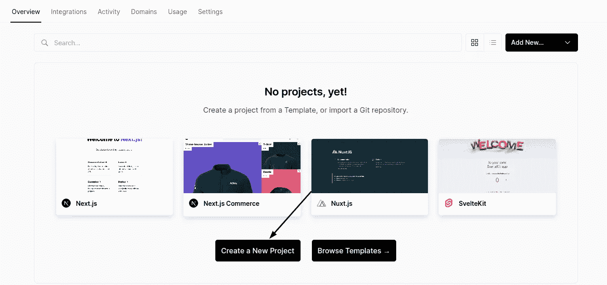
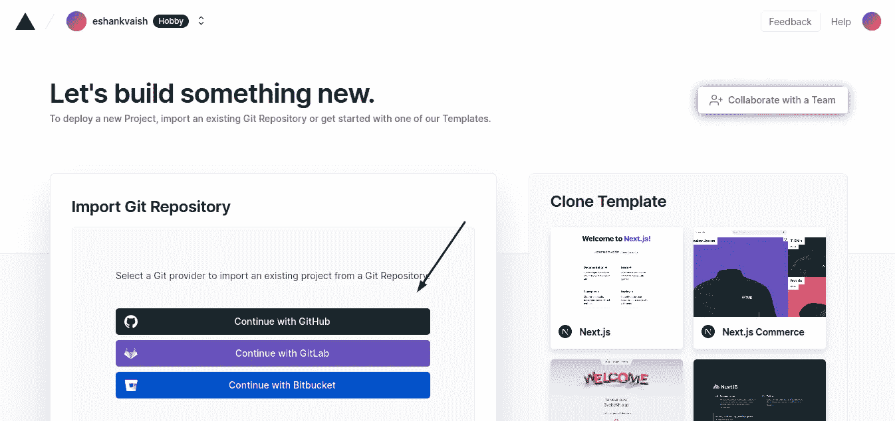
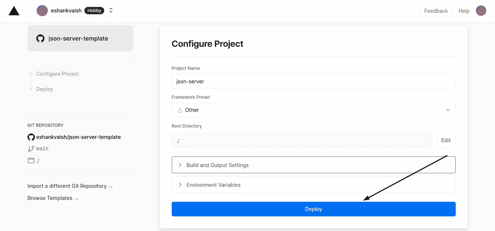
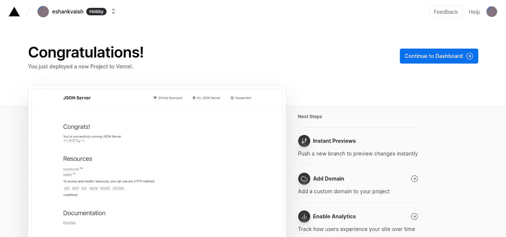
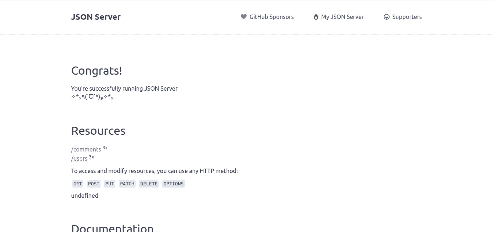

# 如何使用 JSON 服务器设置和部署伪 REST API 服务器

> 原文：<https://javascript.plainenglish.io/how-to-set-up-deploy-fake-rest-api-server-using-json-server-24e26dc1d120?source=collection_archive---------1----------------------->

## JSON Server 可以用来设置一个完整的假 REST API，零编码，不到 30 秒。



Rest API ([Source](https://dataedo.com/asset/img/banners/blog/rest_api.png))

如果您曾经将任何前端应用程序与正在开发的后端 API 集成在一起，那么您必须意识到在集成 API 时所面临的各种问题。这可能是因为 API 没有准备好供前端应用程序使用，也可能是因为端点的一些错误最终阻碍了整个前端团队的工作。

在本文中，我将介绍如何使用流行的 npm 库`json-server`并部署到 Vercel 来建立一个假的 REST API 服务器。

# 1.初始化存储库

您需要创建一个新目录并执行`yarn init`命令来初始化一个`Node.js`项目。你需要回答一系列问题，之后你的项目将被初始化。



Initialize a Node.js project

# 2.安装 JSON 服务器

为了设置`json-server`，让我们使用下面提到的命令将包安装到我们的项目中:

```
yarn add json-server
```

# 3.添加数据库文件

一旦安装了这个包，就需要创建一个 JSON 文件来存储数据库的内容。让我们创建一个`db.json`文件，并向其中添加以下示例数据:

```
touch db.json
```

Database file for JSON-server

# 4.将项目用作模块

因为我们还需要添加对部署的支持，所以我们将该项目作为一个模块与 Express 一起使用。由于我们使用`db.json`文件来维护数据库，由于权限问题，它不能在部署的环境中直接更新。因此，我们修改了设置，这样，如果节点环境是生产环境，请求就不会对数据库文件进行任何更新。您需要创建一个包含以下内容的`server.js`文件:

Setup JSON Server Project as Module

如果我们想向服务器添加任何身份验证、验证或任何其他行为，我们可以定制同一个文件。

# 5.启动服务器

要启动服务器，您需要将`start`脚本添加到`package.json`文件中，这样文件的内容将类似于:

```
{
  "name": "template-json-server",
  "version": "1.0.0",
  "description": "Template for creating a backend using JSON Server",
  "main": "server.js",
  "license": "MIT",
  "scripts": {
    "dev": "NODE_ENV=development node server.js",
    "start": "NODE_ENV=production node server.js",
    "watch": "json-server db.json --port=8000"
  },
  "dependencies": {
    "clone": "^2.1.2",
    "json-server": "^0.17.1"
  }
}
```

现在，一旦运行了`yarn run watch`，后端服务器就应该启动并运行了。



JSON Server Running

你可以试着点击`[http://localhost:8000](http://localhost:8000/)`，你会得到一个类似于所附截图的输出。



JSON Server Landing Page

请随意调整配置，根据您的需要定制设置。

# 6.添加 Vercel 配置

为了在部署后进行路由，您需要添加一个包含以下内容的`vercel.json`文件。如果您打算只在本地环境中使用服务器，可以跳过这一步。

Configuration File for Vercel

# 7.部署到 Vercel

现在您已经设置了 JSON 服务器，我们可以继续部署部分了。

*   注册或登录 [Vercel](https://vercel.com/login) 。



Vercel Login Page

*   从 [Vercel 仪表板](https://vercel.com/dashboard)中，点击**创建一个新项目**，然后通过提供必要的权限来导入您的存储库。



Create a New Project for Vercel



Import Project

*   在 Configure Project 屏幕上，保留所有默认设置，然后单击 Deploy。



Vercel Configuration Page

*   等到部署完成，您自己的 JSON 服务器就可以服务了。



Deployment Successful

*   当一个新的提交被推送到项目的默认分支时，Vercel 支持自动部署。因此，当添加新的更改时，您不必担心部署问题。



JSON Server on Deployed Instance

# 结论

您已经使用部署到 Vercel 的`json-server`启动并运行了您的伪 REST API 服务器。您可以在您的前端应用程序中配置 API 基本 URL 指向`json-server`，并根据他们的文档按照您的要求更新数据库文件。

和往常一样，下面是 Github 上完整代码的链接:

[](https://github.com/eshankvaish/json-server-template) [## GitHub-eshankvaish/JSON-server-Template:用于创建后端 API 服务器的模板，使用…

### 这个存储库提供了现成的模拟数据服务器。您所需要做的就是根据您的需要更新 db.json 文件…

github.com](https://github.com/eshankvaish/json-server-template) 

> *感谢阅读。请分享一下您对为伪 Rest APIs 设置 JSON 服务器的想法。另外，如果你觉得这篇文章有用，请在你的圈子里分享。*

```
Want to connect?
Reach out on [Twitter](https://twitter.com/eshankvaish), [LinkedIn](https://www.linkedin.com/in/eshankvaish/) or in the comments below!
```

# 参考

*   [JSON 服务器](https://www.npmjs.com/package/json-server)
*   [JSON 服务器版本](https://github.com/kitloong/json-server-vercel)

*更多内容请看*[***plain English . io***](https://plainenglish.io/)*。报名参加我们的* [***免费周报***](http://newsletter.plainenglish.io/) *。关注我们关于*[***Twitter***](https://twitter.com/inPlainEngHQ)[***LinkedIn***](https://www.linkedin.com/company/inplainenglish/)*[***YouTube***](https://www.youtube.com/channel/UCtipWUghju290NWcn8jhyAw)*[***不和***](https://discord.gg/GtDtUAvyhW) *。对增长黑客感兴趣？检查* [***电路***](https://circuit.ooo/) *。***