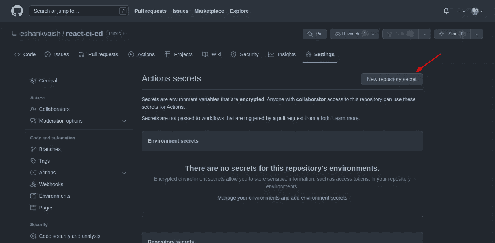
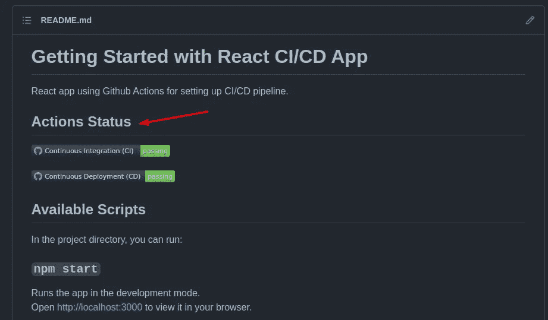
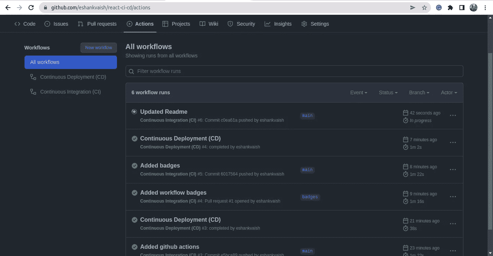

# 如何在 React 应用中为 CI/CD 设置 Github 操作

> 原文：<https://javascript.plainenglish.io/how-to-set-up-github-actions-for-ci-cd-in-react-apps-a49a20129fcc?source=collection_archive---------4----------------------->

## 如何设置 Github Actions，这是一个 CI/CD 平台，允许我们为代码测试、构建、部署等构建自动化管道。


Photo by [Roman Synkevych 🇺🇦](https://unsplash.com/@synkevych?utm_source=unsplash&utm_medium=referral&utm_content=creditCopyText) on [Unsplash](https://unsplash.com/s/photos/github-actions?utm_source=unsplash&utm_medium=referral&utm_content=creditCopyText)

随着项目复杂性和团队规模的增长，确保正在开发的代码不破坏现有代码变得越来越重要。除此之外，确保代码遵循为项目定义的编码标准以及一旦代码被合并到默认分支上就自动部署到开发/阶段环境中也很重要。如果项目遵循[基于主干的开发](https://trunkbaseddevelopment.com/)，确保每个人都遵循定义的过程就变得更加重要。这正是使用 [Github Actions](https://github.com/features/actions) 可以解决的问题。

# 什么是 CI/CD？

**CI 代表持续集成**，其中增量代码变更频繁且可靠地完成，而 **CD 代表持续交付/持续部署**，其中代码变更一合并就交付或部署到开发或试运行环境。

# 什么是 Github 动作？

Github Actions 是一个 CI/CD 平台，它允许我们为代码测试、构建、部署等构建自动化管道。Github 动作并不局限于 React 应用程序，也可以用于基于其他框架的应用程序。 [**Jenkins**](https://www.jenkins.io/) 是 Github 动作的替代选项之一，可用于设置 CI/CD 管道。


Github Actions Homepage

# 为 CI/CD 使用 Github 操作

Github 动作可以通过在项目根目录下的`.github/workflows`目录中为工作流添加`**yml**` 文件来设置。在本文的过程中，我们将使用`CI.yml`作为**持续集成**工作流，使用`CD.yml`作为**持续部署**工作流。

## 设置配置项工作流

每当针对主(默认)分支注册了拉请求或推事件时，`CI.yml`将负责执行工作流。CI 工作流包括执行测试用例，检查林挺和测试构建。如果您想为 Lint 设置 ESLint 和 beauty，请执行 checkout:

[](/setup-eslint-and-prettier-in-a-react-app-2022-ec09be9f0407) [## 使用绝对导入在 React 应用程序中设置 ESLint 和更漂亮(2022)

### 使用绝对导入为 React 应用程序设置 Eslint 和更漂亮。

javascript.plainenglish.io](/setup-eslint-and-prettier-in-a-react-app-2022-ec09be9f0407) 

作为提高效率的附加组件，给定的工作流文件还实现了**依赖项缓存，以使工作流更加高效** ( [缓存 Github 操作中的依赖项](https://docs.github.com/en/actions/using-workflows/caching-dependencies-to-speed-up-workflows) ) ，因为默认情况下 Github 操作使用全新的虚拟环境，每次执行操作时都会下载并重新安装所有依赖项。

>

## 设置光盘工作流程

`CD.yml`将负责部署工作流，如**在开发或试运行环境中部署代码**以及执行 CI 工作流。部署脚本可能需要一些秘密环境变量，可以通过设置>秘密>动作下的 [Github 加密秘密](https://docs.github.com/en/actions/security-guides/encrypted-secrets)添加这些变量。



Adding Action Secrets in Github

下面是在主分支上完成 CI 工作流后执行的 CD 管道的配置。

这里值得一提的是，如果对已定义分支的推送仅限于 pull 请求( [Github:在合并](https://docs.github.com/en/repositories/configuring-branches-and-merges-in-your-repository/defining-the-mergeability-of-pull-requests/about-protected-branches#require-pull-request-reviews-before-merging)之前需要 pull 请求)，那么我们不需要再次执行 CI 工作流，只需安装依赖项并继续进行构建和部署，但由于我们大多数人通常不使用它，因此 CI 工作流将在部署步骤之前执行。

## 添加工作流状态徽章

在自述文件中显示[工作流程状态徽章](https://docs.github.com/en/actions/monitoring-and-troubleshooting-workflows/adding-a-workflow-status-badge)怎么样？这可以通过将下面给出的 URL 添加到 Readmeand 并用所需的值替换占位符值来实现。

```
// Example Workflow Badge Url:
)
```

添加后，徽章将在自述文件中显示工作流的**通过/失败**状态，以及工作流的名称，如所附图像所示。



Workflow Status Badges

# 结论

一旦设置完成，CI 工作流将在针对列出的分支提出拉请求或收到推事件时执行；当 CI 工作流在列出的分支上完成时，CD 工作流将被执行，并且可以使用存储库主页上的**操作**选项卡对其进行监控，如下图所示。



Actions tab on Github

和往常一样，这里有一个 Github 上[完整设置代码](https://github.com/eshankvaish/react-ci-cd)的链接。

[](https://github.com/eshankvaish/react-ci-cd) [## GitHub - eshankvaish/react-ci-cd:对 CI/CD 管道使用 GitHub 操作的 react 应用程序

### 在项目目录中，可以运行:在开发模式下运行应用程序。打开 http://localhost:3000 在…

github.com](https://github.com/eshankvaish/react-ci-cd) 

```
Want to connect?
React out on [Twitter](https://twitter.com/eshankvaish), [LinkedIn](https://www.linkedin.com/in/eshankvaish/) or in the comments below!
```

> *感谢阅读。请分享您对使用 Github 动作为 CI/CD 建立自动化管道的想法。*

*更多内容看* [***说白了就是***](https://plainenglish.io/) *。报名参加我们的* [***免费周报***](http://newsletter.plainenglish.io/) *。关注我们关于*[***Twitter***](https://twitter.com/inPlainEngHQ)*和*[***LinkedIn***](https://www.linkedin.com/company/inplainenglish/)*。查看我们的* [***社区不和谐***](https://discord.gg/GtDtUAvyhW) *加入我们的* [***人才集体***](https://inplainenglish.pallet.com/talent/welcome) *。*