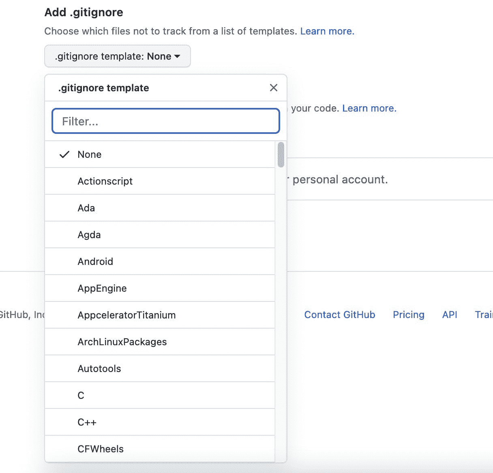
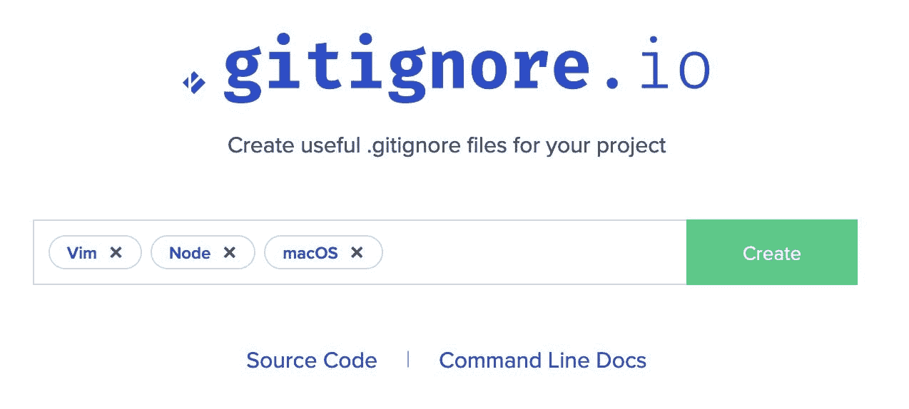

# 如何设置。JavaScript 项目的 gitignore

> 原文：<https://javascript.plainenglish.io/how-to-set-up-gitignore-for-your-javascript-project-317016acfd84?source=collection_archive---------12----------------------->


Illustration by the author

Git 是大多数开发者的必备工具。它允许您跟踪和描述代码库中的变更，然后在存储库中进行跟踪。每个存储库都是从一个名为根文件夹的文件夹中建立的——默认情况下，Git 建议您跟踪其中的所有文件。

在大多数项目中，您不希望跟踪和共享根文件夹中的所有文件 Git 为您提供了一种方法来轻松控制它应该建议您将哪些文件添加到存储库中。

# 什么是。gitignore

`.gitignore`是一个文件，让你描述 Git 应该忽略的名字模式。它支持通配符，因此只需很少的规则，您就可以捕获许多应该被忽略的文件:

```
# Ignore all files with the exe extension
*.exe 

# Ignore dist & converage folders
dist/
converage/

# Nested location
some-folder/another-folder/*.txt

# Complex name pattern
build-config.*.yml
```

为什么`.gitingore`的名字以点开头？这是 UNIX 对隐藏文件的约定。例如，`ls -l`命令不会显示它。

# 项目级别

最常见的是在项目的根文件夹中设置`.gitignore`。这是其他人检查的第一个地方，通过指定一个嵌套位置，它允许您控制整个代码库中的任何文件。你可以在大多数严肃的项目中找到它。以下是一些开源示例:

*   [做出反应](https://github.com/facebook/react/blob/main/.gitignore)，
*   [助推器](https://github.com/twbs/bootstrap/blob/main/.gitignore)，
*   [角度](https://github.com/angular/angular/blob/main/.gitignore)

# 项目子文件夹

`.gitignore`文件可以添加到存储库树的任何级别上。当提供时，它将控制其中的文件——其他的一切都像根文件夹一样工作。开放源代码的例子:

*   [有角度的](https://github.com/angular/angular/blob/main/aio/content/examples/.gitignore)

# 全球一级

您可以指定一个全局的`.gitignore`，并放置特定于您的环境的模式。例如，如果您的代码编辑器在它打开的文件夹中创建临时文件，并且您不想或者不能改变项目的`.gitignore`，那么您可以这样做。

要进行设置，首先检查以下设置:

```
$ git config --global core.excludesfile
```

您将获得名称或您的全局`.gitignore`文件，或者什么也没有。在后一种情况下，您可以自己设置文件名。例如，对于 Linux 或 macOS，您可能会这样做:

```
$ git config --global core.excludesfile ~/.gitignore
```

然后，在该文件中，添加与代码编辑器和操作系统相关的模式。在我的例子中，我会忽略 Vim 创建的临时文件:

```
*~

*.swp
*.swo
```

# JS 项目中容易忽略的常见问题

在您的 JavaScript 项目中，您应该忽略哪些事情？

# 节点 _ 模块

`node_modules`是一个文件夹，`npm`在其中安装所有依赖项。有些人认为它可以作为存储库的一部分被跟踪，但是最常见的方法是忽略它。我建议忽略它，因为:

*   很大，里面会有很多噪点变化
*   它的内容在不同的操作系统之间可能会有所不同——一些模块在安装时会下载额外的依赖项，这些依赖项在 Linux、Windows 和 macOS 之间可能会有所不同
*   需要的时候可以从`package.json`和`package-lock.json`中重新创建

# 输出文件夹

包含您的构建或测试结果的任何文件夹。一些常见的例子:

*   `dist`—web pack 中的默认输出文件夹
*   `coverage` —常用于单元测试的覆盖率报告

为什么不理会他们？输出是有噪声的，只要需要，就可以从源代码中重新创建它们。

# 编辑信息

不同的团队成员经常使用不同的代码编辑器。毫无疑问，您不希望您的配置泄漏到存储库中——这可能会弄乱使用同一编辑器的同事的设置，并且会给其他人带来干扰。由于编辑器的选择与项目无关，让每个人在他们的机器上设置正确的忽略模式是有意义的。正如你在上面的开源例子中所看到的，团队经常决定在项目`.gitignore`中添加编辑器相关模式——毕竟，它通常最多只有几行。

# `.gitignore`发电机

如你所见，设置`.gitignore`会变得相当复杂。幸运的是，您不必完全自己创建这些文件！

# 开源代码库

当您创建新的存储库时，您可以使用此下拉列表:



有了它，您可以用一个与项目需求相关的`.gitignore`来初始化您的存储库。

这里有一个[简洁的工具](https://www.toptal.com/developers/gitignore)来生成一个覆盖多种需求的忽略文件——例如，与以下内容相关的内容:

*   项目中使用的技术
*   代码编辑器
*   操作系统

通过这种方式，您可以创建一个包含适合您项目的正确组合的文件。



# 更多资源

*   [Git 如何存储数据](https://how-to.dev/how-git-stores-data)
*   中的[图案格式](https://git-scm.com/docs/gitignore#_pattern_format)`[.gitingore](https://git-scm.com/docs/gitignore#_pattern_format)`

*最初发布于*[*https://how-to . dev*](https://how-to.dev/how-to-set-up-gitignore-for-your-javascript-project)*。*

*更多内容看* [***说白了。报名参加我们的***](https://plainenglish.io/) **[***免费周报***](http://newsletter.plainenglish.io/) *。关注我们关于* [***推特***](https://twitter.com/inPlainEngHQ) ，[***LinkedIn***](https://www.linkedin.com/company/inplainenglish/)*，*[***YouTube***](https://www.youtube.com/channel/UCtipWUghju290NWcn8jhyAw)*，以及* [***不和***](https://discord.gg/GtDtUAvyhW) *。***