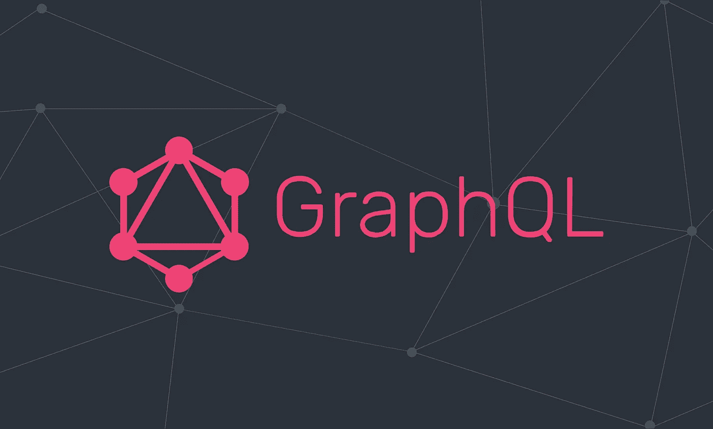
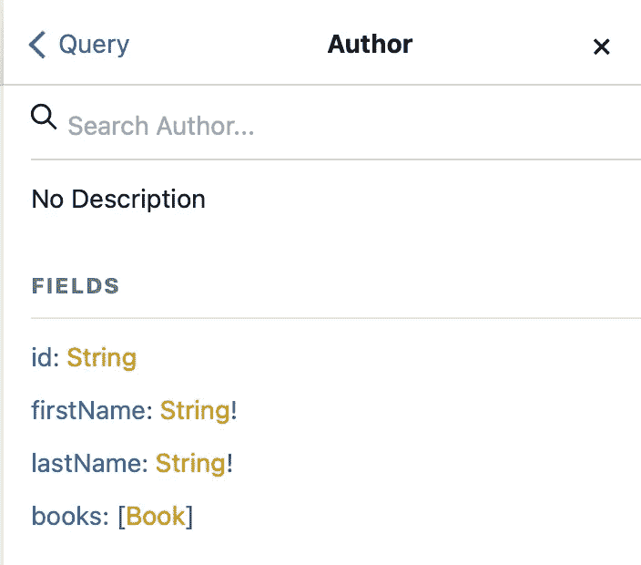
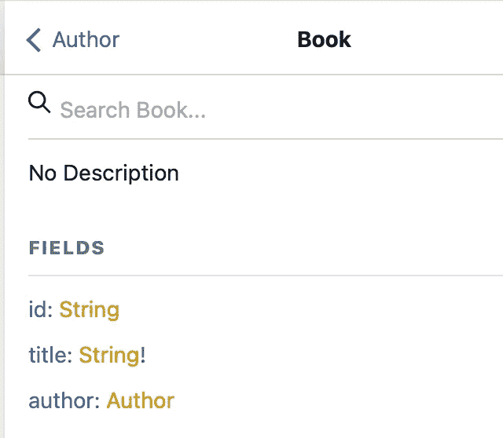

# 如何在 React 应用程序中设置 GraphQL

> 原文：<https://javascript.plainenglish.io/how-to-set-up-graphql-in-your-react-application-45513fcbf710?source=collection_archive---------10----------------------->



Source: [https://codersociety.com/blog/articles/graphql-reasons](https://codersociety.com/blog/articles/graphql-reasons)

如果您还不熟悉 GraphQL，您可以查看本文,它会让您对它的重要性以及何时使用它有一个基本的了解。

如果你已经是了，你可能还想看看[这篇文章](https://medium.com/javascript-in-plain-english/how-to-set-up-a-graphql-server-with-node-js-express-8638a068b609)，在这里我们深入探讨了如何用 Node.js & Express.js 建立一个 GraphQL 服务器

# 介绍

在本文中，我们将了解如何在 [Apollo](https://www.apollographql.com) 的帮助下，在 React 应用程序中实现 GraphQL。

有很多方法可以将 GraphQL 集成到我们的 React 应用程序中，但我确实更喜欢 Apollo 而不是其他任何替代方案。

> *包含本文将要介绍的所有代码的库可以在这里* *找到* [*。*](https://github.com/Vlad-Mihet/react-apollo-integration)
> 
> *请务必在这里* *查看我们将要与之交互的 GraphQL 服务器存储库。*

# 项目设置

# 1.设置 React 项目

首先，我们将从创建一个新的 React 项目开始。这可以通过 **npm** 或**纱线**来完成。我个人比较喜欢纱，但是你也可以用 npm 这里没有问题。

# 2.安装所需的依赖项

因为我们只会做一些更基础的东西，所以为了安装 Apollo，你只需要安装两个库:

*   **@apollo/client** ，其中包含了设置 apollo 客户端所需的几乎所有内容。
*   **graphql** ，它提供了处理 graphql 查询的逻辑。

# 3.设置 Apollo 客户端

现在我们已经安装了两个必需的依赖项，我们可以继续安装 Apollo 客户机了。

首先，让我们从 **@apollo/client** 添加所需的导入:

```
import { ApolloClient, InMemoryCache, ApolloProvider } from '@apollo/client';
```

*   **ApolloClient** 是主类，一旦实例化，它将创建一个新的 Apollo 客户端实例(我们可以有多个)。
*   InMemoryCache 是一个类，我们将使用它来让 Apollo 客户端处理其请求的缓存过程。
*   ApolloProvider 是一个组件，它接收一个**客户端**，这将允许我们将一个 Apollo 客户端注入到我们的应用程序中。

现在让我们继续创建我们的第一个 Apollo 客户端:

```
const apolloClient = new ApolloClient({
  uri: 'http://localhost:8080/graphql',
  cache: new InMemoryCache(),
});
```

这里你可以看到我们将两个属性传递给了 ApolloClient 的构造器。它们用于指定后端 GraphQL 服务器的端点，以及 Apollo 将使用的缓存机制(我们已经通过了导入的默认机制— **InMemoryCache** )。

这就是我们为客户做准备的全部内容。

# 4.连接阿波罗客户端

设置过程的最后一步是将 Apollo 客户机连接到我们的 React 应用程序。我们可以通过将我们的 **< App / >** 组件包装在 **< ApolloProvider >** 组件中来实现这一点:

```
root.render(
  <React.StrictMode>
    <ApolloProvider client={apolloClient}>
      <App />
    </ApolloProvider>
  </React.StrictMode>
);
```

我们的 **App.js** 现在应该是这样的:

```
import React from 'react';
import ReactDOM from 'react-dom/client';
import './index.css';
import App from './App';
import { ApolloClient, InMemoryCache, ApolloProvider } from '@apollo/client';

const apolloClient = new ApolloClient({
  uri: 'http://localhost:8080/graphql',
  cache: new InMemoryCache(),
});

const root = ReactDOM.createRoot(document.getElementById('root'));

root.render(
  <React.StrictMode>
    <ApolloProvider client={apolloClient}>
      <App />
    </ApolloProvider>
  </React.StrictMode>
);
```

# 使用 useQuery 获取数据

现在我们已经完成了 Apollo 客户端的设置，我们可以开始使用由@apollo/client 库以及 graphql 库提供的一些工具。

对于本文，还应该有一个展示使用 Node.js 和 Express 构建的基本 GraphQL 服务器的存储库，它允许我们访问一些作者和一些书籍。

一个作者可以有多本书，但一本书只能有一个作者，因此其背后的模式如下所示:



让我们深入一些简单的用例，比如检索作者和他们写过的书。首先，我们必须创建一个 GraphQL 查询，可以这样做:

```
const GET_AUTHORS_WITH_BOOKS_QUERY = gql`
    query {
      authors {
        id
        firstName
        lastName
        books {
          id
          title
        }
      }
    }
  `;
```

其次，我们必须使用 **useQuery** 钩子查询我们的数据:

```
const { data, loading, error } = useQuery(GET_AUTHORS_WITH_BOOKS_QUERY);
```

如您所见，我们将访问 3 个重要的属性:

*   ***数据*** ，代表我们查询到的数据(根据我们之前定义的 gql 查询)
*   ***加载*** ，它给出了请求的状态，特别是它是否已经完成加载
*   ***错误*** ，在请求失败的情况下，它会向我们指出遇到了什么问题(验证、服务器关闭等)。)

现在，我们可以利用这些属性来处理我们的数据:

```
return (
    <div className="App">
      <div className="authors-container">
        {loading ? (
          <p>Loading Authors...</p>
        ) : error ? (
          <p>There was an issue loading the data...</p>
        ) : (
          data?.authors.map((author) => (
            <div className="user-record" key={author.id}>
              <p>Author: {author.firstName + " " + author.lastName}</p>
              <div className="author-books-container">
                {author?.books?.length && <h3>Books Written:</h3>}
                {author?.books?.map((book) => (
                  <div className="author-book-record">
                    <p>Book Title: {book.title}</p>
                  </div>
                ))}
              </div>
            </div>
          ))
        )}
      </div>
    </div>
  );
```

在这里，如你所见，我们将检索我们存储的所有作者，我们将在屏幕上显示他们的姓名和他们所写书籍的标题。

所有预先定义的属性都是**反应性的**，这意味着我们唯一要做的就是使用它们，一切都将与我们的 React 应用程序很好地挂钩；这意味着一旦加载过程结束，例如，加载变量的值将变为 falsy，然后我们将知道我们可以访问数据属性或错误属性。

# 使用 useMutation 更新/创建数据

更新或改变数据的过程与查询数据的过程非常相似，唯一的区别是我们使用的关键字(***query***vs***mutation***)，以及我们从调用钩子得到的内容(这是一个为我们提供触发改变的函数的数组)，以及我们从 **useQuery** 钩子( ***data*** ，***loading***

*创建新作者的变异查询如下所示:*

```
*const ADD_AUTHOR_MUTATION = gql`
  mutation CreateAuthor($firstName: String!, $lastName: String!) {
    createAuthor(
      firstName: $firstName
      lastName: $lastName
    ) {
      id
    }
  }
`;*
```

****useMutation*** 钩子调用应该是这样的:*

```
*const [addAuthor] = useMutation(ADD_AUTHOR_MUTATION);*
```

*我们不会使用 ***数据*** 、 ***加载*** 、以及 ***错误*** 属性，因为我们只会启动而忘记突变函数。*

*至于 JSX 和 React 代码的其余部分，我们将创建一个新的表单来输入作者的名字和姓氏，在提交时我们将触发一个 **addAuthor** 函数调用来创建新的作者记录。*

*最终的 **App.js** 文件如下所示:*

```
*import { useState } from "react";
import { useQuery, useMutation, gql } from "@apollo/client";
import "./App.css";
function App() {
  const [authorFirstName, setAuthorFirstName] = useState("");
  const [authorLastName, setAuthorLastName] = useState("");
  const GET_AUTHORS_WITH_BOOKS_QUERY = gql`
    query {
      authors {
        id
        firstName
        lastName
        books {
          id
          title
        }
      }
    }
  `;
  const ADD_AUTHOR_MUTATION = gql`
    mutation CreateAuthor($firstName: String!, $lastName: String!) {
      createAuthor(
        firstName: $firstName
        lastName: $lastName
      ) {
        id
      }
    }
  `;
  const { data, loading, error, refetch } = useQuery(GET_AUTHORS_WITH_BOOKS_QUERY);
  const [addAuthor] = useMutation(ADD_AUTHOR_MUTATION);
  const handleSubmitForm = (e) => {
    e.preventDefault(); // Avoid refreshing the page
    addAuthor({
      variables: {
        firstName: authorFirstName,
        lastName: authorLastName,
      },
    });
    refetch();
  };
  return (
    <div className="App">
      <div className="authors-container">
        {loading ? (
          <p>Loading Authors...</p>
        ) : error ? (
          <p>There was an issue loading the data...</p>
        ) : (
          data?.authors.map((author) => (
            <div className="user-record" key={author.id}>
              <p>Author: {author.firstName + " " + author.lastName}</p>
              <div className="author-books-container">
                {author?.books?.length && <h3>Books Written:</h3>}
                {author?.books?.map((book) => (
                  <div className="author-book-record">
                    <p>Book Title: {book.title}</p>
                  </div>
                ))}
              </div>
            </div>
          ))
        )}
      </div>
      <div className="add-author-container">
        <form onSubmit={(e) => handleSubmitForm(e)}>
          <input
            type="text"
            value={authorFirstName}
            onChange={(e) => setAuthorFirstName(e.target.value)}
          />
          <input
            type="text"
            value={authorLastName}
            onChange={(e) => setAuthorLastName(e.target.value)}
          />
          <button type="submit">Add Author</button>
        </form>
      </div>
    </div>
  );
}
export default App;*
```

# *摘要*

*所以你有它。现在您应该有了一个基本的 Apollo 集成，随着应用程序复杂性的增加，您可以在此基础上进行构建。*

*随着应用程序的增长，您应该开始考虑在单独的全局、特性或特定于视图的目录中分离查询和变化。您可能还想考虑创建钩子来处理常见的查询或变化，这样可以提高代码的可重用性，并消除多余的重复。*

*我希望您喜欢阅读这篇文章，并希望它能帮助您理解在 Apollo 的帮助下在 React 应用程序中设置 GraphQL 的基础知识。如果你觉得我错过了什么，请在下面的评论中告诉我。*

*下次见。干杯！*

# *有用的资源*

*   *[阿波罗查询](https://www.apollographql.com/docs/react/data/queries)*
*   *[阿波罗突变](https://www.apollographql.com/docs/react/data/mutations)*
*   *[重新提取数据](https://www.apollographql.com/docs/react/data/refetching)*
*   *[挂钩术语表](https://www.apollographql.com/docs/react/api/react/hooks)*
*   *[REST API 与 Apollo](https://www.apollographql.com/docs/react/api/link/apollo-link-rest)*

**更多内容请看*[***plain English . io***](https://plainenglish.io/)*。报名参加我们的* [***免费周报***](http://newsletter.plainenglish.io/) *。关注我们关于*[***Twitter***](https://twitter.com/inPlainEngHQ)[***LinkedIn***](https://www.linkedin.com/company/inplainenglish/)*[***YouTube***](https://www.youtube.com/channel/UCtipWUghju290NWcn8jhyAw)*[***不和***](https://discord.gg/GtDtUAvyhW) *。对增长黑客感兴趣？检查* [***电路***](https://circuit.ooo/) *。****