# 如何用 TypeScript 设置 Next.js 在 Google Lighthouse 和 Vercel Analytics 中获得 100 分

> 原文：<https://javascript.plainenglish.io/how-to-set-up-next-js-with-typescript-to-get-a-100-score-in-google-lighthouse-and-vercel-analytics-6f97501a91c7?source=collection_archive---------0----------------------->

## 建立一个 PWA 来获得 Google Lighthouse、Vercel Analytics 和 Webpagetest.org 安全公司的许可

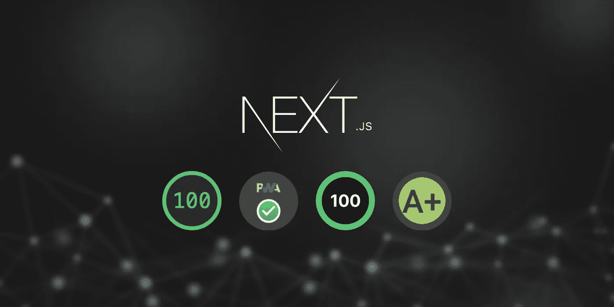

# 介绍

本文介绍了如何使用 Next.js 构建渐进式 Web 应用程序，以在 Google Lighthouse 和 Vercel Analytics 中获得 100%的分数。

在这里，我们将经历优化一个全新的 Next.js 项目的整个过程。也可以将其视为以下文章的更新组合:

[](https://rockyli.medium.com/build-a-pwa-with-next-js-to-achieve-100-lighthouse-score-8bbb86598ed4) [## 用 Next.js 构建 PWA，实现 100% lighthouse 评分

### 这篇文章讲述了我们如何用 Next.js (React.js)构建一个渐进的 Web 应用程序，并获得 100%的分数…

rockyli.medium.com](https://rockyli.medium.com/build-a-pwa-with-next-js-to-achieve-100-lighthouse-score-8bbb86598ed4) [](/build-a-pwa-with-next-js-to-achieve-100-in-google-lighthouse-and-next-js-analytics-ab695765c48) [## 用 Next.js 建立一个 PWA，在 Google Lighthouse 和 Next.js Analytics 中实现 100%

### 在 Google light house+next . js Analytics+Webpagetest.org 中获得最高排名

javascript.plainenglish.io](/build-a-pwa-with-next-js-to-achieve-100-in-google-lighthouse-and-next-js-analytics-ab695765c48) 

另外，该项目将使用 TypeScript 编写。

当我创建 [nextjs-100](https://github.com/rockyliyanlok/nextjs-100) 时，我的大部分项目仍然是用 JavaScript 编写的，并带有用于类型检查的 PropTypes。渐渐地，越来越多的项目转向了 TypeScript，我开始意识到用 TypeScript 构建项目的更多好处。一项[研究](https://earlbarr.com/publications/typestudy.pdf)发现 15%的 JavaScript bugs 可以通过使用 TypeScript 检测出来。

尤其是，当我们在一个有许多贡献者的项目上工作时。使用 TypeScript，我们可以更容易地重构代码，而不会严重破坏代码。

因此，是时候在 TypeScript 中构建我们的 [nextjs-100 了！](https://github.com/rockyliyanlok/nextjs-100-ts)

# 带有 TypeScript 的 Next.js

首先，我们从创建一个新的 Next.js 应用程序开始。

```
$ yarn create next-app — typescript
```

正如我们在 TypeScript Next.js 项目中看到的，名为`next-env.d.ts`和`tsconfig.json`的文件将在项目的根目录下创建。文件`next-env.d.ts`是为了确保 Next.js 类型被 TypeScript 编译器选中。我们不应该删除或编辑它。

另一个文件`tsconfig.json`是 TypeScript 编译器的定制配置。如果我们需要额外的类型，在根中创建一个`*.d.ts`，并在`tsconfig.json`的包含数组中引用。

我们可以在官方文件中找到更多信息:[https://nextjs.org/docs/basic-features/typescript](https://nextjs.org/docs/basic-features/typescript)

# 添加图标资产

让我们清理并添加一些项目签名。例如，删除不必要的组件并添加应用程序图标。favicon.io 工具是一个非常有用的工具，可以生成 web 应用程序图标资产。

```
public/
├── android-chrome-192x192.png
├── android-chrome-512x512.png
├── apple-touch-icon.png
├── favicon-16x16.png
├── favicon-32x32.png
├── favicon.ico
└── site.webmanifest
```

这些图标资产应该放在 ***公共*** 文件夹中。我们还需要给`site.webmanifest`添加一些属性，使其完整并满足渐进式 web 应用程序的需求。

./public/site.webmanifest

./pages/_document.tsx

一旦我们准备好资产，在`_document.tsx`的`<head>`元素中添加 meta 标签。

## manifest . JSON vs site . web manifest

根据 w3.org T21 的说法，开发者可以选择使用不同的扩展，比如 T3 和 T4。然而，IANA 注册的清单文件扩展名是`.webmanifest`。我们将在这个库中使用`site.webmanifest`。


**Figure 1** Performance report from Lighthouse — dev build

生产版本是应用程序的优化版本。**中生成的代码*。接下来编译并缩小*和**。通常，为了优化性能，我们会将生产版本推送到现场。

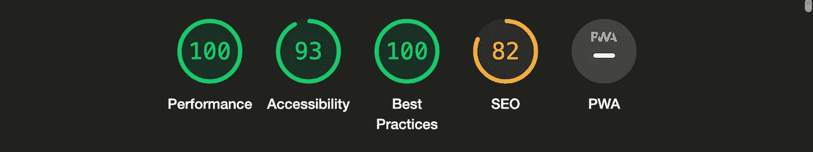

**Figure 2** Performance report from Lighthouse — prod build

让我们继续让报告全是绿色的。

# 添加元标签标题描述

根据 Lighthouse 的报告，添加标题和描述元素可以提高可访问性和 SEO 指标。

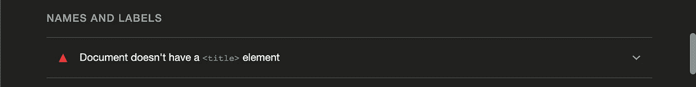

**Figure 3** Diagnostics from Lighthouse — title element

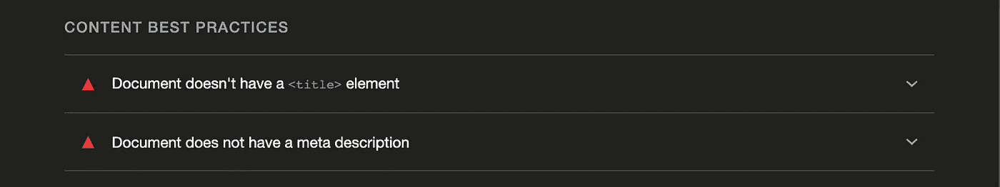

**Figure 4** Diagnostics from Lighthouse — title element and meta description

在 Next.js 中，我们可以将描述元标签放在`_document.tsx`文件中。然而，`<title>`元素应该放在每一页上。

./pages/_document.tsx

./pages/index.tsx

# 向 HTML 元素添加 lang 属性

从 v10 开始 Next.js 支持国际化路由。Next.js 会根据用户访问的语言自动添加`lang`属性。

./next.config.js

在`next.config.js`中添加 i18n 配置以指定支持的语言。然后，我们可以发现自动检测的 lang 属性被添加到 HTML 元素中。


**Figure 5** Performance report from Lighthouse — all green

太好了！我们成功了！

在 Lighthouse 报告中，所有四个指标都是绿色 100。即便如此，你可能会注意到 PWA 圈还是一个负号。

# 渐进式 Web 应用程序

通过添加`next-pwa`包，使 Next.js 应用程序成为一个渐进式 web 应用程序是非常方便的。

```
$ yarn add next-pwa
```

导入`next.config.js`中的`next-pwa`包并添加配置。我们通常不希望服务人员在开发期间运行。

./next.config.js

对于 PWA 设置来说,`theme-color`和`referrer` meta 标签也是必需的。

./pages/_document.tsx

## manifest.json 的预缓存问题

在[这个线程](https://github.com/shadowwalker/next-pwa/issues/295#issuecomment-971219218)中提到了一个预缓存问题，这个问题会在部署到 Vercel 后发生。因此，在下一个 pwa 构建中，运行时缓存被添加，而`middleware-manifest.json`被排除。

做了上面的修改后，灯塔报告中的 PWA 圈神奇地变成了绿色的勾号。

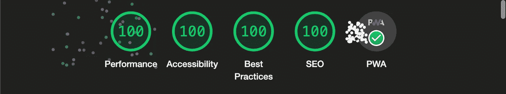

**Figure 6** Performance report from Lighthouse — all green and PWA passed

# 检查安全性

虽然我们在灯塔报告中做到了 100%，但这不应该是这个故事的结尾。安全性总是很重要，因此让我们检查一下安全性得分。

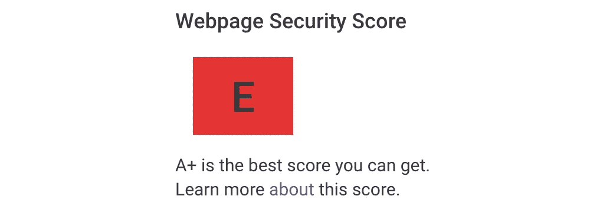

**Figure 7** Security report from Webpagetest.org — Security score E

参考[webpagetest.org](https://webpagetest.org/)安全评分在 **E** 带，有一堆问题需要我们解决。

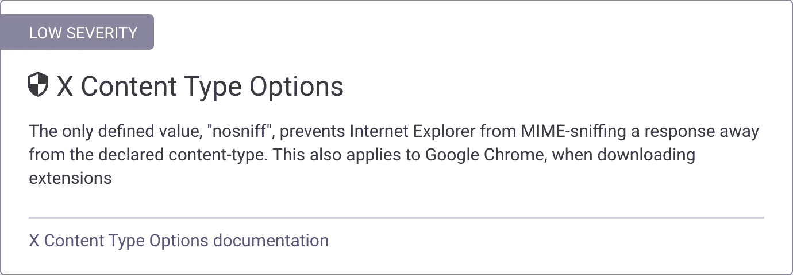

**Figure 8** Diagnostics from Webpagetest.org — X Content Type Options

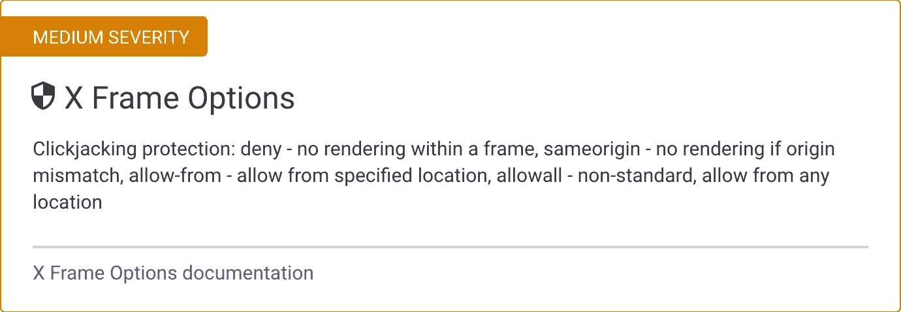

**Figure 9** Diagnostics from Webpagetest.org — X Frame Options


**Figure 10** Diagnostics from Webpagetest.org — X XSS Protection

## 添加安全标题

我们可以通过在`next.config.js`中添加安全头来解决这些问题。

./next.config.js

## 添加内容安全策略

对于内容安全策略，我们还为 Vercel Analytics 添加了***vitals.vercel-insights.com***。

./next.config.js

是时候再次尝试在[webpagetest.org](https://webpagetest.org/)获得更好的安全分数了。

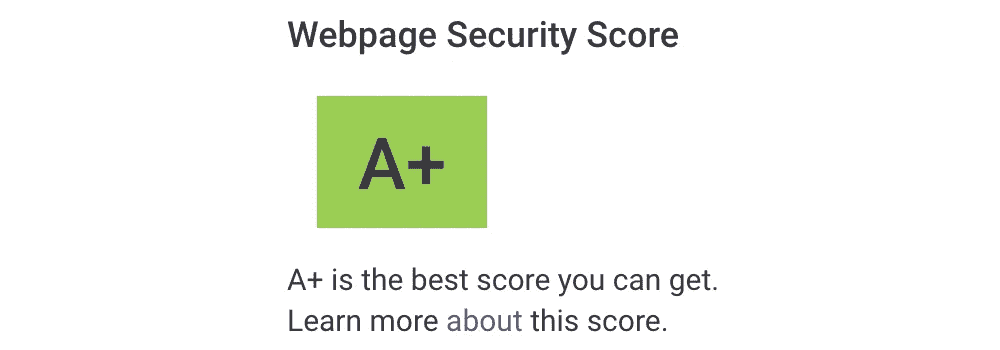

**Figure 11** Security report from Webpagetest.org — Security score A+

干得好！最后我们在安全级别上得到了 band **A+** 。

# 韦尔塞尔分析公司

谷歌灯塔几乎是一个标准的工具，检查核心网站的生命体征评分。然而，这是单个数据点的分数。如果我们想从真实的体验得分中评估网站的重要指标，Vercel analytics 允许我们通过收集访问者访问页面时的指标来衡量网站的性能。

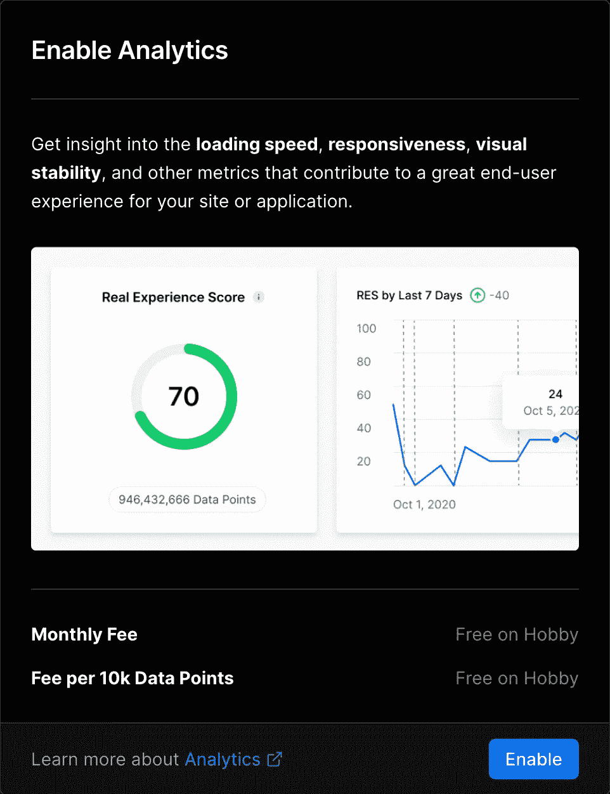

**Figure 12** Enable Vercel Analytics

在 Vercel 上设置 Vercel Analytics 非常容易，我们只需在目标项目的 Analytics 选项卡中启用它。

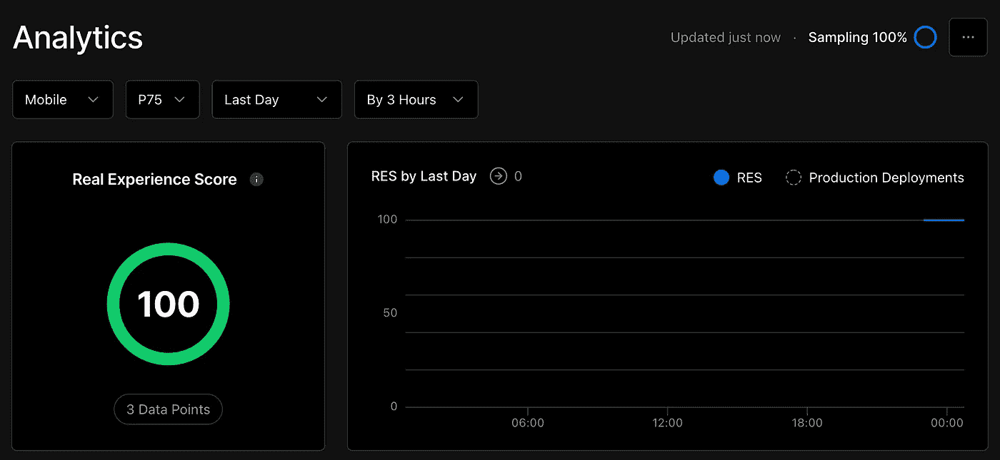

**Figure 13** Performance report from Vercel Analytics

由于 Vercel Analytics 从访问者的访问中收集性能分数，我们需要访问页面几次，数据才会出现在仪表板中。

# 结论

在这个故事中，我们经历了使用 Next.js 创建渐进式 Web 应用程序的整个过程，以在 Google Lighthouse、Next.js Analytics 和 webpagetest.org 的 band A+ security 中获得 100%的分数。我希望这能成为你惊人项目的一个好的开始！

源代码可以在[这个库](https://github.com/rockyliyanlok/nextjs-100-ts)中找到。你可以随意派生存储库或者开始你的 Next.js 项目。

```
$ yarn create next-app -e [https://github.com/rockyliyanlok/nextjs-100-ts](https://github.com/rockyliyanlok/nextjs-100-ts)
```

编码快乐！💻

*更多内容请看*[***plain English . io***](https://plainenglish.io/)*。报名参加我们的* [***免费周报***](http://newsletter.plainenglish.io/) *。关注我们关于*[***Twitter***](https://twitter.com/inPlainEngHQ)*和*[***LinkedIn***](https://www.linkedin.com/company/inplainenglish/)*。加入我们的* [***社区不和谐***](https://discord.gg/GtDtUAvyhW) *。*

## 进一步阅读

[](/typescript-made-easy-a-guide-to-your-first-type-safe-app-with-next-js-wundergraph-and-prisma-e197a59e2b30) [## 轻松编写类型脚本:使用 Next.js、WunderGraph 和 Prisma 编写第一个类型安全应用程序的指南

### 是时候抛开恐惧，学习 TypeScript 了。让我们给你第一次“发现！”瞬间通过建立一个完整的…

javascript.plainenglish.io](/typescript-made-easy-a-guide-to-your-first-type-safe-app-with-next-js-wundergraph-and-prisma-e197a59e2b30)