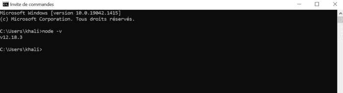
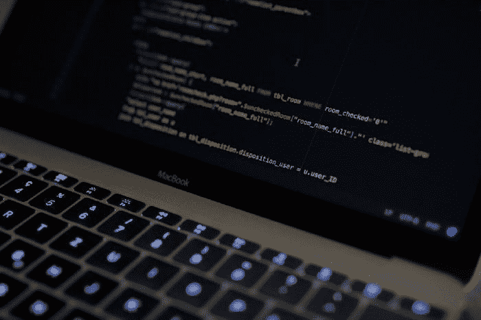
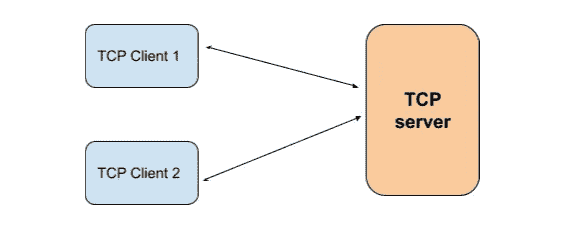
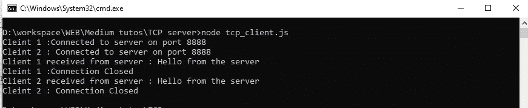
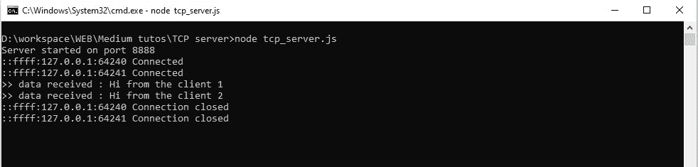

# 如何使用 Node.js 从头开始设置 TCP 客户端/服务器应用程序

> 原文：<https://javascript.plainenglish.io/how-to-set-up-your-tcp-client-server-application-with-nodejs-from-scratch-5d218a1300f2?source=collection_archive---------1----------------------->

## 使用 Node.js 设置自己的 TCP 客户机/服务器应用程序的分步指南


Photo by [Joshua Reddekopp](https://unsplash.com/@joshuaryanphoto?utm_source=medium&utm_medium=referral) on [Unsplash](https://unsplash.com?utm_source=medium&utm_medium=referral)

在本教程中，您将学习如何使用 Node.js 设置和编写 TCP 客户端/服务器应用程序，使用简单的词语和从零开始的逐步方法进行解释！

学习完本教程后，您将理解它是如何工作的，并且能够设置 TCP 服务器和 TCP 客户端，并使用 Node.js 在它们之间交换数据。

(这个例子是基于 Windows 的，但是对于 Linux 也是一样的)


Photo by [Arnold Francisca](https://unsplash.com/@clark_fransa?utm_source=medium&utm_medium=referral) on [Unsplash](https://unsplash.com?utm_source=medium&utm_medium=referral)

# 什么是 TCP？

TCP 代表**传输控制协议**，是 TCP/IP 互联网协议之一。

使用 TCP，您可以在客户端和服务器之间以可靠的方式交换数据。

你要记住的是:

*   TCP 是一种面向连接的协议:这意味着客户端必须先与服务器建立连接，然后才能与它交换数据
*   TCP 是可靠的:这意味着当发送方的消息被接收方收到时，发送方会得到通知
*   如果接收方没有收到消息，数据会重新传输，因此不会丢失数据
*   您的数据是按顺序传送的，这意味着接收方将按照发送方发送数据包的顺序接收数据包
*   误差检测

但在某些应用中，TCP 可能不是正确的选择，因为与其他协议相比，它可能会很慢，而且对于视频流等一些应用来说，它可能会很重。


Photo by [Jordan Harrison](https://unsplash.com/@jordanharrison?utm_source=medium&utm_medium=referral) on [Unsplash](https://unsplash.com?utm_source=medium&utm_medium=referral)

# Node.js 是什么？

Node.js 定义为:

> *“作为异步事件驱动的 JavaScript 运行时，Node.js 旨在构建可扩展的网络应用。在下面的“hello world”示例中，可以并发处理许多连接。在每次连接时，回调被触发，但是如果没有工作要做，Node.js 将休眠“(*)*

【https://nodejs.org/en/about/】(*)[](https://nodejs.org/en/about/)

# *如何安装 Node.js？*

*要安装 Node.js，建议从下载部分下载一个预构建的版本:*

*[https://nodejs.org/en/download/](https://nodejs.org/en/download/)*

*请务必安装 LTS 版本，这是稳定的，并有“长期支持”。*

*为了检查它是否安装正确，请打开命令行(cmd)并执行以下命令(该命令检查 Node.js 的版本):*

```
*node -v*
```

*输出将是 Node.js 版本，例如:*

**

*check nodeJS version*

*如果可以的话，我们就可以开始编码了！*

**

*Photo by [Caspar Camille Rubin](https://unsplash.com/@casparrubin?utm_source=medium&utm_medium=referral) on [Unsplash](https://unsplash.com/?utm_source=medium&utm_medium=referral)*

# *开始编码吧！*

## *1.我们的应用架构*

*对于本教程，它将是一个简单的 TCP 客户端/服务器架构:*

*   *服务器:它将监听客户机消息将要到达的特定端口，并发送对客户机请求的响应。*
*   *客户端将向服务器发送一条消息，并等待对其请求的响应*

***注意:**我尽量让它对你来说非常简单，这样你就可以学习，并且在实际应用中使用它取决于你自己。:)*

**

*Our application architecture*

## *2.TCP 客户端*

*在本节中，我们将使用“net”模块创建两个 TCP 客户端。*

> *“`net`模块为创建基于流的 TCP 提供了异步网络 API”。[https://nodejs.org/api/net.html#net](https://nodejs.org/api/net.html#net)*

*然后，每个客户端将:*

*   *连接到服务器*
*   *表达重要意思*
*   *等待服务器响应*

*以下是该示例的完整代码:*

*TCP client code in NodeJS*

*一些解释:*

*首先，您需要通过调用以下命令来获取“net”模块:*

```
*const net = require('net');*
```

*然后，您需要创建套接字以连接到服务器:*

```
*const client1 = new net.Socket();*
```

*现在，我们可以使用适当的端口(在本例中为 8888)通过以下函数连接到服务器:*

```
*client1.connect(.....)*
```

*建立连接后，您可以使用以下方式发送消息:*

```
*client1.write('Hi from the client 1')*
```

*要处理数据接收、错误、连接关闭等事件，您可以使用:*

```
*client1.on('XXX',function(x){
   // you function code 
});*
```

*   *' XXX '是要处理的事件，它可以是' data '，' close' …*
*   *function(){}:事件发生时是否调用回调*

*现在，我们可以使用以下命令在命令行中启动我们的客户端代码:*

```
*node tcp_client.js*
```

## *3.TCP 服务器*

*与 TCP 客户端一样，要设置 TCP 服务器，我们将使用“net”模块。*

*启动后，服务器将监听特定端口(在本例中为 8888 ),并将:*

*   *等待客户端连接*
*   *从每个连接的客户端接收数据*
*   *向每个连接的客户端发回响应*

*以下是服务器的完整代码:*

*TCP server code in NodeJS*

*一些解释:*

*首先，您必须使用以下命令创建服务器:*

```
*const server = net.createServer(onClientConnection);*
```

***注意**是一个回调函数，每次客户端连接到服务器时都会调用。*

*然后，我们必须使用以下命令启动服务器监听:*

```
*server.listen(....)*
```

*正如我们前面说过的，每次客户端连接到服务器时，`onClientConnection`都会被调用，所以让我们来看看这个函数的内部:*

*您可以注意到，在`onClientConnection`中，我们设置了一些事件发生时要调用的回调函数(正如我们在上面的客户端部分所解释的)。*

*在本例中，我们设置了一个接收数据时的回调:*

```
*sock.on('data',function(data){....})*
```

*以及当连接关闭时要调用的另一个函数:*

```
*sock.on('close',function(){....})*
```

*以及对错误的回调:*

```
*sock.on('error',function(error){...})*
```

*我们可以使用`sock.write(…)`向客户端发送消息，并使用`sock.end()`关闭客户端连接。*

*话虽如此，现在让我们使用命令行启动我们的服务器代码:*

```
*node tcp_server.js*
```

## *4.结果*

*现在，结果是:*

*对于客户端，结果如下:*

**

*TCP clients using NodeJS*

*您可以看到两个客户端成功启动，向服务器发送消息，从服务器接收消息，最后连接关闭。*

*现在服务器端:*

**

*TCP server using NodeJS*

*我们可以看到两个客户端连接到服务器(记录了它们的 IP 地址，您可以注意到每个客户端有两个不同的 IP 地址)。然后，服务器从每个客户端收到一条消息，并发回响应，最后关闭每个客户端的连接。*

*就这样！*

# *结论*

*在本教程结束时:*

*   *您对 TCP 有基本的了解*
*   *您已经在计算机上安装了 Node.js*
*   *设置一个从客户端接收数据并发回响应的 TCP 服务器*
*   *设置 TCP 客户端以连接到 TCP 服务器，从服务器发送消息和接收数据*

*希望本教程对您来说是清晰的，并帮助您使用 Node.js 构建自己的 TCP 客户机/服务器应用程序。*

***请不要忘记点击“跟随”按钮并留言！***

*谢谢！请继续关注更多教程。*

*为了支持我制作更多教程，请加入 media:*

*[](https://medium.com/@khalilsaidi19/membership) [## 加入 Medium，我的推荐链接- Khalil SAIDI

### 作为一名中型会员，您的部分会员费将支付给您所阅读的作家，您可以完全接触到每个故事……

medium.com](https://medium.com/@khalilsaidi19/membership) 

*更内容于*[](https://plainenglish.io/)**。报名参加我们的* [***免费周报***](http://newsletter.plainenglish.io/) *。跟随我们登上* [***推特***](https://twitter.com/inPlainEngHQ) 和 [***领英***](https://www.linkedin.com/company/inplainenglish/) *。加入我们的* [***社群不和***](https://discord.gg/GtDtUAvyhW) *。***