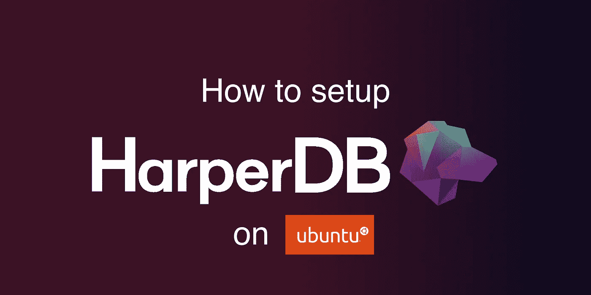
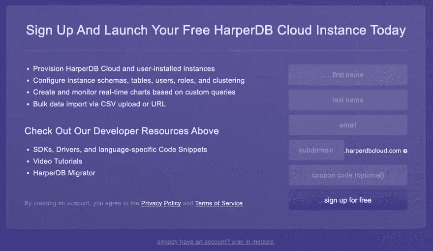
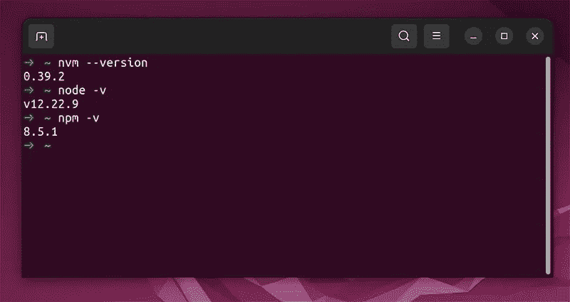
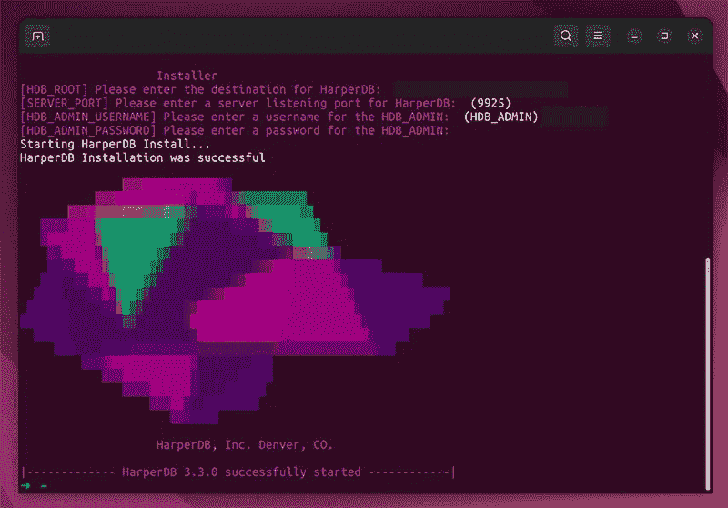
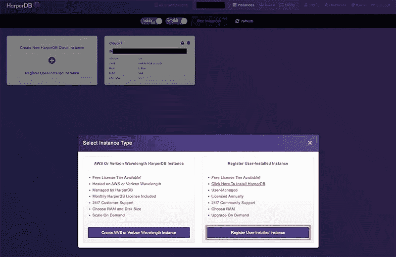
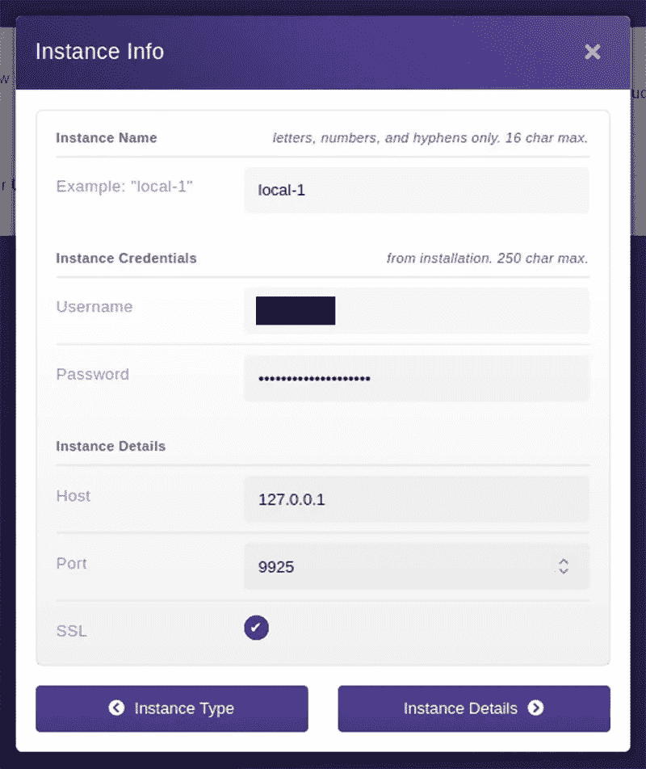
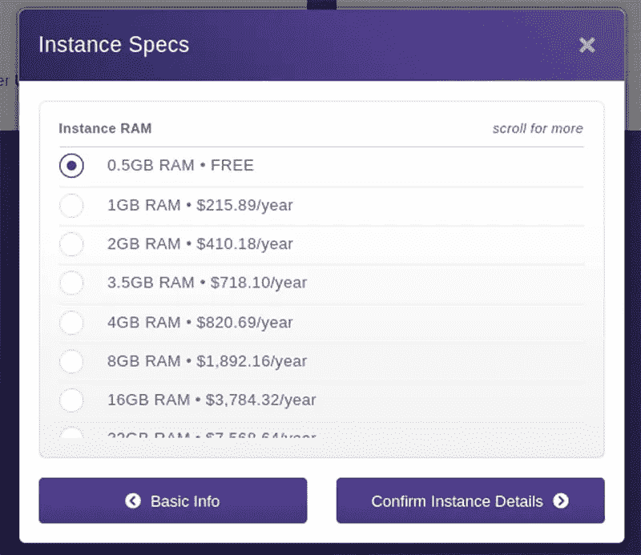
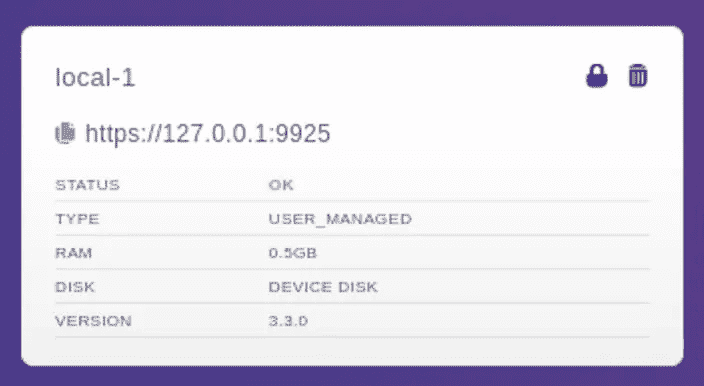

# 如何在 Ubuntu 上设置 HarperDB

> 原文：<https://javascript.plainenglish.io/how-to-setup-harperdb-on-ubuntu-b6b502167150?source=collection_archive---------9----------------------->



# 什么是 HarperDB？

HarperDB 是一个支持 SQL 和 NoSQL 的数据管理平台。它是完全索引的，避免了数据重复，并且可以在任何设备上执行。所有的数据都托管在云中。您可以使用 HarperDB 查询引擎对结构化和非结构化数据运行标准的 SQL 查询，如连接、插入、更新和删除。

# 使用 Linux 发行版进行开发

使用 Linux 发行版作为您的主要开发环境有很多好处。最流行的 Linux 发行版之一是 Ubuntu。使用 Linux 的一些好处包括:

*   使用户能够根据自己的喜好对操作系统进行个性化定制
*   低成本是因为每个人都可以免费使用 Linux
*   强大的隐私和安全性
*   这是高性能
*   还有很多！

# 在 Ubuntu 上设置 HarperDB

# 创建 HarperDB 帐户

今天我们将学习如何在 Ubuntu 上本地设置 HarperDB，这样你就可以管理你所有的数据库。在我们开始之前，您需要确保您已经在 HarperDB 上创建了一个帐户，以便我们有一个与数据库连接的帐户。前往主网站获取 [HarperDB](https://harperdb.io/) 并创建一个免费帐户。您应该会看到一个类似下图的注册页面。



# 设置 Linux 环境

## 使用虚拟化工具

对于初学者来说，理解 Linux 的工作原理和选择哪个发行版可能是非常困难的。在本教程中，我们将使用虚拟化来让 Linux 在您的计算机上运行。这在 macOS 和 Windows 电脑上都可以工作。

首先，你必须决定使用哪种虚拟化软件。下面我列举了几个 macOS 和 Windows 的。

**苹果电脑**

[Parallels](https://www.parallels.com/uk/) (付费，但也附带免费试用)
[UTM](https://mac.getutm.app/) (免费)
[VirtualBox](https://www.virtualbox.org/) (免费，但截至发稿时，它还不太支持苹果硅 MAC)

**窗户**

[VirtualBox](https://www.virtualbox.org/) (免费)
[Windows with WSL](https://learn.microsoft.com/en-us/windows/wsl/install) (免费)
[Parallels](https://www.parallels.com/uk/) (付费但也附带免费试用)

## 下载构建映像

这一步非常重要，所以要确保你做对了。您必须下载一个与您的操作系统兼容的构建映像。如果你不确定你的电脑的处理器，你可以在谷歌上搜索“macos find processor”或者“windows find processor”。

构建映像应该是以**结尾的文件类型。国际标准化组织**。所以比如说 **jammy-desktop-arm64.iso** 。下载构建文件后，请按照您决定使用的虚拟化工具的安装和设置说明进行操作。

**AMD 和英特尔处理器**

如果您的计算机基于 AMD64 或 EM64T 架构(例如，Athlon64、Opteron、EM64T Xeon、Core 2)，那么您应该下载 [64 位 PC (AMD64)桌面映像](https://cdimage.ubuntu.com/jammy/daily-live/current/)。

**ARM 处理器**

如果您的计算机基于 ARMv8/AArch64，那么您应该为 [64 位 ARM (ARMv8/AArch64)计算机](https://cdimage.ubuntu.com/jammy/daily-live/current/)下载桌面映像。最新的苹果 MacBooks 拥有基于 ARM 架构的苹果硅处理器。

# 在 Ubuntu 上安装 HarperDB

假设一切顺利，您现在应该已经在您的计算机上建立了一个工作的 Linux 环境。如果你选择使用 Windows 和 WSL，那么你就不会有 Ubuntu Linux 的 GUI(图形用户界面),因为你将在 Windows 中使用命令行来访问 Linux。

现在进入 Linux 的主菜单，它应该在左边，点击按钮显示所有的应用程序。现在点击终端应用程序的图标并打开它。将下面的命令复制并粘贴到终端中，然后按 enter 键运行它们。这些命令将更新你在 Ubuntu 中的所有包。

```
sudo apt update
sudo apt upgrade
```

接下来，让我们安装 nvm(节点版本管理器),这样我们就可以在 Linux 中安装节点包。将下面的命令输入您的终端并运行它。

```
curl -o- https://raw.githubusercontent.com/nvm-sh/nvm/v0.39.2/install.sh | bash
```

现在重新启动您的终端并运行下面的命令，您应该能够看到您已经安装的 nvm、node 和 npm 的版本。

```
nvm --version
node -version
npm -version
```



通过命令行，nvm 可以快速安装和使用各种节点版本。因此，我们可以动态切换节点版本，这对开发非常有利。HarperDB 的当前版本支持 Node v14.20.0，因此我们需要安装该版本。如果它改变了，你可以用 nvm 来改变它。

使用下面的命令在 Ubuntu 上安装 Node v14.20.0。

```
nvm install 14.20.0
```

它应该会自动切换到节点 v14.20.0，您可以使用`node -v`验证这一点。你可以在他们的 GitHub repo[https://github.com/nvm-sh/nvm](https://github.com/nvm-sh/nvm)上找到 nvm 命令的完整列表。

现在让我们安装 HarperDB，在您的终端中运行 install 命令。

```
npm install -g harperdb
```

您可以使用命令`harperdb version`检查您已经安装的版本。完整的命令列表可以在这里找到[https://harperdb.io/docs/administration/harperdb-cli/](https://harperdb.io/docs/administration/harperdb-cli/)。

要在安装完成后启动并运行 HarperDB，只需运行以下命令。

```
harperdb run
```

按照安装说明，你应该有一个成功启动的屏幕，如下所示。

安装程序将询问以下详细信息，因此为您的本地实例创建一个新的用户名和密码，因为它不会连接到您可能在前面创建的在线 cloud HarperDB 数据库。

HarperDB Root:默认应该没问题
服务器端口:9925
HarperDB 用户名:你的用户名
HarperDB 密码:你的密码

您可以使用这些命令停止和重新启动 HarperDB。

```
harperdb stop
harperdb restart
```



干得好，你已经成功地在 Ubuntu 上设置了 HarperDB。

# 连接到我们的本地 HarperDB 实例

我们现在有了自己的本地实例，是时候连接它了。去 Ubuntu 里面的 HarperDB 网站，登录你的账户。您需要从 Ubuntu 内部进行，因为主机将在您的 Ubuntu 机器上设置为 localhost。现在单击注册用户安装的实例按钮。



如下图所示，填写实例信息。您可能会看到一条警告消息，提示“您可能需要接受实例自签名证书”。如果你看到一个屏幕说“你的连接不是私人的”或类似的话，接受它并继续。



选择免费计划，同意条款并添加实例。



就是这样，您的实例现在应该是活动的，所以您可以单击它并像普通 HarperDB 实例一样使用它。



恭喜你，你刚刚学会了如何在 Ubuntu 上设置和连接 HarperDB。有一件非常重要的事情你需要知道。您只能从您的 Ubuntu 机器访问您的本地 HarperDB 实例，因为它连接到本地主机。所以它不会让你从另一个操作系统登录。

然而，有一个可行的解决方案。您需要向互联网公开本地主机。如果你在谷歌上搜索“本地主机到公共网址”或者“将本地主机暴露给公共互联网”，你会找到一些解决方案。在 [ngrok](https://ngrok.com/) 上创建账户或者使用 npm 包 [Localtunnel](https://theboroer.github.io/localtunnel-www/) 是两种方法。所以理论上，你可以使用他们给你的任何公有地址，而不是使用 localhost (127.0.0.1)作为主机地址。无论哪种方式，您都将学习如何将 localhost 暴露给 internet，这可能会很有用。

如果你喜欢这篇文章，你可能也会喜欢我的帖子、推文和内容。如果你好奇，看看我的 [*社交媒体简介*](https://limey.io/andrewbaisden) *别忘了订阅和关注，因为我正在分享编程和激励资源和知识，以支持你实现你的目标💫*

*更多内容看* [***说白了。报名参加我们的***](https://plainenglish.io/) **[***免费周报***](http://newsletter.plainenglish.io/) *。关注我们关于* [***推特***](https://twitter.com/inPlainEngHQ) ，[***LinkedIn***](https://www.linkedin.com/company/inplainenglish/)*，*[***YouTube***](https://www.youtube.com/channel/UCtipWUghju290NWcn8jhyAw)*，以及* [***不和***](https://discord.gg/GtDtUAvyhW) ***。*****

***有兴趣缩放你的软件启动*** *？检查出* [***电路***](https://circuit.ooo/?utm=publication-post-cta) *。*