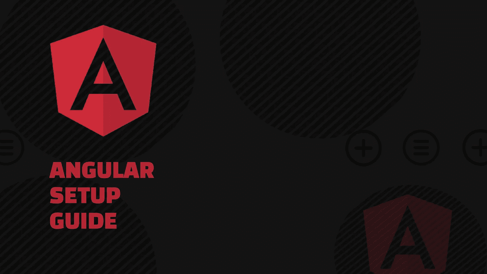
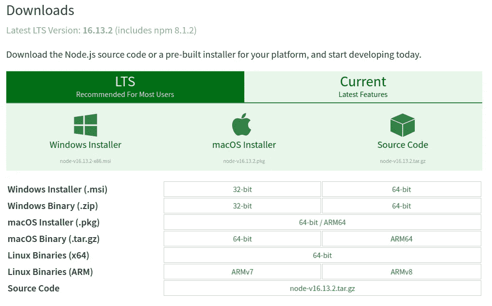
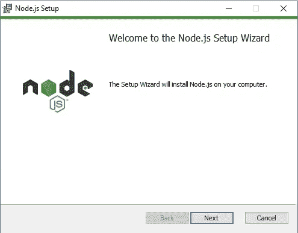
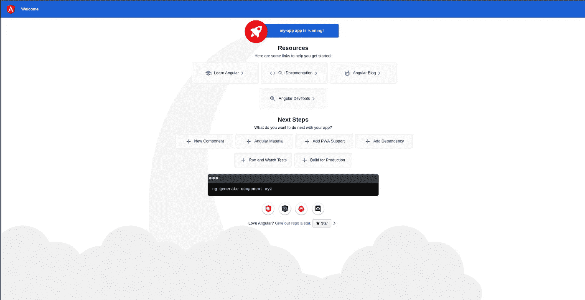

# 如何设置你的第一个 Angular 应用程序

> 原文：<https://javascript.plainenglish.io/how-to-setup-your-first-angular-app-77c1d6aa65f6?source=collection_archive---------11----------------------->

## 谷歌关于设置 Angular 应用程序和 Angular 框架基础的初学者指南。



# **什么是棱角分明？**

Angular 是一个 **JavaScript 应用设计框架**，由 Google 开发和维护，用于开发高效的前端应用。

它最初是作为 AngularJS 库推出的，后来从版本 2 开始，它被认为是一个框架。所以现在我们得到了两件不同的东西:

*   安古拉吉斯
*   角框架

在这篇文章中，我们将讨论角度框架。

它是**均值**应用的重要组成部分之一，其中 A 指角度。你可以在这里了解更多[。](https://angular.io/docs)

# 有角度的历史

Angular 曾经是 JavaScript 框架中的“金童”，因为它最初是由 Google 在 2012 年推出的。它建立在 MVC 架构之上，MVC 架构是模型视图控制器。它通常被称为模型-视图-无论什么😅

*MVC 是一个三层架构概念，主要侧重于分离模型(数据库逻辑)、视图(用户前端逻辑)和控制器(整体应用业务逻辑)。*

第一个版本以 AngularJS 的形式出现，并很快变得非常受欢迎，恢复了很多牵引力。尽管如此，它的创造者决定将它提升到另一个水平，最初将其命名为 Angular 2。2016 年，它被完全重写和重新设计，并引入了许多新概念。这种情况一直持续到现在，我们有了 Angular v13.x.x

# 角度 CLI

Angular 命令行界面用于自动化基本操作，如配置环境、启动、测试项目、安装第三方库等等…基本上 angular CLI 是一个管理器，用于从命令行界面管理所有与 angular 相关的操作。

# **学习角度的先决条件**

在开始使用 angular 之前，您必须首先了解以下内容。

*   Java Script 语言

*JavaScript 是世界上最流行的语言，主要用于前端，Node.js 现在可以用作后端编程语言。它是一种轻量级的、解释性的编程语言，也很容易学习。* [*点击这里*](https://www.w3schools.com/js/) *了解更多。*

*   以打字打的文件

TypeScript 是 JavaScript 的超集。它为 JS 添加了可选类型，支持任何浏览器的大规模 JS 应用程序。它是由微软开发的。如果你了解 JavaScript，那么学习类似语法的 typescript 就很容易了。它的主要目标是克服 JavaScript 的缺点。你可以在这里 *了解更多* [*。*](https://www.typescriptlang.org/)

*   超文本标记语言

代表超文本标记语言，它是一种标准的网页标记语言，易于学习和编写。最好的参考就是 [*这个*](https://www.w3schools.com/html/) *。*

*   半铸钢ˌ钢性铸铁(Cast Semi-Steel)

代表层叠样式表，它是一个简单的工具，用来修改普通的 HTML 代码，赋予它更多的生命。它描述了 HTML 将如何在浏览器上显示。

记住以下事项，我们可以继续在本地系统上设置 Angular:

# 步伐

1.  **安装 Node.js 和 NPM(节点包管理器)**

**适用于 Windows**

*   第一步是将 Node.js 安装到您的本地系统中，为此您必须[单击此处](https://nodejs.org/en/download/)。在那里你会看到:



您必须为您的系统选择合适的软件包，然后在安装程序中继续安装。如果您是第一次启动，您可以使用安装程序中的默认选项和设置进行移动。



单击“下一步”使用默认设置。

**针对 Linux (Ubuntu)**

*   首先，用以下内容更新您的软件包:

```
sudo apt update
```

*   现在安装 Node.js:

```
sudo apt install nodejs
```

*   使用以下命令验证您的安装:

```
node -v
```

*   你可以在我的例子中看到你的版本:

```
v14.15.4
```

*   对于 Node.js，您需要安装 NPM(节点包管理器):

```
sudo apt install npm
```

**适用于 Windows 和 Linux 系统**

*   您必须检查 NPM(节点包管理器)是否安装正确，它是 Windows 中 Node.js 的一部分。您可以通过以下方式进行检查:

```
npm -v
```

*   你可以在我的例子中看到你的版本:

```
6.14.10
```

2.**安装角度 CLI**

您可以使用 Angular CLI 创建项目、生成应用程序和库代码，并执行各种持续的开发任务，如测试、捆绑和部署。

要安装它，您可以使用以下命令:

```
npm install -g @angular/cli
```

3.**创建您的第一个角度应用**

运行以下 CLI 命令为 Angular 创建新的应用程序:

```
ng new my-first-app
```

它会提示您一些关于您的项目的信息，并将其包含在您的初始应用程序中。您可以接受默认值，只需按 Enter 键。

4.**运行您的应用**

*   将您的目录更改为项目目录:

```
cd my-first-app
```

*   运行以下命令:

```
ng serve --open
```

`ng serve`命令启动服务器。默认情况下，它将为您的应用程序使用 4200 端口。你也可以通过传递`— port`也就是`ng serve — port 4500`来改变它。`--open`(或者仅仅是`-o`)选项自动打开你的浏览器到`[http://localhost:4200/](http://localhost:4200/)`，或者你可以浏览到 [i](http://localhost:4200/) t 并查看你的第一个角度应用。



这是你第一个 Angular 应用程序的初始屏幕。

# **整理完毕**

恭喜👏构建你的第一个 Angular 应用。请随意留下任何评论和建议，因为这是我在 Medium 上的第一篇文章。你可以在以下方面向我寻求帮助:

[](https://www.linkedin.com/in/jaykishan-khemani-a0452850/) [## Jaykishan Khemani -解决方案工程师- GAMMASTACK | LinkedIn

### 查看 Jaykishan Khemani 在世界上最大的职业社区 LinkedIn 上的个人资料。Jaykishan 列出了 3 个工作…

www.linkedin.com](https://www.linkedin.com/in/jaykishan-khemani-a0452850/) 

*更多内容看* [***说白了。报名参加我们的***](https://plainenglish.io/)***[***免费周报***](http://newsletter.plainenglish.io/) *。关注我们* [***推特***](https://twitter.com/inPlainEngHQ) *和*[***LinkedIn***](https://www.linkedin.com/company/inplainenglish/)*。查看我们的* [***社区不和谐***](https://discord.gg/GtDtUAvyhW) *加入我们的* [***人才集体***](https://inplainenglish.pallet.com/talent/welcome) *。****