# 如何在前端应用程序之间共享组件

> 原文：<https://javascript.plainenglish.io/how-to-share-components-between-front-end-applications-b1cf2cb35b20?source=collection_archive---------5----------------------->

## 并通过重用组件来加速开发。

今天的 web 应用程序可能很难创建。许多项目甚至有多个应用程序。

例如，一个在线市场需要一个客户应用程序供客户使用，另一个后台应用程序供经理使用。

Photo by [Ryan Quintal](https://unsplash.com/@ryanquintal?utm_source=unsplash&utm_medium=referral&utm_content=creditCopyText) on [Unsplash](https://unsplash.com/s/photos/lego?utm_source=unsplash&utm_medium=referral&utm_content=creditCopyText)

公司通过使用公共设计系统来共享组件和风格，明智地构建这些应用程序。因此，开发人员必须找到组织代码的策略，以便在众多应用中重用组件。

# 与多个应用程序共享组件的选项。

最直接的方法很简单。

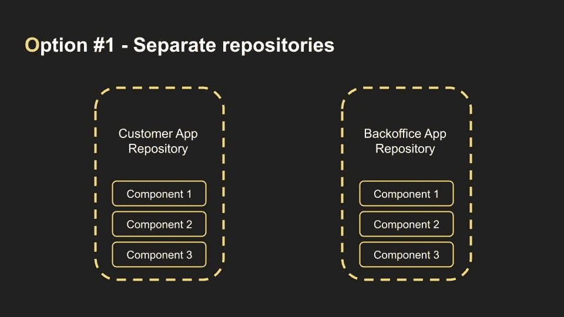

我们将创建两个独立的存储库。一个用于客户应用程序，另一个用于后勤应用程序。两个存储库都独立存储组件。

这显然是最糟糕的解决方案。为了保持组件处于相同的状态，我们必须对每个更改进行两次。

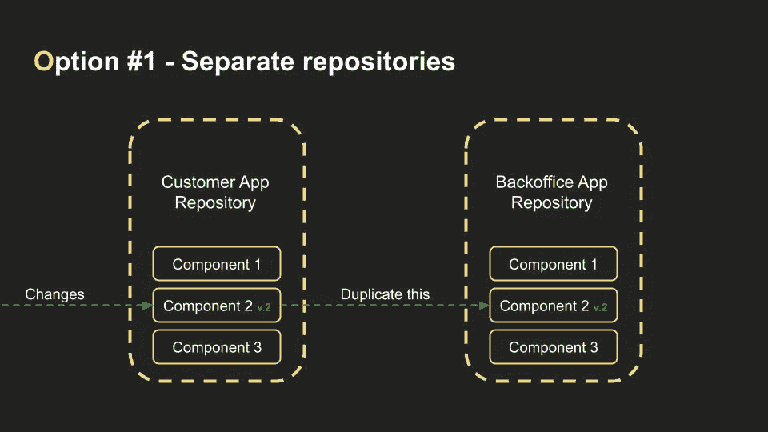

在一个团队中工作，每天做几十个变更，有人会忘记更新第二个项目中的组件。

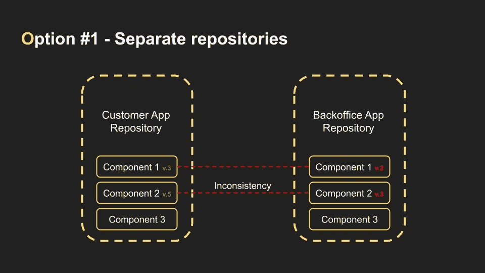

我参与过几个以这种方式建立的项目。这种技术会使开发变得非常复杂和缓慢。因此，我们必须改进工作流程，避免一切重复。

让我们将组件移动到一个单独的存储库中，并将它们用作依赖项。

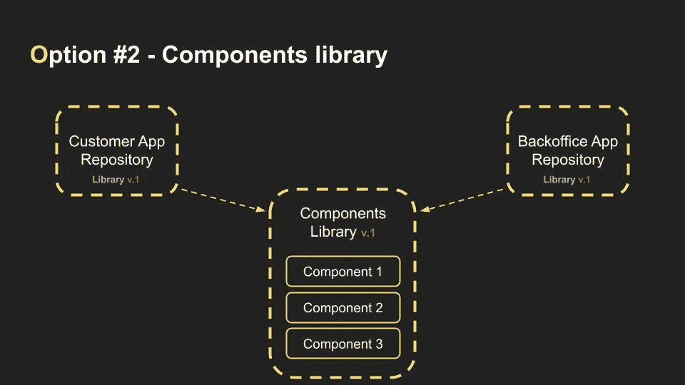

看起来好多了。只要我们修改了库中的一些东西，我们就可以更新应用程序的依赖关系，它们将使用最新版本的组件。

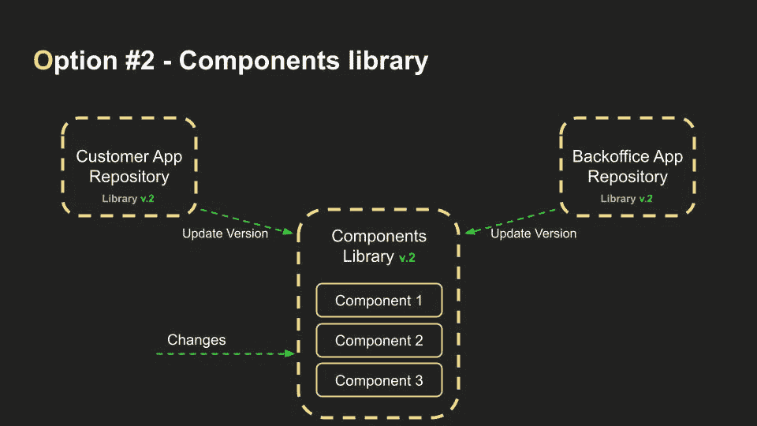

但是后台开发人员正忙于他们当前的任务。上次更改后，他们没有更新库。这没关系，因为他们不需要当前任务的最新变化。

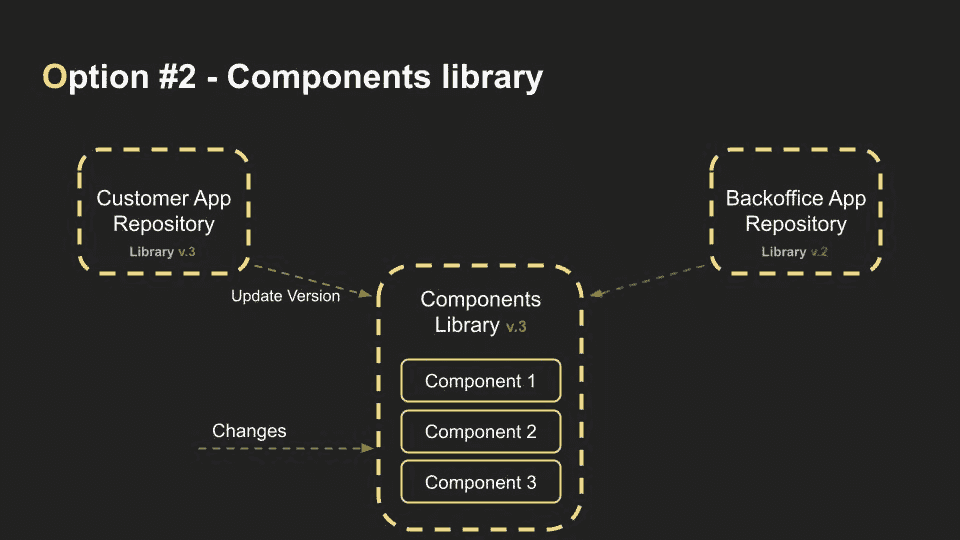

另一天，客户应用程序开发人员也没有更新库。毕竟没有人每天更新依赖关系。对吗？

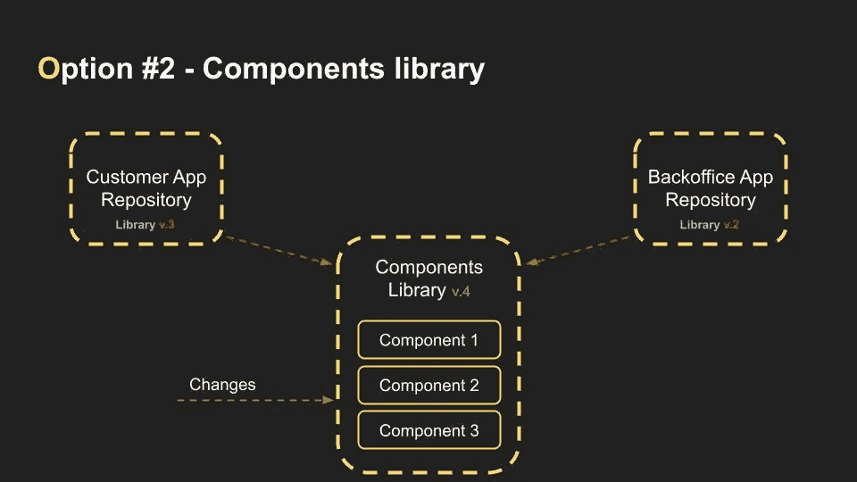

最终，事实证明当前版本的组件与应用程序不兼容。例如，按钮组件属性的名称已经更改。这似乎是一个小问题。另一方面，在整个项目中，可以在数百个位置找到按钮。

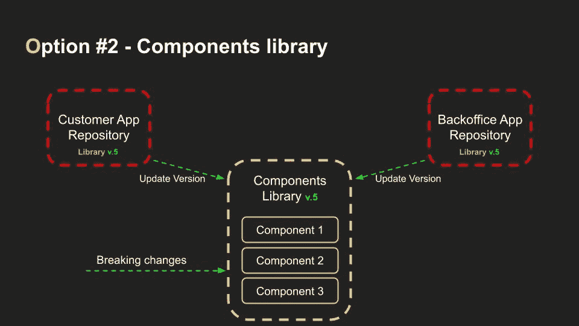

无论如何，你可能会说我们可以通过适当的团队沟通来解决这些问题。是啊。但是，我们将建立部件，将应用程序集成到联盟平台。我们将构建各种各样的登录页面。

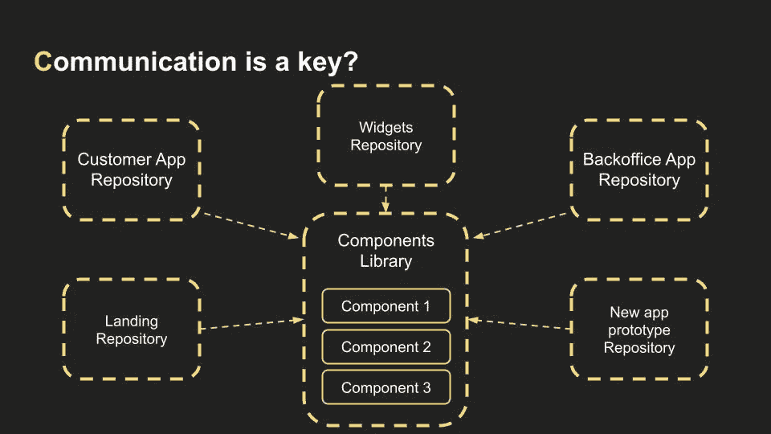

我们将开发新的应用原型。看看这个。在这样的结构中，很难避免沟通不畅。

但是现在我们了解了该项目的基本要求:

*   我想总是使用相同版本的组件。不管是什么情况。
*   我不希望重大的变化被激活。如果这些能被自动检测出来，那就太理想了。

> *💡*这就是开源工具链如 [**Bit**](https://bit.cloud/) 可以帮忙的地方。Bit 提供了 [**版本控制功能**](https://bit.dev/docs/getting-started/collaborate/snap-component-changes/) 跟踪和 [**管理更新**](https://bit.dev/docs/getting-started/collaborate/update-components/) 。它还为组件和文档提供了一个集中的存储库，使您更容易理解和维护整个前端的一致性，从而实现团队之间更好的协作。

## 点击此处了解更多信息:

 [## 构建可组合的 UI 组件库

### 如何构建组件库？React 组件库，包含可组合的组件。

bit.dev](https://bit.dev/blog/building-a-composable-ui-component-library--l33jy1vs/) 

所以还有第三种选择。这是一个单向回购。这次所有的组件和应用程序都在同一个代码库中。

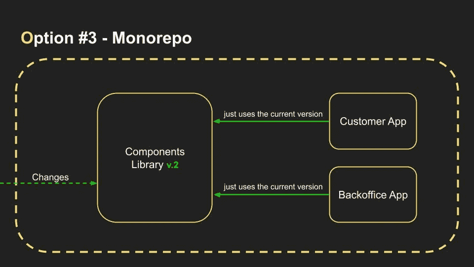

在这种结构中，所有应用程序将自动使用相同版本的库。

那么突破性的改变呢？

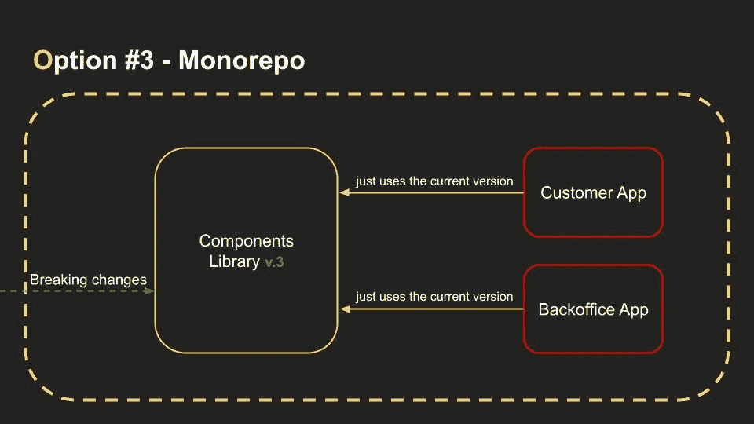

开发者仍然可以在修改的时候破坏应用程序。但是我们不再担心这个了。因为这种情况现在只是拉请求管道的一部分。

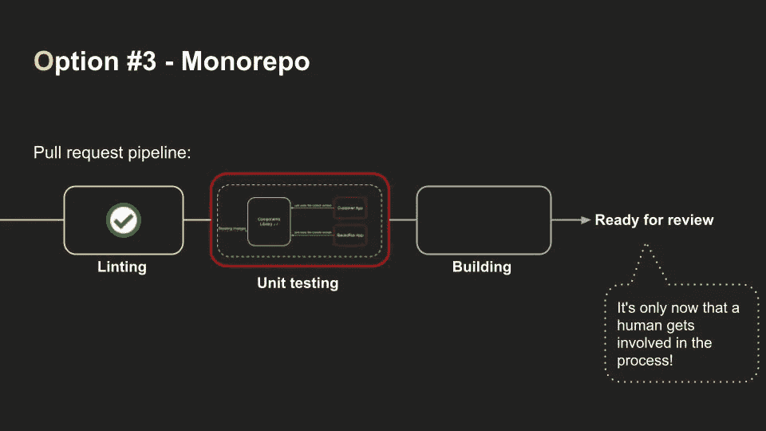

而人类只参与林挺、测试和构建步骤之后的过程！

组织单一回购有许多方式。你可以在[这个库](https://github.com/korfuri/awesome-monorepo)里查看几乎所有的。Korfuri 做得很好，将所有构建系统、存储库管理工具等等结合在一起。

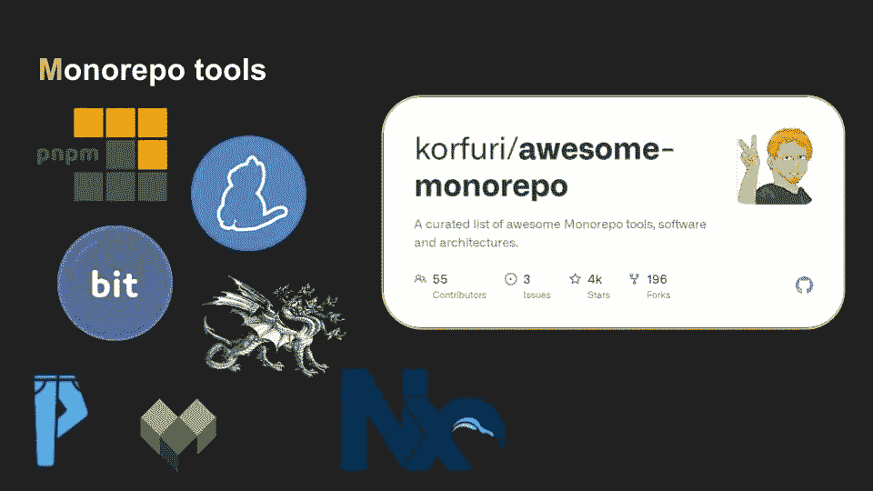

我更喜欢使用 NX 构建系统，它提供了一个强大的 CLI 来在一个命令中生成工作区。多亏了代码生成工具，很容易在一秒钟内创建组件。有许多有用的工具可以简化开发人员的日常工作。

 [## 每当叶夫根尼·基里丘克发表文章时，就收到一封电子邮件。

### 每当叶夫根尼·基里丘克发表文章时，就收到一封电子邮件。关于 web 开发、生产力和黑客的内容！立即加入！通过签名…

medium.com](https://medium.com/subscribe/@kirichuk) 

# Nx monorepo 的优势。

Nx 提供了项目图形可视化。因此，我们可以分析我们的应用程序和库的依赖关系。

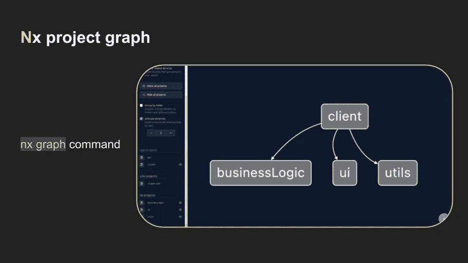

monorepo 的一个普遍缺点是构建时间长，CI/CD 流程长。这是有意义的，因为每次我们改变一些东西时，我们必须为每个应用程序和库重新构建和运行所有作业。

但是 Nx 一直在幕后分析工程图。使用这个项目图 Nx 创建一个任务图来优化所有的工作。

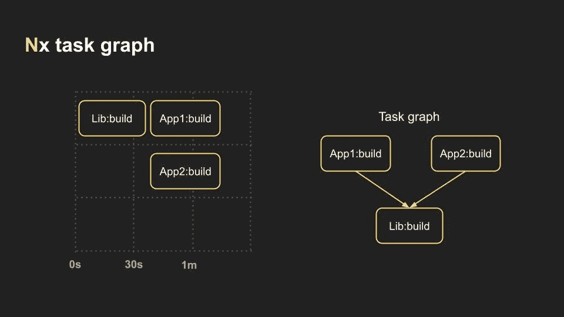

在构建 App1 或 App2 之前，我想先构建一个库。一旦库构建完成，我们就可以构建我们的应用程序了。Nx 按照正确的顺序运行任务，并行执行任务。

但是 Nx 提供了受影响的命令。

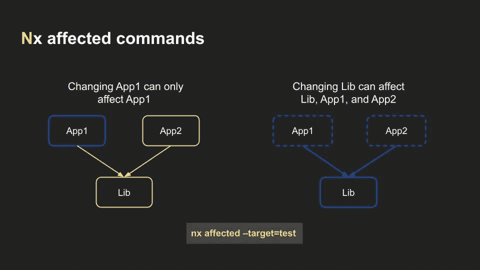

当您更改了 App1 中的某些内容时，无需重新测试或重建 App2 或库。

另一方面，库中的更改将影响 App1 和 App2，因此 Nx 将重新测试并重建它们。并且由于我们之前讨论的任务图，将以最有效的方式完成它。

# 结论

Monorepo 对我来说是一个优秀的解决方案，同时构建了许多前端应用程序。我在现实世界的项目中实现了这个策略，它使开发变得更加容易和快速。

您可以尝试我的指导来创建一个包含多个应用程序的工作区。

 [## 在 5 分钟内设置好多应用环境

### Nx monorepo:如何以及为什么？

blog.devgenius.io](https://blog.devgenius.io/nx-monorepo-why-and-how-71310504aa29) 

你对 mono 库有什么看法？你认为这种文章展示形式怎么样？很想听听大家在评论里的看法。

谢谢你的时间。下一集见。🙂

 [## 云计算快速入门

### 你想问的关于云的一切

medium.com](https://medium.com/@kirichuk/quick-introduction-to-cloud-computing-c59e4d5b1b05)  [## 求职面试中你必须问的关于公司的 12 个问题

### 这是面试中最重要的部分之一

medium.com](https://medium.com/@kirichuk/12-questions-you-must-ask-in-a-job-interview-about-the-company-75d445405d8e) 

*更多内容请看*[***plain English . io***](https://plainenglish.io/)*。报名参加我们的* [***免费周报***](http://newsletter.plainenglish.io/) *。关注我们关于*[***Twitter***](https://twitter.com/inPlainEngHQ)*和*[***LinkedIn***](https://www.linkedin.com/company/inplainenglish/)*。查看我们的* [***社区不和谐***](https://discord.gg/GtDtUAvyhW) *加入我们的* [***人才集体***](https://inplainenglish.pallet.com/talent/welcome) *。*