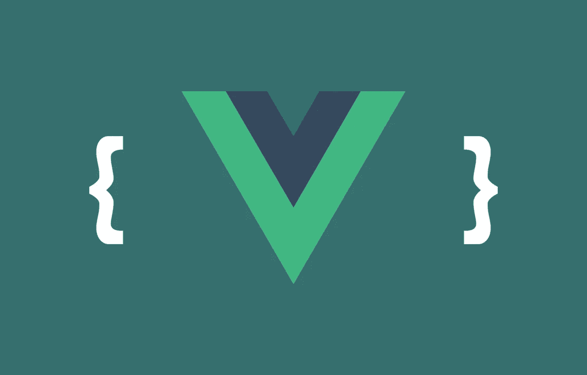

# 在 Vue.js 中使用 Vue 路由器时如何显示特定位置的组件

> 原文：<https://javascript.plainenglish.io/how-to-show-components-on-specific-places-while-using-vue-router-in-vuejs-159ca0cb9374?source=collection_archive---------11----------------------->

## 使用 Vue.js 中的 Vue 路由器时在特定位置显示组件的指南



How To Show Components on Specific Places While Using Vue Router in Vuejs

你好，我今天可能要回答 Vue.js 世界的新手在思想基础上面临的一个问题。正如您在标题中看到的，有时，我们可能希望在开发项目时使用混合结构。换句话说，我们可能不想用 Vue.js 创建整个前端，而只想在某些领域使用它。

除了这个愿望，我们可能希望使用 Vue 路由器来防止性能损失，并构建一个更有组织的 Vue.js 结构。然而，在使用 Vue 路由器时，模板会自动呈现到我们安装的 div 中。Vue Router 是个不错的行为，因为它专注于从头开始设计一个前端，但是如果我们仍然想要手动确定 HTML 中呈现的模板的位置，我们该怎么办呢？让我们来回答这个问题。

我跳过所有这些步骤，因为在这个例子中我不会告诉你如何设置 Vue 路由器。现在，我们已经在安装 Vue.js 的文件中完成了所有的定义，让我们假设我们有一个正常工作的应用程序。它需要一个中心组件来编译成 Vue 路由器组件。在这种情况下，我们调用并呈现具有如下最简单形式的定义的组件:

```
<template>
  <router-view></router-view>
</template>
```

有了这个定义，Vue 路由器自动将相关组件包含在我们已经挂载的 div 中，并呈现它。然而，我们的目标是包含 Vue 路由器，但是当我在组件 HTML 上调用它时会呈现。嗯，那很简单。首先，让我们清空 createApp 函数的内部。

```
const app = ***createApp***({});
```

我们已经清空了它，但不幸的是，我们不能像现在这样从 HTML 中调用它。在我的例子中，我的组件在 Vue.js 上呈现的文件是 App.vue。现在我们需要将这个文件作为一个组件包含在结构中。

```
app.component('app', App);
```

就是这样！现在，我们可以在 HTML 中以健康的方式将这种结构放置在任何我们想要的位置。

```
<section class="w-full">
    <app></app>
</section>
```

现在你知道了。感谢您的阅读。

*更多内容请看*[***plain English . io***](https://plainenglish.io/)*。报名参加我们的* [***免费周报***](http://newsletter.plainenglish.io/) *。关注我们关于*[***Twitter***](https://twitter.com/inPlainEngHQ)*和*[***LinkedIn***](https://www.linkedin.com/company/inplainenglish/)*。加入我们的* [***社区不和谐***](https://discord.gg/GtDtUAvyhW) *。*