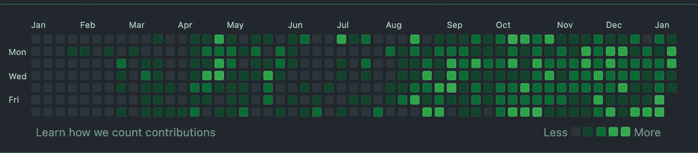
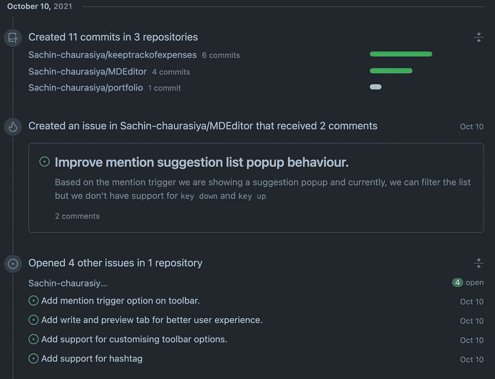
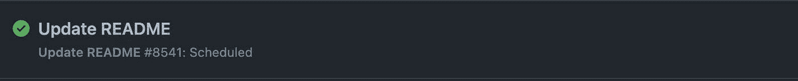
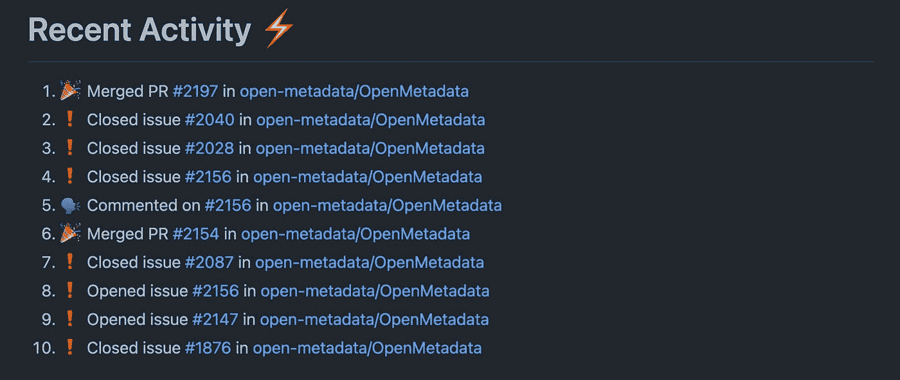

# 如何在您的个人资料自述文件中显示最近的 GitHub 活动

> 原文：<https://javascript.plainenglish.io/how-to-show-recent-github-activities-on-your-profile-readme-3c94cab294c4?source=collection_archive---------19----------------------->

## 使用 GitHub 操作创建一个工作流，在个人资料自述文件中显示您最近的活动。


我们都知道 GitHub 是一个很好的平台，可以和人们合作，为开源项目做出贡献。每天，我们都会在 GitHub 上执行一些活动，比如创建一个问题，创建一个请求，代码审查，以及所有其他的事情。

这些活动被添加到我们的贡献中，我们每天都会收到一个绿色方块，上面写着我们的贡献。

例如，像这样的贡献计数图，



当我们点击任何一个框时，我们会得到当天的活动，类似这样。



在这里你可以看到我迄今为止的活动，我创建了一些提交并打开了一些问题。

您有没有想过在个人资料自述文件中展示您的 GitHub 活动？

你会想，这有可能吗？是的，这是可能的，今天在本文中，我们将讨论如何在我们的个人资料自述文件中显示我们最近的 GitHub 活动。

让我们开始吧。

我们将使用 GitHub Actions 帮助我们创建一个工作流程，在个人资料自述文件中显示我们最近的活动。

在进入设置之前，让我们先讨论一下什么是 GitHub 操作以及它们的用途。

# 什么是 GitHub 行动？

GitHub 操作是一组事件和工作流，只要指定的事件发生在您的 GitHub 存储库中，它就会为它运行相关的工作流。

想了解更多关于 GitHub 操作的信息吗？您可以从[这里](https://docs.github.com/en/actions/learn-github-actions/understanding-github-actions)开始。

# GitHub —活动—自述文件

**GitHub-Activity-Readme**是一个 GitHub 操作，将使用最近的 git hub 活动更新您的个人资料自述文件。

它是由**詹姆斯·乔治**创建的，您可以在这里查看他的档案[。](https://github.com/jamesgeorge007)

要使用此操作，我们将需要设置一个工作流，该工作流将自动运行，以使用最近的活动更新配置文件自述文件。

# 设置工作流

我们可以很容易地在我们的配置文件库中设置此工作流，以捕获和更新具有最近活动的配置文件自述文件。

## 在您的配置文件库中创建`.github`文件夹(如果不存在)。

```
> mkdir .github
```

## 如果`.github`文件夹不存在，在里面创建`workflows`文件夹。

```
>mkdir .github/workflows
```

## 在`workflows`文件夹内创建`{workflowname}.yml`文件。

您可以在其中用工作流名称替换工作流名称。我将给出这个名字`update-readme.yml`。

```
> update-readme.yml
```

创建工作流文件后，将此内容添加到其中。

```
name: Update READMEon:
  schedule:
    - cron: "*/5 * * * *" # Runs every 5 minutes.jobs:
  build:
    runs-on: ubuntu-latest
    name: Update this repo's README with recent activity steps:
      - uses: actions/checkout@v2
      - uses: jamesgeorge007/github-activity-readme@master
        env:
          GITHUB_TOKEN: ${{ secrets.GITHUB_TOKEN }}
        with:
          COMMIT_MSG: "Updated README with recent activity"
          MAX_LINES: 10
```

这里，我们有三个主要的工作流组件:

1.  名字
2.  在
3.  工作

让我们逐一讨论:

*   **name** 是工作流运行后的工作流名称。如果您在存储库中看到“actions”选项卡，您将会看到这样的工作流运行。



*   上的**用于定义您想要运行该工作流的动作。**

在这里，我们使用 cron 作业每 5 分钟自动运行一次工作流`schedule`。

如果你不太了解 cron 语法，那么这可能对你有所帮助[快速简单的 cron 调度表达式编辑器](https://crontab.guru)

*   **jobs** 用于定义当我们的存储库发生事件时要做什么。

这里我们只定义了一个构建的作业，它将提交到我们的存储库中，并显示消息**Update this repo ' s README with recent activity**。

对于作业，我们需要定义它将在什么环境下运行，我们正在`ubuntu`运行这个作业。

此外，我们将需要定义使用什么步骤，就像这样

```
- uses: actions/checkout@v2
- uses: jamesgeorge007/github-activity-readme@master
```

`env`用于自动令牌认证。你不需要担心`secrets.GITHUB_TOKEN`会自动从你的 GitHub 账户中被引用。

```
env:
    GITHUB_TOKEN: ${{ secrets.GITHUB_TOKEN }}
```

如果你注意到我们在第二个动作`jamesgeorge007/github-activity-readme@master`中使用了`with`属性

这里我们提供了两个选项`COMMIT_MSG`和`MAX_LINES`。

*   COMMIT_MSG —提交到存储库时使用的提交消息。
*   MAX_LINES —自述文件中应包含的最大行数

现在，我希望我们清楚工作流程的所有组成部分。

## 最后一步是将这些内容添加到您的概要文件`README.md`中。

```
# Recent Activity :zap:
<!--START_SECTION:activity-->
<!--END_SECTION:activity-->
```

把它想象成一块会被你最近的活动取代的积木。

举个例子，

```
# Recent Activity :zap: 
<!--START_SECTION:activity-->
1\. 🎉 Merged PR [#2197](https://github.com/open-metadata/OpenMetadata/pull/2197) in [open-metadata/OpenMetadata](https://github.com/open-metadata/OpenMetadata) 
2\. ❗️ Closed issue [#2040](https://github.com/open-metadata/OpenMetadata/issues/2040) in [open-metadata/OpenMetadata](https://github.com/open-metadata/OpenMetadata) 
3\. ❗️ Closed issue [#2028](https://github.com/open-metadata/OpenMetadata/issues/2028) in [open-metadata/OpenMetadata](https://github.com/open-metadata/OpenMetadata) 
4\. ❗️ Closed issue [#2156](https://github.com/open-metadata/OpenMetadata/issues/2156) in [open-metadata/OpenMetadata](https://github.com/open-metadata/OpenMetadata) 
5\. 🗣 Commented on [#2156](https://github.com/open-metadata/OpenMetadata/issues/2156) in [open-metadata/OpenMetadata](https://github.com/open-metadata/OpenMetadata) 
6\. 🎉 Merged PR [#2154](https://github.com/open-metadata/OpenMetadata/pull/2154) in [open-metadata/OpenMetadata](https://github.com/open-metadata/OpenMetadata) 
7\. ❗️ Closed issue [#2087](https://github.com/open-metadata/OpenMetadata/issues/2087) in [open-metadata/OpenMetadata](https://github.com/open-metadata/OpenMetadata) 
8\. ❗️ Opened issue [#2156](https://github.com/open-metadata/OpenMetadata/issues/2156) in [open-metadata/OpenMetadata](https://github.com/open-metadata/OpenMetadata) 
9\. ❗️ Opened issue [#2147](https://github.com/open-metadata/OpenMetadata/issues/2147) in [open-metadata/OpenMetadata](https://github.com/open-metadata/OpenMetadata) 
10\. ❗️ Closed issue [#1876](https://github.com/open-metadata/OpenMetadata/issues/1876) in [open-metadata/OpenMetadata](https://github.com/open-metadata/OpenMetadata)
<!--END_SECTION:activity-->
```

最近活动的个人资料自述文件示例:



# 摘要

*   我们讨论了什么是 GitHub 动作以及为什么使用它们。
*   我们设置了工作流程，用最近的活动更新我们的个人资料自述文件。

# 链接

*   [GitHub — Activity — Readme](https://github.com/marketplace/actions/github-activity-readme)
*   [Sachin Chaurasiya GitHub 简介](https://github.com/Sachin-chaurasiya)

这个话题到此为止。感谢您的阅读。

# 与我联系

[LinkedIn](https://www.linkedin.com/in/sachin-chaurasiya)|[Twitter](https://twitter.com/sachindotcom)

*原发布于*[*https://blog . sachinchaurasiya . dev*](https://blog.sachinchaurasiya.dev/how-to-show-recent-github-activities-on-your-profile-readme)*。*

*更多内容看* [***说白了。报名参加我们的***](http://plainenglish.io/) **[***免费周报***](http://newsletter.plainenglish.io/) *。在我们的* [***社区不和谐***](https://discord.gg/GtDtUAvyhW) *获得独家获取写作机会和建议。***