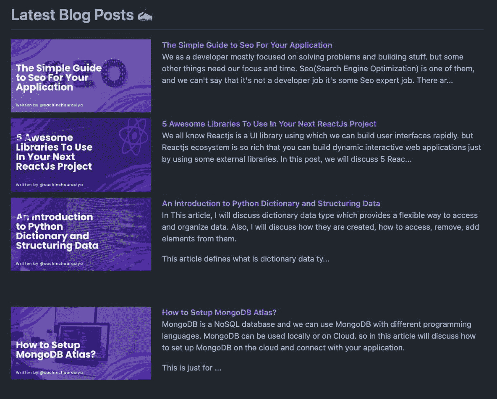

# 如何在 GitHub 个人资料上显示您的最新博客

> 原文：<https://javascript.plainenglish.io/how-to-show-your-latest-blogs-on-github-profile-9809c966a7bd?source=collection_archive---------25----------------------->


作为一名开发人员，我们喜欢建立我们的在线形象，为此，我们做了很多事情，比如分享技巧和诀窍，编写深入的指南来讨论任何技术，编写关于如何用 y 构建 x 的教程等等。我们使用不同的平台来共享内容，如 Hashnode、DEV Community、Medium 等。比如我在 Hashnode 上创建内容，在其他平台上交叉发布。

当我在其他平台上分享我的内容时，我有了一个想法:如果我可以在我的 GitHub 个人资料上显示我的最新内容会怎么样？如果人们访问我的 GitHub 个人资料，并从那里了解我的最新内容，那将是非常好的。所以我开始寻找如何在我的 GitHub 个人资料上展示我最新的博客。我发现了我们将在本文中讨论的两个解决方案(两个 GitHub 动作)。

在进入解决方案之前，让我们先讨论一下什么是 GitHub 动作，它们是用来做什么的。

# 什么是 GitHub 动作？

GitHub 动作是一组事件和工作流，每当你的 GitHub 库发生指定的事件时，它就会为它运行相关的工作流。

如果你想了解更多关于 Github 动作的知识，可以从[这里](https://docs.github.com/en/actions/learn-github-actions/understanding-github-actions)开始。

让我们来讨论两个 Github 工作流，我用它们在我的 GitHub 个人资料上展示我的最新博客。

# [博文工作流程](https://github.com/gautamkrishnar/blog-post-workflow)

使用这个工作流程，我们可以使用 RSS feed 自动显示 Github 个人资料自述文件中任何来源的博客文章。我们还可以使用这个工作流来显示 StackOverflow 活动或 YouTube 视频。

# 设置工作流

我们可以很容易地在我们的配置文件存储库中设置这个工作流，使用 RSS 提要自动获取和显示最新的博客。

## 在您的配置文件存储库中创建`.github`文件夹，如果它不存在的话。

```
> mkdir .github
```

## 在`.github`文件夹中创建`workflows`文件夹，如果它不存在的话。

```
>mkdir .github/workflows
```

## 在`workflows`文件夹中创建`{workflowname}.yml`文件。

您可以在其中用自己的工作流名称替换工作流名称。我给个`blog-post.yml`。

`> touch blog-post.yml`

创建工作流文件后，将此内容添加到其中。

```
name: Latest blog post workflow
on:
  schedule: # Run workflow automatically
    - cron: "0 * * * *" # Runs every hour, on the hour
jobs:
  update-readme-with-blog:
    name: Update README with latest blog posts
    runs-on: ubuntu-latest
    steps:
      - uses: actions/checkout@v2
      - uses: gautamkrishnar/blog-post-workflow@master
        with:
          max_post_count: 10
          feed_list: "https://blog.sachinchaurasiya.dev/rss.xml"
```

## 这里我们有工作流程的三个主要组成部分

1.  名字
2.  在
3.  工作

让我们逐一讨论它们

*   名称是工作流运行后工作流的名称。如果您在存储库中看到“操作”选项卡，您将看到工作流运行如下。


*   on 用于定义您希望运行此工作流的操作。

这里我们在`schedule`运行这个工作流，使用 cron 作业每小时自动运行这个工作流。

如果你不太了解 corn 语法，这可能对你有帮助[cron 调度表达式的快速简单编辑器](https://crontab.guru/)。

*   作业用于定义当我们的存储库中发生事件时要做什么。

这里我们只定义了一个作业，即 update-readme-with-blog，它将在我们的存储库中提交消息 Update README with the latest blog post。

对于作业，我们需要定义它将在什么环境下运行，我们正在`ubuntu`运行这个作业。此外，我们将需要提供像这样使用什么步骤。

```
- uses: actions/checkout@v2
      - uses: gautamkrishnar/blog-post-workflow@master
```

如果你注意到了，我们对第二个动作使用了`with`属性，也就是`gautamkrishnar/blog-post-workflow@master`，这里我们提供了两个选项`max_post_count`和`feed_list`。

> 请用您自己的 RSS 源 URL 替换上面的源列表 URL

现在，我希望我们清楚工作流程的所有组成部分。

## 最后但同样重要的是，将这些内容添加到您的个人资料`README.md`文件中。

```
# Latest Blogs
<!-- BLOG-POST-LIST:START -->
<!-- BLOG-POST-LIST:END -->
```

把它想象成一块将被你的博客列表取代的积木。

例如:

```
# Latest Blogs
<!-- BLOG-POST-LIST:START -->
- [The Simple Guide to Seo For Your Application](https://blog.sachinchaurasiya.dev/the-simple-guide-to-seo-for-your-application)
- [5 Awesome Libraries To Use In Your Next ReactJs Project](https://blog.sachinchaurasiya.dev/5-awesome-libraries-to-use-in-your-next-reactjs-project)
- [An Introduction to Python Dictionary and Structuring Data](https://blog.sachinchaurasiya.dev/an-introduction-to-python-dictionary-and-structuring-data)
- [How to Setup MongoDB Atlas?](https://blog.sachinchaurasiya.dev/how-to-setup-mongodb-atlas)
- [Some of the Best Open-Source Projects to make your life easier.](https://blog.sachinchaurasiya.dev/some-of-the-best-open-source-projects-to-make-your-life-easier)
- [What are Views in Django?](https://blog.sachinchaurasiya.dev/what-are-views-in-django)
- [Django project vs app](https://blog.sachinchaurasiya.dev/django-project-vs-app)
- [Mvt Pattern Of Django](https://blog.sachinchaurasiya.dev/mvt-pattern-of-django)
- [Simple Guide for Django Admin Interface](https://blog.sachinchaurasiya.dev/simple-guide-for-django-admin-interface)
- [Understanding Django Application LifeCycle.](https://blog.sachinchaurasiya.dev/understanding-django-application-lifecycle)
<!-- BLOG-POST-LIST:END -->
```

第二个工作流是特定于 Hashnode 平台的，所以我们也来讨论一下。

# [Hashnode 博客](https://github.com/varunsridharan/action-hashnode-blog)

使用这个工作流，我们可以获取我们的 Hashnode 发布博客，并将它们显示在我们的 GitHub 配置文件中。

# 设置工作流

我们可以很容易地在我们的配置文件存储库中设置这个工作流，使用 RSS 提要自动获取和显示最新的博客。

## 在您的概要文件存储库中创建`.github`文件夹，如果它不存在的话。

```
> mkdir .github
```

## 在`.github`文件夹中创建`workflows`文件夹(如果它不存在)。

```
>mkdir .github/workflows
```

## 在`workflows`文件夹中创建`{workflowname}.yml`文件。

您可以在其中用自己的工作流名称替换工作流名称。我给个`hashnode.yml`。

```
> hashnode.yml
```

创建工作流文件后，将此内容添加到其中。

```
name: "📚 latest Blog"on:
  workflow_dispatch:
  schedule:
    - cron: "0 */24 * * *" # Runs Every 24 Hoursjobs:
  update_blogs:
    name: "Update With Latest Blogs"
    runs-on: ubuntu-latest
    steps:
      - name: "📥  Fetching Repository Contents"
        uses: actions/checkout@main - name: "📚  Hashnode Updater"
        uses: "varunsridharan/action-hashnode-blog@1.1.1"
        with:
          USERNAME: "Sachinchaurasiya" # Hashnode Username
          COUNT: 4 # MAX Visisble
          STYLE: "blog-left"
          BLOG_URL: "https://blog.sachinchaurasiya.dev/"
        env:
          GITHUB_TOKEN: ${{ secrets.GITHUB_TOKEN }}
```

这里所有的组件都和我们之前讨论的一样，除了这里我们有一些额外的不同的属性，比如

*   `USERNAME` -您的哈希节点用户名
*   `COUNT` -您想要获取的发布计数
*   `STYLE` -您希望如何列出您的博客
*   `BLOG_URL` -你的 hashnode 发布网址。

我们这里有一个不同的东西是`env`，它用于自动令牌认证。您不需要担心`secrets.GITHUB_TOKEN`会自动从您的 GitHub 帐户中获得推荐。

```
env:
    GITHUB_TOKEN: ${{ secrets.GITHUB_TOKEN }}
```

## 在您的个人资料`README.md`文件中添加占位符内容。

```
# Latest Blog Posts 👇
<!-- HASHNODE_BLOG:START -->
<!-- HASHNODE_BLOG:END -->
```

把它想象成一个将被你的博客取代的街区。

例如:



# 摘要

*   我们讨论了什么是 GitHub 操作以及使用它们的工作流程。
*   我们还讨论了两个 GitHub 操作，使用它们可以在我们的 GitHub 个人资料上显示最新的博客。
*   我使用的第二个是 Hashnode Blog 动作，因为我第一次在 Hahsnode 上发布我所有的内容。
*   您将使用或已经使用的操作请在评论部分告诉我。

这个话题到此为止。谢谢你的阅读。

# 与我联系

[领英](https://www.linkedin.com/in/sachin-chaurasiya) | [推特](https://twitter.com/sachindotcom)

*最初发布于*[*https://blog . sachincharasiya . dev*](https://blog.sachinchaurasiya.dev/how-to-show-your-latest-blogs-on-github-profile)*。*

*多内容于* [***通俗易懂的英文中有***](http://plainenglish.io/) *。注册我们的* [***免费周报***](http://newsletter.plainenglish.io/) *。在我们的* [***社区纠纷***](https://discord.gg/GtDtUAvyhW) *中获得独家写作机会和建议。*