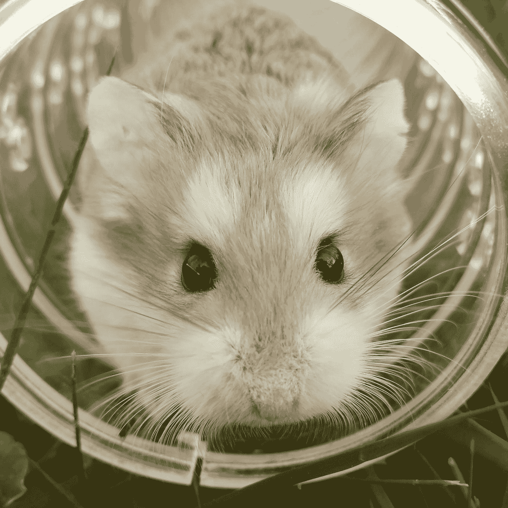

# 如何使用 JavaScript 模拟鼠标点击

> 原文：<https://javascript.plainenglish.io/how-to-simulate-a-mouse-click-using-javascript-baf1620514fd?source=collection_archive---------3----------------------->

## 我们可以通过使用`MouseEvent`构造函数触发鼠标点击事件。



Photo by [Silje Roseneng](https://unsplash.com/@siljeroseneng?utm_source=medium&utm_medium=referral) on [Unsplash](https://unsplash.com?utm_source=medium&utm_medium=referral)

有时，我们希望用 JavaScript 以编程方式触发鼠标点击。

在本文中，我们将看看如何用 JavaScript 模拟鼠标点击。

# 使用 MouseEvent 构造函数

我们可以通过使用`MouseEvent`构造函数来触发鼠标点击事件。

例如，我们可以写:

```
document.body.addEventListener('click', () => console.log('clicked'))const evt = new MouseEvent("click", {
  view: window,
  bubbles: true,
  cancelable: true,
  clientX: 20,
});
document.body.dispatchEvent(evt);
```

我们用`addEventListener`方法在`document.body`上添加一个点击事件。

然后我们创建一个`MouseEvent`实例，用`'click'`作为第一个参数来设置鼠标点击事件的类型。

第二个参数是为鼠标事件设置一些属性的对象。

`view`被设置为`window`，这样我们就可以在`window`中的一个元素上触发 click 事件。

`bubbles`设置为`true`使其从子代传播到父代。

`clientX`是鼠标点击的 x 坐标。

然后我们调用`document.body.dispatchEvent`来触发 body 元素上的 click 事件。

现在当`dispatch`运行时，我们应该看到控制台日志 log `'clicked'`。

# 结论

我们可以通过创建一个`MouseEvent`实例用 JavaScript 模拟鼠标点击。

然后，我们在想要触发点击的元素上调用`dispatchEvent`，以编程方式点击该元素。

*更多内容请看*[***plain English . io***](https://plainenglish.io/)*。报名参加我们的* [***免费周报***](http://newsletter.plainenglish.io/) *。关注我们关于*[***Twitter***](https://twitter.com/inPlainEngHQ)[***LinkedIn***](https://www.linkedin.com/company/inplainenglish/)*[***YouTube***](https://www.youtube.com/channel/UCtipWUghju290NWcn8jhyAw)*[***不和***](https://discord.gg/GtDtUAvyhW) *。对增长黑客感兴趣？检查* [***电路***](https://circuit.ooo/) *。***