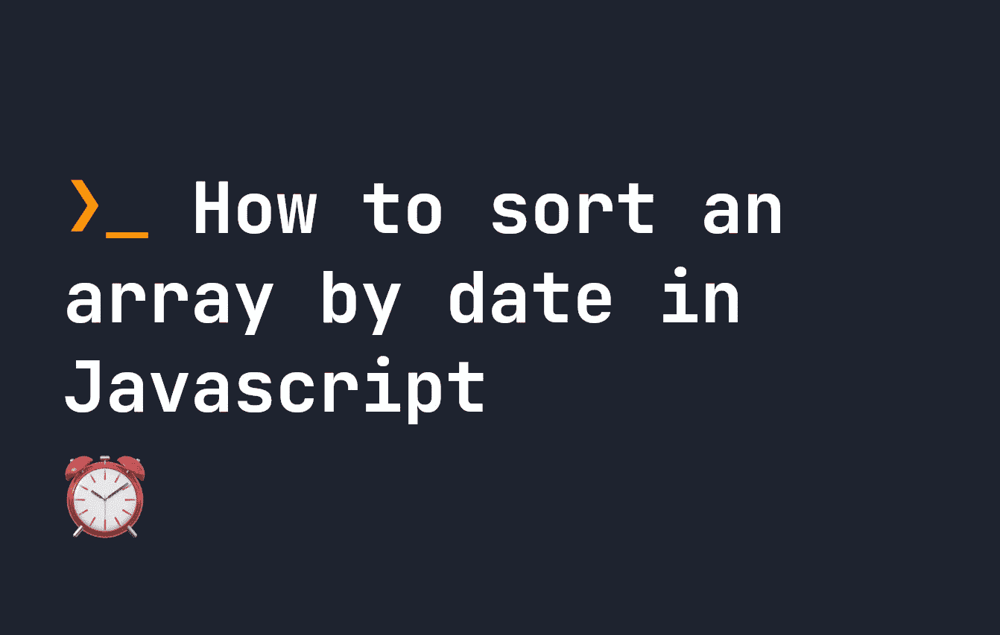

# 如何在 JavaScript 中按日期对数组排序

> 原文：<https://javascript.plainenglish.io/how-to-sort-an-array-by-date-in-javascript-3b92f2dc1119?source=collection_archive---------16----------------------->



在 JavaScript 中，我们都遇到过这样的情况，我们有一组数据，都有不同的日期，我们希望快速地按日期排序。让我们看看这是如何工作的。

**关于 JavaScript 日期的注意事项**:需要注意的是，JavaScript 中没有所谓的`date`。相反，Javascript 本身只有**日期时间**。这意味着每个日期都有相应的时间。[你可以在这里阅读更多关于 JavaScript 日期的内容。](https://fjolt.com/article/javascript-date-is-weird)

# 如何在 JavaScript 中按日期排序

按日期排序的第一步是确保你所有的日期都是`date`格式。假设我们有一个这样的物体:

```
let articles = [
    { name: "HTML Inputs", date: "03/03/2022" },
    { name: "Python Tips", date: "04/04/2022" },
    { name: "Javascript Objects", date: "05/05/2022" }
]
```

这对于排序日期来说实际上不起作用，因为我们的`date`属性是文本格式的。根据您的具体情况，您可能需要稍微不同的处理方式。对于这一个，我将简单地用正斜杠分割每个日期，并用有效的日期值替换该值。

```
let articles = [
    { name: "HTML Inputs", date: "12/03/2022" },
    { name: "Python Tips", date: "04/06/2022" },
    { name: "Javascript Objects", date: "05/05/2022" }
]for(let article of articles) {
    // Split the date by the slash, resulting in an array of [ '03', '03', '2022' ], for example
    let dateArr = article.date.split('/');
    // Year, month, and day from the array. We subtract 1 from month, since months start counting from 0 in Javascript dates.
    let year = parseFloat(dateArr[2]);
    let month = parseFloat(dateArr[1]) - 1;
    let day = parseFloat(dateArr[0])
    // Pass in the different components as year, month, day to get the valid date
    let articleDate = new Date(year, month, day);
    // Update the object
    article.date = articleDate;
} console.log(articles);
// This will output the object, now with valid dates!
```

**有时候**，你就不用这么做了。有时候，你会有有效的日期。你可以检查一下，因为在我们上面的`console.log`为`articles`转换日期后，它们显示的格式为`Thu Mar 03 2022 00:00:00 GMT+0000 (Greenwich Mean Time)}`。

不管怎样，现在你已经有了标准日期格式的日期，让我们对它们进行排序。我们将使用`sort`来做到这一点:

```
let articles = [
    { name: "HTML Inputs", date: "03/03/2022" },
    { name: "Python Tips", date: "04/04/2022" },
    { name: "Javascript Objects", date: "05/05/2022" }
]for(let article of articles) {
    // Split the date by the slash, resulting in an array of [ '03', '03', '2022' ], for example
    let dateArr = article.date.split('/');
    // Year, month, and day from the array. We subtract 1 from month, since months start counting from 0 in Javascript dates.
    let year = parseFloat(dateArr[2]);
    let month = parseFloat(dateArr[1]) - 1;
    let day = parseFloat(dateArr[0])
    // Pass in the different components as year, month, day to get the valid date
    let articleDate = new Date(year, month, day);
    // Update the object
    article.date = articleDate;
} console.log(articles);
// This will output
VM93:20 (3) [{…}, {…}, {…}]0: {name: 'HTML Inputs', date: Thu Mar 03 2022 00:00:00 GMT+0000 (Greenwich Mean Time)}1: {name: 'Python Tips', date: Mon Apr 04 2022 00:00:00 GMT+0100 (British Summer Time)}2: {name: 'Javascript Objects', date: Thu May 05 2022 00:00:00 GMT+0100 (British Summer Time)}length: 3[[Prototype]]: Array(0)
undefined
let articles = [
    { name: "HTML Inputs", date: "12/03/2022" },
    { name: "Python Tips", date: "04/06/2022" },
    { name: "Javascript Objects", date: "05/05/2022" }
]for(let article of articles) {
    // Split the date by the slash, resulting in an array of [ '03', '03', '2022' ], for example
    let dateArr = article.date.split('/');
    // Year, month, and day from the array. We subtract 1 from month, since months start counting from 0 in Javascript dates.
    let year = parseFloat(dateArr[2]);
    let month = parseFloat(dateArr[1]) - 1;
    let day = parseFloat(dateArr[0])
    // Pass in the different components as year, month, day to get the valid date
    let articleDate = new Date(year, month, day);
    // Update the object
    article.date = articleDate;
} articles.sort((a, b) => a.date - b.date);
console.log(articles);
```

现在，这里需要注意的一点是`sort`改变了原始数组。所以我们不需要创建一个新的变量来存储它。因此，`articles`将永久按日期排序，从最早日期到最晚日期。

如果你想反过来做，就写`articles.sort((a, b) => b.date - a.date)`。

# 为什么在 JavaScript 中可以像数字一样对日期进行排序？

这看起来令人困惑，为什么会这样。当然`date`是一个**日期**——那么为什么我们可以把它们相减呢？简单地说，正如我前面提到的，Javascript 没有`date`类型——只有`date-time`类型。

这意味着每个日期都是一个**日期**加上一个**时间**。JavaScript 用一个 unix 时间戳来表示这一点，这是一个数字，表示自 1970 年 1 月 1 日**以来经过的秒数(对于 JavaScript 来说是毫秒数)。因此，我们可以在 JavaScript 中将日期相减，因为它们实际上是用数字表示的。**

***更多内容看* [***说白了就是 io***](https://plainenglish.io/) *。报名参加我们的* [***免费周报***](http://newsletter.plainenglish.io/) *。关注我们上* [***推特***](https://twitter.com/inPlainEngHQ) ， [***领英***](https://www.linkedin.com/company/inplainenglish/) ***，*** *，* [***不和谐***](https://discord.gg/GtDtUAvyhW) ***。*****