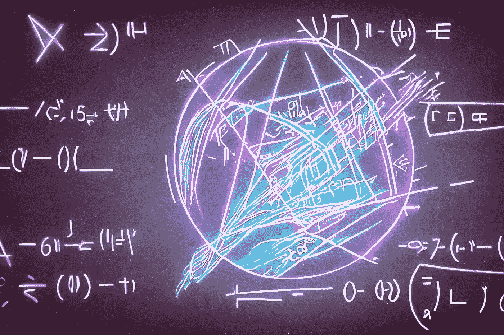

# 如何计算 JavaScript 和 TypeScript 中每个数字的平方

> 原文：<https://javascript.plainenglish.io/how-to-square-every-digit-in-javascript-and-typescript-179cf95bf58f?source=collection_archive---------11----------------------->

## 毁灭 2022



Image by [Samuele](https://medium.com/@el3um4s)

推特世界一片混乱。我决定放弃它。我肯定漏掉了什么。例如，我不知道是否有人在组织像去年那样的灾难。去年这是一次很好的经历，我想再重复一次。但是我没有去年那么多时间。所以我决定做一些虚假的事情:每天我会从 [CodeWars](https://www.codewars.com/) 提出的问题中随机选择一个问题，并尝试解决它。让我们看看进展如何。

# 问题是

今天的问题是[平方每位数](https://www.codewars.com/kata/546e2562b03326a88e000020)。这个问题非常简单:给定一个数字，返回这个数字的每个数字的平方。例如，如果数字是 9119，结果将是 811181。如果数字为 0，结果将为 0。

# 解决方案


Image by [Samuele](https://medium.com/@el3um4s)

我建议的解决方案(在 TypeScript 中)是这样的:

```
export class Kata {
  static squareDigits(num: number): number {
    const char: string = num.toString();
    const result: string = [...char].map((c) => parseInt(c) ** 2).join("");
    return parseInt(result);
  }
}
```

我也可以用 JavaScript 编写解决方案:

```
function squareDigits(num) {
  const char = num.toString();
  const result = [...char].map((c) => parseInt(c) ** 2).join("");
  return +result;
}
```

# 说明

为了简化各个步骤，我可以把问题分成几部分。

首先我把数字转换成一个字符串。

```
// ts
const char: string = num.toString();

// js
const char = num.toString();
```

我为什么要这么做？因为这可以让我提取数字的每一位。我可以使用 [toString()](https://developer.mozilla.org/en-US/docs/Web/JavaScript/Reference/Global_Objects/Object/toString) 方法，或者将空字符串与数字连接起来。这两种方法的工作方式相同。

```
// ts
const char: string = "" + num;

// js
const char = "" + num;
```

问题和测试是关于正数的，但是考虑负数也很有趣。我可以用各种方法解决这个问题。我可以使用 [Math.abs()](https://developer.mozilla.org/en-US/docs/Web/JavaScript/Reference/Global_Objects/Math/abs) 方法将数字转换为正数。

```
// ts
const char: string = Math.abs(num).toString();
const char: string = "" + Math.abs(num);

// js
const char = Math.abs(num).toString();
const char = "" + Math.abs(num);
```

找到字符串后，我可以将它转换成一个数组，这样我就可以使用 [Array.map()](https://developer.mozilla.org/en-US/docs/Web/JavaScript/Reference/Global_Objects/Array/map) 方法。

然后我使用[扩展操作符](https://developer.mozilla.org/en-US/docs/Web/JavaScript/Reference/Operators/Spread_syntax)将一个字符串转换成一个数组:

```
// ts
const array: Array<string> = [...char];

// js
const array = [...char];
```

要计算一个数的幂，我可以使用[取幂运算符(**)](https://developer.mozilla.org/en-US/docs/Web/JavaScript/Reference/Operators/Exponentiation)

```
// ts
const result: number = 2 ** 3;

// js
const result = 2 ** 3;
```

要将字符串转换成数字，我可以使用 [parseInt()](https://developer.mozilla.org/en-US/docs/Web/JavaScript/Reference/Global_Objects/parseInt) 方法。

```
// ts
const result: number = parseInt("123");

// js
const result = parseInt("123");
```

我使用了 [Array.join()](https://developer.mozilla.org/en-US/docs/Web/JavaScript/Reference/Global_Objects/Array/join) 方法来将数组转换成字符串。

我把这些放在一起

```
// ts
const result: string = [...char].map((c) => parseInt(c) ** 2).join("");

// js
const result = [...char].map((c) => parseInt(c) ** 2).join("");
```

我只需要返回一个数字形式的结果:

```
return parseInt(result);
```

# 其他解决方案


Image by [Samuele](https://medium.com/@el3um4s)

显然，这不是唯一可能的解决办法。例如，我可以使用 [Array.reduce()](https://developer.mozilla.org/en-US/docs/Web/JavaScript/Reference/Global_Objects/Array/Reduce) 方法来获得结果。

```
// ts
const result: number = +[...char].reduce((acc, cur) => acc + +cur * +cur, "");
return result;
```

也就是说:

```
// ts
export class Kata {
  static squareDigits(num: number): number {
    return +[...("" + Math.abs(num))].reduce(
      (acc, cur) => acc + +cur * +cur,
      ""
    );
  }
}

// js
function squareDigits(num) {
  return +[...("" + Math.abs(num))].reduce((acc, cur) => acc + +cur * +cur, "");
}
```

另一种方法是使用[正则表达式](https://developer.mozilla.org/en-US/docs/Web/JavaScript/Guide/Regular_Expressions)和 [String.replace()](https://developer.mozilla.org/en-US/docs/Web/JavaScript/Reference/Global_Objects/String/replace) 方法。

```
// ts
export class Kata {
  static squareDigits(num: number): number {
    return +("" + Math.abs(num)).replace(/\d/g, (x) => (+x * +x).toString());
  }
}

// js
function squareDigits(num) {
  return +("" + Math.abs(num)).replace(/\d/g, (x) => (+x * +x).toString());
}
```

感谢阅读！敬请关注更多内容。

***不要错过我的下一篇文章—报名参加我的*** [***中邮件列表***](https://medium.com/subscribe/@el3um4s)

[](https://el3um4s.medium.com/membership) [## 通过我的推荐链接加入 Medium—Samuele

### 阅读萨缪尔的每一个故事(以及媒体上成千上万的其他作家)。不是中等会员？在这里加入一块…

el3um4s.medium.com](https://el3um4s.medium.com/membership) 

*更多内容看* [***说白了。报名参加我们的***](https://plainenglish.io/) **[***免费每周简讯***](http://newsletter.plainenglish.io/) *。关注我们关于* [***推特***](https://twitter.com/inPlainEngHQ) ，[***LinkedIn***](https://www.linkedin.com/company/inplainenglish/)*，*[***YouTube***](https://www.youtube.com/channel/UCtipWUghju290NWcn8jhyAw)*，* [***不和***](https://discord.gg/GtDtUAvyhW) *。对增长黑客感兴趣？检查出* [***电路***](https://circuit.ooo/) *。***