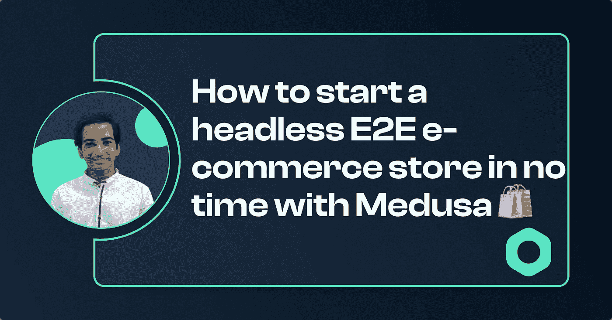

# 如何启动一个无头 E2E 电子商务商店在任何时间与美杜莎🛍️

> 原文：<https://javascript.plainenglish.io/how-to-start-a-headless-e2e-ecommerce-store-in-no-time-with-medusa-%EF%B8%8F-6dc282096e7?source=collection_archive---------20----------------------->



大家好吗？在本文中，我们将使用 Shopify 的开源替代方案: [**Medusa**](https://www.medusajs.com/) 创建一个无头电子商务应用程序。


# 我们在建造什么？

# 美杜莎是什么？

Medusa 是一个开源的无头商务平台，它可以非常容易地快速建立一个电子商务网站！这是一个神奇的工具，所以让我们看看为什么选择美杜莎:

*   使用方便
*   可攀登的
*   开源
*   易于定制
*   免费入门！
*   大型支持社区提供帮助
*   许多易于使用的集成

# 先决条件

我们需要在我们的机器上安装一些东西，让我们看看这些是什么。

## 节点. js

我们的后端服务器是用 Node.js 构建的，所以我们需要它来运行服务器。我们的前端也将使用 Next.js 构建，这需要 npm，因此我们也需要它！所以，去[的 Node.js 网站](https://nodejs.org/en/)安装推荐版本。

## 一种数据库系统

Medusa 使用 Postgres 来存储电子商务网站的数据。你可以去[网站](https://www.postgresql.org/download/)为你的系统安装 Postgres！

## 雷迪斯

Redis 是另一种常用于缓存的数据库。你可以从[这里](https://redis.io/)下载。

## 美杜莎 CLI

最后，我们将需要美杜莎 CLI。因为我们的机器上已经安装了 Node.js，所以我们可以使用以下命令从 npm 轻松安装它:

```
npm i -g @medusajs/medusa-cli
```

# 初学者快速入门指南

## 创建我们的后端服务器

我们将需要为您的电子商务商店后端，所以在这一部分，让我们看看如何建立它！

**使用 Medusa 创建一个启动服务器**

Medusa CLI 使创建新服务器变得非常容易。因此，运行以下命令:

```
medusa new my-medusa-server --seed
```

这将为我们创建一个基本的服务器，一个 Postgres 数据库，并且— seed 标志还将向数据库添加一些测试数据。

**启动服务器**

导航至应用程序:

```
cd my-medusa-server
```

使用 Medusa 启动服务器:

```
medusa develop
```

这将在 [http://localhost:9000](http://localhost:9000) 上启动一个服务器

我准备用 Next.js 做我们商店的前端，美杜莎也支持盖茨比和 Create React app。我将使用一个初学者模板。所以运行这个命令:

```
npx create-next-app -e https://github.com/medusajs/nextjs-starter-medusa my-medusa-storefront
```

这将为我们创建一个新的下一个 js 项目。如果你想用 TailwindCSS，可以试试我创建的这个[模板](https://github.com/avneesh0612/next-medusa-tailwind-template)。

将`.env.template`重命名为`.env.local`。您也可以使用一个命令来完成:

```
mv .env.template .env.local
```

运行应用程序。

如果你现在去 [localhost:8000](http://localhost:8000) ，你会看到我们商店的一个简单的前台。


这个也可以定制！所以，在你最喜欢的代码编辑器中打开它，我将使用 VS 代码。

如果你以前使用过 next.js，它看起来就像一个普通的 Next.js 应用程序！先从改 app 的 logo 开始吧。去`components/layout/nav-bar.jsx`把图片的 src 改成你的 logo。现在，我将使用 icons8 中的一个简单的房子图像。您可能需要根据图像的尺寸来更改宽度和高度:

现在，logo 改了！


**定制颜色**

去`globals.css`，在`:root`你会看到一堆颜色，用你的品牌颜色替换。这将改变网站的整体主题，如果你想改变更多的 CSS，那么你可以直接进入那个组件并自定义它😉。经过一些调整和改变，你将拥有一个完全定制的功能商店！

只做这么多，我们的应用程序就启动并运行了！

# 作为初学者为美杜莎做贡献

如果你对开源项目着迷，并为令人惊叹的项目做贡献，那么你应该尝试为 Medusa 做贡献。第一个问题是**如何**？如果你在一个包中发现一个问题，或者站点创建一个*拉请求*来修复它。如果您不知道如何创建拉动式请求，请查看这篇[文章](https://blog.avneesh.tech/how-to-contribute-to-an-open-source-project)，它非常简单！美杜莎在其[组织](https://github.com/medusajs/)下有很多仓库。最受欢迎的是[主存储库](https://github.com/medusajs/medusa)。您可以通过文档、问题以及更多方式为其做出贡献！

# 结论

我希望你可以使用美杜莎轻松建立你的电子商务网站。如果你有任何问题，请在评论中告诉我。👇😉

## 有用的链接

[GitHub 回购](https://github.com/avneesh0612/medusa-store)

[美杜莎](https://www.medusajs.com/)

[加入美杜莎不和服务器](https://discord.gg/NZZ4ymyESg)

[跟我联系](https://links.avneesh.tech/)

*更多内容看* [*说白了. io*](http://plainenglish.io/) *。报名参加我们的* [*免费每周简讯*](http://newsletter.plainenglish.io/) *。在我们的* [*社区*](https://discord.gg/GtDtUAvyhW) *获得独家写作机会和建议。*