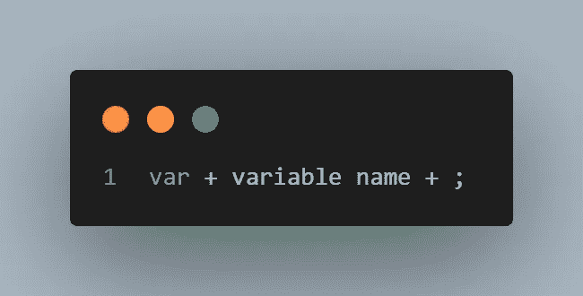
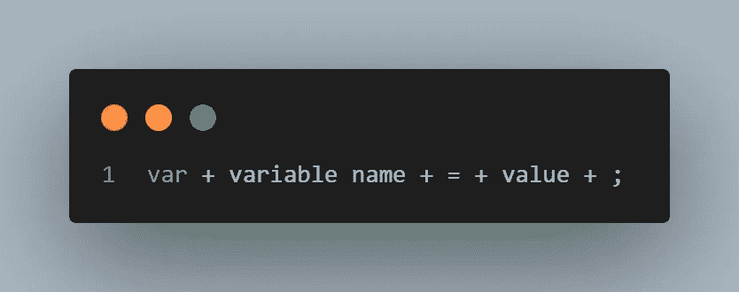
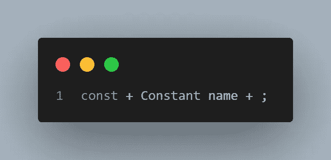
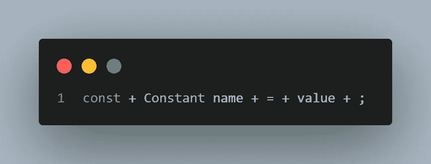
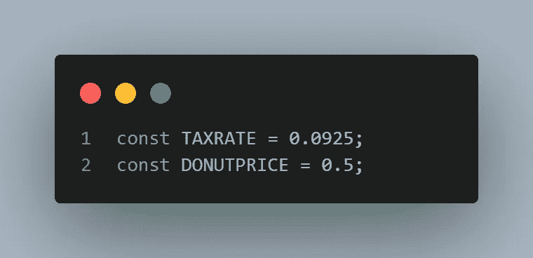
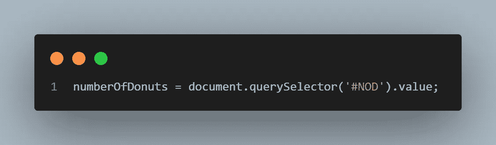
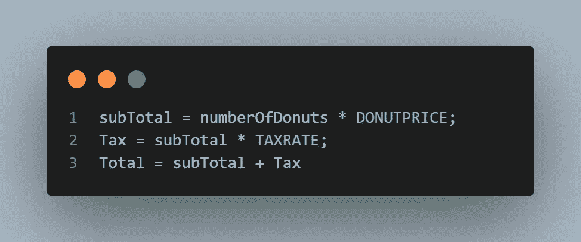
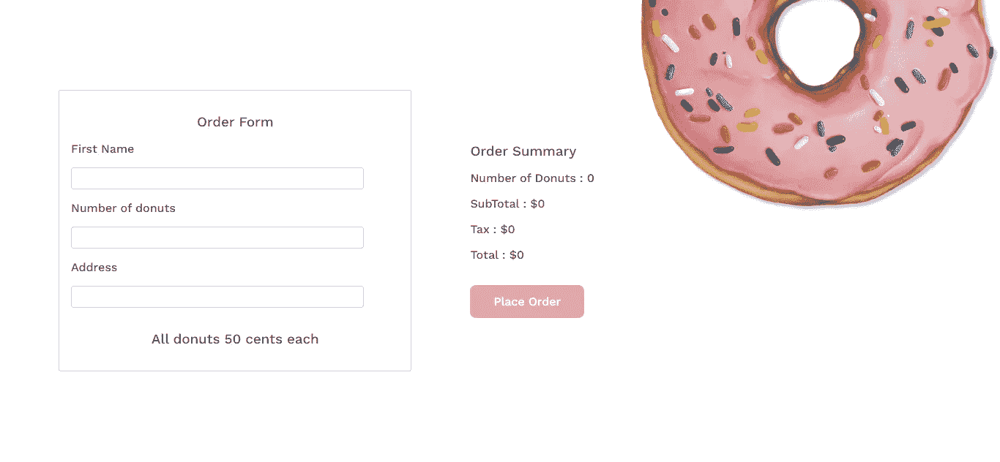
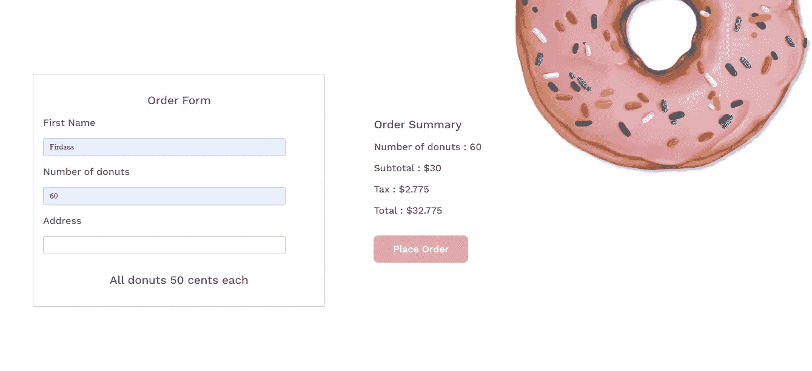

# 如何在 JavaScript 中存储数据(有实际例子)

> 原文：<https://javascript.plainenglish.io/how-to-store-data-in-javascript-with-a-practical-example-e4a832c7ed73?source=collection_archive---------5----------------------->

Image by [storyset](https://www.freepik.com/free-vector/data-report-illustration-concept_6195527.htm#query=data&position=15&from_view=search&track=sph) on Freepik

当我们谈论数据时，我们通常认为它是信息。这些信息可以是任何形式，从名字、数字、声音、气味等等。根据信息的重要性，我们通常希望通过写在日记、日志或某种形式的存储设备中来存储这些信息。在本文中，您将学习如何在 JavaScript 中存储数据，以及如何以自己的方式使用这些数据。我们还将看一个订购页面的实际例子。本文基于 Head first JavaScript 中的例子。

# 在 JavaScript 中存储数据

JavaScript 允许我们存储数据或信息。JavaScript 使用三种基本数据类型:文本、数字和布尔。

## 文本

文本数据，比如你最喜欢的视频游戏的名字，实际上只是一串字符。字符串是 JavaScript 中文本的另一个名称。JavaScript 需要用引号将这些字符串括起来，以便将它们标识为字符串(" ")。

## 数字

数字信息，如重量和数量，是用数字存储的。JavaScript 数字可以是小数，也可以是整数，比如两磅(7.5 公斤)或者 40 公斤。数字存储为整数或浮点数。区别在于浮点数有小数点，而整数没有

## 布尔代数学体系的

真或假是布尔数据仅有的两种可能状态。因此，任何有两种可选形式的东西，比如有开关的灯泡，都可以用布尔值来表示。

# 我们如何在 JavaScript 中存储数据

JavaScript 中的数据可以以两种形式存储；可以改变的数据和不变的数据。这就像在白板上使用永久记号笔和临时记号笔一样。永久标记铭文即使在你清洁白板后仍留在白板上，而时间标记铭文在擦拭后会从白板上清除。例如，550 万平方英里的陆地面积是一个恒定的数据，而 8 亿人口是一个变量，因为人口可以上升或下降。

您可以使用名为 var 的特殊 JavaScript 关键字和新变量的名称来创建变量。

var 关键字表示您正在创建一个新变量，变量名可以是您想要的任何名称，只要它在您的代码/脚本中是唯一的，分号结束代码行。

可以通过添加一个“=”并赋值来初始化变量

您还可以使用一个名为 const 的特殊 JavaScript 关键字来创建一个常量。

const 关键字表示您正在创建一个新的常量，变量名也可以是您想要的任何名称，只要它在您的代码/脚本中是唯一的，并且分号结束代码行。

也可以通过添加一个“=”并赋值来初始化 const

# 个案研究

您当地的甜甜圈店经理希望将业务提升到一个新的水平，并希望将业务放到网上。你的任务是创建一个在线订购系统。现在，系统应该从用户或客户那里获得信息，并显示一些关于订单的税收和总额的信息。

## 你可以这样做:

**需要存储哪些初始数据；**

每个甜甜圈的税率和价格

**你需要从买家那里得到什么数据来存储；**

油炸圈饼的数量

**计算；**

小计、税和订单总数。

很好，现在你知道该怎么做了。

## 这是 HTML 的代码

## 这是 CSS 的代码

## 下面是实现 HTML 和 CSS 后的样子

## 现在 JavaScript 的代码

最后，实现 JavaScript 为我们的订购页面增加了一些功能。

恭喜你，你做到了。您为当地的甜甜圈店构建了一个简单的订购系统。

更多实用话题来了。请确保关注更新。

## 更多内容请访问 [PlainEnglish.io](https://plainenglish.io/) 。

*报名参加我们的* [***免费每周简讯***](http://newsletter.plainenglish.io/) *。关注我们关于*[***Twitter***](https://twitter.com/inPlainEngHQ)[***LinkedIn***](https://www.linkedin.com/company/inplainenglish/)*[***YouTube***](https://www.youtube.com/channel/UCtipWUghju290NWcn8jhyAw)***，以及****[***不和***](https://discord.gg/GtDtUAvyhW) **

## **希望扩大你的科技创业公司的知名度和采用率吗？检查[电路](https://circuit.ooo/?utm=publication-post-cta)。**