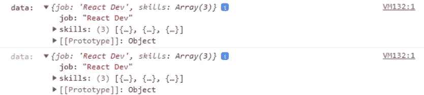
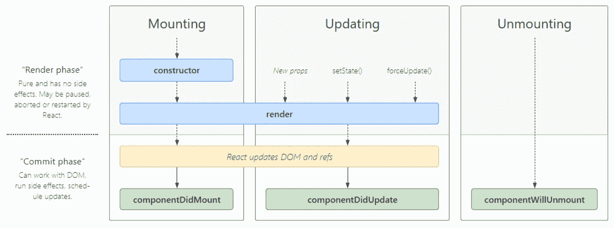

# 如何在本地存储中存储 JSON 数据— JS、React、Angular

> 原文：<https://javascript.plainenglish.io/how-to-store-json-data-in-local-storage-js-react-angular-cba97508fbc5?source=collection_archive---------1----------------------->

## [有角度的](https://medium.com/@lorenzozar/list/angular-5496c492a185)

## 了解如何在 JavaScript、React 或 Angular 中的 localStorage 中存储数据。

您可以通过使用 localStorage 或 sessionStorage 对象在浏览器中存储一些数据(大约 5MB，但[检查此处](https://arty.name/localstorage.html))。


Angular, React, and JSON logo

使用`localStorage`对象，存储在浏览器中的数据没有到期时间。

但是，你应该记住，当最后一个“隐私”标签关闭时，使用“匿名”会话浏览将会清除数据。

这篇文章不会涉及 localStorage 和 sessionStorage 之间的区别，但是知道它们是有好处的。

# 将数据存储在本地存储中— JavaScript


Store JSON Data In localStorage using plain JavaScript

以下是你需要知道的。

您可以使用以下语法在`localStorage`中保存数据

```
localStorage.setItem(variableKey, variableValue);
```

当`variableValue`是一个简单的字符串时，这很好，但是对于更复杂的结构，比如对象，这就不行了。当您有对象或 JSON 数据时，您将需要使用`JSON.stringify()`方法。

## 存储 JSON 数据

这里有一个例子，我们将一个对象存储到存储器中。

```
// Create an object
const userData = {
  job: "Programmer",
  skills: [
    { id: 4200, name: "Angular" },
    { id: 3000, name: "React" },
    { id: 8080, name: "Vue" },
  ],
};// Store the object into storage
localStorage.setItem("userData", JSON.stringify(userData));
```

## 读取 JSON 数据

你怎么知道它是否有效？通过读取你刚刚保存的数据。

```
// Retrieve the object from the storage
const data = localStorage.getItem("userData");
console.log("data: ", JSON.parse(data));
```

请注意，使用`JSON.parse()`方法并不总是必要的！如果你只是想检查存储器里面有什么，你可以简单地记录`data`。

## 删除 JSON 数据

最后，您可能想从`*localStorage*` *中删除数据。*

有两种方式:`removeItem()`和`clear()`。

通过使用`removeItem()`，您只删除与您传入的键相关联的值，例如下面示例中的`'userData'`。

```
localStorage.removeItem('userData');
```

通过使用`clear()`，您将删除`localStorage`区域中与您正在使用的应用程序相关的所有内容。

```
localStorage.clear();
```

更确切地说，它删除了与 URL 相关联的`localStorage`区域中的数据。进一步阅读，了解更多。

## 很高兴知道

如 [MDN](https://developer.mozilla.org/en-US/docs/Web/API/Window/localStorage) 所报告的，`*localStorage*` *数据特定于该文档的协议。*

这是什么意思？

这意味着对于每个 URL，浏览器*可能会创建一个新的“桶”*来存储数据。

假设您正在笔记本电脑上处理 HTML 和 JS。当您在浏览器中打开 HTML 文件时，URL 将类似于以下内容:

```
file:///C:/Users/John/webProjects/appName/localStorage.html
```

根据 [MDN](https://developer.mozilla.org/en-US/docs/Web/API/Window/localStorage#description) ，*在目前所有的浏览器中，* `*localStorage*` *似乎为每个* `*file:*` *URL 返回不同的对象。换句话说，每个* `*file:*` *URL 似乎都有自己独特的本地存储区。但是这种行为没有任何保证，所以你不应该依赖它。*

在我的例子中，尽管改变了部分 URL，`localStorage`似乎返回了相同的对象。

# 将数据存储在本地存储中—反应


Store JSON Data In localStorage using React

React 有什么不同？

不多！我们可以使用相同的 JavaScript 代码从`localStorage` *中存储和检索数据。*记住`useEffect`！

一步一步来。

一旦有了对象，就可以按如下方式存储和检索它:

```
function App() {
  localStorage.setItem("userData", JSON.stringify(userData)); const data = localStorage.getItem("userData");
  console.log("data: ", JSON.parse(data)); return (...)
}
```

但是，有一点要记住！如果我们查看控制台，我们会看到 React 记录了两次！至少是同一个对象！



React logs data twice

## 为什么 React 日志记录两次？

由于组件生命周期方法，React 将同一个对象记录两次。



[React Component Lifecycle Method](https://projects.wojtekmaj.pl/react-lifecycle-methods-diagram/)

因为安装和更新都会触发一次呈现，所以组件内部的代码会执行两次。

在我的例子中，console.log 在`App()`中，因此它在组件挂载和更新时被执行。

当您在 React 中处理副作用时，您可能希望使用`useEffect`。

代码变为:

```
function App() {
  localStorage.setItem("userData", JSON.stringify(userData)); useEffect(() => {
    const data = localStorage.getItem("userData");
    console.log("data: ", JSON.parse(data));
  }, []);return (...)
}
```

要知道需要导入`useEffect`。

此外，记住如果你用`React.StrictMode`包装你的`App`组件，React 将渲染两次。

正如[在 StackOverflow](https://stackoverflow.com/questions/61254372/my-react-component-is-rendering-twice-because-of-strict-mode/61897567#61897567) 上报道的那样，`*StrictMode*` *渲染组件两次(在开发阶段，而不是生产阶段)，以便检测代码中的任何问题，并向您发出警告(这可能非常有用)。*

如有必要，转到`index.js`并拆除`React.StrictMode`。

```
// index.js...root.render(
  <React.StrictMode> // remove this
    <App />
  </React.StrictMode> // and this!
);
```

# 在本地存储中存储数据—角度


Store JSON Data In localStorage using Angular

有角有什么不同？

不多！我们可以使用相同的 JavaScript 代码来存储和检索来自`localStorage`的数据。

在下面的例子中，我将代码添加到 AppComponent。

一切都发生在 ngOnInit 内部。

```
export class AppComponent implements OnInit {
  userData = { ... } ngOnInit() {
    localStorage.setItem('userData', JSON.stringify(this.userData))
    const data = localStorage.getItem('userData')
    console.log('data: ', JSON.parse(data))
  }
}
```

顺便说一下，使用服务的效果可能更合适。

# 摘要

*   存储数据:`localStorage.setItem(key, value)`
*   读取数据:`localStorage.getItem(key)`
*   要存储 JSON 数据，用`JSON.stringify(value)`转换值
*   转换 JSON 数据`JSON.parse(value)`
*   在 React 中，使用`useEffect`来处理副作用。您可能需要移除`React.StrictMode`
*   在 Angular 中，只需在 ngOnInit 内部或您喜欢的地方使用普通 JavaScript 即可！

*更多内容看* [***说白了就是 io***](https://plainenglish.io/) *。报名参加我们的* [***免费周报***](http://newsletter.plainenglish.io/) *。关注我们关于* [***推特***](https://twitter.com/inPlainEngHQ) ， [***领英***](https://www.linkedin.com/company/inplainenglish/) *，*[***YouTube***](https://www.youtube.com/channel/UCtipWUghju290NWcn8jhyAw)*[***不和***](https://discord.gg/GtDtUAvyhW) *。对增长黑客感兴趣？检查* [***电路***](https://circuit.ooo/) *。**