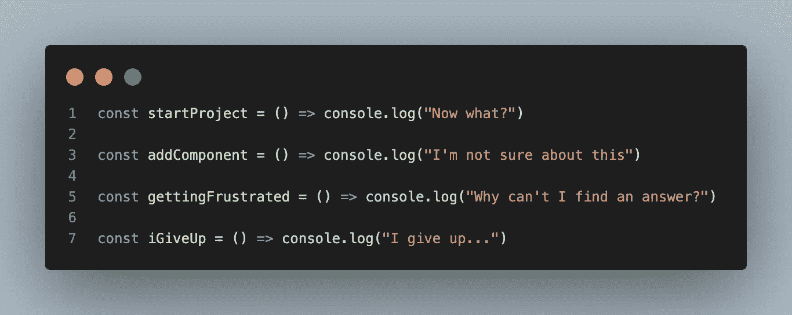
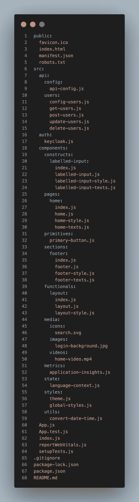
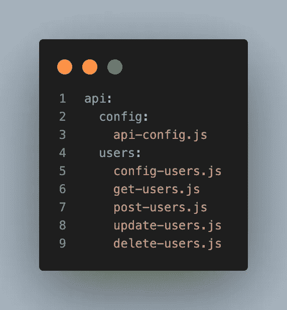
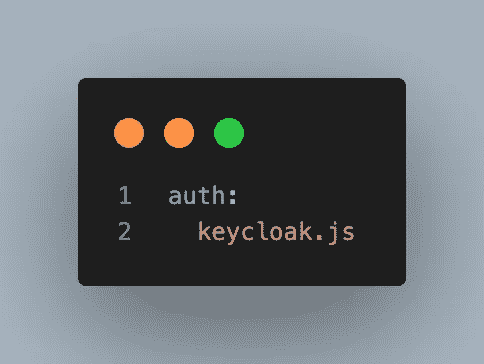
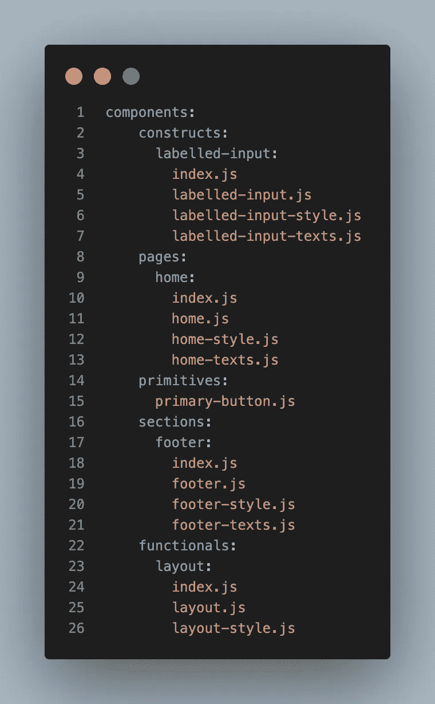
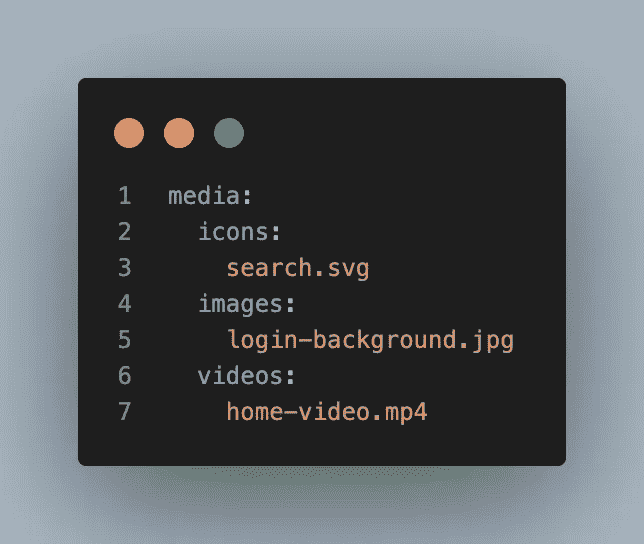
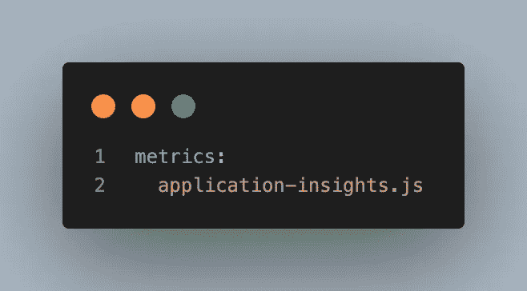
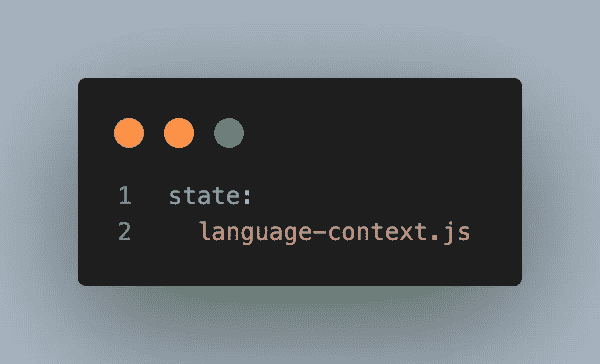
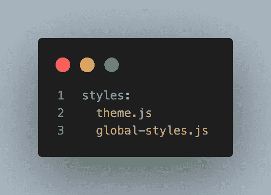
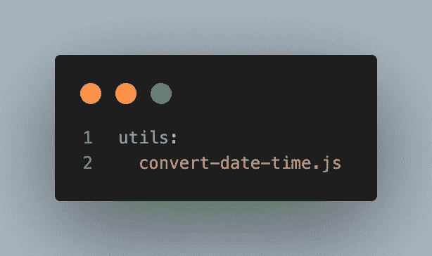

# 如何构建您的 React 项目

> 原文：<https://javascript.plainenglish.io/how-to-structure-your-react-project-d33ea45772c1?source=collection_archive---------6----------------------->

The header image

你好。

我已经在 React 中开发了几年了。这是一次有趣的旅程，我学到了很多。我开始时面临的最大挑战之一是如何组织我的项目。我不知道最有效的方法是什么。React 也没有提供关于这个主题的真正的指南或标准，所以我想帮助人们。

## 阅读前的一些“须知”

这个 React 项目当然是固执己见的。我不认为有一个“放之四海而皆准”的方法来做到这一点，所以就从这里拿你喜欢的，并开发你感到舒服的东西。

我的首选 *NPM* 依赖项是*风格组件*、 *Axios* 和 *React 路由器 Dom* 。这也体现在我的项目结构中。很有可能将这种结构与其他依赖项一起使用。

# 结构是关键

我喜欢结构。这真的有助于开发…无论何时。它使您的项目更具可追踪性、可理解性、可伸缩性和可维护性，我可以继续列出这些关键词。下面你可以看到我的结构的一个很好的概述。我们会仔细检查的。

Overview of my opinionated project structure

我知道，很大。为此道歉。我们就不赘述 *Create React App* 添加的标准文件了。下面我将单独讨论这些文件夹。

## src > api

我希望不要惊讶。我们使用这个文件夹来存放我们的 API。我们的*配置*文件夹存放了我们的 API 配置，这也不足为奇。在这里，我们定义我们的 API 实例，基本 URL，可能是我们向服务器认证的方式，诸如此类的东西。

现在我们有了*用户*文件夹。这是我们可以在 web 应用程序中使用的 API 资源的一个例子。我总是给每个资源一个自己的文件夹。现在，一个资源文件夹(在本例中是 *users* 文件夹)为每个 HTTP 动词都准备了一个文件。很自然，大多数资源都有共享的配置，这就是为什么每个资源都有自己的配置文件。在本例中是 *config-users.js* 。

现在只需对每个 API 资源重复这一步。

The API folder

## 作家（author 的简写）

auth 文件夹存放我们的授权特定的配置。我主要使用*键盘锁*进行本地授权。这意味着 *keycloak.js* 包含了 keycloak 对象，它包含了你想要的所有配置。

The auth folder

## 成分

啊，开始了。组件文件夹…我的老对手，我一生的朋友。我花了一段时间才把这个不可避免的巨大文件夹做好。组件文件夹的结构包含以下文件夹:

*   基元
*   构成
*   部分
*   页
*   泛函

## 组件>基本体

primitives 文件夹存放了我们最小的组件。所以你应该考虑原子大小的东西，而不是用另一个组件构建的。一些例子是*按钮、输入、标题等。*

## 组件>构造

我总是发现我在 *constructs* 文件夹里放了很多东西。这个文件夹应该包含使用*原语、*或其他*构造*创建的组件。不过要小心。一位智者曾经说过:“*太多的结构组成一个部分*”。一些构造的例子是*标记的输入、形式、表格等。*

## 组件>部分

如上所述，想想什么是构造，什么是节。过去我和他有一些交集，但你会习惯的。一个很好的例子是一个网站的标准主页。它通常由一个英雄部分、一个服务部分、一个关于部分和一个联系部分组成。这些都是截面的好例子。

*主导航*和*页脚*也是部分吗？这有待讨论。我想是的。它们占据了页面的大部分，通常是全幅的。

## 组件>页面

我想你可以对这个文件夹的内部进行有根据的猜测。这个文件夹存放了你的项目的*页面*。

## 组件>功能

这是最奇怪的一个。我发现这个文件夹对页面上没有显示的组件非常有帮助。*功能*是通常包装东西并提供元数据、配置或路由的组件。也许更多。

我认为*布局*组件是一个很好的例子。我们使用这个组件来构建我们的页面，因此我们有一个一致的布局。它没有显示任何内容，但是它在页面上。

The components folder

## 媒体

现在我们有了*媒体*文件夹。我就不多讲了，因为它是由什么组成的已经很清楚了。

这个文件夹里有我们的*图标*、*图片*和*视频*。我花了一段时间才觉得这个文件夹的命名适合我。*资产*是一个很好的竞争者，但是我觉得这个名字更好地传达了文件夹的目的。

The media folder

## 韵律学

当您想要基于用户数据改进您的应用程序时，您需要有某种类型的*度量*。此外，拥有*指标*可以让您定制记录哪些错误以及如何记录。

对于这个例子，我使用的是来自 *Azure* 的*应用洞察*。这是一个很好的 React 插件，所以很容易使用。

The metrics folder

## 状态

甚至在您开始开发 React 应用程序之前，您可能会听到这个关键字上百次。它用于软件开发，无处不在…

我使用这个文件夹来存放*上下文*对象。如果您开发一个多语言应用程序，您可能需要某种方式来保持所选的语言。您的应用程序状态是管理这一点的好地方。

The state folder

## 风格

我们快到了！React 促进组件化。尽管如此，我总是有一些样式需要应用于某一类型的元素。你可能会想到 *h1* 、 *p* 、*标签*。我喜欢把它们放在我的 *global-styles.js* 文件中。主题化也是一大时尚趋势。这是一个很好的特性，但是它也使可维护性变得更加容易。您不必在所有地方编辑所有组件的所有字体。就在 *themes.js* 文件里。好神奇:)

The styles folder

## 实用工具

我们拥有的最后一个文件夹叫做 *utils。* React 使用了大量普通的 JavaScript。我的意思是，没有 jQuery。这意味着我们必须自己编写许多实用函数。感谢上帝堆栈溢出。我将这些实用函数添加到 *utils* 文件夹中。它让生活变得更容易，句号。

The utils folder

# 一些遗言

所以现在你有了。这是我通常构建 React 应用程序的方式。我希望这能帮助一些正在寻找组织他们项目的方法的人。

我已经开发了一个命令行工具，使它更容易引导一个项目与上述结构。它叫做:Propulse。它还使得添加组件变得非常容易，而不必输入所有的麻烦和重复代码。我已经在本文的[中描述了这个包。](https://medium.com/@devriesrjj/speed-up-your-development-process-e60f616ffbc4)

这是我的第一篇媒体文章。让我知道你的想法。我也喜欢阅读时任何引起你注意的反馈。

和平、爱和准则！

## 有用的东西

 [## react——用于构建用户界面的 JavaScript 库

### React 使得创建交互式 ui 变得不那么痛苦。为应用程序中的每个状态设计简单的视图，并反应…

reactjs.org](https://reactjs.org/)  [## 样式组件

### 组件时代的视觉原语。使用 ES6 和 CSS 的精华来设计你的应用，没有压力💅🏾

styled-components.com](https://styled-components.com/)  [## 入门指南

### 用于浏览器和 node.js Axios 的基于 Promise 的 HTTP 客户端是用于和浏览器的基于 promise 的 HTTP 客户端。这是…

axios-http.com](https://axios-http.com/docs/intro)  [## React 应用洞察插件 JavaScript SDK - Azure Monitor

### React 插件用于应用洞察 JavaScript SDK，支持:跟踪路线变化 React 组件使用情况…

docs.microsoft.com](https://docs.microsoft.com/en-us/azure/azure-monitor/app/javascript-react-plugin)  [## GitHub-React-key cloak/React-key cloak:key cloak 的 React/React Native/NextJS/Razzle 组件

### React bindings for key cloak React key cloak for Web 需要:yarn add @react-keycloak/web 或 npm install - save…

github.com](https://github.com/react-keycloak/react-keycloak)  [## 加速您的开发过程

### 我是一个懒惰的人。最近有人说我非常懒惰，我同意这种说法。

medium.com](https://medium.com/@devriesrjj/speed-up-your-development-process-e60f616ffbc4) 

*更多内容请看*[***plain English . io***](https://plainenglish.io/)*。报名参加我们的* [***免费周报***](http://newsletter.plainenglish.io/) *。关注我们关于*[***Twitter***](https://twitter.com/inPlainEngHQ)*和*[***LinkedIn***](https://www.linkedin.com/company/inplainenglish/)*。加入我们的* [***社区不和谐***](https://discord.gg/GtDtUAvyhW) *。*