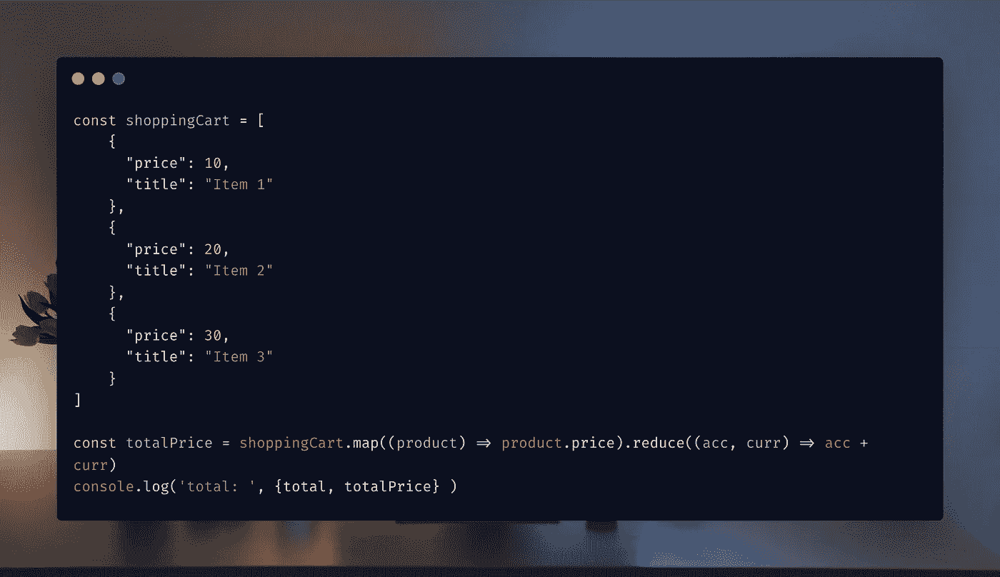

# 如何用 JavaScript Reduce 方法从对象属性数组中计算 Shoppingcart 总数

> 原文：<https://javascript.plainenglish.io/how-to-sum-total-shoppingcart-from-array-of-object-properties-with-javascript-reduce-method-12a4f75ea2c3?source=collection_archive---------4----------------------->



在 JavaScript `reduce`方法出现之前，计算购物车的总价是一件很麻烦的事情。在这篇文章中，我将向您展示使用`reduce`方法来计算购物车中产品数组的总价是多么简单。JavaScript `reduce`方法非常强大，可以根据一组对象属性计算总价。

*原载于*[*byray ray . dev*](https://byrayray.dev/posts/2022-12-19-sum-total-array-object-properties-javascript-reduce-method)*。*

# reduce 方法是如何工作的？

JavaScript 中的`reduce()`方法用于对数组中的每个元素执行一个函数，产生一个输出值。它对一个元素数组进行操作，对数组中的每个元素执行计算，并生成结果。

下面是使用`reduce()`方法的语法:

```
array.reduce((accumulator, currentValue, currentIndex, array) => {
  // code to be executed
}, initialValue);
```

`reduce()`方法接受一个回调函数作为它的第一个参数。这个回调函数为数组中的每个元素调用，并接受四个参数:

*   `accumulator`:这是最后一次迭代返回的值。如果提供了初始值，则从初始值开始；如果没有提供初始值，则从数组的第一个元素开始。并累加每次迭代。
*   `currentValue`:这是数组中正在处理的当前元素。
*   `currentIndex` ( *可选*):这是数组中正在处理的当前项的索引。
*   `array` ( *可选*):这是被调用的数组`reduce()`。

回调函数应该返回累加器的更新值。

下面是一个使用`reduce()`计算数组中所有数字的简单例子:

```
const numbers = [1, 2, 3, 4, 5];
const sum = numbers.reduce((accumulator, currentValue) => {
  return accumulator + currentValue;
}, 0);
console.log(sum); // 15
```

*检查* [*runkit 示例*](https://runkit.com/devbyrayray/calculate-total-based-on-numbers-array-with-javascript-reduce) *。*

在本例中，对`numbers`数组调用了`reduce()`方法，并向其传递了一个将累加器和当前值相加的回调函数。累加器的初始值为 0。

`reduce()`方法遍历数组中的数字，从第一个元素开始，并对每个元素应用回调函数。

回调函数的返回值成为累加器的新值，并传递给下一次迭代。这个过程一直持续到处理完数组中的所有元素，并返回累加器的最终值。

让我们看看如何将它应用到一个虚拟购物车的产品数组中。

# 从一组对象属性中获取总价

假设您的购物车中有一系列产品。

```
const products = [
    {
      "price": 10,
      "title": "Item 1"
    },
    {
      "price": 20,
      "title": "Item 2"
    },
    {
      "price": 30,
      "title": "Item 3"
    }
]
```

为了计算价格，我们首先需要一组价格。我们想计算我们购物车的总价。我们可以通过使用`.map()`方法来实现。在下面的例子中，我们创建了一个新的数组，其中只包含我们产品的价格。

```
const prices = shoppingCart.map((product) => product.price)
```

之后，我们可以使用该数组通过`reduce`方法计算总价。

```
const prices = shoppingCart.map((product) => product.price)
const total = prices.reduce((acc, curr) => acc + curr)
console.log('total: ', total )
```

*检查* [*runkit 示例*](https://runkit.com/devbyrayray/calculate-total-price-from-javascript-array-of-product-objects) *。*

我们也可以把它写得更短，并将`map()`和`reduce()`方法链接起来。

```
const totalPrice = shoppingCart.reduce((acc, curr) => acc + curr.price, 0)
console.log('total: ', totalPrice )
```

那很容易。👍

[**通过电子邮件获取我的文章点击这里**](https://byrayray.medium.com/subscribe) **|** [**购买 5 美元中等会员资格**](https://byrayray.medium.com/membership)

# 谢谢！


看完这个故事后，我希望你学到了新的东西或者受到了启发去创造新的东西！🤗如果我给你留下了问题或一些要说的话作为回应，向下滚动并给我键入一条消息在 Twitter @DevByRayRay 上给我发送一条 [*DM*](https://twitter.com/@devbyrayray)

想在你的邮箱里收到新邮件吗？不只是一个链接，只是整篇文章没有任何广告🤗*或其他东西。* [***然后订阅我的简讯***](https://byrayraydev.substack.com/) *👍。我保证我不会给你发垃圾邮件，只有最重要和最优质的内容会发送给你✌️.*

*更多内容请看*[***plain English . io***](https://plainenglish.io/)*。报名参加我们的* [***免费周报***](http://newsletter.plainenglish.io/) *。关注我们关于*[***Twitter***](https://twitter.com/inPlainEngHQ)[***LinkedIn***](https://www.linkedin.com/company/inplainenglish/)*[***YouTube***](https://www.youtube.com/channel/UCtipWUghju290NWcn8jhyAw)*[***不和***](https://discord.gg/GtDtUAvyhW) ***。*****

*****对缩放您的软件启动感兴趣*** *？检查* [***电路***](https://circuit.ooo?utm=publication-post-cta) *。***