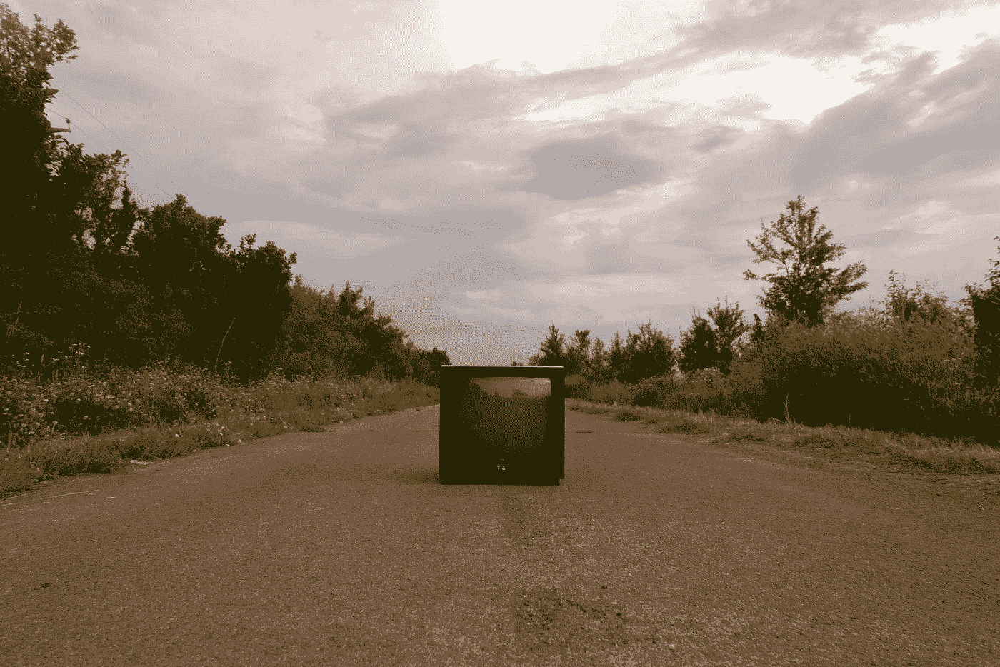

# 如何用 JavaScript 截图一个 div？

> 原文：<https://javascript.plainenglish.io/how-to-take-a-screenshot-of-a-div-with-javascript-641576de0f74?source=collection_archive---------1----------------------->



Photo by [Gaspar Uhas](https://unsplash.com/@gasparuhas?utm_source=medium&utm_medium=referral) on [Unsplash](https://unsplash.com?utm_source=medium&utm_medium=referral)

有时候，我们可能想用 JavaScript 截取一个 div 的截图。

在本文中，我们将看看如何用 JavaScript 截取一个 div 的屏幕截图。

# 使用 html2canvas 库

我们可以使用`html2canvas`库将 div 捕获为图像，并将其放入画布元素中。

要使用它，我们可以通过编写以下代码来添加带有脚本标记的库:

```
<script src='https://html2canvas.hertzen.com/dist/html2canvas.min.js'></script>
```

我们也可以通过运行以下命令将它与 NPM 一起安装:

```
npm install --save html2canvas
```

或者我们可以用纱线安装它，方法是:

```
yarn add html2canvas
```

接下来，我们可以通过编写以下代码将我们想要捕获的 div 添加到图像中:

```
<div id="capture" style="padding: 10px; background: #f5da55">
  <h4 style="color: #000; ">Hello world!</h4>
</div>
```

然后为了选择和捕获元素，我们可以写:

```
const getScreenshotOfElement = async (element) => {
  const canvas = await html2canvas(element)
  document.body.appendChild(canvas)
}const div = document.querySelector('div')
getScreenshotOfElement(div)
```

我们有一个`getScreenOfElement`函数，它将我们想要捕捉的`element`放入一个图像并放到画布中。

在函数中，我们只是用`element`调用`html2canvas`函数。

该函数返回一个承诺，该承诺解析为一个画布元素，并将`element`转换为画布中的一个图像。

然后我们用`canvas`调用`document.body.appendChild`来把它附加到主体上。

接下来，我们用`querySelector`选择 div。

然后我们调用刚刚创建的`getScreenOfElement`函数。

现在，我们应该看到画布，在实际的 div 下面显示了 div 的图像。

# 结论

我们可以使用`html2canvas`库将一个元素捕获到 canvas 元素内的图像中。

这让我们可以轻松地截取一个元素的屏幕截图。

*更多内容请看*[***plain English . io***](https://plainenglish.io/)*。报名参加我们的* [***免费周报***](http://newsletter.plainenglish.io/) *。关注我们关于*[***Twitter***](https://twitter.com/inPlainEngHQ)*和*[***LinkedIn***](https://www.linkedin.com/company/inplainenglish/)*。查看我们的* [***社区不和谐***](https://discord.gg/GtDtUAvyhW) *加入我们的* [***人才集体***](https://inplainenglish.pallet.com/talent/welcome) *。*