# 如何测试 Node.js 命令行工具

> 原文：<https://javascript.plainenglish.io/how-to-test-a-node-js-command-line-tool-2735ea7dc041?source=collection_archive---------5----------------------->


Photo by [Ferenc Almasi](https://unsplash.com/@flowforfrank?utm_source=medium&utm_medium=referral) on [Unsplash](https://unsplash.com?utm_source=medium&utm_medium=referral)

您可以使用 Jest 来测试命令行工具。

本文主要关注前端测试的一些高级技术，以及大量演示代码，展示如何对更复杂的命令行工具进行集成测试。

# 为什么需要测试用例

# 优势

## 1.代码质量保证和增加信任

纵观 Github 整体，一个成熟的工具库必须具备:

开发良好的测试案例(Jest/Mocha)

友好的文档(官方网站/演示)

类型声明文件 d.ts

持续集成环境(git action/circleci)

如果没有这些要素，用户在使用产品时可能会遇到各种各样的 bug，显然他们肯定不希望看到这种情况发生，最终导致用户很难接受你的产品。

测试用例最重要的一点是提高代码质量，让别人有信心使用你开发的工具(信心产生的信任关系对软件工程师来说至关重要)。

另外，测试用例可以直接看作是现成的调试环境，在编写测试用例时会逐渐弥补需求分析中没有想到的情况。

## 2.担保重组

当代码需要针对主要版本进行更新时，拥有开发良好的测试用例可以在重构中发挥关键作用。

选择黑盒测试的测试用例设计方法，只关心输入输出，不需要关心测试用例内部做什么。

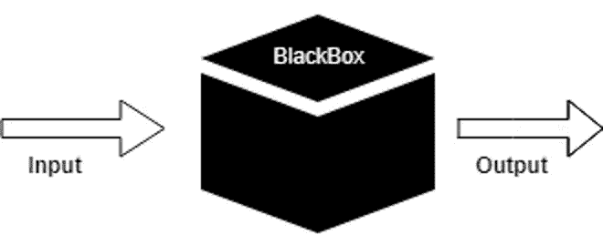

对于重构，**如果最终暴露给用户的 api 没有改变，**那么几乎不需要做任何改变，直接重用之前的测试用例。

所以，如果代码有好的测试用例，可以大大增强重构的信心，而不用担心原来的功能会因为代码的改变而失效。

## 3.提高代码可读性

对于想要理解项目源代码的开发人员来说，阅读测试用例是一种有效的方式。

测试用例为工具在各种情况下的功能和行为提供了非常直观的表示。

换句话说，**测试用例是软件开发者阅读的“文档”。**

```
// Vue.js test cases
// [https://github.com/vuejs/core/blob/main/packages/reactivity/__tests__/computed.spec.ts#L24](https://github.com/vuejs/core/blob/main/packages/reactivity/__tests__/computed.spec.ts#L24)
it('should compute lazily', () => {
  const value = reactive<{ foo?: number }>({})
  const getter = jest.fn(() => value.foo)
  const cValue = computed(getter) // lazy
  expect(getter).not.toHaveBeenCalled()expect(cValue.value).toBe(undefined)
  expect(getter).toHaveBeenCalledTimes(1) // should not compute again
  cValue.value
  expect(getter).toHaveBeenCalledTimes(1) // should not compute until needed
  value.foo = 1
  expect(getter).toHaveBeenCalledTimes(1) // now it should compute
  expect(cValue.value).toBe(1)
  expect(getter).toHaveBeenCalledTimes(2) // should not compute again
  cValue.value
  expect(getter).toHaveBeenCalledTimes(2)
})
```

# 不足之处

任何事情都有两面性，所以在谈完优点之后，我们来谈谈缺点，以帮助你更好地确定是否应该为你的项目编写测试用例。

## 一会儿工夫

开发人员一般不写测试用例的时候，最常见的一点就是太繁琐。

***我写测试用例的时候，代码早就写好了，你说测试？交给 QA，那是他们的责任。***

这种情况是完全可以理解的，通常情况下，开发时间来不及，怎么能抽出时间来写测试用例呢？

所以你需要根据项目的类型来判断编写测试用例的价值。

对于 UI 修改频繁、生命周期短的项目，比如官网、活动页面，**我不建议写测试用例。**

因为它们一般都是时间敏感的，页面结构的频繁变化会直接导致测试用例的频繁变化，另外这类项目一般都配备了 QA 资源，一定程度上保证了项目的质量(自测还是很有必要的)。

相反，对于工具库和组件库，由于功能变化少，一般没有 QA 资源，如果已经有一定的用户规模，建议**补充测试用例**。

## 不会写

写测试用例需要学习测试框架的语法，所以需要一定的学习成本(没时间学习也是不会写的原因)

好的方面是市面上主流的测试框架大同小异，整体思路趋于一致，而突破性的改变本身并不多。普通开发商一周就能上手，要提前两周。学会后能够在任何前端项目中使用(学一次，到处写)。

对比 Vue.js 和 React 的学习成本，再结合前面的优势，是不是很划算？

优缺点之后，再来分享一些为复杂命令行工具编写测试用例的经验。

# 命令行工具的集成测试

集成测试和单元测试的区别在于，前者更宽泛，后者更细粒度，集成测试也可以由多个单元测试组合而成。

既然是命令行工具，首先要考虑的是如何模拟用户使用命令行的行为。

## 直接运行命令行

起初，我对测试用例的理解是尽可能模拟原始的用户输入。所以我的想法是直接在测试用例中运行命令行工具。

在子进程中运行命令行工具，然后将子进程的输出打印到父进程，最后确定打印结果是否如预期。

**优点:**更符合用户使用命令行的方式。

**缺点:**当你需要调试测试用例时，由于对子进程的依赖，调试器启动时性能非常差，测试用例经常超时甚至吞错或者输出一些与测试用例本身无关的系统错误。

## 功能运行

上一个方案滞后太厉害，被迫想其他方案。

由于我使用 [*commander*](https://www.npmjs.com/package/commander) 来实现 Node.js 的命令行工具，测试用例本质上只需要获得命令背后的动作来执行。

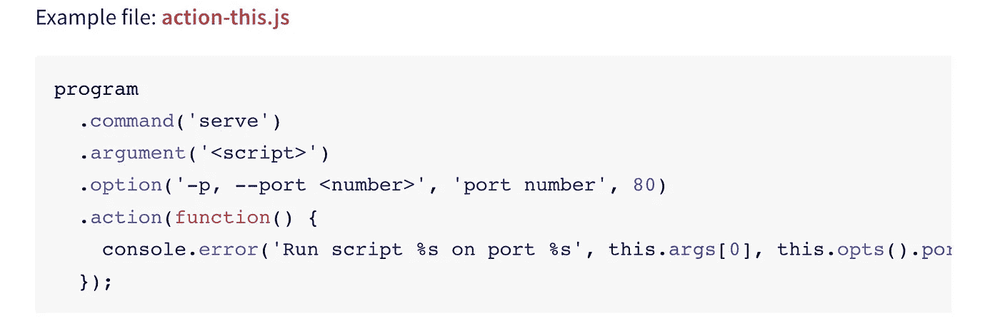

commander 文档提到用命令行参数调用 [parse](https://www.npmjs.com/package/commander#parse-and-parseasync) 方法将触发动作回调。

因此，我们公开了一个引导启动函数，它接受命令行参数并将其传递给 parse。

**优点:**不依赖子进程，直接在当前进程中运行测试用例，调试器也没问题，成功解决了性能瓶颈。

**缺点:**代码有副作用，所有测试用例共享同一个程序实例，测试用例可以单独使用没有问题，但是多个测试用例可能会互相干扰。

## 工厂功能操作

有了上次的经验，我们公开一个直接生成命令行工具的工厂函数。

这样，每当你运行一个测试用例时，你就创建了一个单独的程序，使得测试用例相互隔离。

在解决了命令行工具的初始化之后，让我们来看几个针对命令行的特殊测试用例。

## 测试帮助命令

当测试帮助命令(— help，-h)或测试命令行参数的有效性时，commander 将提示文本作为错误日志输出到进程，并调用`process.exit`退出当前进程。

这将导致测试用例**提前退出，**因此这个行为需要重写。

Commander 内部提供了一个被覆盖的函数`exitOverride`，它抛出一个 JavaScript 错误，而不是原来的进程退出。

在覆盖退出行为之后，为了验证帮助命令文本，您还需要使用 commander 提供的 [configureOutput](https://www.npmjs.com/package/commander#display-help-from-code) 。

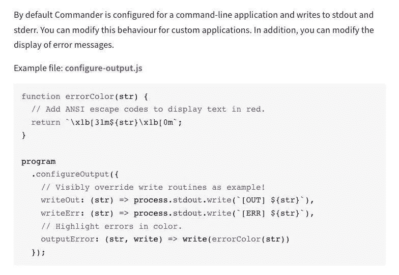

然后修改测试用例:

## 测试异步用例

命令行工具可能有异步回调，测试用例需要支持异步用例。

好的一面是 Jest 对于异步测试用例是现成的，所以让我们以 help 命令为例。

对于异步测试用例，建议设置一个**超时**，防止因代码编写错误而等待测试结果。

Jest 的默认超时为 5000 毫秒，也可以通过配置文件/测试用例来覆盖。

除了超时，增加的**断言数量**也是保证异步测试用例成功的一个点。

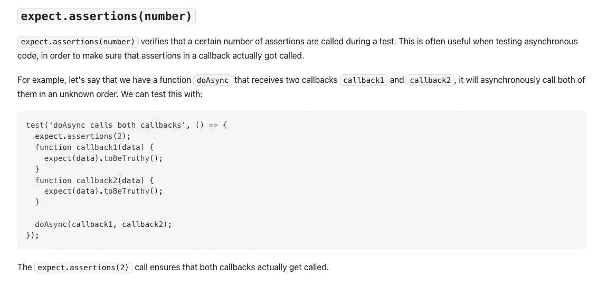

`expect.assertions`可以指定单个测试用例触发断言的次数，这对测试异常捕获场景很有用。

超时和预期的次数不匹配都会使测试用例失败。

**测试运行中的变量**

在正常的测试场景中，可以通过运行导出函数的返回值来验证变量值。

然而，命令行工具可能依赖于上下文信息(参数、选项)，不太适合在内部反汇编和导出单个函数，那么如何在运行时测试变量值呢？

我用[debug](https://www.npmjs.com/package/debug)+[jest . do mock](https://jestjs.io/docs/jest-object#jestdomockmodulename-factory-options)+[调用了](https://jestjs.io/docs/expect#tohavebeencalled)

1.使用`debug`模块打印需要验证的参数(在代码中有些侵入性，但是调试模块也可以用于日志记录)。

2.测试用例运行时用 jest.doMock 劫持调试模块，以便调试执行返回`jest.fn`。

3.用`toHaveBeenCalled`确认`jest.fn`的输入。

> 为什么用`jest.doMock`而不用`jest.mock`？
> 
> `jest.mock`在运行时声明提升，使得不能使用外部变量 f
> 
> [*https://github.com/facebook/jest/issues/2567*](https://github.com/facebook/jest/issues/2567)

## 模拟命令行交互

具有命令行交互的命令行工具是一种非常常见的场景。

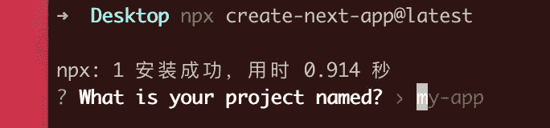

受 [*vue-cli*](https://github.com/vuejs/vue-cli/blob/dev/__mocks__/inquirer.js) 的启发，在测试用例中模拟用户输入变得非常简单，不会侵入任何代码。

1.创建 __mock__/inquirer.js，劫持并代理 prompt 模块，将 Jest 的断言语句添加到重新实现的 prompt 函数中。

2.在运行测试用例之前，通过`expectPrompts`模拟用户的问题和答案(创建断言的条件)。

3.代码运行 inquirer.prompt 时，代理跳转到 __mock__/inquirer.js 自定义提示，提示会根据前面`expectPrompts`创建的问题和答案按顺序匹配(消耗数据)。

4.最终的代理提示将返回与真实提示相同的 answers 对象，使最终行为保持一致。

## 摘要

保证测试用例彼此独立编写**，互不影响，没有副作用，具有幂等性。**

这可以从以下角度进行:

每次运行测试用例时，创建一个新的 commander 实例。

允许单个测试用例使用单一模式，不允许多个测试用例使用同一个单一模式。

文件系统隔离。

# 其他测试技巧

## 模拟作业目录

```
jest.spyOn(process, ‘cwd’).mockImplementation(() => mockPath))
```

[jest.spyOn](https://jestjs.io/docs/jest-object#jestspyonobject-methodname) 跟踪对 process.cwd 的调用， [jest.mockImplementation](https://jestjs.io/docs/mock-function-api#mockfnmockimplementationfn) 重写 process.cwd 的行为，以模拟工作目录。

如果不依赖 Jest API，也可以将模拟工作目录作为参数传递给`createProgram`工厂函数。

## 文件系统的模拟

文件读写也是包含副作用的操作，并且由于命令行工具可能涉及文件修改，所以不能保证每次运行测试用例时都有一个干净的环境。为了确保测试用例相互独立，需要模拟一个真实的文件系统。

在这里选择 [*memory-fs*](https://www.npmjs.com/package/memfs) ，将真实的文件系统操作转换为内存中的虚拟文件。

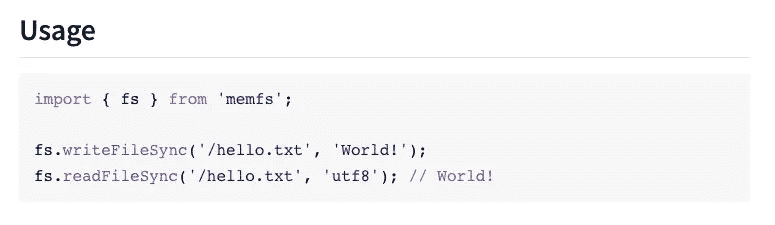

在项目根目录下创建一个新的 __mocks__ 文件夹。

将 fs.js 添加到 __mocks__ 文件夹中以导出 memfs 模块。

Jest 将 __mocks__ 文件夹中的文件视为默认情况下可以 [*模拟*](https://jestjs.io/docs/next/manual-mocks#mocking-user-modules) 的 [*模块*](https://jestjs.io/docs/next/manual-mocks#mocking-user-modules) 。

在测试用例中运行`jest.mock(fs)`劫持 fs 模块并代理到 __mocks__/fs.js 下。

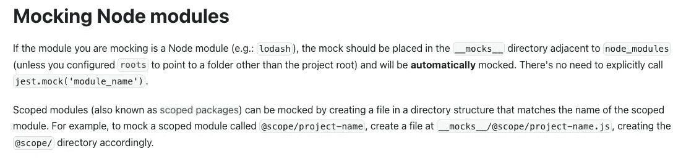

文件系统副作用问题通过将 fs 代理到 memfs 来解决。

## 无声错误日志

`jest.mockImplementation`不传递任何参数，并在模仿后静默处理函数。

实现测试运行时不输出错误日志的功能，使测试用例运行更加干净。

不输出错误日志并不意味着接受错误，您仍然可以使用 try/catch 来验证错误场景。

如前所述，还可以使用 program.configureOutput 重写错误日志。

使用前。

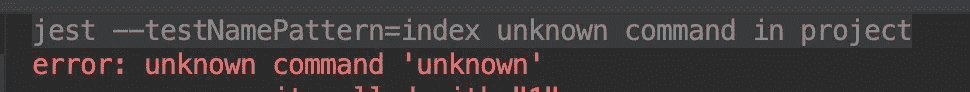

用后。

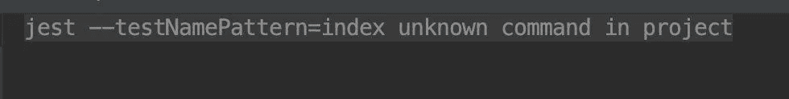

## 测试用例生命周期挂钩

Jest 提供了以下挂钩

首先

每次之前

每次之后

毕竟

生命周期挂钩在每个/所有测试用例之前/之后触发，通过向挂钩添加公共代码，可以在一定程度上减少代码量。

比如用`beforeEach`钩子，在每个测试用例运行之前，代码都被嘲讽，结束之后，用`jest.retoreAllMock`恢复。

# 类型脚本支持

向测试用例添加 TypeScript 支持允许更强的类型提示，并允许在运行测试用例之前预先检查代码类型。

1.  添加`ts-jest`、`typescript`、`@types/jest`类型的申报文件。

```
npm i ts-jest typescript @types/jest -D
```

2.添加 tsconfig.json 文件，并将之前安装的@types/jest 添加到声明文件列表中。

```
{
 “compilerOptions”: {
   “types”: [ “jest” ],
 }
}
```

3.修改测试用例文件名后缀 index.spec.js → index.spec.ts，并将 CommonJS 简介改为 ESM。

# 测试覆盖率

测试用例运行、代码未运行、行数的可视化表示。

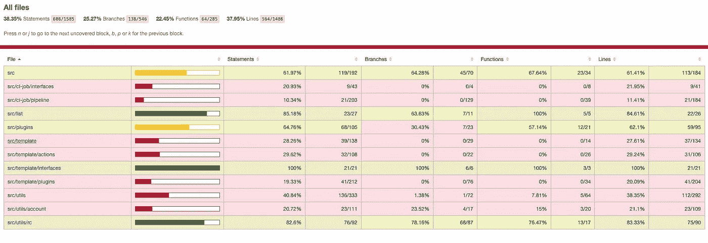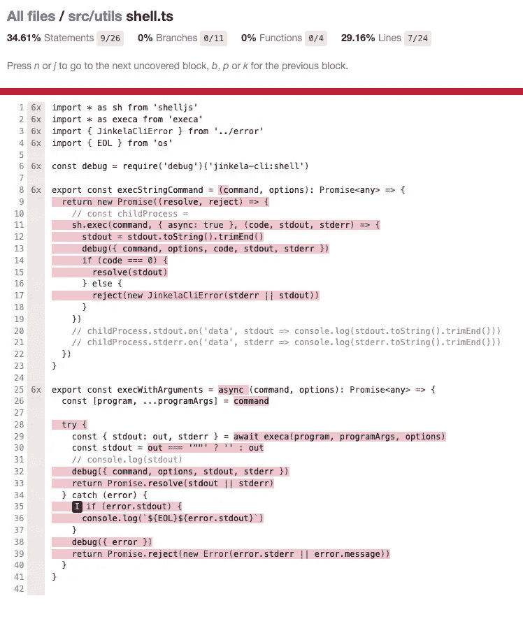

将`coverage`参数添加到测试命令的末尾。

```
jest --coverage
```

运行后生成覆盖率的文件夹包含测试覆盖率报告。

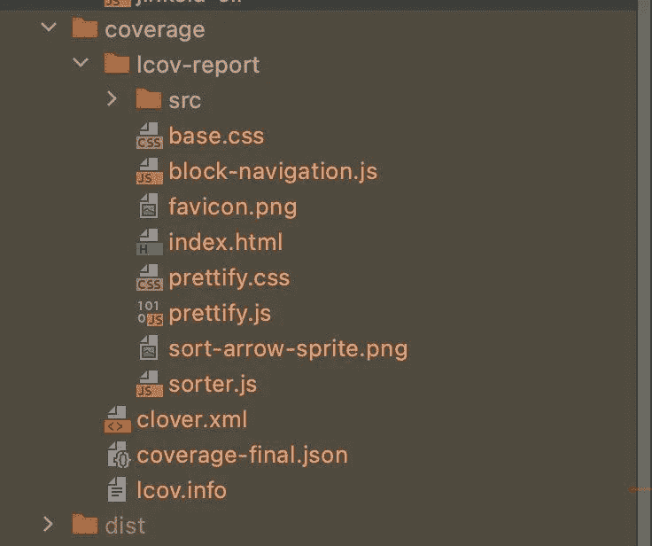

此外，测试覆盖可以与 CI/CD 平台集成，生成测试覆盖报告，并在每次工具发布后上传到 CDN。

实现每个工具版本测试覆盖率的增长趋势。

# 摘要

编写测试用例是一种前期投入更多时间(学习测试用例语法)和后期收获很多(持续的代码质量保证和提高重构信心)的方式。

适合改动少，QA 资源少的产品，比如命令行工具，工具库。

写测试用例的一个小技巧就是参考相应工具的 Github 上的测试用例，往往官方的测试用例更完整。

命令行工具的集成测试要求测试用例相互隔离，以确保等幂性。

公开一个创建 commander 实例的工厂函数，每次运行测试用例时都创建一个全新的实例。

使用 Jest 的内置 api，如`jest.spyOn`、`mockImplementation`、`jest.doMock`，代理 npm 模块或内置函数，对代码的侵入性较小。

# 参考

博客。

[*对 commander cli 进行单元测试的最好方法是什么？*](https://github.com/tj/commander.js/issues/1565)

[*https://it next . io/testing-with-jest-in-typescript-cc1cd 0095421*](https://itnext.io/testing-with-jest-in-typescript-cc1cd0095421)

斯塔科弗洛。

[*https://stack overflow . com/questions/58096872/react-jest-test-fails-to-run-with-ts-jest-unexpected-token-on-imported-file*](https://stackoverflow.com/questions/58096872/react-jest-test-fails-to-run-with-ts-jest-unexpected-token-on-imported-file)

Github。

[https://github . com/shadow spawn/forest-arborist/blob/fc a5 ffcc 5b 300660 AE 9 E1 f 6 C4 a 8667d 72 feb 0822/src/command . ts # L48](https://github.com/shadowspawn/forest-arborist/blob/fca5ffcc5b300660ae9e1f6c4a8667d72feb0822/src/command.ts#L48)

[*https://github . com/TJ/commander . js/blob/master/tests/command . action . test . js*](https://github.com/tj/commander.js/blob/master/tests/command.action.test.js)

*更多内容看* [***说白了。报名参加我们的***](https://plainenglish.io/) **[***免费周报***](http://newsletter.plainenglish.io/) *。关注我们*[***Twitter***](https://twitter.com/inPlainEngHQ)*和*[***LinkedIn***](https://www.linkedin.com/company/inplainenglish/)*。加入我们的* [***社区***](https://discord.gg/GtDtUAvyhW) *。***