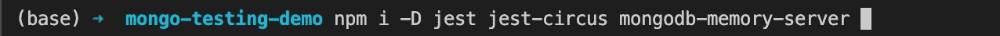
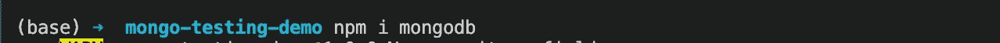
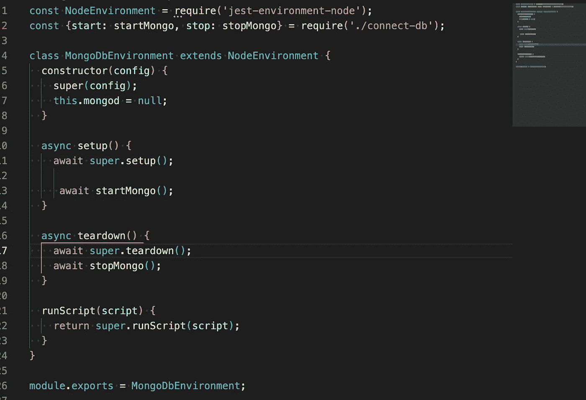
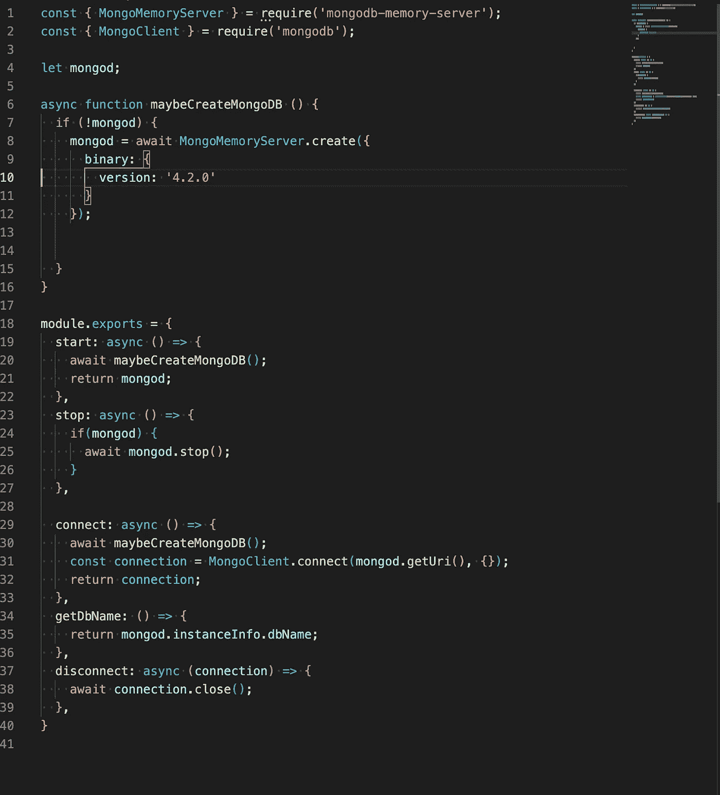
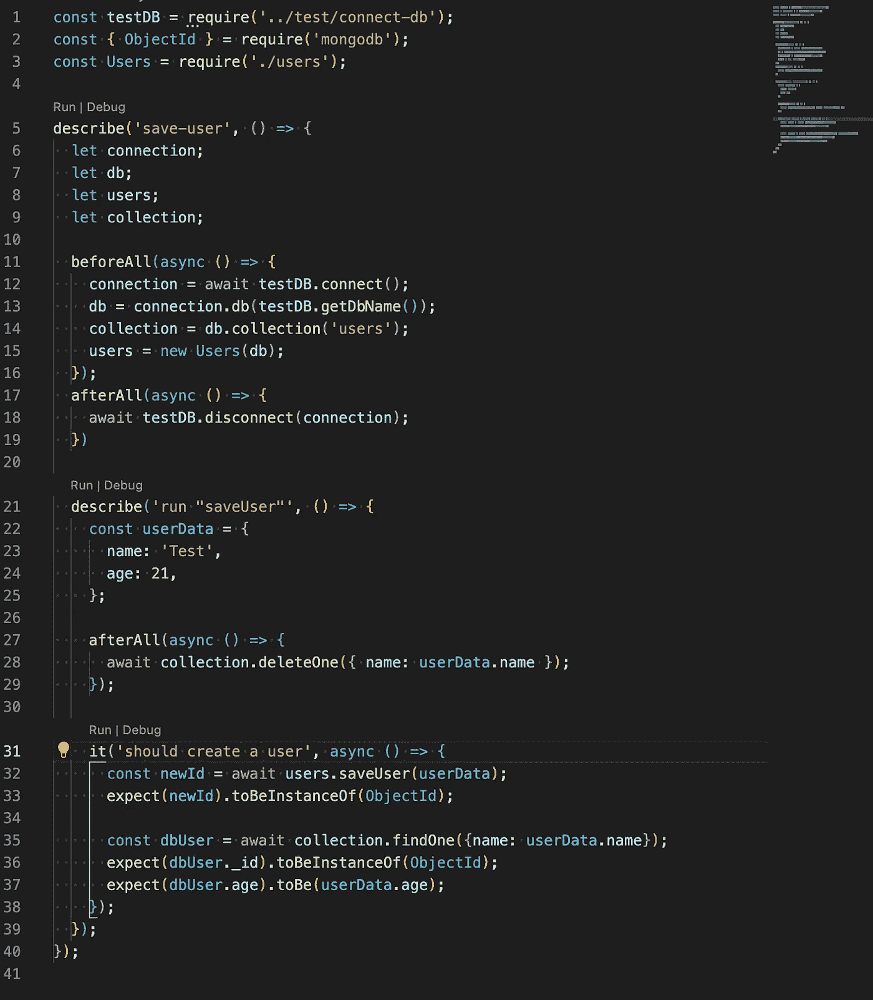

# 在 Node.js 中测试 MongoDB 集成

> 原文：<https://javascript.plainenglish.io/how-to-test-with-mongodb-with-node-js-b05f94aa17a?source=collection_archive---------5----------------------->

## 如何在真实的 MongoDB 实例中测试代码的简单分步指南。


Photo by [Arnold Francisca](https://unsplash.com/@clark_fransa?utm_source=medium&utm_medium=referral) on [Unsplash](https://unsplash.com?utm_source=medium&utm_medium=referral)

MongoDB 通常与 Node.js 一起用于数据存储，像 MERN 或 MEAN 这样的堆栈也广泛用于创建 web 应用程序。记住这一点，知道如何用 MongoDB 测试您的代码对于确保正确的行为和良好的软件质量非常重要。在这里，我将展示如何使用项目中包含的真实 MongoDB 数据库来测试您的代码。

在这种情况下，我们将使用的工具和库是 node v16、 [mongodb-memory-server](https://github.com/nodkz/mongodb-memory-server) 和 [Jest](https://jestjs.io/es-ES/) 。

这个案例的关键是 [mongodb-memory-server](https://github.com/nodkz/mongodb-memory-server) 。它允许我们选择一个 MongoDB 版本在我们的测试环境中运行。最好的一点是，我们可以确保用我们在生产环境中运行的相同版本来测试我们的代码。让我们看看这有多简单。

我们首先需要知道的是，我们有三个选项来选择我们想要运行的版本:由环境变量设置的版本，在我们使用参数启动服务器时设置版本，或者让模块下载默认版本(编写时为`5.03`)。在这个例子中，我们将选择在初始化时设置版本的那个(下面你会看到一个这样的例子)。

让我们添加所需的依赖项:



现在，让我们在`package.json`文件中添加一个基本的 jest 配置:

```
"jest": {
    "bail": true,
    "testEnvironment": "<rootDir>/test/mongo-test-environment"
    "coverageReporters": [
      "json",
      "text-summary",
      "lcov",
      "clover"
    ],
    "collectCoverage": true,
    "collectCoverageFrom": [
      "src/**"
    ],
    "coveragePathIgnorePatterns": [
      "test/*"
    ],
    "testRunner": "jest-circus/runner"
  }
```

为了启动数据库，我们将使用 Jest 功能，该功能允许我们在开始运行测试用例之前运行代码(`"testEnvironment": "<rootDir>/test/mongo-test-environment"`)。下面是该文件的内容:



它使用一个助手文件来创建 MongoDB 实例，并且还将在测试用例中用来连接和断开数据库。代码如下:



这只是做这件事的一种方法，还有几种方法可以做到这一点。请注意，我已经指定了我想要的 MongoDB 版本(4.2.0)，[这里](https://github.com/nodkz/mongodb-memory-server#available-options-for-mongomemoryserver)您可以看到所有可以用来初始化 MongoDB 实例的选项。

现在，当我们开始运行我们的测试用例时，一个内存中的 MongoDB 实例将会运行，我们可以连接、插入、查找、删除等等。在我们的每一个测试案例中。让我们看一个示例测试文件:



这很简单，只需在运行任何测试用例之前连接，并确保在所有测试用例结束时断开连接。我还喜欢删除测试用例中创建的任何数据(我在“saveUser”测试用例的`afterAll`方法中这样做。

通过这些简单的步骤，我们可以在一个真实的 MongoDB 实例中测试我们的代码。我希望这能帮助你提高代码的质量。[这里](https://github.com/amcereijo/mongo-testing-demo)你可以看到这个例子的完整代码。

*更多内容看* [*说白了。报名参加我们的*](http://plainenglish.io/) [*免费每周简讯*](http://newsletter.plainenglish.io/) *。在我们的* [*社区*](https://discord.gg/GtDtUAvyhW) *获得独家写作机会和建议。*