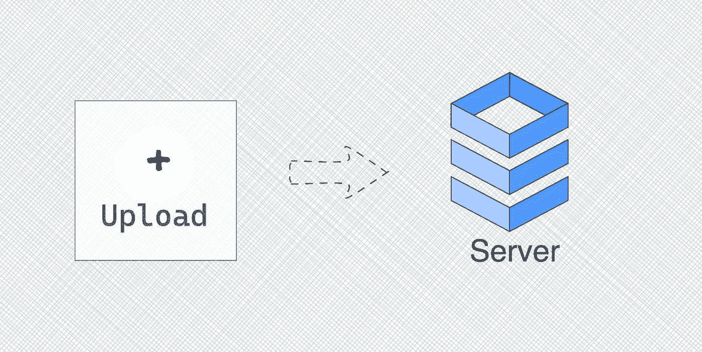
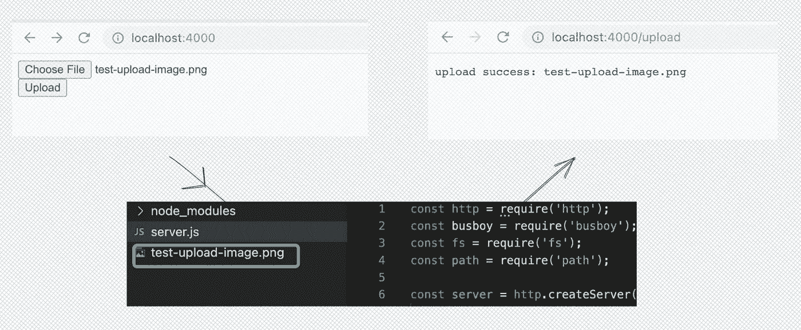
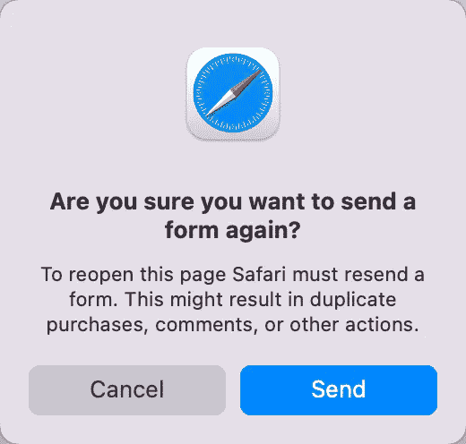
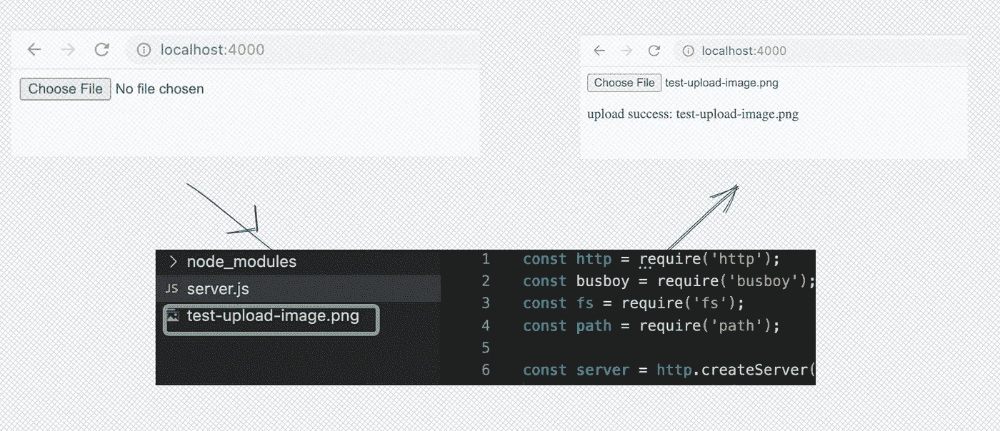
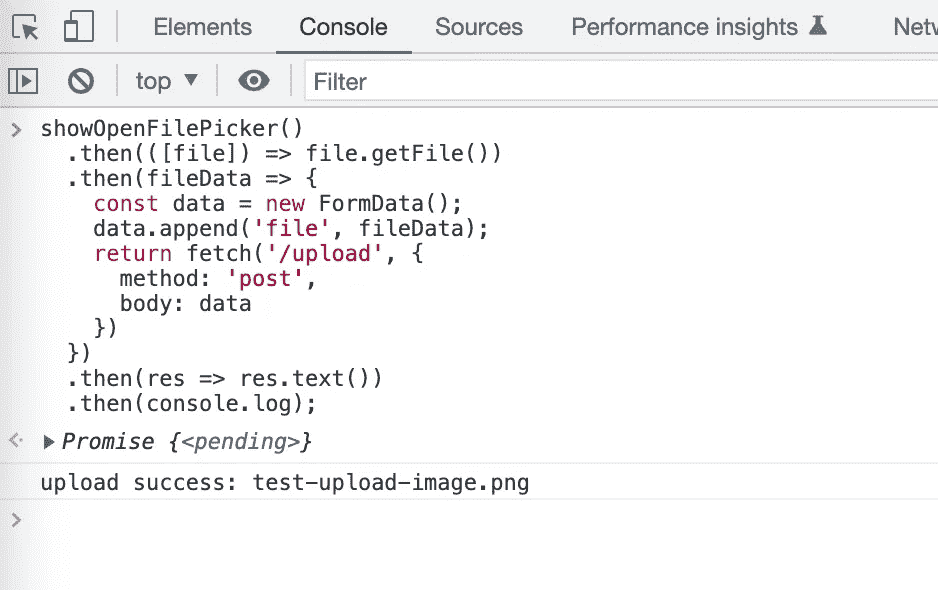
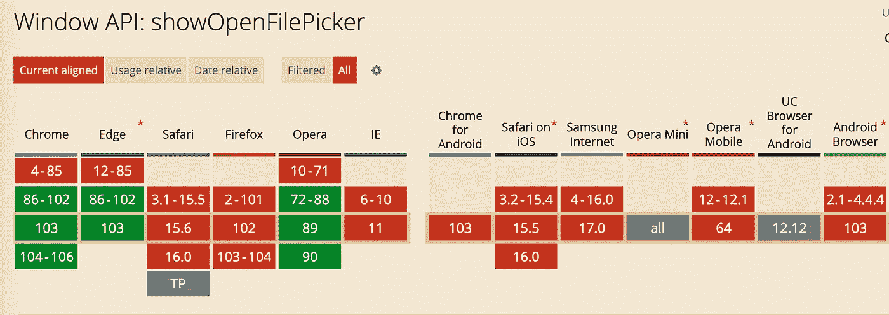

# 如何从网页上传文件

> 原文：<https://javascript.plainenglish.io/how-to-upload-file-from-a-webpage-e3e9fa727d73?source=collection_archive---------4----------------------->

这里有 3 种从网页上传文件的方法:使用 HTML 表单、FormData 和 showOpenFilePicker API。

# 前言

上传文件是网页上很常见的功能，尤其是上传图片。大多数内容创作网站，如 Medium、Twitter、StackOverflow 等。支持上传图片，相比纯文本，图片会让写出来的内容通俗易懂。

在这篇文章中，我们将学习 3 种在网页上上传文件的方法。我们将使用 Node.js 实现一个文件上传服务器，如本文所示:

 [## 如何用 Node.js 实现文件上传服务器

### 使用 busboy 模块解析表单数据。

javascript.plainenglish.io](/how-to-implement-a-file-upload-server-with-node-js-83043bc180fc) 

# HTML 表单

在网页上，我们可以使用`<form>`元素提交用户输入的信息，比如允许用户在登录网站时填写用户名和密码。`<form>`元素也支持上传文件。实现上传文件只需要几行 HTML 代码。当然，你需要注意正确设置`<form>`元素的属性:

我们需要设置`action`、`enctype`、`method`。`action`将是处理表单提交的 URL。`method`的值必须是`post`，否则表单数据将被追加到 URL 中。而`enctype`的值在我们需要上传文件的时候必须是`multipart/form-data`。

使用 HTML `<form>`元素上传文件非常简单，甚至不使用 JavaScript。缺点也很明显。提交表单后，页面会跳转到新的地址，刷新页面时 Safari 中也会有警告。

refresh the page after submit

# 使用 JavaScript 提交表单数据

我们可以使用 ajax 实现表单提交，以避免 HTML `<form>`元素引起的页面跳转。

在使用 JavaScript 时，我们首先需要通过监听输入的 change 事件来获取可以访问的上传文件，然后构造表单数据，最后使用`fetch`提交数据。

选择文件后，该文件将自动上传到服务器:

在我的项目中，我使用这种方法上传文件。但是如果需要自定义样式，就不能直接通过 CSS 来实现。

# showOpenFilePicker API

随着现代网络技术的发展，浏览器支持[文件系统访问 API](https://developer.mozilla.org/en-US/docs/Web/API/File_System_Access_API) ，它允许读、写和文件管理功能。

[文件系统访问 API](https://developer.mozilla.org/en-US/docs/Web/API/File_System_Access_API) 有一个方法`[showOpenFilePicker](https://developer.mozilla.org/en-US/docs/Web/API/window/showOpenFilePicker)`，它显示了一个文件选择器，允许选择一个或多个文件。我们甚至可以在 Chrome Devtools 中使用它:

`showOpenFilePicker`将返回一个承诺，其实现处理程序接收一组`[FileSystemFileHandle](https://developer.mozilla.org/en-US/docs/Web/API/FileSystemFileHandle)`对象。

这种方法非常方便，但目前只有 Chrome 和 Edge 支持。

Browser compatibility of showOpenFilePicker

# 结论

在这篇文章中，我们学习了 3 种从网页上传文件的方法。通过使用 HTML `<form>`元素，我们可以在没有 JavaScript 的情况下上传文件，通过使用 JavaScript，我们可以定制上传文件的交互，最令人期待的是`showOpenFilePicker`使上传文件变得更容易和更具可扩展性。

希望这篇文章能帮助你，我期待你跟随我学习更多实用的技巧，成为一名更好的开发者。

*更多内容请看*[***plain English . io***](https://plainenglish.io/)*。报名参加我们的* [***免费周报***](http://newsletter.plainenglish.io/) *。关注我们关于*[***Twitter***](https://twitter.com/inPlainEngHQ)**和*[***LinkedIn***](https://www.linkedin.com/company/inplainenglish/)*。查看我们的* [***社区不和谐***](https://discord.gg/GtDtUAvyhW) *加入我们的* [***人才集体***](https://inplainenglish.pallet.com/talent/welcome) *。**