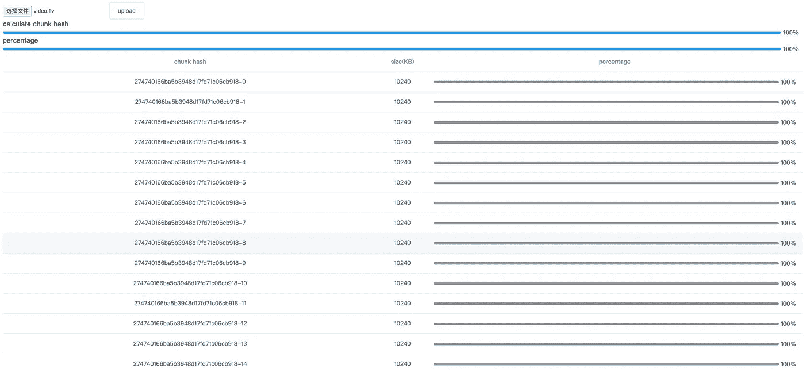
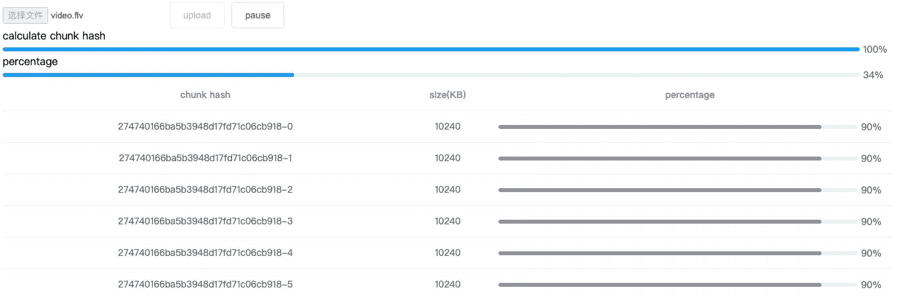

# 如何用纯 JavaScript 上传大文件？

> 原文：<https://javascript.plainenglish.io/how-to-upload-large-files-using-plain-javascript-1ca551e43950?source=collection_archive---------1----------------------->

## 实现大文件上传和断点续传指南——解决面试问题。

Photo by [Sigmund](https://unsplash.com/@sigmund?utm_source=medium&utm_medium=referral) on [Unsplash](https://unsplash.com?utm_source=medium&utm_medium=referral)

如何用纯 JavaScript 上传大文件？

# 序

面试的时候被问到这个问题，是一个在线编码编程问题。虽然当时的想法是正确的，但遗憾的是，并不完全正确。

最后花了一段时间整理思路，那么如何实现一个大文件上传，如何实现上传中恢复上传的功能？

本文将从头构建前端和后端，并实现一个上传大文件和从断点恢复上传的演示。

frontend:vue . js @ 2+[Element-ui](https://element.eleme.io/#/en-US)

后端:Node.js@14 + [多方](https://www.npmjs.com/package/multiparty)

# 大型文件上传

# 整个想法(前端)

大部分关于前端大文件上传在线的文章都给出了解决方案。核心是使用 Blob.prototype.slice 方法。类似于数组的 slice 方法，文件的 slice 方法可以返回原始文件的一大块。

预先定义单个块的大小，将文件划分成块，借助 HTTP 的并发性同时上传多个块。这样，原来上传一个大文件就变成了多个小文件块的并发上传，可以大大减少上传时间。

此外，由于并发性，传输到服务器的顺序可能会改变，因此我们还需要记录每个块的顺序。

# 整个想法(后端)

在接收它们之后合并所有的块。

这里还有两个问题:

1.何时合并块，即何时传输块？

2.怎么合并组块？

第一个问题需要前端的配合。前端携带每个组块的最大组块数的信息，当服务器接收到这个数目的组块时，自动合并组块。或者您可以发送一个额外的请求，主动通知服务器合并块。

第二个问题是如何合并组块？在这里，您可以使用 Nodejs 的读写流(readStream/writeStream)将所有块的流传输到最终文件的流。

空谈不值钱，给我看代码，然后我们用代码实现上面的思路。

# 前端实现

前端使用 Vue.js 作为开发框架，对界面没有太多要求。可以是原生的。考虑到美观，采用 Element-UI 作为 UI 框架。

## 上传控件

首先，创建一个用于选择文件和监听更改事件的控件，另一个是上传按钮:

## 请求逻辑

考虑到通用性，没有第三方请求库，而是简单封装了原生 XMLHttpRequest 来发送请求:

## 上传区块

然后要实现更重要的上传功能，上传需要做两件事:

将文件切片

将块传输到服务器

单击上传按钮时，将调用 createFileChunk 对文件进行切片。块的数量由文件大小控制。这里设置了 10MB，这意味着一个 100MB 的文件将被分成 10 个 10MB 的块。

使用 createFileChunk 中的 while 循环和 slice 方法将块放入 fileChunkList 数组并返回。

当生成文件块时，您需要给每个块一个作为散列的标识符。这里临时使用文件名+下标，这样服务器就可以知道当前的组块是哪个组块，哪个组块会用于后续合并的组块。

然后调用 uploadChunks 上传所有文件块，将文件块、切片哈希、文件名放入 formData，然后调用上一步的 request 函数返回一个 promise，最后调用 Promise.all 并发上传所有块。

## 发送合并请求

使用总体思路中提到的第二种合并组块的方法，即前端主动通知服务器进行合并。

前端发送一个额外的合并请求，后端在收到请求时合并块。

# 后端实现

使用 HTTP 模块构建一个简单的服务器。

## 接受块

使用[多方](https://www.npmjs.com/package/multiparty)从前端处理表单数据。

在 multiparty.parse 的回调中，files 参数将文件保存在 formData 中，fields 参数将非文件字段保存在 formData 中。

查看多方处理的 chunk 对象，“path”是存放临时文件的路径，“size”是临时文件的大小，多方文档中提到可以使用 fs.rename(此处替换为 fs.remove，因为 fs-extra 的重命名方法在[T3、Windows 平台上存在权限问题)。](https://github.com/meteor/meteor/issues/7852#issuecomment-255767835)

当接受文件块时，您需要创建一个临时存储块的文件夹，前缀为 chunkDir，后缀为 filename。

由于前端在发送每个块时额外携带一个唯一值散列，所以散列被用作文件名，并且块被从临时路径移动到块文件夹。最终结果如下:

## 合并块

服务器收到前端发送的合并请求后，合并文件夹下的所有组块:

由于前端在发送合并请求时会携带文件名，所以服务器可以根据文件名找到上一步创建的 chunk 文件夹。

然后用 fs.createWriteStream 创建一个可写的流，可写的流文件名就是上传时的文件名。

然后遍历整个 chunk 文件夹，通过 fs.createReadStream 创建一个可读的流，将传输合并到目标文件中。

值得注意的是，每次可读流都会被传输到可写流的指定位置，这是由 createWriteStream 的第二个参数 start 控制的，目的是能够将多个可读流并发合并到可写流中，这样即使并发时流的顺序不同，也可以传输到正确的位置。

因此，还需要让前端在请求时向服务器提供预先设置的大小，服务器根据大小指定可读流的起始位置。

其实也可以等前一个组块合并后再合并下一个组块这样就不需要指定位置了，但是传输速度会降低，所以使用并发合并的方法。

然后只需确保在每次合并后删除块，并在所有块合并后删除块文件夹。

至此，一个简单的大文件上传完成，接下来我们会在此基础上扩展一些附加功能。

# 显示上传进度条

上传进度有两种，一种是每个组块的上传进度，一种是整个文件的上传进度，整个文件的上传进度是根据每个组块的上传进度计算出来的，所以我们先实现单个组块的进度条。

## 单个块的进度条

XMLHttpRequest 原生支持上传进度的监控，只需要监控 upload.onprogress，我们在原请求的基础上传入 onprogress 参数，为 XMLHttpRequest 注册监控事件。

因为每个块都需要触发一个独立的侦听器事件，所以需要一个工厂函数来根据传入的块返回不同的侦听器函数。

将监听器功能部分添加到原来的前端上传逻辑中。

当上传每个块时，数据数组的相应元素的百分比属性将通过监听器函数更新。然后数据数组将显示在视图中。

## 总进度条

当前文件的上传进度可以通过累加每个 chunk 的上传部分，除以整个文件的大小得到，所以我们这里用 Vue 的 computed 属性。

最终显示如下

# 从断点恢复

从断点恢复上传的原理是前端/后端需要记住上传的块，以便在下一次上传中可以跳过之前上传的部分。有两种方案来实现存储器的功能。

前端使用 localStorage 记录上传的区块哈希。

服务器保存上传的块哈希，前端在每次上传前从服务器获取上传的块。

第一个是前端方案，第二个是服务器，前端方案有一个瑕疵。换一个浏览器就会失去记忆效果，所以我这里选择后者。

## 生成哈希

无论是前端还是服务器，都必须生成文件和组块的哈希。之前，我们使用文件名+块下标作为块散列。一旦文件名被修改，它将失去作用。其实只要文件内容不变，hash 就不应该变，所以正确的做法是基于文件内容生成 hash，那么我们来修改一下 hash 生成规则。

> webpack contenthash 也是基于这个思路。

这里使用了另一个库[spark-MD5](https://www.npmjs.com/package/spark-md5)，可以根据文件的内容计算出文件的哈希值。

另外，考虑到如果上传一个大文件，读取文件内容和计算 hash 是非常耗时的，而且会造成 UI 阻塞，导致页面的挂起状态，所以我们使用 web-worker 在 worker 线程中计算 hash，这样用户仍然可以正常的交互主界面。

在实例化 web-worker 时，参数是一个 js 文件路径，不能跨域，所以我们创建一个单独的 hash.js 文件，放在 public 目录下。此外，不允许访问 worker 中的 dom，但它提供了 importScripts 函数用于导入外部脚本，通过该函数导入 spark-md5。

在 worker 线程中，接受文件切片 fileChunkList，用 fileReader 读取每个组块的 ArrayBuffer，不断传入 spark-md5，每个组块计算完后，通过 postMessage 向主线程发送一个 progress 事件，全部发送到主线程后完成最终的 hash。

> 在 spark-md5 文档中，需要传入所有块并计算哈希值。您不能直接将整个文件放入计算中，否则，即使不同的文件也会有相同的散列。

然后编写主线程和工作线程之间的通信逻辑。

主线程使用 postMessage 将所有块 fileChunkList 传递给工作线程，并侦听工作线程发送的 postMessage 事件以获取文件哈希。

加上一个进度条，显示计算的散列，如下所示:

此时，前端需要将之前使用的文件名作为 hash 重写为 worker 返回的 hash。

服务器使用固定前缀+哈希作为块文件夹名称，哈希+下标作为块名称，哈希+扩展名作为文件名。

## 文件传输只需几秒钟

在实现断点续传之前，我们先简单介绍一下第二个文件传输。

所谓文件秒上传，是指上传的资源已经存在于服务器端，所以当用户再次上传时，会直接提示上传成功。

第二次文件传输需要依靠上一步生成的 hash，即在上传之前，先计算文件 hash，将 hash 发送到服务器进行验证。由于哈希的唯一性，一旦服务器可以找到具有相同哈希的文件，那么只需返回成功上传的信息。

这其实只是一个让用户看到的把戏，本质上根本没有上传。

:)

服务器的逻辑非常简单。增加一个验证界面，验证文件是否存在。

## 暂停上传

在谈论了几秒钟内生成散列和文件传输之后，回到断点继续传输。

断点续传，顾名思义就是断点+续传，所以我们第一步就是实现“断点”，也就是暂停上传。

XMLHttpRequest 的 abort 方法取消发送 XHR 请求。出于这个原因，我们需要保存上传每个块的 XHR 对象。让我们重塑请求方法。

这样，在上传块时，将 requestList 数组作为参数传入，请求方法将保存数组中的所有 XHR。

每当成功上传块时，从请求列表中删除相应的 XHR，这样只有上传块的 XHR 保存在请求列表中。

然后创建一个新的暂停按钮，当按钮被点击时，在 requestList 中调用保存在 XHR 的 abort 方法，即取消并清除所有上传的组块。

单击“暂停”按钮可以看到 XHR 已被取消。

## 继续上传

当我介绍从断点恢复上传时，我提到了使用第二种服务器端存储方法来实现恢复上传。

上传文件组块后，服务器会创建一个文件夹来存储所有上传的组块，所以每次前端上传前都可以调用一个接口，服务器会返回上传组块的组块名称，前端会跳过这些上传的组块。切片，从而达到“延续”的效果。

并且该接口可以与之前第二次上传的验证接口结合，前端在每次上传前发送验证请求并返回两个结果:

文件已经存在于服务器上，不需要再次上传

如果服务器上不存在该文件或者已经上传了一些文件块，通知前端上传并将**上传的**文件块返回给前端

所以我们来秒变之前文件传输的服务器端验证接口。

然后回到前端，前端有两个地方需要调用验证接口:

点击上传时，检查是否需要上传以及已经上传的块

暂停后点击继续上传，返回上传的区块

增加了一个恢复按钮，修改了原来上传组块的逻辑。

这里上传列表参数是在上传组块的原有功能上增加的，也就是上图中服务器返回的组块名称列表。上传的组块被 filter 过滤掉，由于添加了上传的部分，对之前合并接口的触发条件做了一些改变。

至此，断点续传功能基本完成。

# 进度条改进

虽然实现了断点续传，但是进度条的显示规则需要修改，否则当上传暂停/收到上传的组块时进度条会偏离。

## 单块进度条

由于当点击上传/恢复上传时，会调用验证接口返回上传的组块，所以上传组块的进度需要改为 100%。

上传列表将返回上传的块。遍历所有组块时，可以判断当前组块是否在上传列表中。

## 总进度条

前面提到总进度条是一个计算属性，是根据所有组块的上传进度计算的，这就导致了一个问题。

点击暂停将取消和清除块的 XHR 请求。如果此时已经上传了一个零件，你会发现文件的进度条已经退步了。

单击“resume”时，由于重新创建 XHR，总进度条将向后移动，这将导致区块进度被清除。

解决方案是创建一个“假的”进度条，它基于文件进度条，但是只停止和增加，然后向用户显示这个假的进度条。

这里我们使用 Vue.js 的 listener 属性。

当 uploadPercentage 增加真实文件进度条时，fakeUploadPercentage 也增加，一旦文件进度条退回，假进度条只需停止。

至此，一个大文件上传+断点续传的解决方案完成。

# 总结

大文件上传:

当前端上传大文件时，使用 Blob.prototype.slice 对文件进行切片，并发上传多个块，最后发送合并请求通知服务器合并块

服务器接收块并存储它，并在接收到合并请求后使用流将块合并到最终文件中

本机 XMLHttpRequest 的 upload.onprogress 监控块的上传进度

使用 Vue 计算属性根据每个块的进度计算整个文件的上传进度

从断点恢复:

使用 spark-md5 根据文件内容计算文件哈希

通过 hash 可以判断服务器是否上传了文件，从而直接提示用户上传成功(第二次上传)

通过 XMLHttpRequest 的 abort 方法暂停上传块

上传前，服务器返回上传的组块名称，前端跳过这些组块的上传。

# 源代码

源码增加了一些按钮状态，交互更加友好，文章表达更加晦涩，可以跳转源码查看。

[*-文件上传*](https://github.com/yeyan1996/file-upload)

感谢阅读:)

*更多内容看* [***说白了就是***](https://plainenglish.io/) *。报名参加我们的* [***免费周报***](http://newsletter.plainenglish.io/) *。关注我们关于*[***Twitter***](https://twitter.com/inPlainEngHQ)*和*[***LinkedIn***](https://www.linkedin.com/company/inplainenglish/)*。查看我们的* [***社区不和谐***](https://discord.gg/GtDtUAvyhW) *加入我们的* [***人才集体***](https://inplainenglish.pallet.com/talent/welcome) *。*