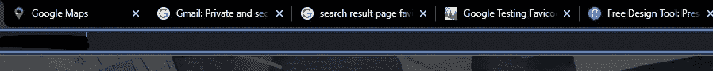
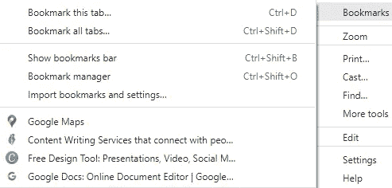

# 如何在 SEO 中使用 Favicon 来提高网站的排名

> 原文：<https://javascript.plainenglish.io/how-to-use-a-favicon-in-seo-to-improve-your-websites-ranking-682901f0c862?source=collection_archive---------9----------------------->

## 有了 favicon 和这些提示，你可以提高你的网站在搜索引擎结果中的排名。

大多数网站所有者都知道，拥有一个网站图标可以帮助他们的网站脱颖而出。但是你知道一个网站图标也可以提高你的网站在搜索引擎结果页面中的排名吗？

在这篇文章中，我们将向你展示如何在 SEO 中使用 favicon 来提高你网站的排名。我们也将提供一些关于如何创建一个 favicon 的提示，这将[帮助你的网站在 SERPs](https://circuit.ooo/blog/how-to-develop-a-strategy-to-rank-on-the-first-page-of-google) 中排名更高。

所以，如果你正在寻找方法来提高你的网站在搜索引擎结果页面上的排名，请继续读下去！

# 什么是 favicon？



Favicons on the browser tab

favicon 是一个小图标，出现在浏览器标签中网站地址的旁边。它通常是 16x16 像素，用于为您的网站提供一致的标识。

让我们来看看法维康的历史。“favicon”这个名字基本上由两个词组合而成:收藏夹和图标。该名称是由 Microsoft Internet Explorer 引入的。该公司允许用户将网站添加到他们的收藏夹列表中，同时引入 favicon 图标，以便用户可以轻松地在其他可用的网站中导航。

然后，网站图标最终被 W3C 标准化，W3C 代表万维网联盟。它现在是浏览器的推荐功能。

favicon 或图标也可以用来表示您正在查看的内容类型。例如，如果你在一个社交媒体网站上，图标会显示为一个小脸书标志。

如果你在一个电子商务网站上，它会显示为一个小小的购物车标志。



Favicons on bookmark

你还可以在书签列表中看到谷歌地图、Canva 和谷歌文档的 favicon，在 SERP 中看到谷歌的 favicon。

这个小而独特的图标代表了你的网站。它可以帮助您的网站在搜索引擎中的排名，为您的网站创建一个强大的视觉识别。

网站图标还可以帮助访问者更容易地找到您的网站，并使您的网站更容易被记住。

# 网站图标在搜索引擎优化中的重要性

Favicons 对你的搜索引擎优化没有直接影响，但是间接提高了你在搜索引擎上的排名。我们已经列出了在你的网站上使用 favicon 的三个主要好处，这将有助于你的 SEO。

## ●轻松导航您的网页

在您的网站上使用 favicon，允许您的用户通过浏览器标签、书签、历史档案等轻松识别和导航您的网站。这肯定会增加用户与你的网站的互动。因此，花在网站上的时间也会增加，从而提高你的搜索引擎优化

保留一个收藏夹图标，可以让用户使用书签选项重新访问你的网站。所有这些都提高了你网站的排名和搜索引擎优化。

## ●品牌

SEO 是关于可见性和品牌的。在你的网站中使用 Favicon 可以增加你在其他网站和企业中的知名度。用户会把你的品牌和所用的图标联系起来。因此，你的网站越显眼，用户就越有可能与你的网站互动。

# 如何创建一个 favicon？

Favicon 图像必须以适合使用的方式创建和设计。此外，用户应该能够在看到你的网站图标时很容易认出你的品牌。

在设计你的网站图标时，有两件事需要考虑:

● **图标大小**

● **图标格式**

## 图标大小

创建 favicon 的最佳尺寸是 16 X 16 像素，这是最常用的尺寸。然而，它们也可以出现在更大的维度中。

这是所有图标大小的完整列表

● 32 X 32 像素——大多数桌面浏览器的标准

● 128×128 像素——Chrome 网络商店图标和小的 Windows 8 开始屏幕图标

● 180×180 像素— iOS 首选

● 192×192 像素——谷歌开发者网络应用清单推荐

● 57×57 像素——iOS 主屏幕标准(iPod Touch、iPhone 第一代到 3G)

● 72 × 72 像素**—**iPad 主屏幕图标

● 96 × 96 像素 **—** 谷歌电视平台的图标

## 图标格式

Windows ICO 格式是过去最标准的格式。但是现在有几种不同的格式可供选择。以下是支持的格式列表:

● ICO、GIF 和 PNG 都受到 Edge、Firefox、Chrome、Opera 和 Safari 的支持

●所有现代浏览器都支持 SVG 和 JPEGs

●动画 gif 大多不支持。

## 创建好的收藏夹图标的技巧

●保持简单易识别。

●使用矢量图形将锐化所有设备上的图像。

●确保 16x16 像素的标准尺寸。

●使用. ico 文件格式。

●为你的网站图标选择一个对比鲜明的颜色，让它在你网站的背景下更加突出。

## 图标生成器

如果你能够创建自己的 favicon 图标，那么只需上传一张图片，并使用任何 favicon 到 ico 的在线转换工具将其适当地调整大小并转换为 ICO 图像文件。

这里有一些广泛使用的免费图标生成器。

● Favicon.io。

●Favicon-Generator.org。

● Real Favicon 生成器。

● Favicon.cc。

●FaviconGenerator.com。

● Favicomatic。

favicon 生成器帮助您从文本、图像或表情符号中创建 favicon 图标。

使用基于文本的选项，您可以选择背景颜色和形状、字体系列和大小以及字体颜色。

Favicon 生成器使用谷歌字体，有 800 多种字体可用。

或者，您也可以为 favicon 生成器上传一个文件，将其转换为适当的大小。或者，你可以从选项列表中下载表情符号图标。生成的 favicon 将适用于所有浏览器和多种平台。

# 如何添加一个图标？

现在你已经生成了你想要的格式的图标。

让我们考虑两种情况

●在你的网站上添加一个图标的过程，这个网站是从零开始建立的。

●使用网站生成器或 CMS(如 WordPress)将 favicon 添加到您的网站的过程。

因为该过程对于所考虑的两种情况会略有不同。我们将逐一解释。

**如何在 HTML 中添加 Favicon？**

●要在您的网站上添加一个 favicon，要么将您的 favicon 图像保存到您的 web 服务器的根目录下，要么在根目录下创建一个名为 images 的文件夹，并将您的 favicon 图像保存在该文件夹中。favicon 图像的常见名称是“favicon.ico”。

●在“index.html”文件中的<title>元素之后添加一个<link/>元素</title>

```
<head><title>My Page Title</title><link rel=”icon” type=”image/x-icon” href=”/images/favicon.ico”></head>
```

●保存“index.html”文件，并在浏览器中重新加载。您的浏览器标签现在应该在页面标题的左边显示您的 favicon 图像。

**如何在 Wordpress 添加网页图标？**

●进入 WordPress 仪表盘，点击**“外观”**，然后点击“定制”。

●接下来，点击**“站点标识”**。

●说出你网站的标题和标语。此信息显示在浏览器选项卡中的网站图标旁边。

●在“站点图标”中，点击“**选择站点图标**，以便在 WordPress 中添加您的 favicon。

●将会打开 **WordPress 媒体库**。如果你已经上传了你的 favicon 到 WordPress，你可以简单的选择它。否则，点击“上传文件”并从您计算机上的文件夹中选择文件。单击“选择”按钮确认您的选择。

●您可以选择裁剪图像或直接跳到下一步

●然后 WordPress 会自动添加你的 favicon。如果你想再次改变你的 favicon，只需回到 WordPress 定制器。

# 开始为你的网站搜索引擎优化排名创建图标

尽管图标已经存在了很长时间，但它们在网络世界越来越受欢迎。他们被认为对搜索引擎优化策略有间接影响，因为他们让你的网站或品牌可见和难以处理。

因此，建议在你的网站中加入图标，增加你的网站在数字世界中被认可的机会。

使用上面的过程，开始为你的网站创建图标，增加网站的可用性。你知道，网站的可用性与搜索引擎排名的提高有关。

# 常见问题

1.favicon.ico 是什么？

favicon.ico 是浏览器标签、URL 地址栏、SERPs 和 web 浏览器创建的书签中的一个小图标。的。ico 是几乎所有浏览器都支持的小图标图像的标准格式。

2.为什么网站图标很重要？

通过 favicon，用户可以更好地记住你的网站，也增加了你的网站和企业的可信度。

3.如何从任何网站下载图标？

使用谷歌 s2 转换器，你可以下载任何网站的图标。只需在浏览器中输入链接，将“网站名称”替换为网站地址。

[http://www.google.com/s2/favicons?domain=www.SITENAME.com](http://www.google.com/s2/favicons?domain=www.SITENAME.com)

4.为什么在 Chrome 浏览器中不能显示图标？

像 Chrome 和 Safari 这样的浏览器如果是本地的就不显示收藏夹图标。也就是说，如果 favicon 还没有上传到服务器。

5.如何在 WordPress 中改变一个 favicon？

在 WordPress 中添加/改变一个网站图标的一步一步的过程可以在“如何在 WordPress 中添加一个网站图标？”在上面的文章中。

6.一个图标要显示多长时间？

时间取决于搜索引擎。只有当搜索引擎抓取你的主页时，这个图标才会显示。

[](https://circuit.ooo/blog/how-to-develop-a-strategy-to-rank-on-the-first-page-of-google) [## 如何制定在谷歌首页排名的策略

### 让你的网站排名在谷歌的第一页是许多企业的重要目标，因为它可以推动…

电路. ooo](https://circuit.ooo/blog/how-to-develop-a-strategy-to-rank-on-the-first-page-of-google) 

*更多内容看* [***说白了。报名参加我们的***](https://plainenglish.io/) **[***免费周报***](http://newsletter.plainenglish.io/) *。关注我们关于* [***推特***](https://twitter.com/inPlainEngHQ)[***LinkedIn***](https://www.linkedin.com/company/inplainenglish/)*[***YouTube***](https://www.youtube.com/channel/UCtipWUghju290NWcn8jhyAw)*[***不和***](https://discord.gg/GtDtUAvyhW) *。对增长黑客感兴趣？检查* [***电路***](https://circuit.ooo/) *。*****