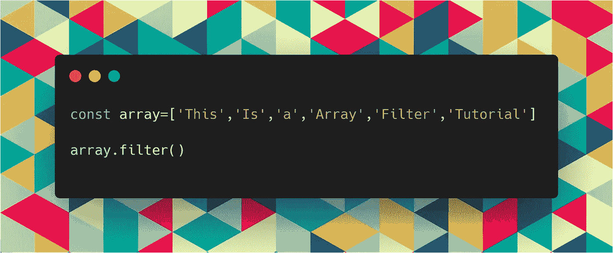

# 如何在 JavaScript 中使用 Array.filter()

> 原文：<https://javascript.plainenglish.io/how-to-use-array-filter-in-javascript-a9353b6ce9ba?source=collection_archive---------4----------------------->

## 理解 Array.filter()的 4 个示例

Array Filter Tutorial Screenshot

当您需要从数组中过滤出值时，`Array.filter()` 方法是有用的。

为了帮助你掌握`filter()`方法，我们将通过 4 个不同的例子来学习。每个例子将帮助你理解排序方法的不同部分。

# 理解数组。排序()

在我们进入例子之前，我们必须了解什么是`Array.filter()`。

根据 [MDN 文档](https://developer.mozilla.org/en-US/docs/Web/JavaScript/Reference/Global_Objects/Array/sort):

*`*filter()*`*方法创建一个新数组，其中所有元素都通过了由提供的函数实现的测试。**

*通过传递一个计算结果为 true 或 false 的回调方法来使用 filter 方法。然后对数组中的每个元素运行这个回调方法。如果回调方法对数组元素的计算结果为 false，则移除该元素。*

*需要注意的是`array.filter()`不会**也不会**改变原始数组。相反，它会创建一个新数组，而原始数组保持不变。*

## *排序方法和回调函数*

*当传递一个回调函数给`Array.filter()`时，给你三个参数:**元素，索引，**和**数组**。*

***元素**参数代表数组中正在处理的当前元素。*

***索引**参数表示数组中当前元素的当前*索引**

*最后，**数组**参数保存对被过滤的原始数组的引用。*

**注意:你可以随意命名这些参数，重要的是它们被调用的顺序。**

# *1.对数字使用过滤器()*

*对于第一个例子，我们将从一个数字数组中过滤掉所有奇数。*

*我们将通过检查一个给定的数是否有余数 0 来实现这一点。如果所述数字*没有*为 0 的提示，这意味着它是奇数，将被从新数组中过滤掉。*

*下面的代码演示了这一点:*

*Using Array.Filter() with numbers*

# *2.对字符串使用 filter()*

*我们并不局限于对整数使用`Array.filter()`。在下面的例子中，我们将使用`filter()`过滤掉所有长度小于 4 个字符的字符串。*

*下面的代码显示了如何:*

*Using Array.Filter() with Strings*

# *3.对对象使用 Filter()*

*我们也可以将`Array. filter()`用于宾语。这可以通过比较对象的属性来实现。为了解释这一点，我们将通过一个假设的例子*

**在这个假设的例子中，我们得到了一组物体。这些对象表示试图进入酒吧的顾客的信息。举个例子，法定饮酒年龄是 21 岁。**

*要解决这个问题，我们要做的就是检查数组中每个对象的 age 属性，看它是否等于或大于 21。*

*下面的代码演示了如何:*

*Using Array.Filter*

# *4.访问 filter()方法索引*

*`filter()`方法还有第二个参数。此参数包含筛选器在数组中的当前索引。*

*在下面的例子中，我们使用索引来过滤掉一个字符串数组，所以我们只有每个*的第三个*值。*

*下面的代码演示了这一点。*

# *结论*

*感谢您阅读完我关于**‘如何使用数组’的文章。JavaScript'** 中的 Filter()。如果你有任何问题，请随意提问，我会尽快回答你。*

*如果你刚接触媒体，你可以点击这里的链接[加入。](https://bookeraziz.medium.com/membership)*

## *进一步阅读*

*以下是我的一些进一步的故事:*

* [## 如何使用数组？JavaScript 中的 Sort()

### 5 个例子帮助你理解 JavaScript 的数组。Sort()方法。

javascript.plainenglish.io](/how-to-use-array-sort-in-javascript-a259c14d873b)  [## 6 个面向自学开发者的免费谷歌认证

### 我的意思是 100%免费

javascript.plainenglish.io](/6-free-google-certifications-for-self-taught-developers-80e52e10253d) 

*更多内容看* [***说白了。报名参加我们的***](https://plainenglish.io/) **[***免费周报***](http://newsletter.plainenglish.io/) *。关注我们关于*[***Twitter***](https://twitter.com/inPlainEngHQ)*和*[***LinkedIn***](https://www.linkedin.com/company/inplainenglish/)*。加入我们的* [***社区不和谐***](https://discord.gg/GtDtUAvyhW) *。****