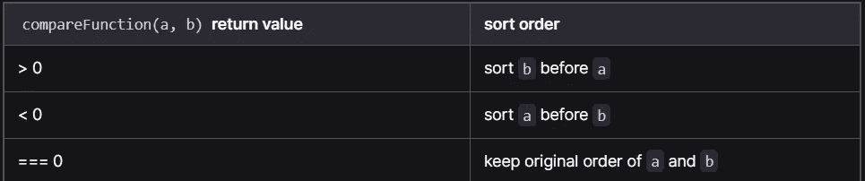

# 如何使用数组？JavaScript 中的 Sort()

> 原文：<https://javascript.plainenglish.io/how-to-use-array-sort-in-javascript-a259c14d873b?source=collection_archive---------11----------------------->

## [JavaScript](https://bookeraziz.medium.com/list/javascript-1ab814ee1c27)

## 5 个例子帮助你理解 JavaScript 的数组。Sort()方法。

当您需要排序/组织一组值时，`Array. sort()`方法非常有用。

为了帮助你掌握`sort()`方法，我们将通过 5 个不同的例子来学习。每个例子将帮助你理解排序方法的不同部分。

# 理解数组。排序()

在我们进入例子之前，我们必须了解什么是`Array.sort()`。

根据 [MDN 文档](https://developer.mozilla.org/en-US/docs/Web/JavaScript/Reference/Global_Objects/Array/sort):

> `sort()`方法将数组 [*中的元素在*](https://en.wikipedia.org/wiki/In-place_algorithm) 中排序，并返回排序后的数组。默认的排序顺序是升序，建立在将元素转换为字符串，然后比较它们的 UTF-16 代码单元值序列的基础上。

如果你第一次没有完全理解这个定义。这完全没问题。

`Array.Sort()`可以用来改变数组中元素的顺序。你可以传入一个函数来决定这个顺序。

# 1.使用数组。用整数排序()

使用`sort()`方法最简单的方法是不使用回调函数。

如果用在一组数字上，它将按升序排列这些数字。

Using sort() on integers

`sort()`方法也适用于十进制数。

Using sort() with decimals

# 2.对字符使用 Sort()

`sort()`方法也可以在不使用回调方法的情况下使用字符数组。

方法将按字母顺序对数组进行排序。

举一个在单字母字符串数组上使用`sort()`方法的例子。

Using sort() on characters.

# 3.使用箭头函数作为回调

对于更复杂的排序，我们可以传递一个箭头函数作为回调。

在下面的例子中，我们使用回调方法对数组进行排序，使偶数出现在奇数之前。

在 return 语句中，我们使用了一个[三元运算符](/how-to-create-if-statement-one-liners-using-javascript-e94a7bd96dcd)。

这个例子提出了一个问题**当传递一个回调函数时，sort()方法如何对函数进行排序？**

## 了解排序方法和回调函数

当传递一个回调函数给`Array.sort()`时，你会得到两个参数: **a** 和 **b.**

**a** 表示用于比较的第一个元素，b**表示用于比较的第二个元素。**

实际的排序由 sort 方法返回的整数值决定。如果返回一个大于 0 的数字**，第二个元素将排在第一个元素之前。如果返回的数字**小于 0** ，则第一个数字排在第二个数字之前。如果你返回 0，第一个和第二个元素都留在原来的位置。**

****

**How sorting is determined by Return Value**

# **4.对对象使用排序**

**还可以通过比较对象的一个字段来对 JavaScript 对象进行排序。**

**在下面的例子中，我们按照每个对象的**年龄**字段以升序对一个对象数组进行排序。**

**Using Array.sort() on an array of objects**

# **5.作为回调传入一个单独的函数**

**`Array. sort()`也允许你传递一个单独的函数作为回调函数。**

**在下面的例子中，我们使用 **sortByLastChar** 作为我们的回调函数*。* sortByLastChar 将用于按照 l *ast 字符对美国各州的数组进行排序。***

**Passing in a Function as a Callback Function**

# **结论**

**感谢您阅读完我的文章，这篇文章用了 5 个例子来帮助您理解 JavaScript 的数组。Sort()方法'。如果你有任何问题，请随意提问，我会尽快回答你。**

**如果你刚接触媒体，你可以点击这里的链接[加入。](https://bookeraziz.medium.com/membership)**

***更多内容请看*[***plain English . io***](https://plainenglish.io/)*。报名参加我们的* [***免费每周简讯***](http://newsletter.plainenglish.io/) *。关注我们*[***Twitter***](https://twitter.com/inPlainEngHQ)*和*[***LinkedIn***](https://www.linkedin.com/company/inplainenglish/)*。加入我们的* [***社区不和谐***](https://discord.gg/GtDtUAvyhW) *。***