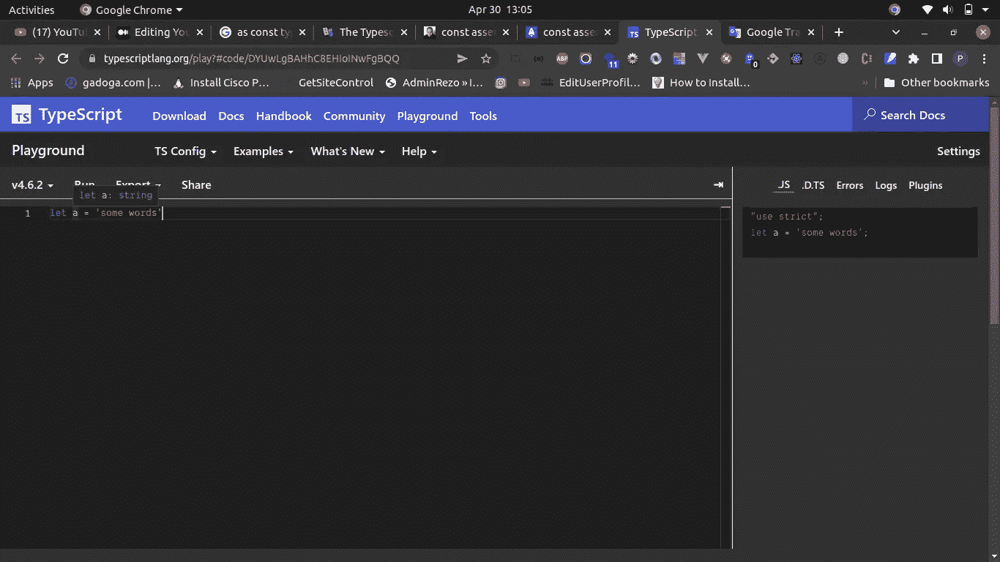
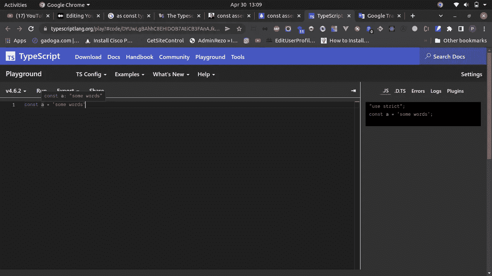
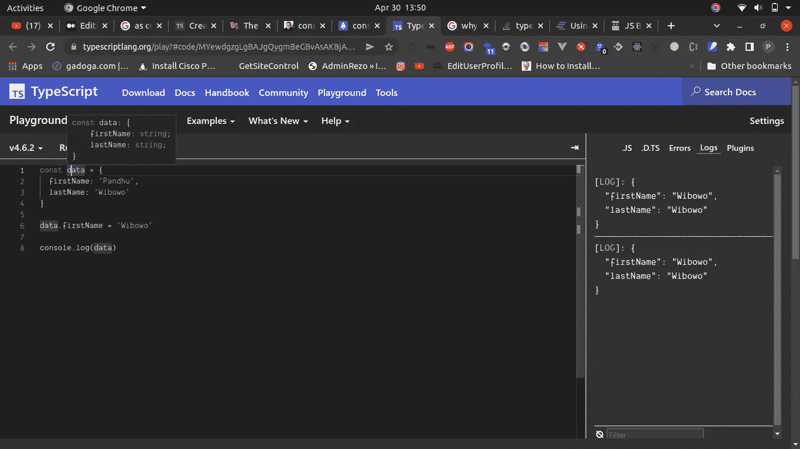
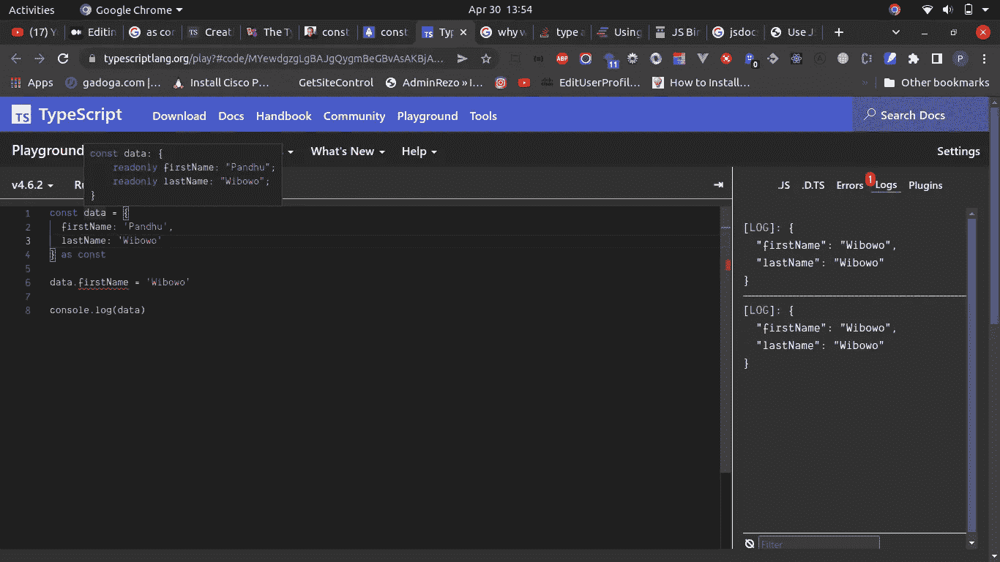

# 如何在 TypeScript 中使用“as const ”( const 断言)

> 原文：<https://javascript.plainenglish.io/how-to-use-as-const-in-typescript-const-assertions-4ed34921ac51?source=collection_archive---------4----------------------->

## 我们应该什么时候使用它？


Photo by [Christopher Gower](https://unsplash.com/@cgower?utm_source=medium&utm_medium=referral) on [Unsplash](https://unsplash.com?utm_source=medium&utm_medium=referral)

嗨，我是潘杜，我是一名软件工程师。欢迎来到我的博客。今天，我们将学习**常量断言**。

让我们深入研究一下。

```
const newArray = [1,2,3,4,5] as const
const newString = 'hello' as const
const newNumber = 1 as const
```

你可以假设这些变量是不可变的。这意味着您不能在接下来的几行中修改它们。**你的一些想法是对的，但可能不完整**。为什么？让我告诉你这件事。


Photo by [Joseph Rosales](https://unsplash.com/@josephandjosephandjoseph?utm_source=medium&utm_medium=referral) on [Unsplash](https://unsplash.com?utm_source=medium&utm_medium=referral)

# 什么是“作为常数”？

它被称为**常量断言**。Const 断言在 TypeScript v3.4 及更高版本中发布。根据官方网站，

> TypeScript 3.4 为文字值引入了一个新的构造，称为`*const*`断言。它的语法是用`const`代替类型名的类型断言(例如`123 as const`)。当我们用`const`断言构造新的文字表达式时，我们可以向语言发出信号
> 
> 该表达式中的文字类型不应被加宽(例如，从`"hello"`到`string`没有)
> 
> 对象文字获取`readonly`属性
> 
> 数组文字变成了`readonly`元组

老实说，我对文档中到底解释了什么感到困惑，但我试图找到其他参考资料来理解它。而且在我得到了很多参考之后，我尝试按照我的理解重写代码。这就是了。

# 文字类型没有类型扩展

```
let a = 'some words'
```



如果你看到我上面的截图，我得到的解释是 **a 是字符串类型**。如果我们把它编辑成 **const** 呢？

```
const a = 'some words'
```



如果我们重新分配他们两个呢？

```
1\. // let
let a = 'some words'
a = 'new word' // OK2\. // let with const assertions
let a = 'some words' as const
a = 'new word' // let a: "some words" - Type '"new word"' is not assignable to type '"some words"'.3\. // const (directly)
const a = 'some words'
a = 'new word' // const a: any - Cannot assign to 'a' because it is a constant.
```

如果你看那边，当我们用 **let** 重新赋值时， **a** 将 **OK** 。另一方面，如果我们用 let 在 **const 断言**内重新赋值，那么 **a** 不会接受并得到错误。同样当你直接用 **const** 重新赋值时(非 const 断言)。但是对于案例 2 和案例 3，你需要更具体的解释。

在例 2 中，我们得到了**让 a:“一些单词”**。在第三种情况下，**常量 a:任何**。为什么我们会得到不同的错误？

因为当我们使用 **const 断言**时，该值只是一个输入。直截了当。举个例子，

```
let a = "some words" // will be have "string"
```

但是如果你使用常量断言，

```
let a = "some words" as const // to the point, will explain that **a just value "some words"**
```

在上面的例子中， **a 只有一个值并且是特定的*绝对的*，【某些词】不是*任何*** 。您不能用另一个值重新分配，它是只读的。

# 对象文本获取只读属性

但是，如果我们把它用于对象文字呢？有用吗？让我们试一试。

当我们在对象字面量中使用 **let** 或 **const** 时，我们仍然能够改变其中的值。举个例子，

```
1\. // With let
let data = {
  firstName: 'Pandhu',
  lastName: 'Wibowo'
}data.firstName = 'Wibowo'
console.log(data)// {   "firstName": "Wibowo",   "lastName": "Wibowo" }2\. // With const
const data = {
  firstName: 'Pandhu',
  lastName: 'Wibowo'
}data.firstName = 'Wibowo'
console.log(data)// {   "firstName": "Wibowo",   "lastName": "Wibowo" }
```

你仍然可以改变它，它的工作。因为它不是只读的，只是告诉我们数据是否有两个属性，每个属性都是字符串类型。

```
const data: {
    firstName: string;
    lastName: string;
}
```



这样，当我们使用文字类型时，我们可以用类似的方式添加“as const”。

```
const data = {
  firstName: 'Pandhu',
  lastName: 'Wibowo'
} as constdata.firstName = 'Wibowo'console.log(data) // Cannot assign to 'firstName' because it is a read-only property.
```



# 数组文字变成了`read-only`元组

我们也可以将它用于**数组文字**。

```
const payload = {
    fullName: 'Pandhu Wibowo',
    characteristics: ["man", 25, "husband"]
}// Description for the object
const payload: {
    fullName: string;
    characteristics: (string | number)[];
}
```

我们想把它改成这样:

```
const payload = {
    fullName: 'Pandhu Wibowo',
    characteristics: ["man", 25, "husband"]
} as const// Description for the object
const payload: {
    readonly fullName: "Pandhu Wibowo";
    readonly characteristics: readonly ["man", 25, "husband"];
}
```

如果我们改变，我们将得到一个错误，消息看起来像这样:

```
const payload = {
    fullName: 'Pandhu Wibowo',
    characteristics: ["man", 25, "husband"]
} as constpayload.characteristics.push('rich')Property 'push' does not exist on type 'readonly ["man", 25, "husband"]'.
```

# 警惕！

如果你们碰巧来自**印度尼西亚**并且想要支持我写更多，希望你们能从钱包里贡献一点。可以通过一些方式分享你的天赋，谢谢。

# 萨韦里亚

[https://saweria.co/pandhuwibowo](https://saweria.co/pandhuwibowo)


# 特拉克特尔

[https://trakteer.id/goodpeopletogivemoney](https://trakteer.id/goodpeopletogivemoney)


# **阅读更多我的文章**

[](https://blog.devgenius.io/using-cloud-firestore-as-your-nosql-database-to-supports-your-business-part-1-c18347d4086a) [## 使用云 Firestore 作为您的 NoSQL 数据库来支持您的业务|第 1 部分

### 介绍 Firebase Firestore /云 Firestore

blog.devgenius.io](https://blog.devgenius.io/using-cloud-firestore-as-your-nosql-database-to-supports-your-business-part-1-c18347d4086a) [](https://blog.devgenius.io/sends-contact-form-via-sendgrid-marketing-campaigns-api-in-nestjs-4fa6c096e1df) [## 通过 NestJS 中的 Sendgrid 营销活动 API 发送联系人表单

### 在 Sendgrid 营销活动 API 中收集潜在客户数据

blog.devgenius.io](https://blog.devgenius.io/sends-contact-form-via-sendgrid-marketing-campaigns-api-in-nestjs-4fa6c096e1df) [](https://blog.devgenius.io/learn-ci-cd-with-github-actions-to-deploy-a-nestjs-app-to-heroku-8feb715d3ce7) [## 使用 GitHub 动作学习 CI/CD，以将 Nestjs 应用程序部署到 Heroku

### 在 Nestjs 中使用 GitHub Actions 轻松部署到 Heroku。为了避免无聊的任务。:)

blog.devgenius.io](https://blog.devgenius.io/learn-ci-cd-with-github-actions-to-deploy-a-nestjs-app-to-heroku-8feb715d3ce7) [](/deploy-a-strapi-v4-app-on-heroku-also-connected-into-google-cloud-sql-postgresql-f4c4ad8f2fa5) [## 在 Heroku 上部署一个 Strapi V4 应用程序，同时连接到 Google Cloud SQL (PostgreSQL)

### 如何在 Heroku 上部署一个连接到 Google Cloud SQL (PostgreSQL)的 Strapi V4 应用程序

javascript.plainenglish.io](/deploy-a-strapi-v4-app-on-heroku-also-connected-into-google-cloud-sql-postgresql-f4c4ad8f2fa5) [](/deploy-nestjs-app-on-heroku-also-connected-to-google-cloud-sql-postgresql-f0a085fea4be) [## 在 Heroku 上部署 NestJS 应用程序，同时连接到 Google Cloud SQL (PostgreSQL)

### 如何在 Heroku 上部署您的 NestJS 应用程序并将其连接到 Google Cloud SQL (PostgreSQL)的指南。

javascript.plainenglish.io](/deploy-nestjs-app-on-heroku-also-connected-to-google-cloud-sql-postgresql-f0a085fea4be) 

# 参考

[](https://dev.to/adamcoster/the-typescript-as-const-trick-2f4o) [## Typescript“as const”技巧

### 不久前，当我第一次学习 Typescript 时，我在某个地方的教程中看到了一个片段...标记为…

开发到](https://dev.to/adamcoster/the-typescript-as-const-trick-2f4o) [](https://stackoverflow.com/questions/66993264/what-does-the-as-const-mean-in-typescript-and-what-is-its-use-case) [## TypeScript 中的“as const”是什么意思，它的用例是什么？

### 我对演员阵容感到困惑。我查了一些文件和视频，但没有完全理解。我关心的是…

stackoverflow.com](https://stackoverflow.com/questions/66993264/what-does-the-as-const-mean-in-typescript-and-what-is-its-use-case) [](https://blog.logrocket.com/const-assertions-are-the-killer-new-typescript-feature-b73451f35802/) [## const 断言是杀手级的新类型脚本特性

### Typescript 3.4 已经发布了，虽然我发现官方的 Typescript 文档信息量很大，但它们总是有点太…

blog.logrocket.com](https://blog.logrocket.com/const-assertions-are-the-killer-new-typescript-feature-b73451f35802/) [](https://www.typescriptlang.org/docs/handbook/release-notes/typescript-3-4.html#const-assertions) [## 文件-打字稿 3.4

### TypeScript 3.4 发行说明

www.typescriptlang.org](https://www.typescriptlang.org/docs/handbook/release-notes/typescript-3-4.html#const-assertions) [](https://www.bscotch.net/post/typescript-as-const) [## 打字稿“as const”三|奶油糖果恶作剧

### 获取文本值的文本类型。

www.bscotch.net](https://www.bscotch.net/post/typescript-as-const) [](https://mainawycliffe.dev/blog/const-assertion-in-typescript/) [## Typescript 中的常量断言

### 在 Typescript 4.3 中，Typescript 引入了 const 断言。const 断言用于告诉类型脚本…

mainawycliffe.dev](https://mainawycliffe.dev/blog/const-assertion-in-typescript/) [](https://instil.co/blog/using-typescript-const-assertions-for-fun-and-profit/) [## 使用 TypeScript const 断言以获得乐趣和利润

### 从 TypeScript 3.4 开始，我们已经能够使用 as const 符号在我们的文字上创建“const 断言”

instil.co](https://instil.co/blog/using-typescript-const-assertions-for-fun-and-profit/) 

*更多内容请看*[***plain English . io***](https://plainenglish.io/)*。报名参加我们的* [***免费周报***](http://newsletter.plainenglish.io/) *。关注我们关于*[***Twitter***](https://twitter.com/inPlainEngHQ)*和*[***LinkedIn***](https://www.linkedin.com/company/inplainenglish/)*。加入我们的* [***社区不和谐***](https://discord.gg/GtDtUAvyhW) *。*