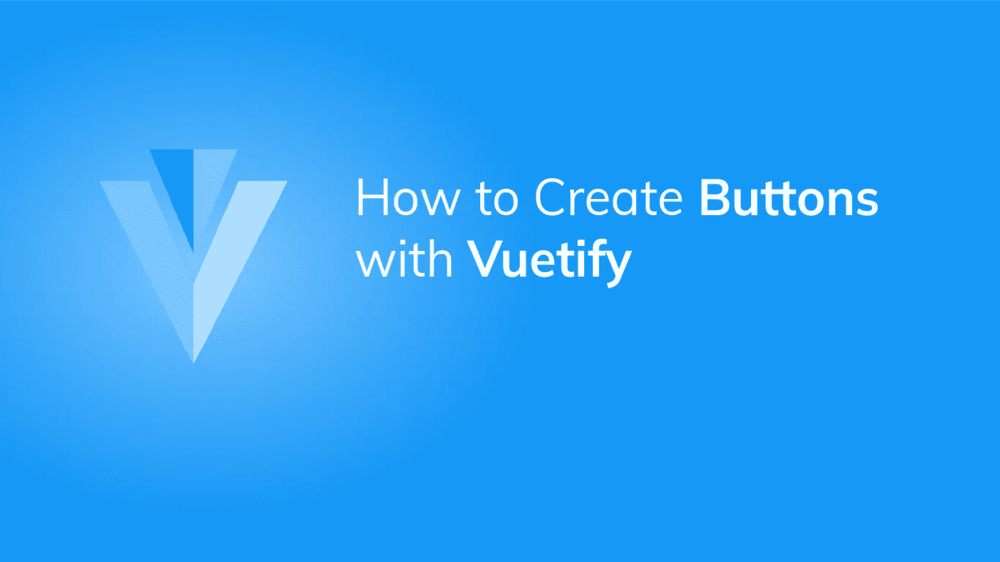
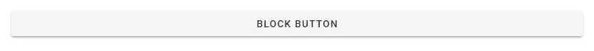
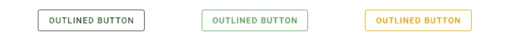
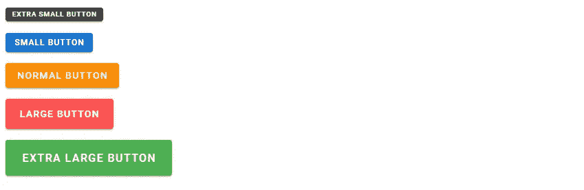

# 如何用 Vuetify 创建按钮

> 原文：<https://javascript.plainenglish.io/how-to-use-buttons-in-vuetify-37e4e28d2548?source=collection_archive---------17----------------------->



按钮是几乎每个用户界面中都有的元素之一。它们是为应用程序增加交互性的最常见的方式。Vuetify 提供了用于创建按钮的`v-btn`组件。让我们看看在一个样例 Vue.js 应用程序中使用该组件的不同方式。

# 常规按钮

这里，我们创建了三个不同颜色的均匀间隔的按钮。在 Vuetify 中[设置大多数组件颜色](https://codingbeautydev.com/blog/how-to-use-color-in-vuetify/)的一种方法是使用`color`道具。对于绿色按钮，我们添加了`dark`属性，使其文本为白色。

```
<template>
  <v-app>
    <v-row class="ma-4 justify-space-around">
      <v-btn>Button</v-btn>
      <v-btn color="red">Button</v-btn>
      <v-btn color="green" dark>Button</v-btn>
    </v-row>
  </v-app>
</template><script>
export default {
  name: 'App',
};
</script>
```


# 阻止按钮

我们通过将`block`道具设置为`true`来创建块按钮:

```
<template>
  <v-app>
    <v-row class="ma-4">
      <v-btn block>Block Button</v-btn>
    </v-row>
  </v-app>
</template>
...
```

这将使按钮扩展到其最大可用宽度:



# 按下按钮

使用`depressed`道具按下按钮消除阴影:

```
<template>
  <v-app>
    <v-row class="ma-4 justify-space-around">
      <v-btn depressed>Depressed Button</v-btn>
      <v-btn depressed color="yellow">Depressed Button</v-btn>
      <v-btn depressed color="red">Depressed Button</v-btn>
    </v-row>
  </v-app>
</template>
...
```


# 用美化来美化

使用 Vuetify 材料设计框架创建优雅 web 应用程序的完整指南。


在这里下载免费的[](https://mailchi.mp/583226ee0d7b/beautify-with-vuetify)****！****

# **图标按钮**

**我们不仅限于文本，我们还可以在 Vuetify 中创建图标按钮。`icon`道具使按钮变圆，并且应用了与我们设置`text`道具时相同的样式(在这篇文章的后面会有更多关于这个道具的内容)。**

```
<template>
  <v-app>
    <v-row class="ma-4 justify-space-around">
      <v-btn color="blue" icon><v-icon>mdi-thumb-up</v-icon></v-btn>
      <v-btn color="red" icon><v-icon>mdi-heart</v-icon></v-btn>
      <v-btn color="yellow" icon><v-icon>mdi-star</v-icon></v-btn>
    </v-row>
  </v-app>
</template>
...
```

****

# **轮廓按钮**

**我们可以用`outlined`道具创建轮廓按钮。这些类型的按钮从当前应用的颜色继承它们的边框:**

```
<template>
  <v-app>
    <v-row class="ma-4 justify-space-around">
      <v-btn outlined>Outlined Button</v-btn>
      <v-btn color="green" outlined>Outlined Button</v-btn>
      <v-btn color="orange" outlined>Outlined Button</v-btn>
    </v-row>
  </v-app>
</template>
...
```

****

# **普通按钮**

**普通按钮由`plain`道具制作。它们的基线不透明度较低，当您悬停或聚焦于它们时，基线不透明度会增加:**

```
<template>
  <v-app>
    <v-row class="ma-4 justify-space-around">
      <v-btn plain>Plain Button</v-btn>
      <v-btn color="red" plain>Plain Button</v-btn>
      <v-btn color="blue" plain>Plain Button</v-btn>
    </v-row>
  </v-app>
</template>
...
```

****

# **圆形按钮**

**使用`rounded`道具，我们可以创建与普通按钮行为相同的按钮，但具有圆形边缘:**

```
<template>
  <v-app>
    <v-row class="ma-4 justify-space-around">
      <v-btn rounded>Rounded Button</v-btn>
      <v-btn rounded color="blue">Rounded Button</v-btn>
      <v-btn rounded color="green">Rounded Button</v-btn>
    </v-row>
  </v-app>
</template>
...
```

****

# **文本按钮**

**用`text`道具创建的文本按钮没有框影和背景。按钮的容器仅在悬停时显示，并且按钮的颜色设置应用于其文本而不是其背景:**

```
<template>
  <v-app>
    <v-row class="ma-4" justify="space-around">
      <v-btn text> Normal </v-btn>
      <v-btn text color="primary"> Primary </v-btn>
      <v-btn text color="error"> Error </v-btn>
      <v-btn text disabled> Disabled </v-btn>
    </v-row>
  </v-app>
</template>
...
```

****

# **平铺按钮**

**平铺按钮的作用类似于常规按钮，但没有边框半径。您可以使用`tile`道具创建它们:**

```
<template>
  <v-app>
    <v-row class="ma-4" justify="space-around">
      <v-btn tile> Tile Button </v-btn>
      <v-btn tile color="yellow"> Tile Button </v-btn>
      <v-btn tile color="blue"> Tile Button</v-btn>
    </v-row>
  </v-app>
</template>
...
```

****

# **尺寸按钮**

**除了这些变体，Vuetify 还为我们提供了一系列按钮尺寸选项，以适应各种场景:**

```
<template>
  <v-app>
    <div class="ma-2">
      <v-btn x-small color="secondary" dark> Extra small Button </v-btn>
    </div>
    <div class="ma-2">
      <v-btn small color="primary" dark> Small Button </v-btn>
    </div>
    <div class="ma-2">
      <v-btn color="warning" dark> Normal Button </v-btn>
    </div>
    <div class="ma-2">
      <v-btn color="error" dark large> Large Button </v-btn>
    </div>
    <div class="ma-2">
      <v-btn x-large color="success" dark> Extra large Button </v-btn>
    </div>
  </v-app>
</template>
...
```

****

# **摘要**

**按钮无处不在。Vuetify 的`v-btn`组件允许我们创建它们，并支持各种定制选项，比如改变变体或修改大小。**

**[***注册***](http://eepurl.com/hRfyJL) *订阅我们的每周时事通讯，了解我们最新的精彩内容！***

***在*[*codingbeautydev.com*](https://codingbeautydev.com/blog/vuetify-button/)*获取更新文章。***