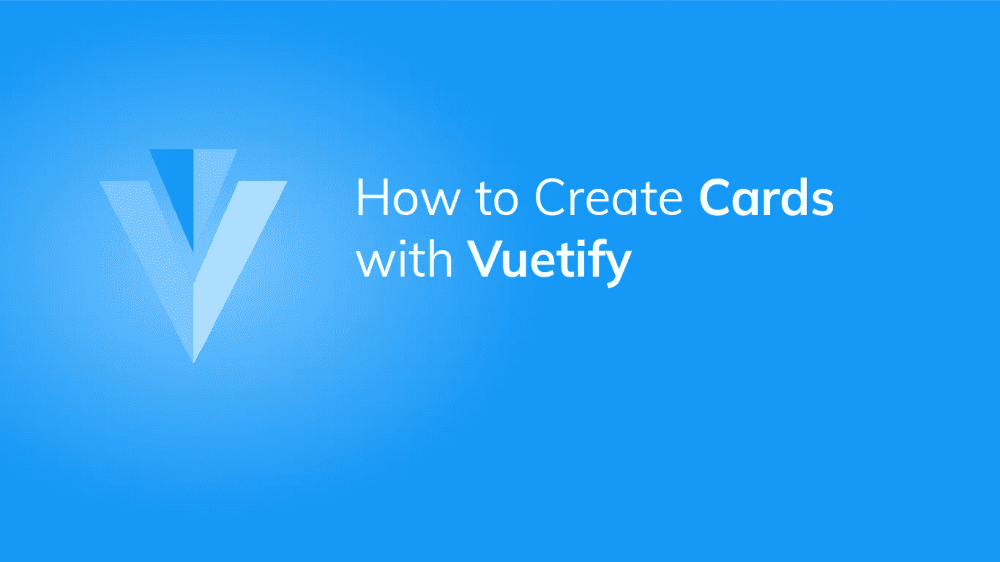

# 如何使用 Vuetify 创建卡片

> 原文：<https://javascript.plainenglish.io/how-to-use-cards-in-vuetify-ab50243cd7c7?source=collection_archive---------3----------------------->



Vuetify 中的卡组件是一个可以用于多种用途的组件。我们可以用它来包装一个工具栏组件，包含一个列表，或者只是显示一个静态图像。我们可以定制某些卡的功能，如[颜色](https://codingbeautydev.com/blog/how-to-use-color-in-vuetify/)，高度和大小。在本文中，您将学习如何使用 UI 库创建一个简单的卡片。

# “虚拟卡”组件

`v-card`是 Vuetify 提供的用于创建卡片的组件的名称。我们在下面的代码中创建了一个，并用各自的道具定制了它的高度和宽度:

```
<template>
  <v-app>
    <div class="d-flex justify-center ma-4">
      <v-card height="150" width="350"></v-card>
    </div>
  </v-app>
</template><script>
export default {
  name: 'App',
};
</script>
```


# “虚拟名片标题”组件

`v-card`附带某些要在其中使用的补充组件(作为子组件)。其中之一就是`v-card-title`组件。顾名思义，它允许我们设置卡片的标题。例如:

```
<template>
  <v-app>
    <div class="d-flex justify-center ma-4">
      <v-card height="150" width="350">
        <v-card-title>data.zip</v-card-title>
      </v-card>
    </div>
  </v-app>
</template>
...
```


# “视频卡-字幕”组件

我们也可以用`v-card-subtitle`组件设置卡片字幕。作为一个副标题，它使用常规的字体粗细和比标题小的字体。

```
<template>
  <v-app>
    <div class="d-flex justify-center ma-4">
      <v-card height="150" width="350">
        <v-card-title>data.zip</v-card-title>
        <v-card-subtitle>Your data is ready</v-card-subtitle>
      </v-card>
    </div>
  </v-app>
</template>
...
```


# 用美化来美化

使用 Vuetify 材料设计框架创建优雅 web 应用程序的完整指南。


在这里下载免费的[](https://mailchi.mp/583226ee0d7b/beautify-with-vuetify)****！****

# **“虚拟名片文本”组件**

**我们可以使用`v-card-text`组件为卡体添加文本:**

```
<template>
  <v-app>
    <div class="d-flex justify-center ma-4">
      <v-card width="350">
        <v-card-title>data.zip</v-card-title>
        <v-card-subtitle>Your data is ready</v-card-subtitle>
        <v-card-text
          >You can now download an archive of all your data within the next 24
          hours.</v-card-text
        >
      </v-card>
    </div>
  </v-app>
</template>
...
```

****

# **“虚拟卡-行动”组件**

**`v-card-actions`组件作为交互组件(如[按钮](https://codingbeautydev.com/blog/how-to-use-buttons-in-vuetify/))的容器，让我们执行与卡片上的信息相关的某些操作:**

```
<template>
  <v-app>
    <div class="d-flex justify-center ma-4">
      <v-card width="350">
        <v-card-title>data.zip</v-card-title>
        <v-card-subtitle>Your data is ready</v-card-subtitle>
        <v-card-text
          >You can now download an archive of all your data within the next 24
          hours.</v-card-text
        >
        <v-card-actions>
          <v-btn text color="primary">Download</v-btn>
          <v-btn text>Cancel</v-btn>
        </v-card-actions>
      </v-card>
    </div>
  </v-app>
</template>
...
```

****

# **概述卡**

**将`v-card`组件的`outlined`属性设置为`true`将会移除卡的高度:**

```
<template>
  <v-app>
    <div class="d-flex justify-center ma-4">
      <v-card width="350" outlined>
        <v-card-title>data.zip</v-card-title>
        <v-card-subtitle>Your data is ready</v-card-subtitle>
        <v-card-text
          >You can now download an archive of all your data within the next 24
          hours.</v-card-text
        >
        <v-card-actions>
          <v-btn text color="primary">Download</v-btn>
          <v-btn text>Cancel</v-btn>
        </v-card-actions>
      </v-card>
    </div>
  </v-app>
</template>
...
```

****

# **“提升”支柱**

**我们还可以用`elevation`道具为一张卡设置我们想要的具体提升量:**

```
<template>
  <v-app>
    <div class="d-flex justify-center ma-4">
      <v-card width="350" elevation="5">
        <v-card-title>data.zip</v-card-title>
        <v-card-subtitle>Your data is ready</v-card-subtitle>
        <v-card-text
          >You can now download an archive of all your data within the next 24
          hours.</v-card-text
        >
        <v-card-actions>
          <v-btn text color="primary">Download</v-btn>
          <v-btn text>Cancel</v-btn>
        </v-card-actions>
      </v-card>
    </div>
  </v-app>
</template>
...
```

****

# **摘要**

**Vuetify 提供了用于创建卡片的`v-card`组件，这些卡片用于各种功能。**

**[*注册*](http://eepurl.com/hRfyJL) *订阅我们的每周时事通讯，了解我们最新的精彩内容！***

***在*[*【codingbeautydev.com】*](https://codingbeautydev.com/blog/vuetify-card/)*获取更新文章。***