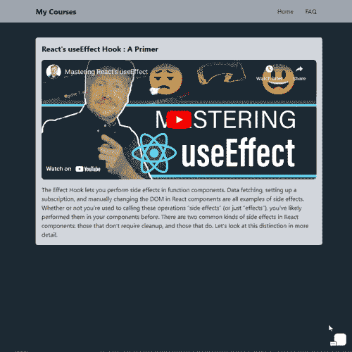
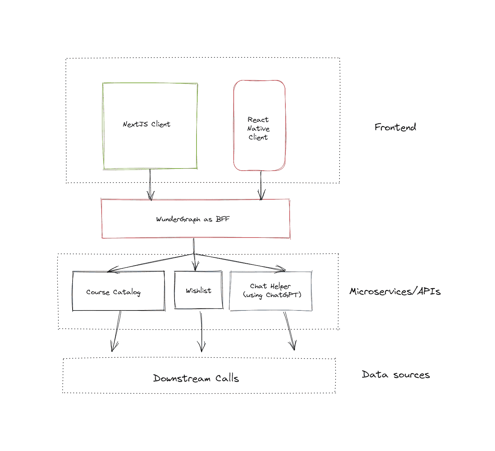
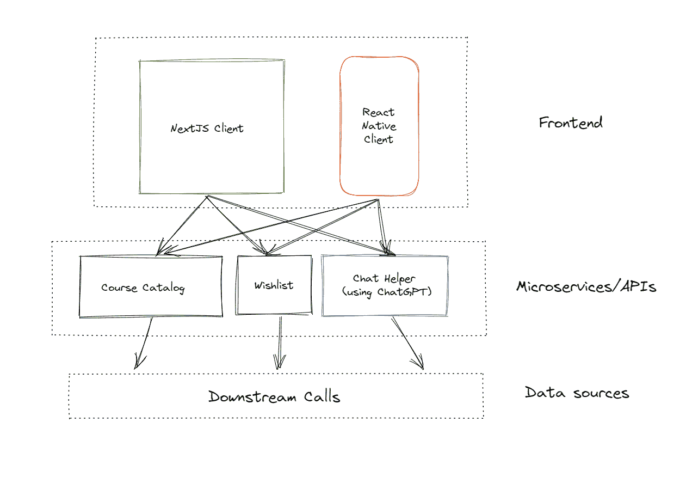

# 如何在 Next.js 前端使用 ChatGPT 作为教育聊天机器人

> 原文：<https://javascript.plainenglish.io/how-to-use-chatgpt-as-an-educational-chatbot-in-a-next-js-frontend-6f9689ba85e9?source=collection_archive---------1----------------------->

## 你可以在你的网站上使用 OpenAI 的 GPT-3.5 作为聊天助手吗？你打赌。以下是如何使用 Express 服务器、作为 BFF 的 WunderGraph 和 GraphQL 来完成的。


Photo by [Volodymyr Hryshchenko](https://unsplash.com/es/@lunarts?utm_source=medium&utm_medium=referral) on [Unsplash](https://unsplash.com?utm_source=medium&utm_medium=referral)

> 三到八年内，我们将拥有一台具有普通人一般智力的机器……如果我们幸运的话，他们可能会决定把我们当宠物养。”——***马文·明斯基，1970 年*** *。麻省理工学院人工智能实验室的创始人，图灵奖获得者，斯坦利·库布里克 2001 太空漫游的顾问。*

从这句话开始，53 年过去了，我要说我们在避免机器人起义方面做得很好。

然而，我们*已经*到了可以教机器*学习*的地步，并根据它们所学生成文本和图像。当然，记忆统计模式不是智力，但是随着大型语言模型的出现，我们甚至可以使用人工智能来帮助人类理解语言概念。

想想聊天机器人/助手不需要告诉你"*如果你在连接到我们的服务器时遇到问题，请按 3 "*，但是当你告诉它"*我的游戏在登录屏幕上死机时，*明白*你想要解决连接问题！请帮忙！！1"*

接下来，我们可以使用这些 LLM——以“问一个问题，得到一个答案”的能力——为学生提供个性化的、可访问的、按需的帮助，帮助他们按照自己的速度、根据自己的需要和能力进行学习。对于电子学习来说，这种即时反馈和支持不需要打断当前的讲座(事实上，甚至不需要只在常规课时内提问)，只需要补充一门课程，使其对学生来说更容易获得和更有吸引力。



Here’s the app in action. Love Jack, but his video is only being used as an example here. 😅 Not affiliated in any way.

但是这些思想实验已经够了。让我们尝试构建这样一个前端集成——一个聊天助手，它可以使用 OpenAI 来回答潜在学生的问题，而无需他们退出课程！

# 技术堆栈会是什么样的？

类似这样的。



*   一个 Next.js 前端，模拟了一个电子学习平台，带有一个聊天助手/助手/聊天机器人/随便你想叫它什么的组件，学生可以在其中输入问题，并从那里接收答案。
*   一个 Node.js/Express API，它从前端接收问题，将它们代理到 OpenAI ChatGPT 服务器上，并在响应中提供答案。ChatGPT API 还没有公开，但是我们可以使用非官方的`[chatgpt](https://www.npmjs.com/package/chatgpt)`包来实现我们的目的。
*   使用 [WunderGraph](https://wundergraph.com/) 的后端对前端(BFF)，这是一个免费的开源开发工具，仅在构建时使用 GraphQL，通过安全的 JSON-over-RPC 提供数据。WunderGraph 服务器将是一个服务层，或者 API 网关，不管你想叫它什么，它是你的前端可以看到的唯一的“后端”。

# 为什么是 WunderGraph？

为什么首先要使用 BFF 模式？为什么不直接从前端处理对 API 的 GET/POST 调用呢？好吧，让我们先假设一下。在这种情况下，您的架构可能是这样的。



What’s wrong with this picture?

您的前端现在与后端紧密耦合。您将不得不提交数百行代码到您的前端 repo，仅仅是为了协调您的前端和您的应用程序使用的许多微服务和 API 之间的双向通信。如果它们中的任何一个是新生的或不稳定的技术——chat GPT 就是最好的例子——那么您将经常一头扎进您的前端代码，对底层线路进行必要的修改，以确保一切正常工作。不理想。

使用 WunderGraph 作为后端对前端，将前端(对于任何一组客户端)从后端解耦，简化了维护以及两者之间的双向通信，方法是**仅在构建时使用 graph QL**将整个操作转变为简单的查询和变化，具有完全的端到端类型安全，并且来自所有数据源的数据整合到一个单一的、统一的虚拟图中，即 JSON-over-RPC。

通过这种方式，您可以并行化所有微服务/API 调用，一次性获取每个客户端所需的准确数据，减少嵌套数据的瀑布，并自动完成所有数据获取…所有这些都没有 GraphQL 的典型痛点，即大型客户端捆绑包和缓存/安全问题。

你的应用甚至不需要提供 GraphQL 端点；你只是利用它的力量来获得巨大的 DX 胜利。

# 代码

> *⚠* 然而，OpenAI 的 ChatGPT 和 Travis Fischer 的 [chatgpt 库](https://www.npmjs.com/package/chatgpt)都在不断变化，突破性的变化将不可避免(但您的前端基本保持不变——使用 BFF 模型的额外好处！).如果您发现代码不再工作，请在这里勾选。

# 第 1 部分:Express 和 ChatGPT 库

## 第 0 步:依赖项

在项目根目录中，为您的 API()创建一个目录。/后端工作正常)，光盘到其中，然后键入这些。

```
npm install express dotenv
npm install chatgpt
```

可选地…

```
npm install puppeteer
```

我们对 API 使用 [Express](https://www.npmjs.com/package/express) 、对环境变量使用 [dotenv](https://www.npmjs.com/package/dotenv) 、对非官方的 ChatGPT API 使用(直到 OpenAPI 发布官方的公共 API)。

OpenAPI 最近为 ChatGPT 增加了 CloudFlare 保护，使得使用非官方 API 变得更加困难。该库(可选)在引擎盖下使用[木偶师](https://www.npmjs.com/package/puppeteer)自动绕过这些保护—您需要做的就是在一个。环境文件。

## 第 1 步:服务器

```
import { ChatGPTAPI, getOpenAIAuth } from "chatgpt";
import * as dotenv from "dotenv";
dotenv.config();
import express from "express";

const app = express();
app.use(express.json());
const port = 3001;

async function getAnswer(question) {
  // use puppeteer to bypass cloudflare (headful because of captchas)
  const openAIAuth = await getOpenAIAuth({
    email: process.env.OPENAI_EMAIL,
    password: process.env.OPENAI_PASSWORD
    // isGoogleLogin: true // uncomment this if using google auth
  })

  const api = new ChatGPTAPI({ ...openAIAuth })
  await api.initSession()

  // send a message and wait for the response
  const response = await api.sendMessage(question);

  // response is a markdown-formatted string
  return response; 
}

// GET
app.get("/api", async (req, res) => {
  res.send({
    question: "What is the answer to life, the universe, and everything?",
    answer: "42!",
  });
});

// POST
app.post("/api", async (req, res) => {
  // Get the body from the request
  const { body } = req;
  console.log(body.question); // debug
  res.send({
    question: body.question,
    answer: await getAnswer(body.question),
  });
});

app.listen(port, () => {
  console.log(`Example app listening on port ${port}`);
});
```

应用编程接口服务器代码本身是非常自明的。它接收请求正文中的一个问题，使用 ChatGPT 将其发送到 OpenAI 服务器，等待答案，并以这种响应格式为两者提供服务:

```
{
    "question": "what is the first letter of the alphabet?",
    "answer": {
        "conversationId": someId,
        "messageId": someOtherId,
        "response": "The first letter of the alphabet is \"A.\""
    }
}
```

## 第 2 步:OpenAPI 规范

WunderGraph 的工作方式是对数据源进行内省，并将它们整合到一个统一的虚拟图形中，然后您可以在该图形上定义操作，并通过 JSON-over-RPC 来提供结果。为了让这种内省在 REST API 上发挥作用，您将需要 OpenAPI(您也可以称之为 swag)规范。

OpenAPI/swag 规范是 RESTful API 的可读描述。这只是一个 JSON 或 YAML 文件，描述了 API 使用的服务器、它的身份验证方法、每个端点的功能、每个端点需要的参数/请求体的格式以及每个端点返回的响应模式。

幸运的是，一旦你知道该做什么，写这个并不太难，有几个库可以使它自动化。

这是我们 API 的 OpenAPI V3 规范，在 JSON 中。

```
{
  "openapi": "3.0.0",
  "info": {
    "title": "express-api-for-chatgpt",
    "version": "1.0.0",
    "license": {
      "name": "ISC"
    },
    "description": "Specification JSONs: [v2](/api-spec/v2), [v3](/api-spec/v3)."
  },
  "servers": [
    {
      "url": "http://localhost:3001"
    }
  ],
  "paths": {
    "/api": {
      "get": {
        "summary": "/api",
        "responses": {
          "200": {
            "description": "OK",
            "content": {
              "application/json": {
                "schema": {
                  "type": "object",
                  "properties": {
                    "question": {
                      "type": "string",
                      "description": "The question to be asked",
                      "example": "What is the answer to life, the universe, and everything?"
                    },
                    "answer": {
                      "type": "string",
                      "description": "The answer",
                      "example": "42!"
                    }
                  }
                }
              }
            }
          }
        },
        "tags": []
      },
      "post": {
        "summary": "/api",
        "requestBody": {
          "required": true,
          "content": {
            "application/json": {
              "schema": {
                "type": "object",
                "properties": {
                  "question": {
                    "type": "string",
                    "description": "The question to be asked",
                    "example": "What is the answer to life, the universe, and everything?"
                  }
                }
              }
            }
          }
        },
        "responses": {
          "200": {
            "description": "OK",
            "content": {
              "application/json": {
                "schema": {
                  "type": "object",
                  "properties": {
                    "question": {
                      "type": "string",
                      "example": "what is the first letter of the alphabet?"
                    },
                    "answer": {
                      "type": "object",
                      "properties": {
                        "conversationId": {
                          "type": "string",
                          "example": "someId"
                        },
                        "messageId": {
                          "type": "string",
                          "example": "someOtherId"
                        },
                        "response": {
                          "type": "string",
                          "example": "The first letter of the alphabet is A."
                        }
                      }
                    }
                  }
                }
              }
            }
          }
        }
      }
    }
  }
}
```

# 第 2 部分:Next.js + WunderGraph

## 第 0 步:快速入门

我们可以使用`create-wundergraph-app` CLI 设置 Next.js 客户端和 WunderGraph BFF。CD 进入项目根目录(在您的 Express 后端目录下)，并键入:

```
npx create-wundergraph-app frontend -E nextjs
```

然后，进入您刚才要求 CLI 创建的目录:

```
cd frontend
```

安装依赖项，并启动:

```
npm i && npm start
```

这将启动 WunderGraph 和 Next.js 服务器(利用`npm-run-all`包)，在`localhost:3000`为您提供一个带有示例查询的 Next.js 启动页面。如果你看到了，一切都正常。

## 步骤 1:设置 WunderGraph

WunderGraph 可以将你能想到的几乎任何数据源——微服务、数据库、API——内省到一个安全的、类型安全的 JSON-over-RPC API 中；OpenAPI REST、GraphQL、PlanetScale、Fauna、MongoDB 等等，以及任何 Postgres/SQLite/MySQL 数据库。

所以让我们开门见山。在`.wundergraph`目录中打开`wundergraph.config.ts`，添加我们的 REST 端点作为我们的应用程序所依赖的一个数据源，一个 WunderGraph 应该反省的数据源。

```
const chatgpt = introspect.openApi({
 apiNamespace: 'chatgpt',
 source: {
   kind: 'file',
   filePath: './chatgpt-spec.json', // path to your openAPI spec file
 },
 requestTimeoutSeconds: 30, // optional
  })ty

// add this data source to your config like a dependency
configureWunderGraphApplication({
 apis: [chatgpt],
});
//...
```

一个真实的应用程序当然会有不止一个 REST 端点，您可以像这样定义它们。在这里检查 WunderGraph 可以自省的不同类型的数据源，然后在您的配置中相应地定义它们。

一旦你运行了 npm start，WunderGraph 会自动监控你的项目目录中的必要文件，所以只要点击这里的 save 就会让代码生成器运行，它会生成一个你可以检查的模式(如果你想的话)——在`/.wundergraph/generated`中的`wundergraph.app.schema.graphql` 文件。

## 步骤 2:使用 GraphQL 定义操作

这是我们在 GraphQL 中编写查询/变异来操作 WunderGraph 生成的虚拟图形层，并获得我们想要的数据的部分。

所以转到`./wundergraph/operations`并创建一个新的 GraphQL 文件。我们就叫它`GetAnswer.graphql`。

所以这是我们的变种，向我们的 Express API 发送一个问题(作为一个字符串)，并接收一个回答(包括原始问题，用于您的 UI，或者只是日志)。

```
mutation ($question: String!) {
  chatgpt_postApi(postApiInput: { question: $question }) {
    question
    answer {
      conversationId
      messageId
      response
    }
  }
}
```

注意名字间距！

中为其他数据源定义数据提取操作。graphql 文件就像这个。

在整个过程中，每次点击 save，WunderGraph 的代码生成都在后台工作(只要它的服务器在运行，它就会在后台工作)，生成类型安全的、特定于客户端的数据获取 React 钩子(`useQuery, useMutation`等等。)为你飞奔(使用维尔塞尔的《引擎盖下的 SWR》)。这些是我们将在 Next.js 前端使用的。

## 步骤 3:构建用户界面

对于一个最小可行的产品，我们的 UI 确实只需要两样东西。一个内容区，你可以在这里展示你的课程、教程或你提供的任何类型的内容，以及一个可折叠的聊天助手/聊天机器人界面——它使用了我们刚刚谈到的一个钩子，`useMutation`。

## 。/pages/_app.tsx

```
import Head from "next/head";

function MyApp({ Component, pageProps }) {
  return (
    <>
      <Head>
        <meta charSet="UTF-8" />
        <meta name="viewport" content="width=device-width, initial-scale=1.0" />
        <script src="https://cdn.tailwindcss.com"></script>
      </Head>
      <main>
        <Component {...pageProps} />
      </main>
    </>
  );
}
export default MyApp;
```

请注意，我在这个应用程序中使用的是 Tailwind。Tailwind 是一个非常棒的实用至上的 CSS，可以通过它的 Play CDN 轻松地集成到任何应用程序中(尽管你可能想切换到 PostCSS 实现进行生产)。

## 。/pages/index.tsx

```
import { NextPage } from "next";
import { withWunderGraph } from "../components/generated/nextjs";
// my components
import ChatHelper from "../components/ChatHelper";
import NavBar from "../components/Header";

const Home: NextPage = () => {

  return (
    <>
      <div className="dark:bg-gray-800 min-h-screen">
        <NavBar />
        <div className="container flex mx-auto mt-10 h-fit">
          <div className="bg-gray-300 p-4 rounded-md">
            {/* page content */}
            <h2 className="font-bold text-xl"> Page content goes here </h2>
            <div>
{/* video/course content here */}
              <iframe
                className="rounded-lg w-full h-80 mt-4 "
                src="https://www.youtube.com/embed/njX2bu-_Vw4"
                title="YouTube video player"
                allow="accelerometer; autoplay; clipboard-write; encrypted-media; gyroscope; picture-in-picture"
                allowFullScreen
              ></iframe>
            </div>
            <p className="mt-4">
              {/* some lipsum here */}            </p>
          </div>
          <div className="absolute bottom-0 right-0 m-4">
            <ChatHelper />
          </div>
        </div>
      </div>
    </>
  );
};

export default withWunderGraph(Home); // for SSR with WunderGraph
```

## 。/components/NavBar.tsx

```
const NavBar = () => {
  return (
    <header className="bg-gray-400 p-4 shadow-md">
      <div className="container mx-auto flex items-center justify-between">
        <a href="#" className="font-bold text-xl">
          My Website
        </a>
        <nav>
          <a href="#" className="px-4 hover:underline">
            Home
          </a>
          <a href="#" className="px-4 hover:underline">
            FAQ
          </a>
        </nav>
      </div>
    </header>
  );
};

export default NavBar;
```

在这个例子中，导航条并不是必需的；这只是一个我在布局时放入我的所有项目中的一个常用组件，以使事情看起来更漂亮😅。

## 。/components/ChatHelper.tsx

```
import React, { useState } from "react";
import { useMutation, useQuery } from "../components/generated/nextjs";

const ChatHelper = () => {
  const placeholderAnswer = "Hi! What did you want to learn about today?";

  const [isExpanded, setIsExpanded] = useState(false);
  const [input, setInput] = useState("");

  const { data, isMutating, trigger } = useMutation({
    operationName: "GetAnswer",
  });

  return (
    <div
      className={`relative rounded-lg bg-white shadow-md ${
        isExpanded ? "expanded" : "collapsed"
      }`}
    >
      <button
        className="p-4 absolute top-0 right-0 mr-2"
        onClick={() => setIsExpanded(!isExpanded)}
      >
        <span>{isExpanded ? "❌" : "💬"}</span>
      </button>
      <div className="max-w-lg max-h-lg p-4">
        {isExpanded && (
          <>
            <h2 className="text-lg font-bold">Helper</h2>

            <p id="answer" className="text-blue-500 font-bold">
              {data ? data.chatgpt_postApi?.answer?.response : placeholderAnswer}
            </p>

            <p id="ifLoading" className="text-green-500 font-bold font-italics">
              {isMutating ? "ChatGPT is thinking..." : ""}
            </p>

            <form
              onSubmit={(event) => {
                event.preventDefault();
                if (input) {
                  trigger({
                    question: input,
                  });
                }
              }}ty
            >
              <input
                className="border rounded-md p-2 w-full"
                type="text"
                placeholder="Your question here."
                onChange={(event) => {
                  const val = event.target.value;
                  if (val) {
                    // set question
                    setInput(val);
                  }
                }}
              />
              <button className="bg-blue-500 text-white rounded-md p-2 mt-2">
                Help me, Obi-Wan Kenobi.
              </button>
            </form>
          </>
        )}
      </div>
    </div>
  );
};

export default ChatHelper;
```

只有当您在表单提交上用输入(即问题)调用`trigger` 时，才会调用`useMutation`钩子；其将在 Express 后端中作为请求主体结束)。这很直观，但是关于`trigger`的更多问题，请查看 SWR 的文档[这里](https://swr.vercel.app/docs/api)。

你完了！如果 ChatGPT 服务器的负载不是很重，您应该能够输入一个问题，点击按钮，然后在。

# 从这里去哪里？

希望本教程能够让您了解如何将 ChatGPT 用于您自己的用例，编写 API 并为其生成 OpenAPI 文档，这样您就可以将它作为 BFF 与 WunderGraph 一起使用，使查询变得轻而易举。

接下来，您可能会想要添加一个`<ul>`列表，列出固定/预先选择的问题(基于当前课程)，单击这些问题时，它们会作为问题传递给`<ChatHelper>`组件，这样您的学生就有了一个建议列表，知道从哪里开始提问。

除此之外，您还可以在结果对象中使用`conversationId` 和`messageId` ，并将它们分别作为`conversationId` 和`parentMessageId` 传递给`sendMessage` 来跟踪与机器人的对话，并为其添加对之前所提问题的意识——这样您的学生就可以提出后续问题以获得更多相关信息，并使对话更加自然。

```
 // send a follow-up
res = await api.sendMessage('Can you expand on that?', {
  conversationId: res.conversationId,
  parentMessageId: res.messageId
})
console.log(res.response)

// send another follow-up
res = await api.sendMessage('What were we talking about?', {
  conversationId: res.conversationId,
  parentMessageId: res.messageId
})
```

此外，请留意`chatgpt`库本身，因为 OpenAI 经常改变 ChatGPT 的研究预览版的工作方式，所以您需要确保您的代码跟上非官方 API 的更新。

最后，如果你想了解更多关于 WunderGraph 的众多用例，可以查看他们的 Discord 社区 [*这里*](https://wundergraph.com/discord) ！