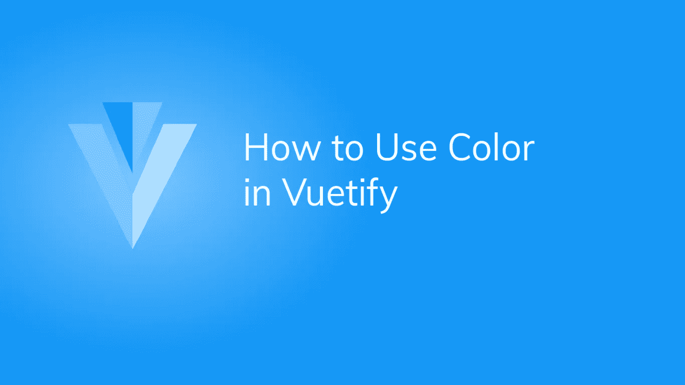
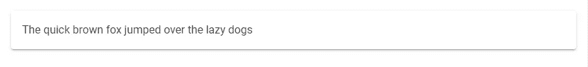
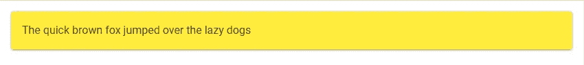
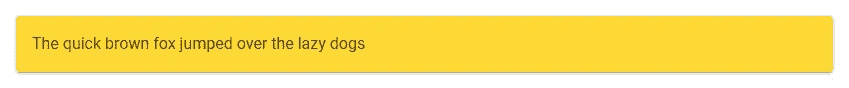
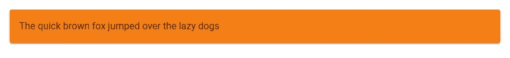
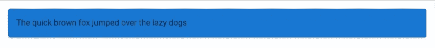
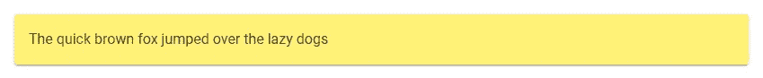
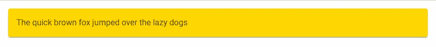

# 如何在虚拟化中使用颜色

> 原文：<https://javascript.plainenglish.io/how-to-use-color-in-vuetify-f48cb9153829?source=collection_archive---------14----------------------->

## 使用 Vuetify 的材料设计调色板中的颜色来设计构件的样式。



Vuetify 配备了大量可供我们使用的颜色选项。[材料设计规格](https://material.io/design/color/the-color-system.html)中的所有颜色均可用。设置虚拟化组件颜色的方法有多种。为了演示它们，让我们创建一个卡组件:

```
<template>
  <v-app>
    <v-card class="pa-4 ma-4">The quick brown fox jumped over the lazy dogs</v-card>
  </v-app>
</template><script>
export default {
  name: 'App',
};
</script>
```

现在看起来是这样的:



# 使用“颜色”属性设置颜色

大多数 Vuetify 组件都带有一个`color`道具，用于定制组件的外观。让我们改变卡片的颜色，看看它是如何工作的:

```
<template>
  <v-app>
    <v-card class="pa-4 ma-4" color="yellow"
      >The quick brown fox jumped over the lazy dogs</v-card
    >
  </v-app>
</template>
...
```



我们可以通过添加`lighten-{n}`或`darker-{n}`来使颜色变得更亮或更暗，其中`n`代表你希望卡片变得多亮或多暗。我们可以让它稍微暗一点:

```
<template>
  <v-app>
    <v-card class="pa-4 ma-4" color="yellow darken-1"
      >The quick brown fox jumped over the lazy dogs</v-card
    >
  </v-app>
</template>
...
```



或者非常暗:

```
<template>
  <v-app>
    <v-card class="pa-4 ma-4" color="yellow darken-4"
      >The quick brown fox jumped over the lazy dogs</v-card
    >
  </v-app>
</template>
...
```



使用`color`道具，我们还可以从 Vuetify 主题中设置一个更通用的颜色集，比如`primary`。这里，`primary`主题颜色是蓝色:

```
<template>
  <v-app>
    <v-card class="pa-4 ma-4" color="primary"
      >The quick brown fox jumped over the lazy dogs</v-card
    >
  </v-app>
</template>
```



# 用美化来美化

使用 Vuetify 材料设计框架创建优雅 web 应用程序的完整指南。


在这里免费下载[](https://mailchi.mp/583226ee0d7b/beautify-with-vuetify)****！****

# **使用虚拟化颜色类设置颜色**

**设置组件颜色的另一种方法是使用 Vuetify 中的一个类为组件添加颜色。因此，对于我们将卡片设为黄色的示例，我们可以通过向卡片添加`yellow`类来完成，而不是使用`color`道具:**

```
<template>
  <v-app>
    <v-card class="pa-4 ma-4 yellow"
      >The quick brown fox jumped over the lazy dogs</v-card
    >
  </v-app>
</template>
```

**当然，我们也可以使用`lighten-{n}`或`darken-{n}`类中的一个。让我们轻松一下:**

```
<template>
  <v-app>
    <v-card class="pa-4 ma-4" color="yellow lighten-2"
      >The quick brown fox jumped over the lazy dogs</v-card
    >
  </v-app>
</template>
```

****

**除了这些修改类之外，还有 accent-{n}类，用于为一个颜色组指定多达 4 种不同的重音，其用法如下:**

```
<template>
  <v-app>
    <v-card class="pa-4 ma-4" color="yellow accent-4"
      >The quick brown fox jumped over the lazy dogs</v-card
    >
  </v-app>
</template>
```

****

# **摘要**

**我们绝对不仅限于黄色。通过选择一个颜色组(黄色、红色、蓝色等)并将其与其中一个修改类(`lighten-{n}`、`darken-{n}`、`accent-{n}`)相结合，您可以将数百种颜色添加到您的 Vue 应用程序中，并反映您的品牌或风格。**

**[***注册***](http://eepurl.com/hRfyJL) *订阅我们的每周时事通讯，了解 Vuetify 和 Vue 的最新提示。***

***在*[*https://codingbeautydev.com*](https://codingbeautydev.com/blog/vuetify-colors/)获取更新文章**